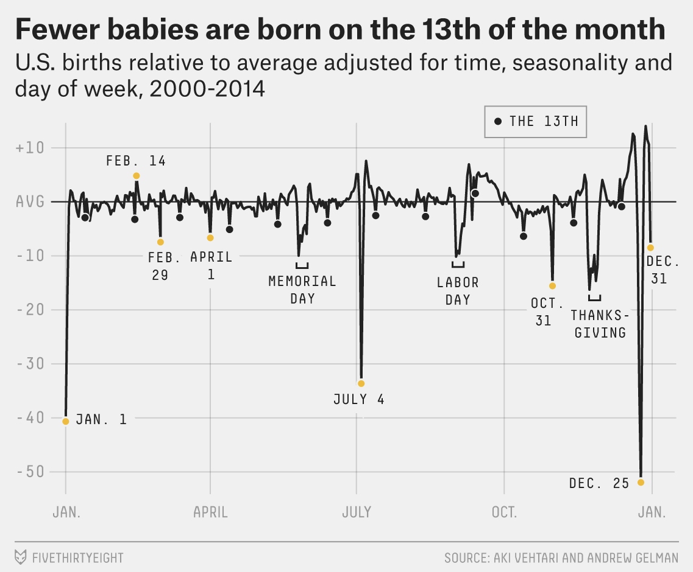
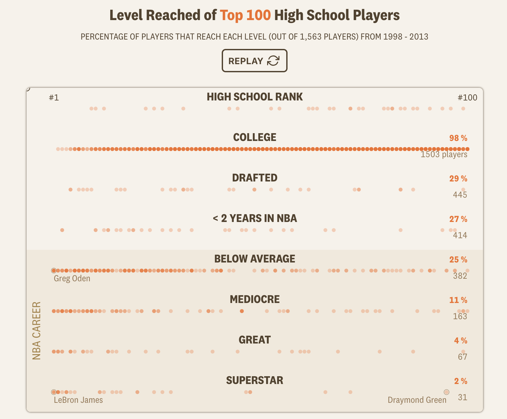

```{r setup, include = FALSE}
library(learnr)
library(tutorial.helpers)
library(knitr)
library(tidyverse)
library(readxl)

knitr::opts_chunk$set(echo = FALSE)
knitr::opts_chunk$set(out.width = '90%')
options(tutorial.exercise.timelimit = 600,
        tutorial.storage = "local")

births_tibble <- read_excel("data/us_births_1994_2014.xlsx") |>
  mutate(
    day_of_week = factor(
      day_of_week,
      levels = c("Sun", "Mon", "Tues", "Wed", "Thurs", "Fri", "Sat"),
      ordered = TRUE
    )
  )

christmas_data <- births_tibble |>
  filter(month == 12) |>
  group_by(year) |>
  summarize(
    christmas_births = births[date_of_month == 25],
    baseline        = mean(births[date_of_month %in% c(20:24, 27:30)]),
    weekday         = as.character(day_of_week[date_of_month == 25]),
    .groups         = "drop"
  ) |>
  mutate(
    pct_of_baseline = christmas_births / baseline,
    weekday = factor(weekday,
                     levels = c("Sun", "Mon", "Tues", "Wed", "Thurs", "Fri", "Sat"))
  )

births_model <- lm(births ~ factor(year) + factor(month) + day_of_week,
                   data = births_tibble)

births_adjusted <- births_tibble |>
  mutate(pct_resid = resid(births_model) / mean(births_tibble$births) * 100)

calendar_resid <- births_adjusted |>
  filter(!(month == 2 & date_of_month == 29)) |>
  group_by(month, date_of_month) |>
  summarize(mean_pct_resid = mean(pct_resid), .groups = "drop") |>
  mutate(calendar_date = as.Date(paste("2001", month, date_of_month, sep = "-")))

basketball_tibble <- read_excel(
  "data/nba_recruits.xlsx"
) |>
  mutate(
    recruit_group = factor(
      recruit_group,
      levels = c("#1–10", "#11–25", "#26–50",
                 "#51–100", "Outside top 100")
    ),
    tier = factor(
      tier,
      levels = c("Never played", "Brief career", "Solid career",
                 "All-Star level", "Superstar")
    )
  )
```

```{r info-section, child = system.file("child_documents/info_section.Rmd", package = "tutorial.helpers")}
```

## Introduction
###

This section covers key concepts from [Chapter 9: Layers](https://r4ds.hadley.nz/layers.html), [Chapter 10: Exploratory Data Analysis](https://r4ds.hadley.nz/eda.html), [Chapter 11: Communication](https://r4ds.hadley.nz/communication.html), and [Chapter 20: Spreadsheets](https://r4ds.hadley.nz/spreadsheets.html) from [*R for Data Science (2e)*](https://r4ds.hadley.nz/) by Hadley Wickham, Mine Çetinkaya-Rundel, and Garrett Grolemund.

You will learn about working with tabular data from Excel files using **[readxl](https://readxl.tidyverse.org/)** and **[ggplot2](https://ggplot2.tidyverse.org/)**. Key techniques include calendar heatmaps with `geom_tile()`, ordered factors for correct axis sorting, grouped summaries as the foundation for visualizations, boxplots, and scatter plots with annotated outliers.

Work with whichever AI agent you prefer — **GitHub Copilot** is built into VS Code and always available, and "ask AI" always means the agent of your choice. Describe the result you want, let the agent edit your files, review its changes, and render.


### Exercise 1

You should be doing this tutorial in a repo named `r4ds-2`. If you are not, create one and then connect to it. You may need to restart this tutorial after you do so.

Create a new file and save it as `analysis.qmd`. Add a YAML header at the top with a title (`"Analyzing US Births and Basketball Recruits"`) and your name as author. In a bash Terminal, run:

```
quarto render analysis.qmd
```

Open `analysis.html` with Live Server (right-click it in the Explorer → **Open with Live Server**) and keep the tab open. It refreshes on every render. Going forward, we will just tell you to "Render" when we want you to take these steps.

Create a `.gitignore` with `analysis_files` followed by a blank line. Commit and push.

In the R Terminal, run:

```
show_file(".gitignore")
```

If that fails, it is probably because you have not yet loaded `library(tutorial.helpers)` in the R Terminal.

CP/CR.

```{r introduction-1}
question_text(NULL,
    answer(NULL, correct = TRUE),
    allow_retry = TRUE,
    try_again_button = "Edit Answer",
    incorrect = NULL,
    rows = 3)
```

###

<pre><code>analysis_files
</code></pre>

###

This tutorial works with two datasets: US daily birth counts (1994–2014) from FiveThirtyEight and high school basketball recruit outcomes from The Pudding. Both arrive as `.xlsx` Excel files, so `library(readxl)` will be needed alongside `library(tidyverse)` — `readxl` is part of the **[tidyverse](https://www.tidyverse.org/)** family but is not loaded automatically.

### Exercise 2

In your QMD, put `library(tidyverse)` and `library(readxl)` in a new code chunk. Render.

Notice that the file does not look good because the code is visible and there are annoying messages. To take care of this, add `#| message: false` to remove all the messages in this code chunk. Also add the following to the YAML header to remove all code echoes from the HTML:

```
execute:
  echo: false
```

In the R Terminal, run:

```
show_file("analysis.qmd", chunk = "Last")
```

CP/CR.

```{r introduction-2}
question_text(NULL,
    answer(NULL, correct = TRUE),
    allow_retry = TRUE,
    try_again_button = "Edit Answer",
    incorrect = NULL,
    rows = 6)
```

###

<pre><code>#| message: false
library(tidyverse)
library(readxl)
</code></pre>

###

Excel files exported from spreadsheet software often encode categorical variables as plain text. Before those columns display in the right order on a plot axis they need to be converted to ordered factors — you will do that for both datasets in this tutorial.

### Exercise 3

From the R Terminal, run these three commands:

`getwd()`  
`dir.create("data")`  
`list.files()`  

This will create a `data` directory in your project. This is a good place to store any data that you are working with.

We will soon stop giving you commands like these and just have AI do it.

CP/CR.

```{r introduction-3}
question_text(NULL,
	answer(NULL, correct = TRUE),
	allow_retry = TRUE,
	try_again_button = "Edit Answer",
	incorrect = NULL,
	rows = 7)
```

###

```
> getwd()
[1] "/workspaces/r4ds-2"
> dir.create("data")
> list.files()
[1] "analysis.html"  "analysis.qmd"   "analysis_files" "data"
>
```

###

Keeping raw data in its own `data/` directory is the convention [Chapter 20: Spreadsheets](https://r4ds.hadley.nz/spreadsheets.html) assumes: the spreadsheet you download stays untouched in one known place, and every change you make to it lives in code rather than in the file itself. That is what makes a spreadsheet analysis reproducible — an Excel workbook edited by hand carries no record of what was edited, while a QMD that reads the original workbook records every step.

## Births
###

In 2015, FiveThirtyEight published ["Some People Are Too Superstitious to Have a Baby on Friday the 13th"](https://fivethirtyeight.com/features/some-people-are-too-superstitious-to-have-a-baby-on-friday-the-13th/), which showed US births relative to average — adjusted for time trends, seasonality, and day of week — across the full calendar year.

```{r}

```

New Year's Day and Christmas show the deepest dips; even the 13th of each month is slightly lower than surrounding days. You will investigate this dataset and produce a version of this chart.

### Exercise 1

Download the Excel file `us_births_1994_2014.xlsx` into your `data/` directory. In the R Terminal, run:

```
download.file(
  "https://github.com/PPBDS/misc.tutorials/raw/refs/heads/main/inst/tutorials/02-r4ds-2/data/us_births_1994_2014.xlsx",
  "data/us_births_1994_2014.xlsx",
  mode = "wb"
)
```

In a bash Terminal, run:

```
ls data
```

CP/CR.

```{r births-1}
question_text(NULL,
    answer(NULL, correct = TRUE),
    allow_retry = TRUE,
    try_again_button = "Edit Answer",
    incorrect = NULL,
    rows = 5)
```

###

```
@ppbds-student ➜ /workspaces/r4ds-2 (main) $ ls data
us_births_1994_2014.xlsx
@ppbds-student ➜ /workspaces/r4ds-2 (main) $
```

###

FiveThirtyEight published this data under a CC-BY license alongside their 2016 article. It combines two overlapping government sources: a CDC-derived file covering 1994–1999 and a Social Security Administration (SSA) file covering 2000–2014; the combined spreadsheet uses the SSA data for the 2000–2003 overlap to avoid double-counting. Both sources use registration date rather than birth date, which introduces a small lag but does not materially affect the patterns you will analyze.

### Exercise 2

Display the structure of `data/us_births_1994_2014.xlsx` — its column names, their types, and a few example values. Render.

In the R Terminal, run `show_file("analysis.qmd", chunk = "Last")`. CP/CR.

```{r births-2}
question_text(NULL,
    answer(NULL, correct = TRUE),
    allow_retry = TRUE,
    try_again_button = "Edit Answer",
    incorrect = NULL,
    rows = 5)
```

###


```{r births-2-test}
#| echo: true
glimpse(read_excel("data/us_births_1994_2014.xlsx"))
```

###

The dataset has 7,670 rows and five columns: `year`, `month`, `date_of_month`, `day_of_week`, and `births`. Each row is one calendar day. Notice that `day_of_week` arrives as `<chr>` — it uses FiveThirtyEight's abbreviated labels ("Mon", "Tues", "Wed", "Thurs", "Fri", "Sat", "Sun") rather than full names or numbers.

### Exercise 3

Show summary statistics for the `births` and `year` columns. Render.

In the R Terminal, run `show_file("analysis.qmd", chunk = "Last")`. CP/CR.

```{r births-3}
question_text(NULL,
    answer(NULL, correct = TRUE),
    allow_retry = TRUE,
    try_again_button = "Edit Answer",
    incorrect = NULL,
    rows = 5)
```

###


```{r births-3-test}
#| echo: true
read_excel("data/us_births_1994_2014.xlsx") |>
  select(births, year) |>
  summary()
```

###

The minimum birth count is around 5,700 — that single-day low belongs to December 25, 2011 (a Sunday). The maximum is about 16,000, near the September peak. The year range confirms the full 1994–2014 span is present.

Total US births also varied year to year across this span — annual daily averages peaked around 2006–2007 and dipped somewhat by the early 2010s, a swing of roughly 7%. That secular trend means raw counts on any given December 25 carry both a holiday signal and a year-level baseline shift mixed together.

### Exercise 4

Build a tibble named `births_tibble` from the spreadsheet in which `day_of_week` is an ordered factor running `"Sun"`, `"Mon"`, `"Tues"`, `"Wed"`, `"Thurs"`, `"Fri"`, `"Sat"`, then display its structure. Render.

In the R Terminal, run:

```
show_file("analysis.qmd", chunk = "Last")
```

CP/CR.

```{r births-4}
question_text(NULL,
    answer(NULL, correct = TRUE),
    allow_retry = TRUE,
    try_again_button = "Edit Answer",
    incorrect = NULL,
    rows = 10)
```

###


```{r births-4-test}
#| echo: true
births_tibble <- read_excel("data/us_births_1994_2014.xlsx") |>
  mutate(
    day_of_week = factor(
      day_of_week,
      levels = c("Sun", "Mon", "Tues", "Wed", "Thurs", "Fri", "Sat"),
      ordered = TRUE
    )
  )

glimpse(births_tibble)
```

###

`day_of_week` is now `<ord>` — an ordered factor — rather than `<chr>`. Ordered factors tell **ggplot2** how to sequence a categorical variable on axes and in legends. Without the ordering, **ggplot2** would sort day names alphabetically ("Fri" before "Mon"), which is meaningless for a day-of-week axis.

### Exercise 5

`births_tibble` is worth keeping around, so the chunk that builds it should do nothing else. Delete the display line from that chunk, leaving only the definition of `births_tibble`. Render.

In the R Terminal, run:

```
show_file("analysis.qmd", chunk = "Last")
```

CP/CR.

```{r births-5}
question_text(NULL,
    answer(NULL, correct = TRUE),
    allow_retry = TRUE,
    try_again_button = "Edit Answer",
    incorrect = NULL,
    rows = 10)
```

###

<pre><code>births_tibble &lt;- read_excel("data/us_births_1994_2014.xlsx") |>
  mutate(
    day_of_week = factor(
      day_of_week,
      levels = c("Sun", "Mon", "Tues", "Wed", "Thurs", "Fri", "Sat"),
      ordered = TRUE
    )
  )
</code></pre>

###

The chunk now holds one thing: the tibble the rest of the section depends on. That is what makes it safe to save — a chunk that both builds an object and prints something about it would have to be re-run whenever you wanted a different printout.

The 7,670 rows are 365 × 21 years plus 5 leap days (1996, 2000, 2004, 2008, 2012), which confirms no calendar days are missing from the data.

### Exercise 6

Add `#| cache: true` as the first line inside the `births_tibble` chunk. Render the QMD. Rendering with caching turned on creates an `analysis_cache/` directory next to your `analysis.qmd`, which holds the parsed result so Quarto can reload it on subsequent renders rather than re-parsing the Excel file each time.

In the bash Terminal, run `ls`.

CP/CR.

```{r births-6}
question_text(NULL,
    answer(NULL, correct = TRUE),
    allow_retry = TRUE,
    try_again_button = "Edit Answer",
    incorrect = NULL,
    rows = 5)
```

###

```
@ppbds-student ➜ /workspaces/r4ds-2 (main) $ ls
analysis.html  analysis.qmd  analysis_cache  analysis_files  data
@ppbds-student ➜ /workspaces/r4ds-2 (main) $
```

###

Caching is worth doing here because **readxl** parses a binary format on every render, which is slower than reading a plain-text CSV. The saving is small on a file this size, but the habit matters: any step whose result you would be annoyed to wait for twice belongs in its own chunk with the cache turned on.

### Exercise 7

The Source Control change count just jumped, because `analysis_cache/` and everything inside it now look like untracked work to git. Cached files should never go to GitHub — they're machine-specific and regenerated on every render.

Add `analysis_cache` to your `.gitignore` on its own line. In the R Terminal, run `show_file(".gitignore")`. CP/CR.

```{r births-7}
question_text(NULL,
    answer(NULL, correct = TRUE),
    allow_retry = TRUE,
    try_again_button = "Edit Answer",
    incorrect = NULL,
    rows = 5)
```

###

<pre><code>analysis_files
analysis_cache
</code></pre>

###

The Source Control change count should drop back to whatever it was before the render.

### Exercise 8

In a new code chunk, compute the average number of births for each calendar position — each combination of `month` and `date_of_month` — averaged across all 21 years. Render.

In the R Terminal, run `show_file("analysis.qmd", chunk = "Last")`. CP/CR.

```{r births-8}
question_text(NULL,
    answer(NULL, correct = TRUE),
    allow_retry = TRUE,
    try_again_button = "Edit Answer",
    incorrect = NULL,
    rows = 5)
```

###


```{r births-8-test}
#| echo: true
births_tibble |>
  group_by(month, date_of_month) |>
  summarize(mean_births = mean(births), .groups = "drop")
```

###

This summary collapses 7,670 daily observations into 366 cells (one per calendar position, including Feb 29). Each cell holds the mean births across all 21 years — except February 29, which appears only 5 times (the leap years 1996, 2000, 2004, 2008, and 2012).

### Exercise 9

Turn that summary into a calendar heatmap: one colored tile per calendar position, with day of month running across the bottom, months running down the side from January, and tile color showing mean births. Render.

In the R Terminal, run:

```
show_file("analysis.qmd", chunk = "Last")
```

CP/CR.

```{r births-9}
question_text(NULL,
    answer(NULL, correct = TRUE),
    allow_retry = TRUE,
    try_again_button = "Edit Answer",
    incorrect = NULL,
    rows = 10)
```

###


```{r births-9-test}
#| echo: true
births_tibble |>
  group_by(month, date_of_month) |>
  summarize(mean_births = mean(births), .groups = "drop") |>
  ggplot(aes(x = date_of_month, y = month, fill = mean_births)) +
  geom_tile(color = "white", linewidth = 0.1) +
  scale_y_reverse(breaks = 1:12, labels = month.abb) +
  scale_fill_gradient(low = "#fff7ec", high = "#7f0000",
                      labels = scales::comma,
                      name = "Mean births") +
  labs(
    title = "Mean US Births by Calendar Day (1994–2014)",
    subtitle = "September peaks; holidays show deep dips (1994–2014)",
    x = "Day of month",
    y = NULL,
    caption = "Source: FiveThirtyEight/SSA (1994–2014)"
  ) +
  theme_minimal()
```

###

A calendar heatmap lays a year out as a matrix — day of month across, month down — and uses color as a third dimension, so 366 daily values fit in a single glance. Months run downward from January because that is how a wall calendar reads. The September cluster is immediately visible as the darkest band; the holiday notches are unmistakable light vertical cuts.

The overall color gradient from January/February (lightest) to late summer (darkest) encodes the seasonal birth wave — roughly 9% more births per day in September than in February. That gradient is the dominant signal in the heatmap; the holiday notches are sharp interruptions within it. The five lightest cells are all major US holidays — December 25, December 24, January 1, July 4, and Thanksgiving (the fourth Thursday of November) — while the darkest cells run through the summer, peaking in September. That September peak sits roughly nine months after the December holiday season, a pattern sometimes called the "holiday baby boom."

### Exercise 10

Compute, for each year, the number of births on December 25 and the average number of births on the surrounding days (December 20–24 and 27–30), then express December 25 as a percentage of that baseline. Render.

In the R Terminal, run `show_file("analysis.qmd", chunk = "Last")`. CP/CR.

```{r births-10}
question_text(NULL,
    answer(NULL, correct = TRUE),
    allow_retry = TRUE,
    try_again_button = "Edit Answer",
    incorrect = NULL,
    rows = 5)
```

###


```{r births-10-test}
#| echo: true
christmas_data <- births_tibble |>
  filter(month == 12) |>
  group_by(year) |>
  summarize(
    christmas_births = births[date_of_month == 25],
    baseline         = mean(births[date_of_month %in% c(20:24, 27:30)]),
    weekday          = as.character(day_of_week[date_of_month == 25]),
    .groups          = "drop"
  ) |>
  mutate(
    pct_of_baseline = christmas_births / baseline,
    weekday = factor(weekday,
                     levels = c("Sun", "Mon", "Tues", "Wed",
                                "Thurs", "Fri", "Sat"))
  )

christmas_data |>
  mutate(pct_of_baseline = round(pct_of_baseline, 3)) |>
  select(year, christmas_births, baseline, pct_of_baseline, weekday)
```

###

The `weekday` column shows Christmas falling on a different day each year — Sunday in 1994, Monday in 1995, Wednesday in 1996. The `pct_of_baseline` moves noticeably from row to row, but the table alone does not reveal how much of that movement comes from the weekday, year-to-year differences in overall birth rates, or simply noise.

### Exercise 11

Show summary statistics for `christmas_data`. Render.

In the R Terminal, run `show_file("analysis.qmd", chunk = "Last")`. CP/CR.

```{r births-11}
question_text(NULL,
    answer(NULL, correct = TRUE),
    allow_retry = TRUE,
    try_again_button = "Edit Answer",
    incorrect = NULL,
    rows = 5)
```

###


```{r births-11-test}
#| echo: true
summary(christmas_data)
```

###

The `pct_of_baseline` ranges from 48.1% to 70.8% — a 23-point swing across just 21 Christmases, with a median of 60.7%. The `weekday` factor shows Christmas cycling through all seven days across the window. A 23-point spread is too large to attribute to noise alone; something systematic is driving the variation.

### Exercise 12

Make a line and point chart of `pct_of_baseline` by year. Render.

In the R Terminal, run:

```
show_file("analysis.qmd", chunk = "Last")
```

CP/CR.

```{r births-12}
question_text(NULL,
    answer(NULL, correct = TRUE),
    allow_retry = TRUE,
    try_again_button = "Edit Answer",
    incorrect = NULL,
    rows = 10)
```

###


```{r births-12-test}
#| echo: true
christmas_data |>
  ggplot(aes(x = year, y = pct_of_baseline)) +
  geom_line(color = "gray60", linewidth = 0.5) +
  geom_point(size = 2) +
  scale_y_continuous(labels = scales::percent_format(accuracy = 1)) +
  labs(
    title = "Dec 25 Births as a Share of Surrounding-Day Baseline",
    subtitle = "Year-over-year comparison looks noisy",
    x = "Year",
    y = "Dec 25 births as % of baseline",
    caption = "Source: FiveThirtyEight/SSA (1994–2014)"
  ) +
  theme_minimal()
```

###

There seems to be a general downward trend as well as an oscillating pattern. Two things vary year to year that could cause this: which weekday Christmas falls on, and the underlying level of US births — 2007 was a near-record birth year while 2011–2012 were noticeably lower.

### Exercise 13

Update the plot to color each point by the weekday that December 25 fell on that year. Render.

In the R Terminal, run:

```
show_file("analysis.qmd", chunk = "Last")
```

CP/CR.

```{r births-13}
question_text(NULL,
    answer(NULL, correct = TRUE),
    allow_retry = TRUE,
    try_again_button = "Edit Answer",
    incorrect = NULL,
    rows = 10)
```

###


```{r births-13-test}
#| echo: true
christmas_data |>
  ggplot(aes(x = year, y = pct_of_baseline, color = weekday)) +
  geom_line(color = "gray70", linewidth = 0.4) +
  geom_point(size = 3) +
  scale_y_continuous(labels = scales::percent_format(accuracy = 1)) +
  scale_color_brewer(palette = "Dark2") +
  labs(
    title = "Dec 25 Births as a Share of Surrounding-Day Baseline",
    subtitle = "Color shows the weekday Christmas fell on each year",
    x = "Year",
    y = "Dec 25 births as % of baseline",
    color = "Weekday",
    caption = "Source: FiveThirtyEight/SSA (1994–2014)"
  ) +
  theme_minimal()
```

###

Saturday and Sunday years sit at the bottom of every vertical slice; Wednesday and Thursday years sit at the top — the confound is the day of the week. Weekend days already average roughly a third fewer births than weekdays, because scheduled inductions and cesareans are booked on working days, so a Saturday Christmas compounds the holiday effect while a Wednesday Christmas barely adds to it.

### Exercise 14

The Christmas analysis revealed two confounds blurring the year-over-year comparison: which weekday December 25 falls on, and year-to-year variation in overall birth rates. The FiveThirtyEight graphic shown at the top of this section removes all three effects — year, season, and day of week — before measuring the residual. The next four exercises build a version of that graphic.

The tool is a linear model. R predicts each day's birth count from year, month, and day of week; the residuals — the gap between actual and predicted — carry the holiday signal in isolation, stripped of those confounds.

Fit a linear model that explains each day's birth count from year, month, and day of the week, assign it to `births_model`, and print the model's R² — the share of day-to-day variation those three factors account for. Render.

In the R Terminal, run `show_file("analysis.qmd", chunk = "Last")`. CP/CR.

```{r births-14}
question_text(NULL,
    answer(NULL, correct = TRUE),
    allow_retry = TRUE,
    try_again_button = "Edit Answer",
    incorrect = NULL,
    rows = 3)
```

###


```{r births-14-test}
#| echo: true
births_model <- lm(births ~ factor(year) + factor(month) + day_of_week,
                   data = births_tibble)

summary(births_model)$r.squared
```

###

The model's R² of roughly 0.87 means year, month, and weekday together explain about 87% of the day-to-day variation in US birth counts. The remaining 13% is what the three factors cannot account for — and that unexplained portion is what we want: it holds the holiday signal, isolated from season and schedule.

### Exercise 15

Add a column to `births_tibble` named `pct_resid` holding each day's residual from `births_model`, expressed as a percentage of the overall mean birth count. Assign the result to `births_adjusted` and display its structure. Render.

In the R Terminal, run:

```
show_file("analysis.qmd", chunk = "Last")
```

CP/CR.

```{r births-15}
question_text(NULL,
    answer(NULL, correct = TRUE),
    allow_retry = TRUE,
    try_again_button = "Edit Answer",
    incorrect = NULL,
    rows = 5)
```

###


```{r births-15-test}
#| echo: true
births_model <- lm(births ~ factor(year) + factor(month) + day_of_week,
                   data = births_tibble)

births_adjusted <- births_tibble |>
  mutate(pct_resid = resid(births_model) / mean(births) * 100)

glimpse(births_adjusted)
```

###

The `pct_resid` column holds each day's residual as a percentage of the overall mean — how many percentage points above or below the model's prediction for a day with that year, season, and weekday. Most ordinary days hover near zero. The largest negative values belong to major holidays: Christmas, New Year's Day, July 4, and Thanksgiving.

### Exercise 16

Collapse `births_adjusted` to one row per calendar position — 365 of them, with February 29 dropped — holding the mean `pct_resid` for that date. Add a date column that pins each position to 2001, a non-leap year, so the whole calendar can go on a date axis. Assign the result to `calendar_resid` and display it. Render.

In the R Terminal, run `show_file("analysis.qmd", chunk = "Last")`. CP/CR.

```{r births-16}
question_text(NULL,
    answer(NULL, correct = TRUE),
    allow_retry = TRUE,
    try_again_button = "Edit Answer",
    incorrect = NULL,
    rows = 5)
```

###


```{r births-16-test}
#| echo: true
births_model <- lm(births ~ factor(year) + factor(month) + day_of_week,
                   data = births_tibble)

calendar_resid <- births_tibble |>
  mutate(pct_resid = resid(births_model) / mean(births) * 100) |>
  filter(!(month == 2 & date_of_month == 29)) |>
  group_by(month, date_of_month) |>
  summarize(mean_pct_resid = mean(pct_resid), .groups = "drop") |>
  mutate(calendar_date = as.Date(paste("2001", month, date_of_month,
                                       sep = "-")))

calendar_resid
```

###

This collapses 7,670 daily residuals to 365 calendar positions. Each row shows how far the average birth count on that date deviates from what year, season, and weekday would predict. The December 25 row shows −39.4, meaning Christmas averages about 39 percentage points below the adjusted baseline. In contrast, typical September dates should show residuals near zero — the September peak is fully captured by the month predictor.

### Exercise 17

Plot `calendar_resid` as a line chart with `calendar_date` on the x-axis and `mean_pct_resid` on the y-axis. Add a horizontal reference line at zero and annotate at least three of the deepest holiday dips by name. Render.

In the R Terminal, run:

```
show_file("analysis.qmd", chunk = "Last")
```

CP/CR.

```{r births-17}
question_text(NULL,
    answer(NULL, correct = TRUE),
    allow_retry = TRUE,
    try_again_button = "Edit Answer",
    incorrect = NULL,
    rows = 10)
```

###


```{r births-17-test}
#| echo: true
calendar_resid |>
  ggplot(aes(x = calendar_date, y = mean_pct_resid)) +
  geom_hline(yintercept = 0, color = "gray60") +
  geom_line(linewidth = 0.4) +
  annotate("text", x = as.Date("2001-01-01"), y = -21, label = "Jan. 1",  size = 3, hjust = 0.2) +
  annotate("text", x = as.Date("2001-07-04"), y = -23, label = "July 4",  size = 3, hjust = 0.5) +
  annotate("text", x = as.Date("2001-12-25"), y = -36, label = "Dec. 25", size = 3, hjust = 1) +
  scale_x_date(date_labels = "%b.", date_breaks = "3 months") +
  scale_y_continuous(labels = scales::label_percent(scale = 1)) +
  labs(
    title = "Fewer Babies Are Born on Holidays",
    subtitle = "US births relative to year-, month-, and weekday-adjusted baseline (1994–2014)",
    x = NULL,
    y = "% vs. adjusted baseline",
    caption = "Source: FiveThirtyEight/SSA (1994–2014)"
  ) +
  theme_minimal()
```

###

Original FiveThirtyEight graphic for comparison:

```{r}

```

The pattern matches the FiveThirtyEight original: deep dips at Christmas, New Year's Day, and July 4; the rest of the year hovering near zero. After removing year, month, and weekday effects, the September peak disappears — it was entirely seasonal. What remains is the calendar of human decisions: the days families choose to avoid.

FiveThirtyEight used a Bayesian smoothing model to achieve a similar decomposition; `lm()` produces a comparable result by a more direct route. The main practical difference is that their model uses prior information to smooth estimates for rare dates like Feb 29; ours averages the few observed values directly.

### Exercise 18

Commit `analysis.qmd` with the message `"Add births analysis"` and push to GitHub.

In the bash Terminal, run:

```
git log --oneline -3
```

CP/CR.

```{r births-18}
question_text(NULL,
    answer(NULL, correct = TRUE),
    allow_retry = TRUE,
    try_again_button = "Edit Answer",
    incorrect = NULL,
    rows = 5)
```

###

```
abc1234 Add births analysis
...
```

###

The births analysis is a textbook EDA iteration: a simple plot reveals a pattern, a second makes it look noisy, and a third reveals the confound that was blurring the signal. That cycle — inspect, notice, refine — is the core loop Chapter 10 describes.

## Basketball recruits
###

In 2019, The Pudding published [*How Many High School Stars Actually Make It in the NBA?*](https://pudding.cool/2019/03/hype/), which tracked every top-ranked high school basketball recruit from 1998 onward to see how their careers actually unfolded.

```{r}

```

The guiding question: does being a top-ranked teenager actually predict who becomes an NBA star? Our spreadsheet `data/nba_recruits.xlsx` contains The Pudding's dataset — one row per player, with recruit ranking, draft information, and career statistics.

### Exercise 1

Download the Excel file `nba_recruits.xlsx` into your `data/` directory. In the R Terminal, run:

```
download.file(
  "https://github.com/PPBDS/misc.tutorials/raw/refs/heads/main/inst/tutorials/02-r4ds-2/data/nba_recruits.xlsx",
  "data/nba_recruits.xlsx",
  mode = "wb"
)
```

In a bash Terminal, run:

```
ls data
```

CP/CR.

```{r basketball-recruits-1}
question_text(NULL,
    answer(NULL, correct = TRUE),
    allow_retry = TRUE,
    try_again_button = "Edit Answer",
    incorrect = NULL,
    rows = 5)
```

###

```
@ppbds-student ➜ /workspaces/r4ds-2 (main) $ ls data
nba_recruits.xlsx  us_births_1994_2014.xlsx
@ppbds-student ➜ /workspaces/r4ds-2 (main) $ 
```

###

The Pudding collected recruit rankings from 247Sports and career statistics from Basketball-Reference. The dataset covers draft classes from 1998 through approximately 2013 — players drafted more recently did not yet have enough career data to evaluate. Excel `.xlsx` files are binary, not plain text — that is why `download.file()` needs `mode = "wb"` ("write binary"): without it, Windows corrupts binary files by translating what it mistakes for line endings. The binary-versus-text distinction is the thing to carry away.

### Exercise 2

Display the structure of `data/nba_recruits.xlsx` — its column names, their types, and a few example values. Render.

In the R Terminal, run `show_file("analysis.qmd", chunk = "Last")`. CP/CR.

```{r basketball-recruits-2}
question_text(NULL,
    answer(NULL, correct = TRUE),
    allow_retry = TRUE,
    try_again_button = "Edit Answer",
    incorrect = NULL,
    rows = 5)
```

###


```{r basketball-recruits-2-test}
#| echo: true
read_excel("data/nba_recruits.xlsx") |> glimpse()
```

###

One row per player, 1,873 of them. `nba_mean_ws48` is Win Shares per 48 minutes, a measure of career productivity normalized for playing time; it is already `NA` for the third and sixth players listed, who never accumulated enough NBA minutes for career stats to register. `recruit_group` and `tier` come in as `<chr>`, which means R will sort them alphabetically — `"#11–25"` before `"#1–10"`, `"All-Star level"` before `"Never played"`. Converting them to ordered factors is what tells R the correct sequence.

### Exercise 3

Show summary statistics for `rank`, `nba_mean_ws48`, `top_mean_wa`, `total_seasons`, and `drafted`. Render.

In the R Terminal, run `show_file("analysis.qmd", chunk = "Last")`. CP/CR.

```{r basketball-recruits-3}
question_text(NULL,
    answer(NULL, correct = TRUE),
    allow_retry = TRUE,
    try_again_button = "Edit Answer",
    incorrect = NULL,
    rows = 5)
```

###


```{r basketball-recruits-3-test}
#| echo: true
read_excel("data/nba_recruits.xlsx") |>
  select(rank, nba_mean_ws48, top_mean_wa, total_seasons, drafted) |>
  summary()
```

###

`nba_mean_ws48` has 1,504 NAs — 80% of all players never accumulated enough NBA minutes for career stats to register. `drafted` shows 1,255 FALSE versus 618 TRUE: most top-ranked high school players were never drafted at all. The 338 NAs in `rank` belong to the "Outside top 100" group — players The Pudding tracked who the ranking services never rated.

### Exercise 4

Count the players in each career `tier`. Render.

In the R Terminal, run `show_file("analysis.qmd", chunk = "Last")`. CP/CR.

```{r basketball-recruits-4}
question_text(NULL,
    answer(NULL, correct = TRUE),
    allow_retry = TRUE,
    try_again_button = "Edit Answer",
    incorrect = NULL,
    rows = 5)
```

###


```{r basketball-recruits-4-test}
#| echo: true
read_excel("data/nba_recruits.xlsx") |>
  count(tier)
```

###

More than half of all players in the dataset — 1,014 of 1,873 — fall into "Never played," meaning the majority of even top-100 recruits never appeared in an NBA game. The next largest group is "Brief career" at 640, and true superstars number just 40. The categories sort alphabetically rather than by career progression because `tier` is still a plain character column.

### Exercise 5

Build a tibble named `basketball_tibble` from the spreadsheet in which `tier` is an ordered factor running `"Never played"`, `"Brief career"`, `"Solid career"`, `"All-Star level"`, `"Superstar"`. Count the players in each tier again. Render.

In the R Terminal, run:

```
show_file("analysis.qmd", chunk = "Last")
```

CP/CR.

```{r basketball-recruits-5}
question_text(NULL,
    answer(NULL, correct = TRUE),
    allow_retry = TRUE,
    try_again_button = "Edit Answer",
    incorrect = NULL,
    rows = 10)
```

###


```{r basketball-recruits-5-test}
#| echo: true
basketball_tibble <- read_excel("data/nba_recruits.xlsx") |>
  mutate(
    tier = factor(
      tier,
      levels = c("Never played", "Brief career", "Solid career",
                 "All-Star level", "Superstar")
    )
  )

count(basketball_tibble, tier)
```

###

Compare this to the previous count: `tier` now runs from "Never played" to "Superstar" rather than alphabetically, matching the natural progression from worst to best career outcome. `recruit_group` is still a plain character column — without the same treatment it would sort as `"#11–25"` before `"#1–10"` in any plot.

### Exercise 6

Extend that pipeline so `recruit_group` is an ordered factor too, running `"#1–10"`, `"#11–25"`, `"#26–50"`, `"#51–100"`, `"Outside top 100"`. Count the players in each recruit group. Render.

In the R Terminal, run:

```
show_file("analysis.qmd", chunk = "Last")
```

CP/CR.

```{r basketball-recruits-6}
question_text(NULL,
    answer(NULL, correct = TRUE),
    allow_retry = TRUE,
    try_again_button = "Edit Answer",
    incorrect = NULL,
    rows = 15)
```

###


```{r basketball-recruits-6-test}
#| echo: true
basketball_tibble <- read_excel("data/nba_recruits.xlsx") |>
  mutate(
    tier = factor(
      tier,
      levels = c("Never played", "Brief career", "Solid career",
                 "All-Star level", "Superstar")
    ),
    recruit_group = factor(
      recruit_group,
      levels = c("#1–10", "#11–25", "#26–50", "#51–100", "Outside top 100")
    )
  )

count(basketball_tibble, recruit_group)
```

###

Both categorical columns are now `<fct>` rather than `<chr>`, so every axis and legend built from them will read in career order and rank order rather than alphabetically.

Each ranked group spans a known rank range — `#1–10` through `#51–100` — so the expected counts across 16 recruit years are 160, 240, 400, and 800 players. Every group falls slightly short, and the gap grows with rank: `#1–10` is 2 players short while `#51–100` is 37 short. Players ranked in the 80s and 90s were inconsistently listed across services, and the earliest classes (1998–2003) drew on older sources that sometimes published fewer than 100 names.

### Exercise 7

`basketball_tibble` is the object the rest of this section is built on, so the chunk that creates it should do nothing else. Delete the counting line from that chunk, leaving only the definition of `basketball_tibble`. Render.

In the R Terminal, run:

```
show_file("analysis.qmd", chunk = "Last")
```

CP/CR.

```{r basketball-recruits-7}
question_text(NULL,
    answer(NULL, correct = TRUE),
    allow_retry = TRUE,
    try_again_button = "Edit Answer",
    incorrect = NULL,
    rows = 15)
```

###

<pre><code>basketball_tibble &lt;- read_excel("data/nba_recruits.xlsx") |>
  mutate(
    tier = factor(
      tier,
      levels = c("Never played", "Brief career", "Solid career",
                 "All-Star level", "Superstar")
    ),
    recruit_group = factor(
      recruit_group,
      levels = c("#1–10", "#11–25", "#26–50", "#51–100", "Outside top 100")
    )
  )
</code></pre>

###

This is the same cleanup you did for `births_tibble`, and for the same reason: a chunk that is going to be saved to disk should contain exactly the thing worth saving. Everything you want to *look* at belongs in the working chunk that follows it.

### Exercise 8

Add `#| cache: true` as the first line inside the `basketball_tibble` chunk. Render the QMD.

In the bash Terminal, run `ls`.

CP/CR.

```{r basketball-recruits-8}
question_text(NULL,
    answer(NULL, correct = TRUE),
    allow_retry = TRUE,
    try_again_button = "Edit Answer",
    incorrect = NULL,
    rows = 5)
```

###

```
@ppbds-student ➜ /workspaces/r4ds-2 (main) $ ls
analysis.html  analysis.qmd  analysis_cache  analysis_files  data
@ppbds-student ➜ /workspaces/r4ds-2 (main) $
```

###

`analysis_cache/` now holds the parsed basketball data alongside the births data from the previous section, and every later render — including the one that publishes your page — loads both from disk. Nothing new shows up in Source Control this time, because `analysis_cache` is already in your `.gitignore`.

A cache is keyed to the code in the chunk, not to the file it reads. Change a level label and Quarto re-runs the chunk; edit `nba_recruits.xlsx` on disk without touching the chunk and it will happily serve you the stale copy. That is the trade you accept when you cache a data-loading step.

### Exercise 9

Add a new code chunk to your QMD that creates a bar chart from `basketball_tibble` showing the proportion of players in each career tier broken down by recruit group, with recruit groups on the y-axis and career tier as the fill color. Render.

In the R Terminal, run:

```
show_file("analysis.qmd", chunk = "Last")
```

CP/CR.

```{r basketball-recruits-9}
question_text(NULL,
    answer(NULL, correct = TRUE),
    allow_retry = TRUE,
    try_again_button = "Edit Answer",
    incorrect = NULL,
    rows = 10)
```

###


```{r basketball-recruits-9-test}
#| echo: true
basketball_tibble |>
  ggplot(aes(x = fct_rev(recruit_group), fill = tier)) +
  geom_bar(position = "fill") +
  coord_flip() +
  scale_fill_brewer(palette = "RdYlGn", direction = 1) +
  labs(
    title = "Career Outcomes by High School Recruit Rank",
    subtitle = "Higher-ranked recruits are more likely to reach the NBA",
    x = "Recruit group",
    y = "Proportion",
    fill = "Career tier",
    caption = "Source: The Pudding, 2019"
  ) +
  theme_minimal()
```

###

Among the four ranked groups, the funnel is clear: the "Never played" segment shrinks steadily from "#51–100" to "#1–10," while the share of players with solid, All-Star, or superstar careers grows. The top-10 group has the largest proportion of meaningful NBA careers by a wide margin. Plotting proportions rather than counts is what makes that comparison legible: the groups hold 158, 232, 382, and 763 players, so raw counts would say more about how many recruits each group contains than about how their careers turned out. Rescaling every bar to the same height throws the group sizes away and asks only one question — of the players in this group, what fraction ended up where? One bar breaks the funnel, though: the "Outside top 100" group shows no "Never played" segment at all, which looks better than even the top-10 group. That is a sampling artifact — those players entered the dataset through the NBA draft, so by definition they all reached the NBA, and the thousands of unranked high school players who were never drafted are simply absent, leaving that group's "Never played" denominator missing entirely.

### Exercise 10

Replace the code in the previous chunk to filter `basketball_tibble` to the four ranked groups (excluding `"Outside top 100"`) before plotting the proportional bar chart, so all groups share the same data structure. Render.

In the R Terminal, run:

```
show_file("analysis.qmd", chunk = "Last")
```

CP/CR.

```{r basketball-recruits-10}
question_text(NULL,
    answer(NULL, correct = TRUE),
    allow_retry = TRUE,
    try_again_button = "Edit Answer",
    incorrect = NULL,
    rows = 10)
```

###


```{r basketball-recruits-10-test}
#| echo: true
basketball_tibble |>
  filter(recruit_group != "Outside top 100") |>
  ggplot(aes(x = fct_rev(recruit_group), fill = tier)) +
  geom_bar(position = "fill") +
  coord_flip() +
  scale_fill_brewer(palette = "RdYlGn", direction = 1) +
  labs(
    title = "Career Outcomes by High School Recruit Rank",
    subtitle = "Top-100 recruits only — all groups include players who never reached the NBA",
    x = "Recruit group",
    y = "Proportion",
    fill = "Career tier",
    caption = "Source: The Pudding, 2019"
  ) +
  theme_minimal()
```

###

With the "Outside top 100" group removed, the four bars represent comparable cohorts — every group includes players who made the NBA and players who did not. The funnel is now honest: "Never played" is highest in the "#51–100" group and falls steadily toward the "#1–10" group. Removing a group that lacks a key structural feature shared by the others is a routine step in exploratory analysis; leaving it in would have led to a misleading conclusion.

### Exercise 11

Replace the code in that chunk with a boxplot comparing career Win Shares per 48 minutes across recruit groups, with recruit groups on the y-axis. Only the players who actually have a career WS48 value belong in the plot. Render.

In the R Terminal, run:

```
show_file("analysis.qmd", chunk = "Last")
```

CP/CR.

```{r basketball-recruits-11}
question_text(NULL,
    answer(NULL, correct = TRUE),
    allow_retry = TRUE,
    try_again_button = "Edit Answer",
    incorrect = NULL,
    rows = 10)
```

###


```{r basketball-recruits-11-test}
#| echo: true
basketball_tibble |>
  filter(!is.na(nba_mean_ws48)) |>
  ggplot(aes(x = fct_rev(recruit_group), y = nba_mean_ws48,
             fill = fct_rev(recruit_group))) +
  geom_boxplot(show.legend = FALSE) +
  coord_flip() +
  labs(
    title = "NBA Career Quality by High School Recruit Rank",
    subtitle = paste0("n = ", sum(!is.na(basketball_tibble$nba_mean_ws48)),
                      " players with career stats"),
    x = "Recruit group",
    y = "Career Win Shares per 48 min (WS48)",
    caption = "Source: The Pudding, 2019"
  ) +
  theme_minimal()
```

###

This plot filters to the 369 players with real career statistics — the 1,504 with missing `nba_mean_ws48` are excluded. The medians shift slightly across groups, but the boxes overlap almost completely. Among players who actually reached the NBA, recruit rank barely predicts how good they became. The bar chart and the boxplot answer different questions: the bar chart showed that rank strongly predicts whether a player reaches the NBA at all, while the boxplot shows that among those who did make it, the spread within every recruit group is enormous and the medians barely differ. A higher high school rank improves your odds of an NBA career; it does not predict whether you will be good once you get there.

### Exercise 12

Replace the code in that chunk with a table of the ten players with the highest career WS48, showing each one's name, recruit rank, recruit group, and WS48. Render.

In the R Terminal, run `show_file("analysis.qmd", chunk = "Last")`. CP/CR.

```{r basketball-recruits-12}
question_text(NULL,
    answer(NULL, correct = TRUE),
    allow_retry = TRUE,
    try_again_button = "Edit Answer",
    incorrect = NULL,
    rows = 7)
```

###


```{r basketball-recruits-12-test}
#| echo: true
basketball_tibble |>
  filter(!is.na(nba_mean_ws48)) |>
  arrange(desc(nba_mean_ws48)) |>
  select(name, rank, recruit_group, nba_mean_ws48) |>
  head(10)
```

###

Three of the ten — Stephen Curry (5th), Hassan Whiteside (7th), and Jimmy Butler (10th) — have a missing `rank` and sit in the "Outside top 100" group. The ranking services never evaluated any of them as a top-100 high school prospect, yet all three produced better career WS48 numbers than every #1-ranked recruit in the dataset except LeBron James and Anthony Davis. Chris Paul (#6) tops the list ahead of LeBron James (#1).

### Exercise 13

Replace the code in that chunk with a scatter plot of peak Wins Added against recruit rank, colored by career tier, with a straight-line trend added and at least four notable players labelled by name. Only players who have both a rank and a peak Wins Added value belong in the plot. Render.

In the R Terminal, run:

```
show_file("analysis.qmd", chunk = "Last")
```

CP/CR.

```{r basketball-recruits-13}
question_text(NULL,
    answer(NULL, correct = TRUE),
    allow_retry = TRUE,
    try_again_button = "Edit Answer",
    incorrect = NULL,
    rows = 15)
```

###


```{r basketball-recruits-13-test}
#| echo: true
basketball_tibble |>
  filter(!is.na(rank), !is.na(top_mean_wa)) |>
  ggplot(aes(x = rank, y = top_mean_wa, color = tier)) +
  geom_point(alpha = 0.6) +
  geom_smooth(method = "lm", se = FALSE, color = "black", linewidth = 0.5) +
  geom_text(
    data = \(d) d |> filter(name %in% c("LeBron James", "Kevin Durant",
                                         "Klay Thompson")),
    aes(label = name),
    nudge_y = 1.2, hjust = 0,
    size = 3, show.legend = FALSE
  ) +
  geom_text(
    data = \(d) d |> filter(name %in% c("Draymond Green", "Gilbert Arenas")),
    aes(label = name),
    nudge_y = 1.2, hjust = 1,
    size = 3, show.legend = FALSE
  ) +
  scale_color_manual(values = c(
    "Never played"   = "gray80",
    "Brief career"   = "#74add1",
    "Solid career"   = "#fee090",
    "All-Star level" = "#f46d43",
    "Superstar"      = "#d73027"
  )) +
  labs(
    title = "Does High School Recruit Rank Predict NBA Stardom?",
    subtitle = "Among players who reached the NBA — rank predicts average careers but not superstars",
    x = "High school recruit rank (1 = top recruit)",
    y = "Peak Wins Added (best 5-season average)",
    color = "Career level",
    caption = "Source: The Pudding, 2019"
  ) +
  theme_minimal()
```

###

The trendline is nearly flat — the correlation between recruit rank and peak career performance among players who made the NBA is approximately −0.09. LeBron James (rank 1) anchors the top left as an outlier in both dimensions. Draymond Green (#95), Klay Thompson (#58), and Gilbert Arenas (#99) all appear at the top right with high peak Wins Added. Stephen Curry and Damian Lillard do not appear here at all because their `rank` is missing — this plot actually understates how flat the relationship is.

### Exercise 14

Commit `analysis.qmd` with the message `"Add basketball recruits analysis"` and push to GitHub.

In the bash Terminal, run:

```
git log --oneline -3
```

CP/CR.

```{r basketball-recruits-14}
question_text(NULL,
    answer(NULL, correct = TRUE),
    allow_retry = TRUE,
    try_again_button = "Edit Answer",
    incorrect = NULL,
    rows = 5)
```

###

```
abc1234 Add basketball recruits analysis
def5678 Add births analysis
...
```

###

The basketball section shows a two-part finding: recruit rank predicts NBA entry (the bar chart), but not career quality once there (the boxplot and scatter plot). The scatter's nearly-flat trendline — and labelled outliers like Draymond Green (#95), Klay Thompson (#58), and Gilbert Arenas (#99) — tell the same story with individual names attached.

## Summary
###

This section covered key concepts from [Chapter 9: Layers](https://r4ds.hadley.nz/layers.html), [Chapter 10: Exploratory Data Analysis](https://r4ds.hadley.nz/eda.html), [Chapter 11: Communication](https://r4ds.hadley.nz/communication.html), and [Chapter 20: Spreadsheets](https://r4ds.hadley.nz/spreadsheets.html) from [*R for Data Science (2e)*](https://r4ds.hadley.nz/) by Hadley Wickham, Mine Çetinkaya-Rundel, and Garrett Grolemund.

You learned about working with tabular data from Excel files using **readxl** and **ggplot2**. Key techniques included calendar heatmaps with `geom_tile()`, ordered factors, grouped summaries, boxplots, and scatter plots with annotated outliers.

### Exercise 1

Render. Check your Live Server tab — the resulting HTML page should be attractive, showing clean versions of your plots.

In the R Terminal, run:

```
show_file("analysis.qmd")
```

CP/CR.

```{r summary-1}
question_text(NULL,
	answer(NULL, correct = TRUE),
	allow_retry = TRUE,
	try_again_button = "Edit Answer",
	incorrect = NULL,
	rows = 30)
```

###

<pre><code>---
title: "Analyzing US Births and Basketball Recruits"
author: &lt;your name&gt;
execute:
  echo: false
---

&#96;&#96;&#96;{r}
#| message: false
library(tidyverse)
library(readxl)
&#96;&#96;&#96;

&#96;&#96;&#96;{r}
#| cache: true
births_tibble &lt;- read_excel("data/us_births_1994_2014.xlsx") |>
  mutate(
    day_of_week = factor(
      day_of_week,
      levels = c("Sun", "Mon", "Tues", "Wed", "Thurs", "Fri", "Sat"),
      ordered = TRUE
    )
  )
&#96;&#96;&#96;

&#96;&#96;&#96;{r}
births_model &lt;- lm(births ~ factor(year) + factor(month) + day_of_week,
                   data = births_tibble)

calendar_resid &lt;- births_tibble |>
  mutate(pct_resid = resid(births_model) / mean(births) * 100) |>
  filter(!(month == 2 &amp; date_of_month == 29)) |>
  group_by(month, date_of_month) |>
  summarize(mean_pct_resid = mean(pct_resid), .groups = "drop") |>
  mutate(calendar_date = as.Date(paste("2001", month, date_of_month,
                                       sep = "-")))

calendar_resid |>
  ggplot(aes(x = calendar_date, y = mean_pct_resid)) +
  geom_hline(yintercept = 0, color = "gray60") +
  geom_line(linewidth = 0.4) +
  annotate("text", x = as.Date("2001-01-01"), y = -21, label = "Jan. 1",  size = 3, hjust = 0.2) +
  annotate("text", x = as.Date("2001-07-04"), y = -23, label = "July 4",  size = 3, hjust = 0.5) +
  annotate("text", x = as.Date("2001-12-25"), y = -36, label = "Dec. 25", size = 3, hjust = 1) +
  scale_x_date(date_labels = "%b.", date_breaks = "3 months") +
  scale_y_continuous(labels = scales::label_percent(scale = 1)) +
  labs(
    title = "Fewer Babies Are Born on Holidays",
    subtitle = "US births relative to year-, month-, and weekday-adjusted baseline (1994–2014)",
    x = NULL,
    y = "% vs. adjusted baseline",
    caption = "Source: FiveThirtyEight/SSA (1994–2014)"
  ) +
  theme_minimal()
&#96;&#96;&#96;

&#96;&#96;&#96;{r}
#| cache: true
basketball_tibble &lt;- read_excel("data/nba_recruits.xlsx") |>
  mutate(
    tier = factor(
      tier,
      levels = c("Never played", "Brief career", "Solid career",
                 "All-Star level", "Superstar")
    ),
    recruit_group = factor(
      recruit_group,
      levels = c("#1–10", "#11–25", "#26–50", "#51–100", "Outside top 100")
    )
  )
&#96;&#96;&#96;

&#96;&#96;&#96;{r}
basketball_tibble |>
  filter(!is.na(rank), !is.na(top_mean_wa)) |>
  ggplot(aes(x = rank, y = top_mean_wa, color = tier)) +
  geom_point(alpha = 0.6) +
  geom_smooth(method = "lm", se = FALSE, color = "black", linewidth = 0.5) +
  geom_text(
    data = \(d) d |> filter(name %in% c("LeBron James", "Kevin Durant",
                                        "Klay Thompson")),
    aes(label = name),
    nudge_y = 1.2, hjust = 0,
    size = 3, show.legend = FALSE
  ) +
  geom_text(
    data = \(d) d |> filter(name %in% c("Draymond Green", "Gilbert Arenas")),
    aes(label = name),
    nudge_y = 1.2, hjust = 1,
    size = 3, show.legend = FALSE
  ) +
  scale_color_manual(values = c(
    "Never played"   = "gray80",
    "Brief career"   = "#74add1",
    "Solid career"   = "#fee090",
    "All-Star level" = "#f46d43",
    "Superstar"      = "#d73027"
  )) +
  labs(
    title = "Does High School Recruit Rank Predict NBA Stardom?",
    subtitle = "Among players who reached the NBA — rank predicts average careers but not superstars",
    x = "High school recruit rank (1 = top recruit)",
    y = "Peak Wins Added (best 5-season average)",
    color = "Career level",
    caption = "Source: The Pudding, 2019"
  ) +
  theme_minimal()
&#96;&#96;&#96;
</code></pre>

###

Both analyses follow the same data-preparation pattern: read an Excel file, inspect column types, convert categorical variables to ordered factors with the right level sequence. The ordered-factor step is easy to forget — but skipping it produces alphabetically sorted axes that rarely match the data's natural order.

### Exercise 2

Publish your rendered QMD to GitHub Pages. In a bash Terminal, run:

```
quarto publish gh-pages analysis.qmd
```

If the bash Terminal is still running from rendering, stop it first using `Ctrl/Cmd + C`.

Copy/paste the resulting URL below.

```{r summary-2}
question_text(NULL,
	answer(NULL, correct = TRUE),
	allow_retry = TRUE,
	try_again_button = "Edit Answer",
	incorrect = NULL,
	rows = 1)
```

###

A GitHub Pages URL makes the rendered HTML publicly accessible. Unlike the Live Server URL (which only works on your own machine while the server is running), the `gh-pages` URL persists afterward and can be shared with anyone.

### Exercise 3

Commit and push any remaining changes. Copy/paste the URL to your GitHub repo.

```{r summary-3}
question_text(NULL,
	answer(NULL, correct = TRUE),
	allow_retry = TRUE,
	try_again_button = "Edit Answer",
	incorrect = NULL,
	rows = 3)
```

###

The GitHub repo holds the source — `analysis.qmd` — behind the published page. Anyone can clone it, reproduce the analysis, or adapt it for a different dataset.

```{r download-answers, child = system.file("child_documents/download_answers.Rmd", package = "tutorial.helpers")}
```
