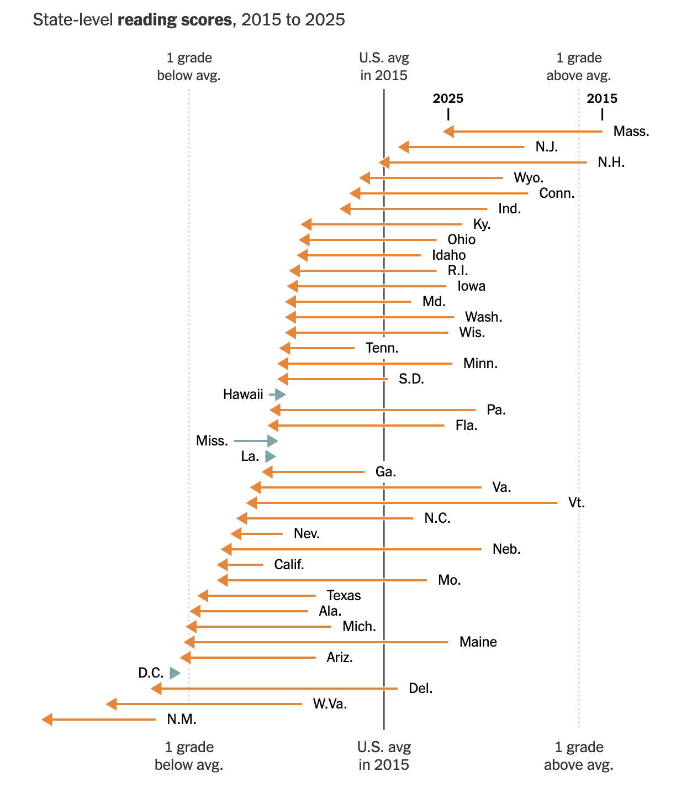
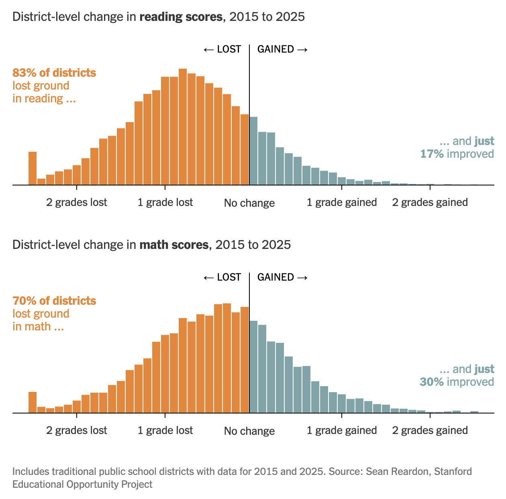
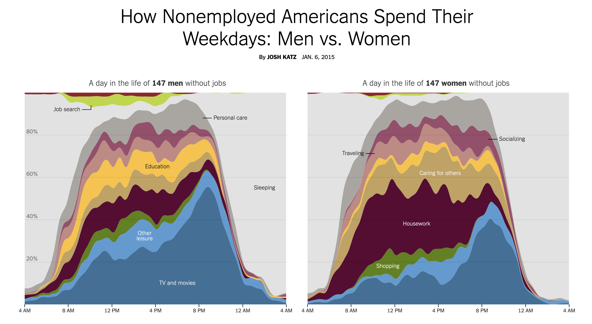

```{r setup, include = FALSE}
library(learnr)
library(tutorial.helpers)

library(tidyverse)
library(DBI)
library(duckdb)
library(dbplyr)

knitr::opts_chunk$set(echo = FALSE)
knitr::opts_chunk$set(out.width = '90%')
options(tutorial.exercise.timelimit = 600,
        tutorial.storage = "local")

con_seda <- dbConnect(duckdb::duckdb(),
                      dbdir = "data/seda_2025.duckdb",
                      read_only = TRUE)

dbplyr_dist <- tbl(con_seda, "district_scores")

score_change <- dbplyr_dist |>
  filter(year %in% c(2015, 2023), !is.na(rla_score)) |>
  select(district_id, district_name, state, year, rla_score) |>
  collect() |>
  pivot_wider(names_from = year, values_from = rla_score, names_prefix = "rla_") |>
  filter(!is.na(rla_2015), !is.na(rla_2023)) |>
  mutate(rla_change = rla_2023 - rla_2015)

state_change <- tbl(con_seda, "state_scores") |>
  filter(year %in% c(2015, 2023), !is.na(rla_score)) |>
  select(stateabb, state_name, year, rla_score) |>
  collect() |>
  pivot_wider(names_from = year, values_from = rla_score, names_prefix = "rla_") |>
  filter(!is.na(rla_2015), !is.na(rla_2023)) |>
  mutate(rla_change = rla_2023 - rla_2015)

con_atus <- dbConnect(duckdb::duckdb(),
                      dbdir = "data/atus.duckdb",
                      read_only = TRUE)

dbplyr_act   <- tbl(con_atus, "activities")
dbplyr_resp  <- tbl(con_atus, "respondents")
dbplyr_codes <- tbl(con_atus, "activity_codes")

keep_cats <- c(
  "Personal Care Activities",
  "Household Activities",
  "Caring For & Helping Household (HH) Members",
  "Socializing, Relaxing, and Leisure"
)

activity_avg <- dbplyr_act |>
  left_join(dbplyr_codes |> select(activity_code, major_name),
            by = "activity_code") |>
  inner_join(dbplyr_resp |>
               filter(str_starts(employment_status, "Not"),
                      day_type == "Weekday") |>
               select(tucaseid, sex),
             by = "tucaseid") |>
  group_by(tucaseid, sex, major_name) |>
  summarize(daily_min = sum(duration_min, na.rm = TRUE), .groups = "drop") |>
  group_by(sex, major_name) |>
  summarize(avg_daily_min = mean(daily_min, na.rm = TRUE), .groups = "drop") |>
  collect()

hourly_avg <- dbplyr_act |>
  mutate(hour = start_hhmm %/% 100L) |>
  filter(hour >= 6L, hour <= 23L) |>
  left_join(dbplyr_codes |> select(activity_code, major_name),
            by = "activity_code") |>
  filter(major_name %in% keep_cats) |>
  inner_join(dbplyr_resp |>
               filter(str_starts(employment_status, "Not"),
                      day_type == "Weekday") |>
               select(tucaseid, sex),
             by = "tucaseid") |>
  group_by(sex, hour, major_name) |>
  summarize(avg_min = mean(duration_min, na.rm = TRUE), .groups = "drop") |>
  collect()
```

```{r info-section, child = system.file("child_documents/info_section.Rmd", package = "tutorial.helpers")}
```

## Introduction
###

This tutorial accompanies [Chapter 21: Databases](https://r4ds.hadley.nz/databases.html) from [*R for Data Science (2e)*](https://r4ds.hadley.nz/) by Hadley Wickham, Mine Çetinkaya-Rundel, and Garrett Grolemund.

You will use the  **[DBI](https://dbi.r-dbi.org/)**, **[duckdb](https://duckdb.org/docs/api/r)**, and **[dbplyr](https://dbplyr.tidyverse.org/)** packages to query two datasets recently featured in the *New York Times*: the Stanford Education Data Archive (SEDA) reading scores across 13,000 US school districts, and the American Time Use Survey (ATUS), which records how non-employed Americans spend their weekdays.

Use whichever AI agent you prefer --- **GitHub Copilot** is built into VS Code and always available, and "ask AI" means the agent of your choice.

### Exercise 1

You should be doing this tutorial in a repo named `r4ds-3`. If you are not, create one and then connect to it. You may need to restart this tutorial after you do so.

Create a new file, `analysis.qmd`, with the title `"Analyzing School Districts and Americans' Time Use"` and your name as the author. In a bash Terminal, render it:

```
quarto render analysis.qmd
```

Open `analysis.html` with Live Server (right-click it in the Explorer → **Open with Live Server**) and keep the tab open. It refreshes on every render. Going forward, we will just tell you to "Render" when we want you to take these steps.

Create a `.gitignore` with `analysis_files` followed by a blank line. Commit and push.

In the R Terminal, run:

```
show_file(".gitignore")
```

If that fails, it is probably because you have not yet loaded `library(tutorial.helpers)` in the R Terminal.

CP/CR.

```{r introduction-1}
question_text(NULL,
	answer(NULL, correct = TRUE),
	allow_retry = TRUE,
	try_again_button = "Edit Answer",
	incorrect = NULL,
	rows = 3)
```

###

```
analysis_files
```

###

We will be working with databases in this tutorial. Two key differences between data frames and database tables: database tables are stored on disk and can be arbitrarily large, while data frames are stored in memory; database tables almost always have indexes for fast row lookups, while data frames do not.

### Exercise 2

In your QMD, put `library(tidyverse)`, `library(DBI)`, `library(duckdb)`, and `library(dbplyr)` in a new code chunk. Render.

Notice that the file does not look good because the code is visible and there are annoying messages. To take care of this, add `#| message: false` to remove all the messages in this code chunk. Also add the following to the YAML header to remove all code echoes from the HTML:

```
execute:
  echo: false
```

Render. In the R Terminal, run:

```
show_file("analysis.qmd", chunk = "Last")
```

CP/CR.

```{r introduction-2}
question_text(NULL,
	answer(NULL, correct = TRUE),
	allow_retry = TRUE,
	try_again_button = "Edit Answer",
	incorrect = NULL,
	rows = 6)
```

###

<pre><code>#| message: false
library(tidyverse)
library(DBI)
library(duckdb)
library(dbplyr)
</code></pre>

###

Databases are run by database management systems (DBMS's). **DBI** is the common interface R uses to talk to any of them; the DBMS-specific driver is a separate package. **duckdb** is one such driver, and DuckDB is unusual in being *in-process* — it runs inside your R session with no server to administer. The alternatives are worth knowing by name: **[RSQLite](https://rsqlite.r-dbi.org/)** for the other common in-process engine, **[RPostgres](https://rpostgres.r-dbi.org/)** and **[RMariaDB](https://rmariadb.r-dbi.org/)** for the client-server databases most organizations actually run, and **[odbc](https://odbc.r-dbi.org/)** as a generic fallback for SQL Server, Snowflake, and anything else with an ODBC driver. Swapping one for another changes the connection line and almost nothing else.

### Exercise 3

Create a `data` directory at the top level of the `r4ds-3` repo. In the bash Terminal, run `ls`.

CP/CR.

```{r introduction-3}
question_text(NULL,
	answer(NULL, correct = TRUE),
	allow_retry = TRUE,
	try_again_button = "Edit Answer",
	incorrect = NULL,
	rows = 3)
```

###

```
analysis.html  analysis.qmd  analysis_files  data
```

###

At the simplest level, a database is a collection of data frames — called tables. Like a data frame, a table is a set of named columns where every value in a column has the same type.


## US education
###

This section uses the [Stanford Education Data Archive (SEDA)](https://edopportunity.org/),
which converts each state's standardized test results into a common
grade-equivalent scale so that achievement can be compared across districts and
years. 

Here's [what the *New York Times* found](https://www.nytimes.com/2026/05/13/upshot/test-scores-school-districts-us.html)
from this same data in May of 2026.

```{r}

```

### Exercise 1

Download the DuckDB database `seda_2025.duckdb` from this URL and save it in your
`data/` directory:

```
https://github.com/PPBDS/misc.tutorials/raw/refs/heads/main/inst/tutorials/03-r4ds-3/data/seda_2025.duckdb
```

Run `ls data` in the bash Terminal. 

CP/CR.

```{r us-education-1}
question_text(NULL,
	answer(NULL, correct = TRUE),
	allow_retry = TRUE,
	try_again_button = "Edit Answer",
	incorrect = NULL,
	rows = 3)
```

###

```
seda_2025.duckdb
```

###

SEDA is a research archive, not an administrative feed. Every state gives a different test, and those raw scores are not comparable to each other. SEDA's contribution is the rescaling: it anchors each state's results to the National Assessment of Educational Progress and reports everything in grade-equivalent units, which is what makes a district in Mississippi comparable to one in Vermont.

### Exercise 2

Create a new working chunk in `analysis.qmd`. Connect to the database file and display the names of the tables it contains. Render.

In the R Terminal, run `show_file("analysis.qmd", chunk = "Last")`. CP/CR.

```{r us-education-2}
question_text(NULL,
	answer(NULL, correct = TRUE),
	allow_retry = TRUE,
	try_again_button = "Edit Answer",
	incorrect = NULL,
	rows = 5)
```

###

```{r us-education-2-test}
#| echo: true
dbListTables(con_seda)
```

###

The SEDA database has three tables: `district_scores` (one row per district per year), `district_demographics` (the same districts broken out by race, gender, and income), and `state_scores` (one row per state per year).

### Exercise 3

In the current working chunk, create a lazy reference to the `district_scores` table, assign it to `dbplyr_dist`, and print it. Render.

In the R Terminal, run `show_file("analysis.qmd", chunk = "Last")`. CP/CR.

```{r us-education-3}
question_text(NULL,
	answer(NULL, correct = TRUE),
	allow_retry = TRUE,
	try_again_button = "Edit Answer",
	incorrect = NULL,
	rows = 5)
```

###

```{r us-education-3-test}
#| echo: true
dbplyr_dist <- tbl(con_seda, "district_scores")
dbplyr_dist
```

###

The `rla_score` column is on the SEDA grade-equivalent scale: 0 is roughly the national average, and 1.0 is one full grade level above it. Negative values mean that district's students scored below the national average. `dbplyr_dist` is a lazy reference — it points to the table but pulls no data into R. Data only moves into memory when you call `collect()`.

### Exercise 4

Count the number of district-year observations per year in `dbplyr_dist`. Collect and arrange by year. Render.

In the R Terminal, run `show_file("analysis.qmd", chunk = "Last")`. CP/CR.

```{r us-education-4}
question_text(NULL,
	answer(NULL, correct = TRUE),
	allow_retry = TRUE,
	try_again_button = "Edit Answer",
	incorrect = NULL,
	rows = 5)
```

###

```{r us-education-4-test}
#| echo: true
dbplyr_dist |>
  count(year) |>
  collect() |>
  arrange(year)
```

###

The 191,547 district-year rows span 2009–2019 and 2022–2025, with no observations for 2020 or 2021 — most states suspended standardized testing during the COVID-19 pandemic. Coverage is not flat in the years that are present, either: 2014 has 10,855 districts against 14,322 the year before, and the reason is that ten states — California and Ohio among them — contribute no rows at all that year. A year-to-year comparison that ignores which states are in the denominator will read those absences as change.

### Exercise 5

Compute the mean `rla_score` across all districts and years where `rla_score` is not missing. Collect the result. Render.

In the R Terminal, run `show_file("analysis.qmd", chunk = "Last")`. CP/CR.

```{r us-education-5}
question_text(NULL,
	answer(NULL, correct = TRUE),
	allow_retry = TRUE,
	try_again_button = "Edit Answer",
	incorrect = NULL,
	rows = 5)
```

###

```{r us-education-5-test}
#| echo: true
dbplyr_dist |>
  filter(!is.na(rla_score)) |>
  summarize(mean_rla = mean(rla_score, na.rm = TRUE)) |>
  collect()
```

###

The overall mean is −0.0089 — the typical US district has scored a hundredth of a grade level below the national benchmark when averaged across all years. That is a district average, not a student average: a one-room district counts as much as Los Angeles Unified.

### Exercise 6

Compute the mean `rla_score` grouped by year, for districts with non-missing scores. Arrange by year. Collect and print. Render.

In the R Terminal, run `show_file("analysis.qmd", chunk = "Last")`. CP/CR.

```{r us-education-6}
question_text(NULL,
	answer(NULL, correct = TRUE),
	allow_retry = TRUE,
	try_again_button = "Edit Answer",
	incorrect = NULL,
	rows = 7)
```

###

```{r us-education-6-test}
#| echo: true
dbplyr_dist |>
  filter(!is.na(rla_score)) |>
  group_by(year) |>
  summarize(mean_rla = mean(rla_score, na.rm = TRUE)) |>
  arrange(year) |>
  collect()
```

###

Scores drift slightly above zero from 2012 through 2018, peaking at 0.064 in 2014, then turn negative in 2019. The four post-COVID years are far worse and get worse every year: −0.069 in 2022, −0.099 in 2023, −0.122 in 2024, −0.124 in 2025. The disruption lowered the national average and there is no recovery in this data.

### Exercise 7

Databases do not run R. Instead of the result, display the query that the database will actually execute for the year-by-year average you just built. Render.

In the R Terminal, run `show_file("analysis.qmd", chunk = "Last")`. CP/CR.

```{r us-education-7}
question_text(NULL,
	answer(NULL, correct = TRUE),
	allow_retry = TRUE,
	try_again_button = "Edit Answer",
	incorrect = NULL,
	rows = 8)
```

###

```{r us-education-7-test}
#| echo: true
dbplyr_dist |>
  filter(!is.na(rla_score)) |>
  group_by(year) |>
  summarize(mean_rla = mean(rla_score, na.rm = TRUE)) |>
  arrange(year) |>
  show_query()
```

###

You never wrote SQL, but SQL is what ran. **dbplyr** turns the pipeline into a query string, hands the string to the database, and lets the database do the work: the row filter becomes a `WHERE` clause, the grouping and averaging become `GROUP BY` and `AVG`, and the sort becomes `ORDER BY`. Two consequences worth carrying away. First, the translation is not DuckDB-specific — point the same pipeline at Postgres through **RPostgres**, or at SQL Server through **odbc**, and **dbplyr** emits that dialect instead. Second, this is why the workflow is *aggregate in the database, collect small*: all 191,547 rows stayed in DuckDB and only the 15-row summary crossed into R.

### Exercise 8

For each district, compute the change in reading score from 2015 to 2023, where a positive value means improvement. Keep only districts with data in both years. Assign the result to `score_change` and print it. Render.

In the R Terminal, run `show_file("analysis.qmd", chunk = "Last")`. CP/CR.

```{r us-education-8}
question_text(NULL,
	answer(NULL, correct = TRUE),
	allow_retry = TRUE,
	try_again_button = "Edit Answer",
	incorrect = NULL,
	rows = 10)
```

###

```{r us-education-8-test}
#| echo: true
score_change <- dbplyr_dist |>
  filter(year %in% c(2015, 2023), !is.na(rla_score)) |>
  select(district_id, district_name, state, year, rla_score) |>
  collect() |>
  pivot_wider(names_from = year, values_from = rla_score, names_prefix = "rla_") |>
  filter(!is.na(rla_2015), !is.na(rla_2023)) |>
  mutate(rla_change = rla_2023 - rla_2015)
score_change
```

###

`score_change` has 9,644 rows — one per district with a usable score in both years, well under the 12,064 districts observed in 2015 alone. Requiring a district to appear twice silently drops every district that opened, closed, merged, or fell below SEDA's reliability threshold in between, which is the most common way a "change over time" table quietly stops representing the population it started from.

### Exercise 9

In the same working chunk, also compute `state_change` using the `state_scores` table — the same structure as `score_change` but aggregated at the state level. Replace the print of `score_change` with a print of `state_change`. Render.

In the R Terminal, run `show_file("analysis.qmd", chunk = "Last")`. CP/CR.

```{r us-education-9}
question_text(NULL,
	answer(NULL, correct = TRUE),
	allow_retry = TRUE,
	try_again_button = "Edit Answer",
	incorrect = NULL,
	rows = 5)
```

###

```{r us-education-9-test}
#| echo: true
score_change <- dbplyr_dist |>
  filter(year %in% c(2015, 2023), !is.na(rla_score)) |>
  select(district_id, district_name, state, year, rla_score) |>
  collect() |>
  pivot_wider(names_from = year, values_from = rla_score, names_prefix = "rla_") |>
  filter(!is.na(rla_2015), !is.na(rla_2023)) |>
  mutate(rla_change = rla_2023 - rla_2015)
state_change <- tbl(con_seda, "state_scores") |>
  filter(year %in% c(2015, 2023), !is.na(rla_score)) |>
  select(stateabb, state_name, year, rla_score) |>
  collect() |>
  pivot_wider(names_from = year, values_from = rla_score, names_prefix = "rla_") |>
  filter(!is.na(rla_2015), !is.na(rla_2023)) |>
  mutate(rla_change = rla_2023 - rla_2015)
state_change
```

###

`score_change` and `state_change` have the same structure at two levels of aggregation, and the aggregation flattens the variation dramatically. In 2015 the district scores had a standard deviation of 0.36 and ran from −1.69 to +1.76; the state scores had a standard deviation of 0.14 and ran from −0.27 to +0.36. Averaging cancels the extremes, which is why a state-level chart looks calm even when the districts inside it do not.

### Exercise 10

Now clean up the working chunk — but split it in two rather than leaving it as one.

`score_change` and `state_change` are ordinary tibbles: once computed, they can be saved to disk and reloaded. A database connection cannot. Put the connection and the `dbplyr_dist` reference in their own chunk, and leave a second chunk — now the last chunk in the file — holding only the `score_change` and `state_change` computations. Delete everything exploratory from Exercises 2 through 7.

Render.

In the R Terminal, run `show_file("analysis.qmd", chunk = "Last")`. CP/CR.

```{r us-education-10}
question_text(NULL,
	answer(NULL, correct = TRUE),
	allow_retry = TRUE,
	try_again_button = "Edit Answer",
	incorrect = NULL,
	rows = 10)
```

###

<pre><code>score_change <- dbplyr_dist |>
  filter(year %in% c(2015, 2023), !is.na(rla_score)) |>
  select(district_id, district_name, state, year, rla_score) |>
  collect() |>
  pivot_wider(names_from = year, values_from = rla_score, names_prefix = "rla_") |>
  filter(!is.na(rla_2015), !is.na(rla_2023)) |>
  mutate(rla_change = rla_2023 - rla_2015)
state_change <- tbl(con_seda, "state_scores") |>
  filter(year %in% c(2015, 2023), !is.na(rla_score)) |>
  select(stateabb, state_name, year, rla_score) |>
  collect() |>
  pivot_wider(names_from = year, values_from = rla_score, names_prefix = "rla_") |>
  filter(!is.na(rla_2015), !is.na(rla_2023)) |>
  mutate(rla_change = rla_2023 - rla_2015)
</code></pre>

###

The chunk above your last one still holds the connection, and it is the one part of this analysis that must be rebuilt from scratch on every single render. A connection is a live handle to a running database process — an *external pointer*, in R's vocabulary — and external pointers do not survive being written to disk and read back. The two tibbles below it have no such problem.

### Exercise 11

Add these two lines as the first lines of the last chunk:

```
#| cache: true
#| cache.extra: !expr file.mtime("data/seda_2025.duckdb")
```

Render. In the bash Terminal, run `ls`.

CP/CR.

```{r us-education-11}
question_text(NULL,
	answer(NULL, correct = TRUE),
	allow_retry = TRUE,
	try_again_button = "Edit Answer",
	incorrect = NULL,
	rows = 5)
```

###

```
analysis.html  analysis.qmd  analysis_cache  analysis_files  data
```

###

The first render with caching writes `analysis_cache/` to disk; later renders read `score_change` and `state_change` back from those files instead of re-querying SEDA. The second line is the guard that makes this safe. Caching normally invalidates when the *code* changes, and the code here would not change if someone dropped a newer `seda_2025.duckdb` into `data/` — you would keep serving last month's numbers forever. Keying the cache on the database file's modification time makes a new file invalidate the cache. Note also what you did *not* cache: caching the connection chunk would save the external pointer as nothing at all, and your next render would fail with `Invalid connection`.

### Exercise 12

Add `analysis_cache` to your `.gitignore` on its own line. In the R Terminal, run `show_file(".gitignore")`. CP/CR.

```{r us-education-12}
question_text(NULL,
	answer(NULL, correct = TRUE),
	allow_retry = TRUE,
	try_again_button = "Edit Answer",
	incorrect = NULL,
	rows = 5)
```

###

<pre><code>analysis_files
analysis_cache
</code></pre>

###

Cache files are machine-specific and regenerated on every render — they should never go to GitHub. The same reasoning applies to `data/`: two 30 MB database files are exactly the kind of thing Git handles badly, which is why this tutorial has you download them rather than commit them.

### Exercise 13

Create a new working code chunk in `analysis.qmd`. From `dbplyr_dist`, filter to 2023 with non-missing `rla_score`, collect, and plot the distribution as a histogram. Add a vertical reference line at 0. Include the district count in the subtitle. Give the plot a title, subtitle, and caption. Render.

In the R Terminal, run:

```
show_file("analysis.qmd", chunk = "Last")
```

CP/CR.

```{r us-education-13}
question_text(NULL,
	answer(NULL, correct = TRUE),
	allow_retry = TRUE,
	try_again_button = "Edit Answer",
	incorrect = NULL,
	rows = 12)
```

###

```{r us-education-13-test}
#| echo: true
dist_2023 <- dbplyr_dist |>
  filter(year == 2023, !is.na(rla_score)) |>
  collect()

ggplot(dist_2023, aes(x = rla_score)) +
  geom_histogram(bins = 50, fill = "steelblue", color = "white") +
  geom_vline(xintercept = 0, linetype = "dashed", color = "darkred") +
  labs(
    title = "Distribution of District Reading Scores, 2023",
    subtitle = paste0("n = ", nrow(dist_2023), " districts; most cluster near average, left tail shows the lowest-scoring"),
    x = "Reading score (grade-equivalents above/below national average)",
    y = "Number of districts",
    caption = "Source: Reardon et al. (2026). Stanford Education Data Archive (SEDA 2025.1)."
  ) +
  theme_minimal()
```

###

11,274 districts, roughly bell-shaped, with a long thin left tail: only four districts fall below −1.5 and exactly one below −2. Look at who they are and the tail stops being a poverty story. The bottom of the 2023 list reads `Mo Schools For The Sev Disabled` (−2.44), `Specl. School Dst. St. Louis County` (−1.85), and `Arizona Autism Charter Schools Inc.` (−1.62). SEDA's unit of observation is the administrative district, and several states run special-education and specialty districts that land in this file as ordinary rows. Notice also that the chunk queried the database again and worked: the connection chunk is not cached, so the handle was rebuilt this render.

### Exercise 14

Plot the distribution of `rla_change` from `score_change` as a histogram, coloring bars differently for positive and negative changes. Add a vertical reference line at 0. Include the district count in the subtitle. Give the plot a title, subtitle, and caption. Render.

In the R Terminal, run:

```
show_file("analysis.qmd", chunk = "Last")
```

CP/CR.

```{r us-education-14}
question_text(NULL,
	answer(NULL, correct = TRUE),
	allow_retry = TRUE,
	try_again_button = "Edit Answer",
	incorrect = NULL,
	rows = 12)
```

###

```{r us-education-14-test}
#| echo: true
ggplot(score_change, aes(x = rla_change)) +
  geom_histogram(bins = 60, aes(fill = rla_change < 0), show.legend = FALSE) +
  scale_fill_manual(values = c("TRUE" = "tomato", "FALSE" = "steelblue")) +
  geom_vline(xintercept = 0, linetype = "dashed", color = "black") +
  labs(
    title = "Change in District Reading Scores, 2015 to 2023",
    subtitle = paste0("n = ", nrow(score_change), " districts; about 79% scored lower in 2023 than in 2015"),
    x = "Score change (grade-equivalents)",
    y = "Number of districts",
    caption = "Source: Reardon et al. (2026). Stanford Education Data Archive (SEDA 2025.1)."
  ) +
  theme_minimal()
```

###

79% of the 9,644 districts sit left of the dashed line. The *New York Times* published the same histogram over a longer window — 2015 to 2025 — and got 83%, along with the useful companion fact that math held up better than reading:

```{r}

```

The four-point gap between 79% and 83% is mostly the endpoint. The national series you printed in Exercise 6 keeps falling after 2023 — −0.122 in 2024, −0.124 in 2025 — so measuring to 2025 instead of 2023 pushes more districts to the left of the line. When two versions of "the same" statistic disagree, the window is the first thing to check.

### Exercise 15

Print `state_change` sorted by `rla_change`. Render.

In the R Terminal, run `show_file("analysis.qmd", chunk = "Last")`. CP/CR.

```{r us-education-15}
question_text(NULL,
	answer(NULL, correct = TRUE),
	allow_retry = TRUE,
	try_again_button = "Edit Answer",
	incorrect = NULL,
	rows = 5)
```

###

```{r us-education-15-test}
#| echo: true
state_change |>
  arrange(rla_change)
```

###

`state_change` has 51 rows, not 50 — SEDA reports the District of Columbia alongside the states. A tibble prints only its first 10, so an ascending sort shows you the ten worst (Vermont at −0.371, Oklahoma at −0.341) and hides every improver. Only two of the 51 gained ground at all, and neither gained much: Mississippi at +0.061 and Hawaii at +0.043 grade-equivalents, on the order of three weeks of school. Seeing all 51 at once requires a plot rather than a printed tibble.

### Exercise 16

Let's reconstruct the *New York Times* arrow chart from the beginning of this section. Recall:


```{r}

```

Build a state-level arrow chart of reading score changes from 2015 to 2023. Sort states by their 2023 reading score. For each state, draw an arrow from its 2015 score to its 2023 score, colored by direction of change. Add a gray dot at the 2015 starting point. Give the plot a title, subtitle, and caption with no y-axis label. Render.

In the R Terminal, run:

```
show_file("analysis.qmd", chunk = "Last")
```

CP/CR.

```{r us-education-16}
question_text(NULL,
	answer(NULL, correct = TRUE),
	allow_retry = TRUE,
	try_again_button = "Edit Answer",
	incorrect = NULL,
	rows = 15)
```

###

```{r us-education-16-test}
#| echo: true
#| fig.height: 10
state_change |>
  arrange(rla_2023) |>
  mutate(state_name = fct_inorder(state_name)) |>
  ggplot(aes(y = state_name)) +
  geom_segment(
    aes(x = rla_2015, xend = rla_2023, yend = state_name,
        color = rla_change > 0),
    arrow = arrow(length = unit(0.15, "cm"), type = "closed"),
    linewidth = 0.7,
    show.legend = FALSE
  ) +
  geom_point(aes(x = rla_2015), color = "gray60", size = 1) +
  scale_color_manual(values = c("TRUE" = "steelblue", "FALSE" = "tomato")) +
  labs(
    title = "State Reading Score Changes, 2015 to 2023",
    subtitle = "Arrows point left (decline) in 49 of 51 jurisdictions; only Mississippi and Hawaii gained",
    x = "Reading score (grade-equivalents)",
    y = NULL,
    caption = "Source: Reardon et al. (2026). Stanford Education Data Archive (SEDA 2025.1)."
  ) +
  theme_minimal() +
  theme(axis.text.y = element_text(size = 9))
```

###

Two blue arrows against 49 red ones. Mississippi is the case with a well-known explanation: its 2013 Literacy-Based Promotion Act required phonics-based instruction, put literacy coaches in low-performing schools, and held back third graders who failed a reading screen, and the gain shows up here. Hawaii has no comparable single statute, which is a useful check on the temptation to read policy off a chart — the chart identifies the exceptions, it does not explain them. Note also how short both blue arrows are next to the red ones: at +0.06 and +0.04, "improved" here means "declined by less than everyone else."

### Exercise 17

Commit `analysis.qmd` with the message `"Add SEDA district reading analysis"` and push to GitHub. You may use your AI agent, the VS Code Source Control panel, or the bash Terminal.

In the bash Terminal, run:

```
git log --oneline -3
```

CP/CR.

```{r us-education-17}
question_text(NULL,
	answer(NULL, correct = TRUE),
	allow_retry = TRUE,
	try_again_button = "Edit Answer",
	incorrect = NULL,
	rows = 3)
```

###

```
abc1234 Add SEDA district reading analysis
def5678 Add .gitignore
...
```

###

About 79% of the 9,644 districts with comparable 2015 and 2023 scores lost ground in reading, and every post-COVID year in the national series is worse than the one before it. That is the finding worth reporting. What the state chart adds is a caution about the story people usually attach to it: a decline this broad has exactly two exceptions, one of them with a famous literacy statute behind it and one without, which is not enough evidence to credit legislation for the pattern.

## Time use
###

This section uses a DuckDB database built from the Bureau of Labor Statistics
[American Time Use Survey (ATUS)](https://www.bls.gov/tus/), which asks one
randomly selected person per household to record every activity they did across
a single 24-hour diary day. The survey has run each year since 2003; this build
covers 2003 through 2024, 252,808 respondents, and 4,880,021 activity records.

###

In 2015, here's [what the *New York Times* found](https://www.nytimes.com/interactive/2015/01/06/upshot/how-nonemployed-americans-spend-their-weekdays-men-vs-women.html)
from this same survey.

```{r}

```

### Exercise 1

Download the DuckDB database `atus.duckdb` from this URL and save it in your `data/` directory:

```
https://github.com/PPBDS/misc.tutorials/raw/refs/heads/main/inst/tutorials/03-r4ds-3/data/atus.duckdb
```

In the bash Terminal, run `ls data`.

CP/CR.

```{r time-use-1}
question_text(NULL,
	answer(NULL, correct = TRUE),
	allow_retry = TRUE,
	try_again_button = "Edit Answer",
	incorrect = NULL,
	rows = 3)
```

###

```
atus.duckdb  seda_2025.duckdb
```

###

ATUS is a *diary* survey, not a recall survey. The interviewer walks the respondent through the previous day in order — "and what did you do next, and how long did that take?" — which is why the activity records for one person tile the whole day end to end, with no gaps and no overlaps. That property is what makes summing minutes per person a meaningful number rather than an undercount, and it is worth checking for before you trust any time-use dataset.

### Exercise 2

Create a new working chunk in `analysis.qmd`. Connect to `data/atus.duckdb` and display the names of the tables it contains. Render.

In the R Terminal, run `show_file("analysis.qmd", chunk = "Last")`. CP/CR.

```{r time-use-2}
question_text(NULL,
	answer(NULL, correct = TRUE),
	allow_retry = TRUE,
	try_again_button = "Edit Answer",
	incorrect = NULL,
	rows = 5)
```

###

```{r time-use-2-test}
#| echo: true
dbListTables(con_atus)
```

###

Three tables: `activities` records every diary entry with start time and duration, `respondents` holds demographic data including sex, age, and employment status, and `activity_codes` maps numeric codes to human-readable category names.

### Exercise 3

In the current working chunk, replace the table listing with lazy references to all three tables: assign `dbplyr_act` for `activities`, `dbplyr_resp` for `respondents`, and `dbplyr_codes` for `activity_codes`. Print `dbplyr_act`. Render.

In the R Terminal, run `show_file("analysis.qmd", chunk = "Last")`. CP/CR.

```{r time-use-3}
question_text(NULL,
	answer(NULL, correct = TRUE),
	allow_retry = TRUE,
	try_again_button = "Edit Answer",
	incorrect = NULL,
	rows = 7)
```

###

```{r time-use-3-test}
#| echo: true
dbplyr_act   <- tbl(con_atus, "activities")
dbplyr_resp  <- tbl(con_atus, "respondents")
dbplyr_codes <- tbl(con_atus, "activity_codes")
dbplyr_act
```

###

The six-digit `activity_code` packs a three-level hierarchy into one integer. For code 120303, the leading two digits give major category 12 (Socializing, Relaxing, and Leisure), the middle two give sub-category 03 (TV and Movies), and the last two give detail 03 (Watching TV). The `start_hhmm` column uses the same packing trick: 1430 means 2:30 PM.

### Exercise 4

In the current working chunk, replace the print of `dbplyr_act` with `dbplyr_resp`. Render.

In the R Terminal, run `show_file("analysis.qmd", chunk = "Last")`. CP/CR.

```{r time-use-4}
question_text(NULL,
	answer(NULL, correct = TRUE),
	allow_retry = TRUE,
	try_again_button = "Edit Answer",
	incorrect = NULL,
	rows = 5)
```

###

```{r time-use-4-test}
#| echo: true
dbplyr_resp
```

###

Each row is one ATUS diarist. "Not in labor force" means the person was neither working nor job-hunting — retirees, full-time caregivers, and non-enrolled students all qualify. The `day_type` column separates weekday diaries from weekend/holiday ones, and `weight` adjusts each respondent to represent the full US population. Nothing you do in this tutorial uses that weight, so every average you produce is an average over *respondents*, not over Americans.

### Exercise 5

Collect the entire `dbplyr_codes` table and print it. Because `activity_codes` is only a few hundred rows, `collect()` is fine here — it is the large tables we defer. Render.

In the R Terminal, run `show_file("analysis.qmd", chunk = "Last")`. CP/CR.

```{r time-use-5}
question_text(NULL,
	answer(NULL, correct = TRUE),
	allow_retry = TRUE,
	try_again_button = "Edit Answer",
	incorrect = NULL,
	rows = 5)
```

###

```{r time-use-5-test}
#| echo: true
dbplyr_codes |>
  collect()
```

###

426 detailed codes roll up into 18 major categories, running from `Personal Care Activities` (01) through `Traveling` (18), with 17 unused and one oddity at the end: major code 50, `Data Codes`, which is where the survey files unclassifiable, refused, and missing answers rather than an actual activity. Anything you compute across all categories will silently include it. This section works with four of the real ones: 01 Personal Care, 02 Household Activities, 03 Caring For & Helping Household (HH) Members, and 12 Socializing, Relaxing, and Leisure. Note the exact spelling of that third label — it uses an ampersand and the abbreviation `(HH)`, and a filter written from the plain-English name will silently match nothing.

### Exercise 6

For each table in the database, count the number of rows. Render.

In the R Terminal, run `show_file("analysis.qmd", chunk = "Last")`. CP/CR.

```{r time-use-6}
question_text(NULL,
	answer(NULL, correct = TRUE),
	allow_retry = TRUE,
	try_again_button = "Edit Answer",
	incorrect = NULL,
	rows = 5)
```

###

```{r time-use-6-test}
#| echo: true
list(
  activities     = dbplyr_act  |> summarize(n = n()) |> collect(),
  respondents    = dbplyr_resp |> summarize(n = n()) |> collect(),
  activity_codes = dbplyr_codes|> summarize(n = n()) |> collect()
)
```

###

4,880,021 activity records against 252,808 respondents — about 19 diary entries per person. A table that size is exactly why the data is in DuckDB rather than a CSV you read into memory. A database is not the only way to handle it, though: **[arrow](https://arrow.apache.org/docs/r/)** gives you the same aggregate-then-collect discipline over Parquet files with no database at all, and **[duckplyr](https://duckplyr.tidyverse.org/)** runs the DuckDB engine underneath ordinary data-frame code. All three share the same idea — keep the big table out of R's memory and pull down only the summary.

### Exercise 7

Count how many activity records fall in each major activity category, largest first. Collect and print. Render.

In the R Terminal, run `show_file("analysis.qmd", chunk = "Last")`. CP/CR.

```{r time-use-7}
question_text(NULL,
	answer(NULL, correct = TRUE),
	allow_retry = TRUE,
	try_again_button = "Edit Answer",
	incorrect = NULL,
	rows = 7)
```

###

```{r time-use-7-test}
#| echo: true
dbplyr_act |>
  left_join(dbplyr_codes |> select(activity_code, major_name),
            by = "activity_code") |>
  count(major_name, sort = TRUE) |>
  collect()
```

###

Record count is not time spent. Traveling tops the table at 938,689 records because every leg of a trip is its own entry: home to the bus stop, the bus to work, the walk to the office is three rows for one journey. Personal Care Activities is a close second at 918,822 — sleeping is usually a single uninterrupted record per night, but the category also holds grooming and washing up, which everyone does several times a day. And there is `Data Codes` at 49,832 records, the junk bucket from the last exercise, sitting in the middle of the table as though it were an activity.

### Exercise 8

Now ask a different question of the same table: what is the average length of a single activity record in each major category? Longest first. Collect and print. Render.

In the R Terminal, run `show_file("analysis.qmd", chunk = "Last")`. CP/CR.

```{r time-use-8}
question_text(NULL,
	answer(NULL, correct = TRUE),
	allow_retry = TRUE,
	try_again_button = "Edit Answer",
	incorrect = NULL,
	rows = 7)
```

###

```{r time-use-8-test}
#| echo: true
dbplyr_act |>
  left_join(dbplyr_codes |> select(activity_code, major_name),
            by = "activity_code") |>
  group_by(major_name) |>
  summarize(avg_min = mean(duration_min, na.rm = TRUE)) |>
  arrange(desc(avg_min)) |>
  collect()
```

###

The ordering nearly inverts. Traveling drops from first to last, at 18.7 minutes per record. Personal Care Activities rises to 159 minutes, behind only Work & Work-Related Activities at 180, because a night's sleep enters the file as one very long row. Two tables built from the same 4.88 million rows, two opposite rankings, and neither is wrong — they answer different questions. Deciding which question a summary answers is most of the work of auditing someone else's chart.

### Exercise 9

Count the number of respondents by `sex` and `employment_status`. Collect and print. Render.

In the R Terminal, run `show_file("analysis.qmd", chunk = "Last")`. CP/CR.

```{r time-use-9}
question_text(NULL,
	answer(NULL, correct = TRUE),
	allow_retry = TRUE,
	try_again_button = "Edit Answer",
	incorrect = NULL,
	rows = 7)
```

###

```{r time-use-9-test}
#| echo: true
dbplyr_resp |>
  count(sex, employment_status, sort = FALSE) |>
  arrange(sex, employment_status) |>
  collect()
```

###

The "Not in labor force" group — the focus of the *New York Times* graphic — holds 56,492 women and 30,349 men, nearly two to one, against an employed group that is almost evenly split (78,566 women, 76,716 men). That imbalance is itself the first finding of the section: leaving the labor force is far more common for women, and any comparison of how non-employed men and women spend their days is comparing two populations that arrived there by different routes.

### Exercise 10

Count the number of respondents by `year`. Collect and print, arranged by year. Render.

In the R Terminal, run `show_file("analysis.qmd", chunk = "Last")`. CP/CR.

```{r time-use-10}
question_text(NULL,
	answer(NULL, correct = TRUE),
	allow_retry = TRUE,
	try_again_button = "Edit Answer",
	incorrect = NULL,
	rows = 7)
```

###

```{r time-use-10-test}
#| echo: true
dbplyr_resp |>
  count(year) |>
  arrange(year) |>
  collect()
```

###

Sample size is not stable. It falls almost every year, from 20,720 in 2003 — the first year was fielded at roughly double the later scale — to 7,669 in 2024, a decline of nearly two-thirds. The pandemic years are not where you would guess, either: 2020 (8,782) and 2021 (9,087) are both *larger* than 2022 (8,136), even though BLS suspended data collection for two months in 2020. So the pooled averages later in this section are dominated by the mid-2000s, and a "2003–2024 average" is closer to a 2000s average than the label suggests.

### Exercise 11

For weekday respondents who are not in the labor force, compute how many minutes each person spent in each major activity category over their diary day. Collect and print the result. Render.

In the R Terminal, run `show_file("analysis.qmd", chunk = "Last")`. CP/CR.

```{r time-use-11}
question_text(NULL,
	answer(NULL, correct = TRUE),
	allow_retry = TRUE,
	try_again_button = "Edit Answer",
	incorrect = NULL,
	rows = 10)
```

###

```{r time-use-11-test}
#| echo: true
dbplyr_act |>
  left_join(dbplyr_codes |> select(activity_code, major_name),
            by = "activity_code") |>
  inner_join(dbplyr_resp |>
               filter(str_starts(employment_status, "Not"),
                      day_type == "Weekday") |>
               select(tucaseid, sex),
             by = "tucaseid") |>
  group_by(tucaseid, sex, major_name) |>
  summarize(daily_min = sum(duration_min, na.rm = TRUE), .groups = "drop") |>
  collect()
```

###

269,718 rows, one per person per category they touched that day — not one per activity record. Someone who watched TV in three separate stretches contributes a single leisure total, not three. Getting this level of aggregation right is the whole ballgame: averaging the raw records instead would answer "how long is a typical TV session," which is a different question from "how much TV do people watch."

### Exercise 12

Collapse those person-level totals one step further: average them across respondents, so you have the mean weekday minutes a non-employed person of each sex spends in each major category. Assign the result to `activity_avg` and print it. Render.

In the R Terminal, run `show_file("analysis.qmd", chunk = "Last")`. CP/CR.

```{r time-use-12}
question_text(NULL,
	answer(NULL, correct = TRUE),
	allow_retry = TRUE,
	try_again_button = "Edit Answer",
	incorrect = NULL,
	rows = 12)
```

###

```{r time-use-12-test}
#| echo: true
activity_avg <- dbplyr_act |>
  left_join(dbplyr_codes |> select(activity_code, major_name),
            by = "activity_code") |>
  inner_join(dbplyr_resp |>
               filter(str_starts(employment_status, "Not"),
                      day_type == "Weekday") |>
               select(tucaseid, sex),
             by = "tucaseid") |>
  group_by(tucaseid, sex, major_name) |>
  summarize(daily_min = sum(duration_min, na.rm = TRUE), .groups = "drop") |>
  group_by(sex, major_name) |>
  summarize(avg_daily_min = mean(daily_min, na.rm = TRUE), .groups = "drop") |>
  collect()
activity_avg
```

###

If your result differs from ours, replace your code with the code above before moving on, so that `activity_avg` matches for the rest of the section.

`activity_avg` has 36 rows: 18 categories × 2 sexes. Read `avg_daily_min` carefully — it is the average over the people who did that activity at all, since someone who never gardened has no Household Activities row to contribute. That is a conditional mean, not a per-capita mean, and the two diverge sharply for rare activities.

### Exercise 13

Start a new code chunk. Build the dataset behind the final chart: for weekday non-employed respondents, the average minutes spent in activities *starting* in each hour of the day, broken out by sex and major category. Keep only the four categories named in Exercise 5, and only hours 6 through 23. Assign the result to `hourly_avg` and print it. Render.

In the R Terminal, run `show_file("analysis.qmd", chunk = "Last")`. CP/CR.

```{r time-use-13}
question_text(NULL,
	answer(NULL, correct = TRUE),
	allow_retry = TRUE,
	try_again_button = "Edit Answer",
	incorrect = NULL,
	rows = 12)
```

###

```{r time-use-13-test}
#| echo: true
keep_cats <- c(
  "Personal Care Activities",
  "Household Activities",
  "Caring For & Helping Household (HH) Members",
  "Socializing, Relaxing, and Leisure"
)

hourly_avg <- dbplyr_act |>
  mutate(hour = start_hhmm %/% 100L) |>
  filter(hour >= 6L, hour <= 23L) |>
  left_join(dbplyr_codes |> select(activity_code, major_name),
            by = "activity_code") |>
  filter(major_name %in% keep_cats) |>
  inner_join(dbplyr_resp |>
               filter(str_starts(employment_status, "Not"),
                      day_type == "Weekday") |>
               select(tucaseid, sex),
             by = "tucaseid") |>
  group_by(sex, hour, major_name) |>
  summarize(avg_min = mean(duration_min, na.rm = TRUE), .groups = "drop") |>
  collect()
hourly_avg
```

###

`hourly_avg` should have exactly 144 rows: 4 categories × 2 sexes × 18 hours. If yours has 108, the category filter matched only three labels — check the spelling of the caregiving category against the table you printed in Exercise 5. Two other things to know about this table. Pulling the hour out of a packed HHMM integer is arithmetic, not date handling: 1430 divided by 100, discarding the remainder, is 14. Packed integers like this are common in government time and transportation files — compact to store, but they need exactly this step before use. And the ATUS diary day runs 4 AM to 4 AM, so a start hour of 0 through 3 belongs to the *end* of the same diary day rather than its beginning; restricting to hours 6 through 23 sidesteps that wrap-around at the cost of dropping the overnight sleep block.

### Exercise 14

Start a new code chunk. Make a horizontal grouped bar chart from `activity_avg` showing average daily minutes by category, with the bars colored by sex and ordered by average minutes. Leave out the `Data Codes` bucket, which is missing-data bookkeeping rather than an activity. Give the chart a title, subtitle, axis labels, and a data source caption. Render.

In the R Terminal, run:

```
show_file("analysis.qmd", chunk = "Last")
```

CP/CR.

```{r time-use-14}
question_text(NULL,
	answer(NULL, correct = TRUE),
	allow_retry = TRUE,
	try_again_button = "Edit Answer",
	incorrect = NULL,
	rows = 12)
```

###

```{r time-use-14-test}
#| echo: true
activity_avg |>
  filter(major_name != "Data Codes") |>
  mutate(major_name = fct_reorder(major_name, avg_daily_min)) |>
  ggplot(aes(x = avg_daily_min, y = major_name, fill = sex)) +
  geom_col(position = "dodge") +
  labs(
    title = "How Non-Employed Americans Spend Weekdays",
    subtitle = "Women devote more time to housework and caregiving; men spend more on leisure",
    x = "Average minutes per weekday",
    y = NULL,
    fill = "Sex",
    caption = "Source: BLS American Time Use Survey (2003–2024). Weekday non-employed respondents."
  ) +
  theme_minimal()
```

###

The caregiving gap is the biggest one on the chart, and it is much bigger than the housework gap: 167 minutes for women against 96.9 for men, a difference of 70 minutes a day. Household Activities differ by 39 minutes (198 against 159). Leisure runs the other way, 447 minutes for men against 359 for women, driven largely by television. Sociologist Arlie Hochschild named this pattern the "second shift" in 1989: even as women entered paid work, they kept the bulk of unpaid domestic labor. What ATUS adds here is that the pattern survives when nobody in the comparison has a job at all — non-employed women redirect time into unpaid work rather than into leisure.

### Exercise 15

Start a new code chunk. Recall the *New York Times* chart from the beginning of this section:

```{r}

```

Build a stacked area chart from `hourly_avg` showing how the day fills up: hour along the horizontal axis, average minutes vertically, one colored band per activity category, and a separate panel for each sex. Label the hour axis in clock time rather than in numbers. Give the chart a title, subtitle, and data source caption. Render.

In the R Terminal, run `show_file("analysis.qmd", chunk = "Last")`. CP/CR.

```{r time-use-15}
question_text(NULL,
	answer(NULL, correct = TRUE),
	allow_retry = TRUE,
	try_again_button = "Edit Answer",
	incorrect = NULL,
	rows = 12)
```

###

```{r time-use-15-test}
#| echo: true
ggplot(hourly_avg, aes(x = hour, y = avg_min, fill = major_name)) +
  geom_area(alpha = 0.85) +
  facet_wrap(~ sex) +
  scale_x_continuous(
    breaks = c(6, 9, 12, 15, 18, 21),
    labels = c("6 AM", "9 AM", "Noon", "3 PM", "6 PM", "9 PM")
  ) +
  labs(
    title = "Time Use by Hour of Day, Non-Employed Americans (Weekdays)",
    subtitle = "Men's afternoon leisure peak is taller; women's morning housework block is wider",
    x = NULL,
    y = "Average minutes in activities starting this hour",
    fill = "Activity",
    caption = "Source: BLS American Time Use Survey (2003–2024). Weekday non-employed respondents."
  ) +
  theme_minimal() +
  theme(legend.position = "bottom")
```

###

Four bands, and the caregiving one is the band that carries the sex difference — it is visible across the women's morning and afternoon and barely there for men. Your chart uses an activity's *start* hour as a proxy for what someone was doing during that hour, which captures the broad shape but understates long activities that spill past the hour boundary. The *New York Times* version measures the fraction of people in each activity at each minute, which is more precise and arrives at the same picture: the leisure band is taller for men all afternoon, and the household band is wider and starts earlier for women.

### Exercise 16

Commit `analysis.qmd` with the message `"Add ATUS time-use analysis"` and push to GitHub.

In the bash Terminal, run:

```
git log --oneline -3
```

CP/CR.

```{r time-use-16}
question_text(NULL,
	answer(NULL, correct = TRUE),
	allow_retry = TRUE,
	try_again_button = "Edit Answer",
	incorrect = NULL,
	rows = 3)
```

###

```
abc1234 Add ATUS time-use analysis
def5678 Add SEDA district reading analysis
...
```

###

ATUS microdata is released every June for the prior year and is free from the BLS. Researchers use it for paid and unpaid labor, sleep inequality, caregiving, commuting, and how time use shifts with the business cycle. The published estimates all apply the survey weight you ignored in these charts, so your numbers describe ATUS respondents rather than the US population — close enough to see the pattern, not close enough to quote.

## Summary

###

This tutorial covered [Chapter 21: Databases](https://r4ds.hadley.nz/databases.html) from [*R for Data Science (2e)*](https://r4ds.hadley.nz/) by Hadley Wickham, Mine Çetinkaya-Rundel, and Garrett Grolemund.

You used **[DBI](https://dbi.r-dbi.org/)**, **[duckdb](https://duckdb.org/docs/api/r)**, and **[dbplyr](https://dbplyr.tidyverse.org/)** to query the Stanford Education Data Archive and the American Time Use Survey, and produced two final graphics featured in the *New York Times*.

### Exercise 1

Render. Check your Live Server tab. The page should show your three graphics and nothing else, so if either of the two data-building chunks still prints a tibble, delete that print first.

In the R Terminal, run:

```
show_file("analysis.qmd")
```

CP/CR.

```{r summary-1}
question_text(NULL,
	answer(NULL, correct = TRUE),
	allow_retry = TRUE,
	try_again_button = "Edit Answer",
	incorrect = NULL,
	rows = 30)
```

###

<pre><code>---
title: "Analyzing School Districts and Americans' Time Use"
author: "&lt;your name&gt;"
format: html
execute:
  echo: false
---

&#96;&#96;&#96;{r}
#| message: false
library(tidyverse)
library(DBI)
library(duckdb)
library(dbplyr)
&#96;&#96;&#96;

&#96;&#96;&#96;{r}
con_seda &lt;- dbConnect(duckdb::duckdb(), dbdir = "data/seda_2025.duckdb")
dbplyr_dist &lt;- tbl(con_seda, "district_scores")
&#96;&#96;&#96;

&#96;&#96;&#96;{r}
#| cache: true
#| cache.extra: !expr file.mtime("data/seda_2025.duckdb")
score_change &lt;- dbplyr_dist |>
  filter(year %in% c(2015, 2023), !is.na(rla_score)) |>
  select(district_id, district_name, state, year, rla_score) |>
  collect() |>
  pivot_wider(names_from = year, values_from = rla_score, names_prefix = "rla_") |>
  filter(!is.na(rla_2015), !is.na(rla_2023)) |>
  mutate(rla_change = rla_2023 - rla_2015)
state_change &lt;- tbl(con_seda, "state_scores") |>
  filter(year %in% c(2015, 2023), !is.na(rla_score)) |>
  select(stateabb, state_name, year, rla_score) |>
  collect() |>
  pivot_wider(names_from = year, values_from = rla_score, names_prefix = "rla_") |>
  filter(!is.na(rla_2015), !is.na(rla_2023)) |>
  mutate(rla_change = rla_2023 - rla_2015)
&#96;&#96;&#96;

&#96;&#96;&#96;{r}
state_change |>
  arrange(rla_2023) |>
  mutate(state_name = fct_inorder(state_name)) |>
  ggplot(aes(y = state_name)) +
  geom_segment(
    aes(x = rla_2015, xend = rla_2023, yend = state_name,
        color = rla_change > 0),
    arrow = arrow(length = unit(0.15, "cm"), type = "closed"),
    linewidth = 0.7,
    show.legend = FALSE
  ) +
  geom_point(aes(x = rla_2015), color = "gray60", size = 1) +
  scale_color_manual(values = c("TRUE" = "steelblue", "FALSE" = "tomato")) +
  labs(
    title = "State Reading Score Changes, 2015 to 2023",
    subtitle = "Arrows point left (decline) in 49 of 51 jurisdictions; only Mississippi and Hawaii gained",
    x = "Reading score (grade-equivalents)",
    y = NULL,
    caption = "Source: Reardon et al. (2026). Stanford Education Data Archive (SEDA 2025.1)."
  ) +
  theme_minimal() +
  theme(axis.text.y = element_text(size = 9))
&#96;&#96;&#96;

&#96;&#96;&#96;{r}
con_atus &lt;- dbConnect(duckdb::duckdb(), dbdir = "data/atus.duckdb")
dbplyr_act   &lt;- tbl(con_atus, "activities")
dbplyr_resp  &lt;- tbl(con_atus, "respondents")
dbplyr_codes &lt;- tbl(con_atus, "activity_codes")

activity_avg &lt;- dbplyr_act |>
  left_join(dbplyr_codes |> select(activity_code, major_name),
            by = "activity_code") |>
  inner_join(dbplyr_resp |>
               filter(str_starts(employment_status, "Not"),
                      day_type == "Weekday") |>
               select(tucaseid, sex),
             by = "tucaseid") |>
  group_by(tucaseid, sex, major_name) |>
  summarize(daily_min = sum(duration_min, na.rm = TRUE), .groups = "drop") |>
  group_by(sex, major_name) |>
  summarize(avg_daily_min = mean(daily_min, na.rm = TRUE), .groups = "drop") |>
  collect()
&#96;&#96;&#96;

&#96;&#96;&#96;{r}
keep_cats &lt;- c(
  "Personal Care Activities",
  "Household Activities",
  "Caring For &amp; Helping Household (HH) Members",
  "Socializing, Relaxing, and Leisure"
)

hourly_avg &lt;- dbplyr_act |>
  mutate(hour = start_hhmm %/% 100L) |>
  filter(hour >= 6L, hour &lt;= 23L) |>
  left_join(dbplyr_codes |> select(activity_code, major_name),
            by = "activity_code") |>
  filter(major_name %in% keep_cats) |>
  inner_join(dbplyr_resp |>
               filter(str_starts(employment_status, "Not"),
                      day_type == "Weekday") |>
               select(tucaseid, sex),
             by = "tucaseid") |>
  group_by(sex, hour, major_name) |>
  summarize(avg_min = mean(duration_min, na.rm = TRUE), .groups = "drop") |>
  collect()
&#96;&#96;&#96;

&#96;&#96;&#96;{r}
activity_avg |>
  filter(major_name != "Data Codes") |>
  mutate(major_name = fct_reorder(major_name, avg_daily_min)) |>
  ggplot(aes(x = avg_daily_min, y = major_name, fill = sex)) +
  geom_col(position = "dodge") +
  labs(
    title = "How Non-Employed Americans Spend Weekdays",
    subtitle = "Women devote more time to housework and caregiving; men spend more on leisure",
    x = "Average minutes per weekday",
    y = NULL,
    fill = "Sex",
    caption = "Source: BLS American Time Use Survey (2003–2024). Weekday non-employed respondents."
  ) +
  theme_minimal()
&#96;&#96;&#96;

&#96;&#96;&#96;{r}
ggplot(hourly_avg, aes(x = hour, y = avg_min, fill = major_name)) +
  geom_area(alpha = 0.85) +
  facet_wrap(~ sex) +
  scale_x_continuous(
    breaks = c(6, 9, 12, 15, 18, 21),
    labels = c("6 AM", "9 AM", "Noon", "3 PM", "6 PM", "9 PM")
  ) +
  labs(
    title = "Time Use by Hour of Day, Non-Employed Americans (Weekdays)",
    subtitle = "Men's afternoon leisure peak is taller; women's morning housework block is wider",
    x = NULL,
    y = "Average minutes in activities starting this hour",
    fill = "Activity",
    caption = "Source: BLS American Time Use Survey (2003–2024). Weekday non-employed respondents."
  ) +
  theme_minimal() +
  theme(legend.position = "bottom")
&#96;&#96;&#96;
</code></pre>

###

Eight chunks, and only one of them is cached. That is the shape a database analysis usually takes: the connections are cheap and must be live, the derived tibbles are expensive and can be frozen, and the plots are cheap and read from whichever of the two is nearest. Notice that neither database file is in the document — a reader of your published page gets the graphics without needing 75 MB of DuckDB.

### Exercise 2

Publish your rendered QMD to GitHub Pages. In a bash Terminal, run:

```
quarto publish gh-pages analysis.qmd
```

If the bash Terminal is still running from rendering, stop it first using `Ctrl/Cmd + C`.

Copy/paste the resulting URL below.

```{r summary-2}
question_text(NULL,
	answer(NULL, correct = TRUE),
	allow_retry = TRUE,
	try_again_button = "Edit Answer",
	incorrect = NULL,
	rows = 1)
```

###

```
? Publish with gh-pages? (Y/n) Y

[INFO] Rendering for publish:
[1/1] analysis.qmd
Preparing worktree
Committing gh-pages
Pushing gh-pages

[✓] Deploying gh-pages branch to website
[✓] Published to https://<your-github-username>.github.io/r4ds-3/
```

###

Every plot on that page was produced without ever loading a full SEDA or ATUS table into R. The database did the filtering, joining, and averaging; `collect()` pulled down a summary of at most a few hundred rows. That pattern — aggregate first, collect small — is what keeps the workflow practical when the table is bigger than your laptop's memory, which is the situation **dbplyr** exists for.

### Exercise 3

Commit and push all your files. Copy/paste the URL to your GitHub repo.

```{r summary-3}
question_text(NULL,
	answer(NULL, correct = TRUE),
	allow_retry = TRUE,
	try_again_button = "Edit Answer",
	incorrect = NULL,
	rows = 3)
```

###

```
https://github.com/<your-github-username>/r4ds-3
```

###

SEDA and ATUS are both maintained by their original institutions and reissued annually, which is exactly why the cached chunk in your document is keyed on the database file's modification time rather than on the code alone. Drop next year's file into `data/`, render, and the numbers update themselves; leave the cache unkeyed and they never would.

```{r download-answers, child = system.file("child_documents/download_answers.Rmd", package = "tutorial.helpers")}
```
