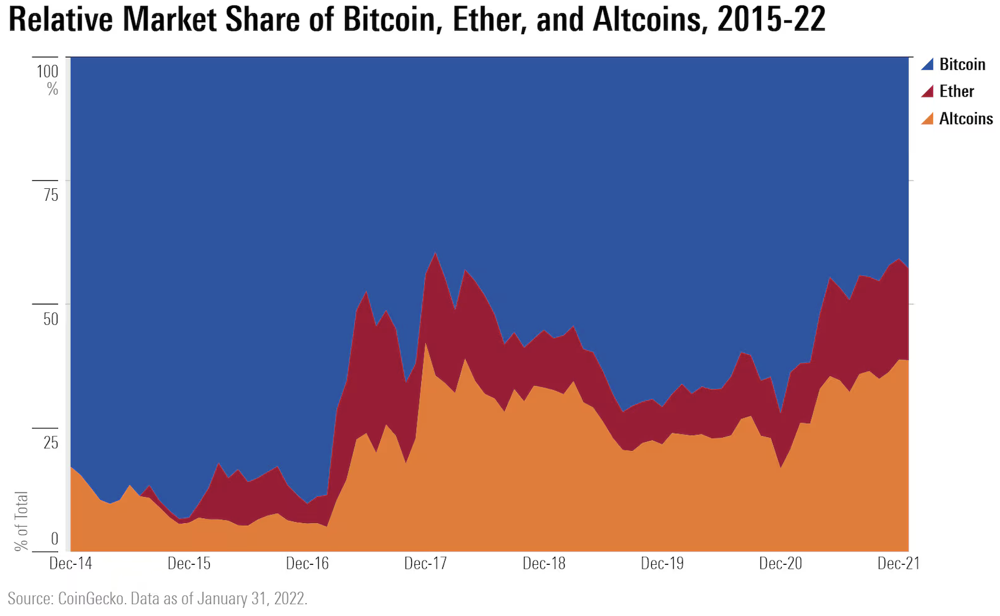

```{r setup, include = FALSE}
library(learnr)
library(tutorial.helpers)
library(tidyverse)
library(arrow)

knitr::opts_chunk$set(echo = FALSE)
knitr::opts_chunk$set(out.width = '90%')
options(tutorial.exercise.timelimit = 600, tutorial.storage = "local")
```

```{r info-section, child = system.file("child_documents/info_section.Rmd", package = "tutorial.helpers")}
```

## Introduction
###

This tutorial covers key concepts from [Chapter 16: Factors](https://r4ds.hadley.nz/factors.html), [Chapter 17: Dates and Times](https://r4ds.hadley.nz/datetimes.html), [Chapter 19: Joins](https://r4ds.hadley.nz/joins.html), and [Chapter 22: Arrow](https://r4ds.hadley.nz/arrow.html) from [*R for Data Science (2e)*](https://r4ds.hadley.nz/) by Hadley Wickham, Mine Çetinkaya-Rundel, and Garrett Grolemund.

You will use cryptocurrency price, metadata, and category files to analyze how the composition of the crypto market changed between 2018 and 2026, reading them with **[arrow](https://arrow.apache.org/docs/r/)**. A companion tutorial, `prediction-markets`, uses the same tools on a different question.

Use whichever AI agent you prefer --- **GitHub Copilot** is built into VS Code and always available, and "ask AI" means the agent of your choice.

### Exercise 1

You should be doing this tutorial in a repo named `r4ds-4`. If you are not, create one and then connect to it. You may need to restart this tutorial after you do so.

Create a new file, `analysis.qmd`, with the title `"Crypto Markets"` and your name as the author. In a bash Terminal, render it:

```
quarto render analysis.qmd
```

Open `analysis.html` with Live Server (right-click it in the Explorer → **Open with Live Server**) and keep the tab open. It refreshes on every render. Going forward, we will just tell you to "Render" when we want you to take these steps.

Create a `.gitignore` with `analysis_files` followed by a blank line. Commit and push.

In the R Terminal, run:

```
show_file(".gitignore")
```

If that fails, it is probably because you have not yet loaded `library(tutorial.helpers)` in the R Terminal.

CP/CR.

```{r introduction-1}
question_text(NULL,
    answer(NULL, correct = TRUE),
    allow_retry = TRUE,
    try_again_button = "Edit Answer",
    incorrect = NULL,
    rows = 3)
```

###

```
analysis_files
```

###

Parquet stores a table column-by-column instead of row-by-row. A query that needs one column reads only that column's bytes and skips the rest of the file, and repeated values inside a single column compress extremely well. The same data is typically 5–10× smaller as parquet than as CSV, and loads proportionally faster.

### Exercise 2

In your QMD, add a new code chunk with `#| message: false` to load all required libraries:

```
library(tidyverse)
library(arrow)
```

Also add the following to the YAML header to remove all code echoes from the HTML:

```
execute:
  echo: false
```

Render. In the R Terminal, run:

```
show_file("analysis.qmd", chunk = "Last")
```

CP/CR.

```{r introduction-2}
question_text(NULL,
    answer(NULL, correct = TRUE),
    allow_retry = TRUE,
    try_again_button = "Edit Answer",
    incorrect = NULL,
    rows = 6)
```

###

<pre><code>#| message: false
library(tidyverse)
library(arrow)
</code></pre>

###

**arrow** is one of several tools for data that is too large or too slow for ordinary in-memory work. **[duckdb](https://r.duckdb.org/)** runs SQL directly against parquet files and is usually the fastest option for big joins and aggregations; **[data.table](https://rdatatable.gitlab.io/data.table/)** is the classic in-memory speed package; **[fst](https://www.fstpackage.org/)** is a fast R-only binary format for local caching. All of them accept **[dplyr](https://dplyr.tidyverse.org/)** verbs or something close to them, so the vocabulary you already have transfers.

### Exercise 3

Create a `data` directory at the top level of the `r4ds-4` repo. In the bash Terminal, run `ls`.

CP/CR.

```{r introduction-3}
question_text(NULL,
    answer(NULL, correct = TRUE),
    allow_retry = TRUE,
    try_again_button = "Edit Answer",
    incorrect = NULL,
    rows = 3)
```

###

```
analysis.html  analysis.qmd  analysis_files  data
```

###

In production, a parquet *dataset* is usually not one file but a directory of them — one file per day, per region, or per customer — read as a single table. Splitting one logical table across many files is what lets a company query a terabyte of logs on a laptop, and it is why data belongs in its own directory rather than loose in the project root.


## Crypto markets
###

Bitcoin launched the cryptocurrency market in 2009, and for its first several years it *was* the market. That had already stopped being true by the time this dataset opens: on January 1, 2018, Ethereum and the other smart-contract platforms held about 52% of the value of the 22 coins tracked here, against Bitcoin's 48%. Which categories held the market over the eight years that followed?

```{r}

```

In this section you will join three parquet files — daily prices, coin metadata, and category labels — to build a chart, similar to the one above from [this *Morningstar* article](https://global.morningstar.com/en-gb/economy/5-charts-on-crypto-s-past-present-and-future), showing how each category's share of the total crypto market evolved. **arrow** makes it practical to inspect, filter, and summarize those files before pulling anything into memory.

### Exercise 1

Download the three crypto parquet files into your `data/` directory so the analysis can run locally and reproducibly. Use these stable URLs:

`https://github.com/PPBDS/misc.tutorials/raw/refs/heads/main/inst/tutorials/04-r4ds-4/data/daily_prices.parquet`
`https://github.com/PPBDS/misc.tutorials/raw/refs/heads/main/inst/tutorials/04-r4ds-4/data/coin_metadata.parquet`
`https://github.com/PPBDS/misc.tutorials/raw/refs/heads/main/inst/tutorials/04-r4ds-4/data/categories.parquet`

In the bash Terminal, run:

```
ls data
```

CP/CR.

```{r crypto-markets-1}
question_text(NULL,
    answer(NULL, correct = TRUE),
    allow_retry = TRUE,
    try_again_button = "Edit Answer",
    incorrect = NULL,
    rows = 3)
```

###

```
categories.parquet    coin_metadata.parquet    daily_prices.parquet
```

###

The three files hold 59,436 daily observations of 22 coins from 2018-01-01 through 2026-05-23, plus a 22-row coin table and a 6-row category table — a little over 2 MB in total. The prices come from Coin Metrics Community Data, one of the few crypto sources that publishes a long, documented, freely reusable history rather than a rate-limited API.

### Exercise 2

In a new code chunk, inspect the schema of `data/daily_prices.parquet` without pulling the full file into memory. Don't assign the result — just print it. Render.

In the R Terminal, run:

```
show_file("analysis.qmd", chunk = "Last")
```

CP/CR.

```{r crypto-markets-2}
question_text(NULL,
    answer(NULL, correct = TRUE),
    allow_retry = TRUE,
    try_again_button = "Edit Answer",
    incorrect = NULL,
    rows = 3)
```

###

```{r crypto-markets-2-test}
#| echo: true
open_dataset("data/daily_prices.parquet")
```

###

Opening a parquet file does not read it. Every parquet file ends with a footer holding its *schema* — the column names and types — plus statistics about each block of rows, and that footer is all that was read here. Notice that `date_raw` is stored as text, not as a date, which means it has to be parsed before any date-based analysis will behave.

### Exercise 3

Take a random sample of 10 rows from `data/daily_prices.parquet` and collect the result into a tibble. Do not assign it — just print it so you can see a variety of coins and dates. Render.

In the R Terminal, run:

```
show_file("analysis.qmd", chunk = "Last")
```

CP/CR.

```{r crypto-markets-3}
question_text(NULL,
    answer(NULL, correct = TRUE),
    allow_retry = TRUE,
    try_again_button = "Edit Answer",
    incorrect = NULL,
    rows = 4)
```

###

```{r crypto-markets-3-test}
#| echo: true
set.seed(9)
open_dataset("data/daily_prices.parquet") |>
  collect() |>
  slice_sample(n = 10)
```

###

Each row records one coin on one day — for example, an `eth` row might show `market_cap_usd` near $200 billion alongside the human-readable `market_cap_str` like `$200.5B`. The data is sorted by coin, so the top rows would all be the same coin; a random sample gives a mix of coins and time periods. About 5% of `market_cap_str` values are missing even though `market_cap_usd` is complete.

### Exercise 4

That last answer read the entire file into memory before sampling it. This time, leave the data on disk: get each coin's average market cap since the start of 2025, ordered from largest to smallest, doing the filtering and the averaging inside the parquet file and bringing only the finished 22-row summary back into R. Render.

In the R Terminal, run:

```
show_file("analysis.qmd", chunk = "Last")
```

CP/CR.

```{r crypto-markets-4}
question_text(NULL,
    answer(NULL, correct = TRUE),
    allow_retry = TRUE,
    try_again_button = "Edit Answer",
    incorrect = NULL,
    rows = 8)
```

###

```{r crypto-markets-4-test}
#| echo: true
open_dataset("data/daily_prices.parquet") |>
  filter(date_raw >= "2025-01-01") |>
  group_by(coin_id) |>
  summarise(mean_mcap = mean(market_cap_usd, na.rm = TRUE), days = n()) |>
  arrange(desc(mean_mcap)) |>
  collect()
```

###

Nothing entered R's memory until the final step. **arrow** hands the filter and the grouping to the file itself — *predicate pushdown* — so only rows that pass the filter, and only the three columns the query mentions, are ever decoded; the result that comes back is 22 rows instead of 59,436. That is the whole point of this file format: the same query works unchanged on a folder of files far larger than your computer's memory, because R only ever holds the answer.

### Exercise 5

Parquet data does not have to live in a single file. Write a copy of the price data to `data/prices_by_coin` as a dataset partitioned by coin, so that each coin's rows land in their own folder. Render.

In the bash Terminal, run:

```
ls data/prices_by_coin
```

CP/CR.

```{r crypto-markets-5}
question_text(NULL,
    answer(NULL, correct = TRUE),
    allow_retry = TRUE,
    try_again_button = "Edit Answer",
    incorrect = NULL,
    rows = 6)
```

###

```
coin_id=aave  coin_id=btc   coin_id=crv   coin_id=eth   coin_id=ltc   coin_id=usdt
coin_id=ada   coin_id=busd  coin_id=dai   coin_id=ftt   coin_id=mkr   coin_id=xrp
coin_id=bch   coin_id=comp  coin_id=doge  coin_id=ht    coin_id=uni
coin_id=bnb   coin_id=cro   coin_id=dot   coin_id=link  coin_id=usdc
```

###

The partition value is stored in the *directory name*, not inside the files, so a query restricted to one coin never opens the other 21 folders. Real datasets are usually partitioned by date, and a query for last week touches seven directories out of ten years' worth. **arrow** can also write Feather (also called Arrow IPC), a format that stores the in-memory layout directly on disk: much faster to read than parquet, much larger on disk, and the right choice for scratch files rather than archives.

### Exercise 6

Bring the whole price file into memory as an analysis table named `prices`. Print a random sample of `prices` so you can inspect the daily price fields before joining. Render.

In the R Terminal, run:

```
show_file("analysis.qmd", chunk = "Last")
```

CP/CR.

```{r crypto-markets-6}
question_text(NULL,
    answer(NULL, correct = TRUE),
    allow_retry = TRUE,
    try_again_button = "Edit Answer",
    incorrect = NULL,
    rows = 5)
```

###

```{r crypto-markets-6-test}
#| echo: true
set.seed(9)
prices     <- open_dataset("data/daily_prices.parquet") |>
  collect()
prices |>
  slice_sample(n = 10)
```

###

The `prices` table has one row per coin per day. Each row records that coin's `price_usd`, `market_cap_usd`, and `volume_usd` for that date. Market cap is the total value of all circulating units at that day's price, which is why it, and not price, is the right unit for comparing coins.

### Exercise 7

Load `coin_metadata.parquet` as `metadata` in the same chunk, below the `prices` line. Print `metadata` instead of `prices` so you can inspect the coin-level fields before joining. Render.

In the R Terminal, run:

```
show_file("analysis.qmd", chunk = "Last")
```

CP/CR.

```{r crypto-markets-7}
question_text(NULL,
    answer(NULL, correct = TRUE),
    allow_retry = TRUE,
    try_again_button = "Edit Answer",
    incorrect = NULL,
    rows = 5)
```

###

```{r crypto-markets-7-test}
#| echo: true
prices     <- open_dataset("data/daily_prices.parquet") |>
  collect()
metadata   <- open_dataset("data/coin_metadata.parquet") |>
  collect()
metadata
```

###

The `metadata` table has one row per coin. `coin_id` links back to `prices`, and `category_id` links forward to `categories`. It also carries hand-entered fields — a `description`, a `launch_date`, a `consensus` mechanism — and hand-entered fields are where messiness lives.

### Exercise 8

Load `categories.parquet` as `categories` in the same chunk, below the `metadata` line. Print `categories` instead of `metadata` so you can inspect the category lookup table before joining. Render.

In the R Terminal, run:

```
show_file("analysis.qmd", chunk = "Last")
```

CP/CR.

```{r crypto-markets-8}
question_text(NULL,
    answer(NULL, correct = TRUE),
    allow_retry = TRUE,
    try_again_button = "Edit Answer",
    incorrect = NULL,
    rows = 5)
```

###

```{r crypto-markets-8-test}
#| echo: true
prices     <- open_dataset("data/daily_prices.parquet") |>
  collect()
metadata   <- open_dataset("data/coin_metadata.parquet") |>
  collect()
categories <- open_dataset("data/categories.parquet") |>
  collect()
categories
```

###

The `categories` table has one row per crypto category, and `category_id` is the key that connects it to `metadata`. Its `category_name` is the readable label we want for plots, but its `description` duplicates a column name already used in `metadata`.

### Exercise 9

`metadata` records when each coin launched. Show the coin, its name, and its launch date for the 22 coins so you can see how those dates were recorded. Render.

In the R Terminal, run:

```
show_file("analysis.qmd", chunk = "Last")
```

CP/CR.

```{r crypto-markets-9}
question_text(NULL,
    answer(NULL, correct = TRUE),
    allow_retry = TRUE,
    try_again_button = "Edit Answer",
    incorrect = NULL,
    rows = 5)
```

###

```{r crypto-markets-9-test}
#| echo: true
metadata |>
  select(coin_id, coin_name, launch_date)
```

###

Two conventions are mixed in one column: `btc` reads `January 3, 2009` while `eth` reads `2015-07-30`. This is what hand-assembled reference data looks like, and it is dangerous precisely because it is invisible — a parser told to expect one convention returns a missing value for every row written in the other, and a silent `NA` is much worse than an error.

### Exercise 10

Add a real date column to `metadata` that handles both conventions, then list the coins from oldest to newest, showing the original text next to the parsed date. Every coin should end up with a date and no missing values. Render.

In the R Terminal, run:

```
show_file("analysis.qmd", chunk = "Last")
```

CP/CR.

```{r crypto-markets-10}
question_text(NULL,
    answer(NULL, correct = TRUE),
    allow_retry = TRUE,
    try_again_button = "Edit Answer",
    incorrect = NULL,
    rows = 6)
```

###

```{r crypto-markets-10-test}
#| echo: true
metadata |>
  mutate(launch = as_date(parse_date_time(launch_date, orders = c("mdy", "ymd")))) |>
  arrange(launch) |>
  select(coin_id, launch_date, launch)
```

###

Parsing a date means telling the parser the *order of the components*, not their punctuation: month-day-year for `January 3, 2009`, year-month-day for `2015-07-30`. Give it both orders and it tries each in turn. This also explains why [ISO 8601](https://en.wikipedia.org/wiki/ISO_8601) — `YYYY-MM-DD`, biggest unit first — is the only format worth writing down: `03/04/2020` is March 4 in the United States and April 3 in most of Europe, and no parser can tell which one you meant.

### Exercise 11

Get a feel for the raw price data. In a new chunk, draw a line chart of Bitcoin's daily price over the whole period, using only the `btc` rows of `prices`. Render.

In the R Terminal, run:

```
show_file("analysis.qmd", chunk = "Last")
```

CP/CR.

```{r crypto-markets-11}
question_text(NULL,
    answer(NULL, correct = TRUE),
    allow_retry = TRUE,
    try_again_button = "Edit Answer",
    incorrect = NULL,
    rows = 5)
```

###

```{r crypto-markets-11-test}
#| echo: true
prices |>
  filter(coin_id == "btc") |>
  mutate(date = ymd(date_raw)) |>
  ggplot(aes(x = date, y = price_usd)) +
  geom_line() +
  labs(x = NULL, y = "Price (USD)", title = "Bitcoin daily price") +
  theme_minimal()
```

###

Two cycles are visible, and the second dwarfs the first. Bitcoin's 2021 high was $67,542; it then fell below $16,000 in late 2022, reached $106,116 in 2024 and $124,824 in 2025, and had fallen back to $76,620 when the data ends on May 23, 2026. Anyone describing the 2024–25 run as a return to the 2021 peak is reading the shape of the line and ignoring its axis.

### Exercise 12

Now plot Bitcoin's market cap over time: a line chart of `market_cap_usd`, in trillions, for the `btc` rows. Render.

In the R Terminal, run:

```
show_file("analysis.qmd", chunk = "Last")
```

CP/CR.

```{r crypto-markets-12}
question_text(NULL,
    answer(NULL, correct = TRUE),
    allow_retry = TRUE,
    try_again_button = "Edit Answer",
    incorrect = NULL,
    rows = 5)
```

###

```{r crypto-markets-12-test}
#| echo: true
prices |>
  filter(coin_id == "btc") |>
  mutate(date = ymd(date_raw)) |>
  ggplot(aes(x = date, y = market_cap_usd / 1e12)) +
  geom_line() +
  labs(x = NULL, y = "Market cap (USD trillions)", title = "Bitcoin market cap over time") +
  theme_minimal()
```

###

Price is what one unit costs; market cap is price times circulating supply. Bitcoin's supply grows slowly and predictably, so the two charts have nearly the same shape — the 2021 peak is $1.27T and the 2025 peak is $2.49T. Market cap is the right unit for comparing coins whose supplies differ by orders of magnitude, which is why it drives the rest of this section.

### Exercise 13

Now compare market cap across all 22 coins with a boxplot of `market_cap_usd`, in billions, per coin, ordered by median market cap, with a log-scale axis. Render.

In the R Terminal, run:

```
show_file("analysis.qmd", chunk = "Last")
```

CP/CR.

```{r crypto-markets-13}
question_text(NULL,
    answer(NULL, correct = TRUE),
    allow_retry = TRUE,
    try_again_button = "Edit Answer",
    incorrect = NULL,
    rows = 8)
```

###

```{r crypto-markets-13-test}
#| echo: true
prices |>
  ggplot(aes(x = fct_reorder(coin_id, market_cap_usd, .fun = median, na.rm = TRUE),
             y = market_cap_usd / 1e9)) +
  geom_boxplot() +
  coord_flip() +
  scale_y_log10() +
  labs(x = NULL, y = "Market cap (USD billions, log scale)",
       title = "Market cap distribution by coin") +
  theme_minimal()
```

###

Bitcoin and Ethereum sit well above the rest — roughly 10–100× larger than the next tier. The log scale is essential here: on a linear scale, every non-BTC coin collapses to near zero. The wide boxes for coins like SOL and BNB reflect high variability over time; the narrow boxes belong to stablecoins, whose market caps move slowly by design, and to coins that entered the dataset late.

### Exercise 14

Join `prices` to `metadata` by `coin_id` to attach coin-level details to each price row. Do not assign the result — just print it to see what columns were added. Render.

In the R Terminal, run:

```
show_file("analysis.qmd", chunk = "Last")
```

CP/CR.

```{r crypto-markets-14}
question_text(NULL,
    answer(NULL, correct = TRUE),
    allow_retry = TRUE,
    try_again_button = "Edit Answer",
    incorrect = NULL,
    rows = 3)
```

###

```{r crypto-markets-14-test}
#| echo: true
prices |>
  left_join(metadata, by = "coin_id")
```

###

A left join keeps all 59,436 rows from `prices` and adds matching columns from `metadata`. Row count is unchanged because each coin appears exactly once in `metadata`.

### Exercise 15

Before joining `categories`, check whether it shares any column names with the table you just built. Resolve any collision, then add the category labels to the pipe by `category_id`. Still do not assign — just print the result. Render.

In the R Terminal, run:

```
show_file("analysis.qmd", chunk = "Last")
```

CP/CR.

```{r crypto-markets-15}
question_text(NULL,
    answer(NULL, correct = TRUE),
    allow_retry = TRUE,
    try_again_button = "Edit Answer",
    incorrect = NULL,
    rows = 5)
```

###

```{r crypto-markets-15-test}
#| echo: true
prices |>
  left_join(metadata, by = "coin_id") |>
  left_join(select(categories, -description), by = "category_id")
```

###

Both `metadata` and `categories` have a `description` column. Joining without resolving that collision creates `description.x` and `description.y` — confusing names that require extra cleanup. Dropping the unwanted column before joining is cleaner than renaming afterward.

### Exercise 16

The join pipeline is ready. Extend it to print the first 5 rows of the joined result. Render.

In the R Terminal, run:

```
show_file("analysis.qmd", chunk = "Last")
```

CP/CR.

```{r crypto-markets-16}
question_text(NULL,
    answer(NULL, correct = TRUE),
    allow_retry = TRUE,
    try_again_button = "Edit Answer",
    incorrect = NULL,
    rows = 5)
```

###

```{r crypto-markets-16-test}
#| echo: true
prices |>
  left_join(metadata, by = "coin_id") |>
  left_join(select(categories, -description), by = "category_id") |>
  head(5)
```

###

The joined table has 59,436 rows and every column the analysis needs: daily prices from `prices`, coin metadata including `category_id`, and the readable `category_name` from `categories`.

### Exercise 17

`date_raw` is still a character string, which means sorting, filtering by date range, and time-series plots all behave unexpectedly. Add a proper date field to the pipe so the steps that follow can use it. End with the range of dates as a sanity check. Render.

In the R Terminal, run:

```
show_file("analysis.qmd", chunk = "Last")
```

CP/CR.

```{r crypto-markets-17}
question_text(NULL,
    answer(NULL, correct = TRUE),
    allow_retry = TRUE,
    try_again_button = "Edit Answer",
    incorrect = NULL,
    rows = 4)
```

###

```{r crypto-markets-17-test}
#| echo: true
prices |>
  left_join(metadata, by = "coin_id") |>
  left_join(select(categories, -description), by = "category_id") |>
  mutate(date = ymd(date_raw)) |>
  pull(date) |>
  range()
```

###

Unlike the launch dates, `date_raw` is uniform ISO 8601 text, so one order of components parses every row. The range confirms the window: 2018-01-01 through 2026-05-23. A parsed date is not cosmetic — as text, `"2018-1-1"` and `"2018-01-01"` sort differently and neither can be subtracted from the other.

### Exercise 18

Finalize the data-preparation chunk. Merge the three file loads and the join pipe into a single chunk, assign the pipe's result to `crypto`, and keep nothing but those loads and that pipe. End by printing `crypto`. Render.

In the R Terminal, run:

```
show_file("analysis.qmd", chunk = "Last")
```

CP/CR.

```{r crypto-markets-18}
question_text(NULL,
    answer(NULL, correct = TRUE),
    allow_retry = TRUE,
    try_again_button = "Edit Answer",
    incorrect = NULL,
    rows = 15)
```

###

```{r crypto-markets-18-test}
#| echo: true
prices     <- open_dataset("data/daily_prices.parquet") |>
  collect()
metadata   <- open_dataset("data/coin_metadata.parquet") |>
  collect()
categories <- open_dataset("data/categories.parquet") |>
  collect()

crypto <- prices |>
  left_join(metadata, by = "coin_id") |>
  left_join(select(categories, -description), by = "category_id") |>
  mutate(date = ymd(date_raw))

crypto
```

###

The cleaned `crypto` table has one row per coin per day: 59,436 rows covering 22 coins from 2018 through 2026. A data-preparation chunk should hold only the steps whose results are used later; verification lines that were useful while building it are now noise, and every column it creates should have a job.

### Exercise 19

Delete the `crypto` line at the bottom of that chunk, so it defines the table and nothing else. Then add `#| cache: true` to the chunk and render. This first render with caching will take a moment; later renders load the table from disk.

In the bash Terminal, run:

```
ls
```

CP/CR.

```{r crypto-markets-19}
question_text(NULL,
    answer(NULL, correct = TRUE),
    allow_retry = TRUE,
    try_again_button = "Edit Answer",
    incorrect = NULL,
    rows = 5)
```

###

```
analysis.html  analysis.qmd  analysis_cache  analysis_files  data
```

###

Stablecoin market cap can rise even when token prices stay pinned near $1. For coins like USDT, USDC, and DAI, market-cap growth mostly reflects more dollars flowing into stable crypto-denominated assets — which is why the stablecoin share of this market grew from almost nothing in 2018 to double digits later on.

### Exercise 20

Add `analysis_cache` to your `.gitignore`. The Source Control change count in VS Code jumped when the cache directory appeared; adding it to `.gitignore` drops it back.

In the R Terminal, run:

```
show_file(".gitignore")
```

CP/CR.

```{r crypto-markets-20}
question_text(NULL,
    answer(NULL, correct = TRUE),
    allow_retry = TRUE,
    try_again_button = "Edit Answer",
    incorrect = NULL,
    rows = 4)
```

###

```
analysis_files
analysis_cache
```

###

Cache files are fully reproducible — anyone can regenerate them by rendering — so committing them just adds binary noise to the repo and can cause spurious merge conflicts if two contributors run the document on machines where the cache hashes differ.

### Exercise 21

Start a new analysis chunk that gives market context: calculate total crypto market cap for each day in `crypto` and plot it as a line chart, with market cap shown in trillions of dollars. Render.

In the R Terminal, run:

```
show_file("analysis.qmd", chunk = "Last")
```

CP/CR.

```{r crypto-markets-21}
question_text(NULL,
    answer(NULL, correct = TRUE),
    allow_retry = TRUE,
    try_again_button = "Edit Answer",
    incorrect = NULL,
    rows = 8)
```

###

```{r crypto-markets-21-test}
#| echo: true
crypto |>
  group_by(date) |>
  summarise(total_mcap = sum(market_cap_usd, na.rm = TRUE)) |>
  ggplot(aes(x = date, y = total_mcap / 1e12)) +
  geom_line() +
  labs(x = NULL, y = "Total market cap (trillions USD)",
       title = "Total crypto market capitalization, 2018–2026")
```

###

These 22 coins were worth $0.58T on the first day of the data and $2.35T on the last, a fourfold increase across two full boom-and-bust cycles. That total is the denominator for everything that follows: a coin's *share* can fall while its dollar value rises, and rise while its dollar value falls, because the whole market is moving underneath it.

### Exercise 22

Break the market-cap trend out by category. For each day and category, aggregate the coin-level market caps, then plot category market cap over time as a multi-line chart. Render.

In the R Terminal, run:

```
show_file("analysis.qmd", chunk = "Last")
```

CP/CR.

```{r crypto-markets-22}
question_text(NULL,
    answer(NULL, correct = TRUE),
    allow_retry = TRUE,
    try_again_button = "Edit Answer",
    incorrect = NULL,
    rows = 8)
```

###

```{r crypto-markets-22-test}
#| echo: true
crypto |>
  group_by(date, category_name) |>
  summarise(cat_mcap = sum(market_cap_usd, na.rm = TRUE), .groups = "drop") |>
  ggplot(aes(x = date, y = cat_mcap / 1e12, color = category_name)) +
  geom_line() +
  labs(x = NULL, y = "Market cap (trillions USD)", color = NULL,
       title = "Crypto market cap by category, 2018–2026")
```

###

This chart is hard to read because Bitcoin dominates the absolute dollar scale and every category rises and falls together with the market. When one group dwarfs the others, plotting each group's share of the total often reveals patterns that the raw values hide.

### Exercise 23

Now build a stacked area chart of category market-cap shares over time. The total height of the chart should always sum to 100%, with each colored band representing one category's share. This format — familiar from the Morningstar chart shown at the start of the section — makes it easy to see how category dominance shifted over the period. Render.

In the R Terminal, run:

```
show_file("analysis.qmd", chunk = "Last")
```

CP/CR.

```{r crypto-markets-23}
question_text(NULL,
    answer(NULL, correct = TRUE),
    allow_retry = TRUE,
    try_again_button = "Edit Answer",
    incorrect = NULL,
    rows = 10)
```

###

```{r crypto-markets-23-test}
#| echo: true
crypto |>
  group_by(date, category_name) |>
  summarise(cat_mcap = sum(market_cap_usd, na.rm = TRUE), .groups = "drop") |>
  ggplot(aes(x = date, y = cat_mcap, fill = category_name)) +
  geom_area(position = "fill") +
  scale_y_continuous(labels = scales::percent) +
  labs(x = NULL, y = "Share of total market cap", fill = NULL,
       title = "Crypto market cap share by category, 2018–2026")
```

###

Normalising every column to 100% is what makes shares comparable across days when the total is changing by a factor of four; **ggplot2** does the division for you, so no percentage columns are needed. Read the bands and the story runs opposite to the usual one: Bitcoin starts at 48%, bottoms out near 42% in late 2022, and finishes at 66%, while smart-contract platforms fall from 52% to 21%. Stablecoins are the genuine newcomer, going from 0.2% to a 21% spike in mid-2022 and 11% at the end.

### Exercise 24

Polish the market-share chart for publication. Order the legend by typical category size, use a colorblind-safe palette, and add a clear title, subtitle, axis labels, and source caption. The subtitle should state what the chart actually shows. Render.

In the R Terminal, run:

```
show_file("analysis.qmd", chunk = "Last")
```

CP/CR.

```{r crypto-markets-24}
question_text(NULL,
    answer(NULL, correct = TRUE),
    allow_retry = TRUE,
    try_again_button = "Edit Answer",
    incorrect = NULL,
    rows = 14)
```

###

```{r crypto-markets-24-test}
#| echo: true
crypto |>
  group_by(date, category_name) |>
  summarise(cat_mcap = sum(market_cap_usd, na.rm = TRUE), .groups = "drop") |>
  mutate(category_name = fct_reorder(category_name, cat_mcap, .fun = median, .desc = TRUE)) |>
  ggplot(aes(x = date, y = cat_mcap, fill = category_name)) +
  geom_area(position = "fill") +
  scale_fill_viridis_d(option = "plasma", end = 0.9) +
  scale_y_continuous(labels = scales::percent) +
  labs(x = NULL, y = "Share of total market cap", fill = NULL,
       title = "Crypto market cap share by category, 2018–2026",
       subtitle = "Bitcoin gained share as smart-contract platforms shrank and stablecoins grew",
       caption = "Source: Coin Metrics Community Data (CC BY 4.0)")
```

###

A subtitle is a claim, and a reader will trust it more readily than the picture beneath it. Write it last, from the finished chart, and check every clause against the bands: this one has to survive the fact that Bitcoin's share *rose* over the period. Ordering the legend by typical size and choosing a perceptually uniform, colorblind-safe palette are the other two edits that make a chart worth publishing.

### Exercise 25

Add event context to the final chart by marking two major crypto shocks: the Luna/UST crash (approximately May 7–12, 2022) and the FTX collapse (approximately November 8–11, 2022). Render.

In the R Terminal, run:

```
show_file("analysis.qmd", chunk = "Last")
```

CP/CR.

```{r crypto-markets-25}
question_text(NULL,
    answer(NULL, correct = TRUE),
    allow_retry = TRUE,
    try_again_button = "Edit Answer",
    incorrect = NULL,
    rows = 12)
```

###

```{r crypto-markets-25-test}
#| echo: true
crypto |>
  group_by(date, category_name) |>
  summarise(cat_mcap = sum(market_cap_usd, na.rm = TRUE), .groups = "drop") |>
  mutate(category_name = fct_reorder(category_name, cat_mcap, .fun = median, .desc = TRUE)) |>
  ggplot(aes(x = date, y = cat_mcap, fill = category_name)) +
  geom_area(position = "fill") +
  scale_fill_viridis_d(option = "plasma", end = 0.9) +
  scale_y_continuous(labels = scales::percent) +
  annotate("rect", xmin = as.Date("2022-05-07"), xmax = as.Date("2022-05-12"),
           ymin = -Inf, ymax = Inf, alpha = 0.15, fill = "red") +
  annotate("rect", xmin = as.Date("2022-11-08"), xmax = as.Date("2022-11-11"),
           ymin = -Inf, ymax = Inf, alpha = 0.15, fill = "red") +
  labs(x = NULL, y = "Share of total market cap", fill = NULL,
       title = "Crypto market cap share by category, 2018–2026",
       subtitle = "Bitcoin gained share as smart-contract platforms shrank and stablecoins grew",
       caption = "Source: Coin Metrics Community Data (CC BY 4.0)")
```

###

UST was an algorithmic stablecoin — it tried to hold a $1 value through a mechanism rather than dollar reserves. Its May 2022 collapse wiped roughly $40B from the market in days. The FTX exchange token FTT then fell from roughly $7.25B on November 7, 2022 to about $724M on November 9 when FTX halted withdrawals. Both markers sit in the window where Bitcoin's share reached its low of 42% and the stablecoin band its high of 21%: when risk assets fall, dollars parked in stablecoins become a larger slice of a smaller pie.

### Exercise 26

Commit `analysis.qmd` with the message `"Crypto market composition analysis"` and push to GitHub. In the bash Terminal, run:

```
git log --oneline -3
```

CP/CR.

```{r crypto-markets-26}
question_text(NULL,
    answer(NULL, correct = TRUE),
    allow_retry = TRUE,
    try_again_button = "Edit Answer",
    incorrect = NULL,
    rows = 3)
```

###

```
abc1234 Crypto market composition analysis
...
```

###

The 22 coins in this dataset represent the major categories but exclude thousands of smaller coins, so the category shares are approximations rather than exact measures of the full crypto market. That tradeoff is intentional: the file stays small enough for a tutorial while preserving the dominant category-level patterns.

## Summary
###

This tutorial covered key concepts from [Chapter 16: Factors](https://r4ds.hadley.nz/factors.html), [Chapter 17: Dates and Times](https://r4ds.hadley.nz/datetimes.html), [Chapter 19: Joins](https://r4ds.hadley.nz/joins.html), and [Chapter 22: Arrow](https://r4ds.hadley.nz/arrow.html) from [*R for Data Science (2e)*](https://r4ds.hadley.nz/) by Hadley Wickham, Mine Çetinkaya-Rundel, and Garrett Grolemund.

You read parquet files with **arrow**, inspected schemas and summarized data on disk before pulling anything into memory, wrote a partitioned dataset, and joined market metadata and category labels onto a daily price series by shared keys. You parsed dates written in two different formats, then cleaned, aggregated, and visualized the result using **[tidyverse](https://www.tidyverse.org/)** tools before publishing it to GitHub Pages.

### Exercise 1

Render to ensure that everything works. Check your Live Server tab — the resulting HTML page should be attractive, showing a clean version of your final plots.

In the R Terminal, run:

```
show_file("analysis.qmd")
```

CP/CR.

```{r summary-1}
question_text(NULL,
    answer(NULL, correct = TRUE),
    allow_retry = TRUE,
    try_again_button = "Edit Answer",
    incorrect = NULL,
    rows = 30)
```

###

<pre><code>---
title: "Crypto Markets"
author: &lt;your name&gt;
execute:
  echo: false
---

&#96;&#96;&#96;{r}
#| message: false
library(tidyverse)
library(arrow)
&#96;&#96;&#96;

&#96;&#96;&#96;{r}
#| cache: true
prices     &lt;- open_dataset("data/daily_prices.parquet") |>
  collect()
metadata   &lt;- open_dataset("data/coin_metadata.parquet") |>
  collect()
categories &lt;- open_dataset("data/categories.parquet") |>
  collect()

crypto &lt;- prices |>
  left_join(metadata, by = "coin_id") |>
  left_join(select(categories, -description), by = "category_id") |>
  mutate(date = ymd(date_raw))
&#96;&#96;&#96;

&#96;&#96;&#96;{r}
crypto |>
  group_by(date, category_name) |>
  summarise(cat_mcap = sum(market_cap_usd, na.rm = TRUE), .groups = "drop") |>
  mutate(category_name = fct_reorder(category_name, cat_mcap, .fun = median, .desc = TRUE)) |>
  ggplot(aes(x = date, y = cat_mcap, fill = category_name)) +
  geom_area(position = "fill") +
  scale_fill_viridis_d(option = "plasma", end = 0.9) +
  scale_y_continuous(labels = scales::percent) +
  annotate("rect", xmin = as.Date("2022-05-07"), xmax = as.Date("2022-05-12"),
           ymin = -Inf, ymax = Inf, alpha = 0.15, fill = "red") +
  annotate("rect", xmin = as.Date("2022-11-08"), xmax = as.Date("2022-11-11"),
           ymin = -Inf, ymax = Inf, alpha = 0.15, fill = "red") +
  labs(x = NULL, y = "Share of total market cap", fill = NULL,
       title = "Crypto market cap share by category, 2018–2026",
       subtitle = "Bitcoin gained share as smart-contract platforms shrank and stablecoins grew",
       caption = "Source: Coin Metrics Community Data (CC BY 4.0)")
&#96;&#96;&#96;
</code></pre>

###

The finished document is three chunks long, even though you worked through dozens of exercises: the libraries, one cached data chunk, and one plot. That is what a reproducible analysis looks like — only the steps whose results appear in the output survive, and everything else was scaffolding.

### Exercise 2

Publish your rendered QMD to GitHub Pages. In a bash Terminal, run:

```
quarto publish gh-pages analysis.qmd
```

If the bash Terminal is still running from rendering, stop it first using `Ctrl/Cmd + C`.

Copy/paste the resulting URL below.

```{r summary-2}
question_text(NULL,
    answer(NULL, correct = TRUE),
    allow_retry = TRUE,
    try_again_button = "Edit Answer",
    incorrect = NULL,
    rows = 1)
```

###

Publishing the QMD creates a public URL anyone can use to view the rendered project. Only the file's *output* travels: readers see the charts, not the parquet files behind them, which is why the caption naming the data source is the only provenance they get.

### Exercise 3

Commit and push any remaining changes. Copy/paste the URL to your GitHub repo.

```{r summary-3}
question_text(NULL,
    answer(NULL, correct = TRUE),
    allow_retry = TRUE,
    try_again_button = "Edit Answer",
    incorrect = NULL,
    rows = 3)
```

###

**arrow** understands only a subset of R expressions before data is collected into memory, so a good workflow is to push filtering, selecting, and simple aggregation down to the files, then do more flexible work on the small result that comes back.

```{r download-answers, child = system.file("child_documents/download_answers.Rmd", package = "tutorial.helpers")}
```
