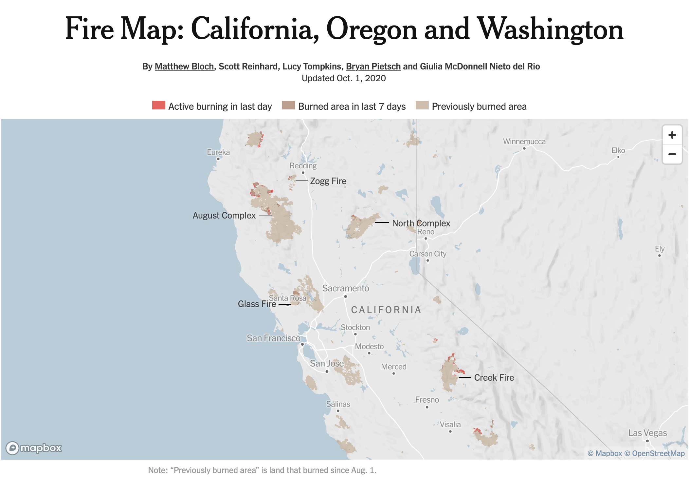

```{r setup, include = FALSE}
library(learnr)
library(tutorial.helpers)

library(tidyverse)
library(leaflet)
library(rvest)
library(httr2)
library(purrr)

knitr::opts_chunk$set(echo = FALSE)
knitr::opts_chunk$set(out.width = '90%')
options(tutorial.exercise.timelimit = 600,
        tutorial.storage = "local")

centroid_lon <- function(coords) {
  mean(map_dbl(coords[[1]], 1))
}
centroid_lat <- function(coords) {
  mean(map_dbl(coords[[1]], 2))
}

raw <- jsonlite::read_json("data/wildfires.geojson")

fires <- raw |>
  pluck("features") |>
  tibble(features = _) |>
  unnest_wider(features) |>
  unnest_wider(properties) |>
  unnest_wider(geometry, names_sep = "_") |>
  select(incident, gis_acres, fire_year, agency, state, geometry_coordinates) |>
  mutate(
    gis_acres = as.numeric(gis_acres),
    fire_year = as.integer(fire_year)
  )

big_fires <- fires |>
  filter(gis_acres >= 100000) |>
  mutate(
    lon = map_dbl(geometry_coordinates, centroid_lon),
    lat = map_dbl(geometry_coordinates, centroid_lat)
  )

imdb_snapshots <- readRDS("data/imdb_snapshots.rds")
```

```{r info-section, child = system.file("child_documents/info_section.Rmd", package = "tutorial.helpers")}
```

## Introduction
###

This section covers key concepts from [Chapter 23: Hierarchical Data](https://r4ds.hadley.nz/hierarchical), [Chapter 24: Web Scraping](https://r4ds.hadley.nz/webscraping), [Chapter 25: Functions](https://r4ds.hadley.nz/functions), and [Chapter 26: Iterations](https://r4ds.hadley.nz/iteration) from [*R for Data Science (2e)*](https://r4ds.hadley.nz/) by Hadley Wickham, Mine Çetinkaya-Rundel, and Garrett Grolemund.

Using core packages such as **[jsonlite](https://cran.r-project.org/package=jsonlite)**, **[rvest](https://rvest.tidyverse.org/)**, **[httr2](https://httr2.r-lib.org/)**, **[purrr](https://purrr.tidyverse.org/)**, and **[leaflet](https://rstudio.github.io/leaflet/)**, you will extract nested elements from lists, expand list-columns into tidy tables, scrape HTML tables from archived web pages, split compound text columns using regex, and render geographic polygon boundaries as interactive maps. The analysis uses two datasets: wildfire perimeter polygons from the National Interagency Fire Center and five archived snapshots of the IMDb Top 250 from the Wayback Machine.

Use whichever AI agent you prefer --- **GitHub Copilot** is built into VS Code and always available, and "ask AI" means the agent of your choice.

### Exercise 1

You should be doing this tutorial in a repo named `r4ds-5`. If you are not, create one and then connect to it. You may need to restart this tutorial after you do so.

Create a new file, `analysis.qmd`, with the title `"Wildfires and Movies"` and your name as the author. In a bash Terminal, render it:

```
quarto render analysis.qmd
```

Open `analysis.html` with Live Server (right-click it in the Explorer → **Open with Live Server**) and keep the tab open. It refreshes on every render. Going forward, we will just tell you to "Render" when we want you to take these steps.

Create a `.gitignore` with `analysis_files` followed by a blank line. Commit and push.

In the R Terminal, run:

```
show_file(".gitignore")
```

If that fails, it is probably because you have not yet loaded `library(tutorial.helpers)` in the R Terminal.

CP/CR.

```{r introduction-1}
question_text(NULL,
	answer(NULL, correct = TRUE),
	allow_retry = TRUE,
	try_again_button = "Edit Answer",
	incorrect = NULL,
	rows = 3)
```

###

<pre><code>analysis_files
</code></pre>

###

This tutorial works with two very different datasets. The first is a GeoJSON file from the National Interagency Fire Center containing 883 finalized wildfire perimeter polygons across the western US — each fire's surveyed boundary stored as nested geographic coordinates. The second is five archived snapshots of the IMDb Top 250, scraped from the Wayback Machine, covering 2015 to 2022. Together they are a study in the messiest storage formats data scientists encounter: deeply nested geographic JSON and scraped HTML tables.

### Exercise 2

In your QMD, add the following `library()` commands in a new code chunk with `#| message: false`:

```
library(tidyverse)
library(purrr)
library(leaflet)
library(rvest)
library(httr2)
library(jsonlite)
```

Also add the following to the YAML header to remove all code from the HTML output:

```
execute:
  echo: false
```

Render.

In the R Terminal, run:

```
show_file("analysis.qmd", chunk = "Last")
```

CP/CR.

```{r introduction-2}
question_text(NULL,
	answer(NULL, correct = TRUE),
	allow_retry = TRUE,
	try_again_button = "Edit Answer",
	incorrect = NULL,
	rows = 6)
```

###

<pre><code>#| message: false
library(tidyverse)
library(purrr)
library(leaflet)
library(rvest)
library(httr2)
library(jsonlite)
</code></pre>

###

JSON is a machine-readable format with six data types: null (like R's `NA`), string, number, boolean (lowercase `true`/`false`), array (like unnamed R lists), and object (like named R lists).

```json
{
  "place": "Northern California",
  "magnitude": 4.2,
  "felt": true,
  "tags": ["minor", "shallow"]
}
```

### Exercise 3

Create a `data` directory at the top level of the `r4ds-5` repo. In the bash Terminal, run `ls`.

CP/CR.

```{r introduction-3}
question_text(NULL,
	answer(NULL, correct = TRUE),
	allow_retry = TRUE,
	try_again_button = "Edit Answer",
	incorrect = NULL,
	rows = 3)
```

###

<pre><code>analysis.html  analysis.qmd  analysis_files  data
</code></pre>

###

**jsonlite** is R's standard package for reading and writing JSON. It is used directly when loading local JSON files like the GeoJSON you are about to download, and indirectly inside packages like **httr2**, which calls jsonlite under the hood when parsing responses from web requests. JSON is a common format for transmitting data on the web, and jsonlite is how R reads it.

## Wildfire perimeters
###

The **[National Interagency Fire Center](https://data-nifc.opendata.arcgis.com/)** maintains a consolidated archive of finalized wildfire perimeter polygons — one polygon per fire, with metadata on name, acreage, year, state, and managing agency — published as a GeoJSON file. GeoJSON stores geometry as deeply nested lists that often must be reformatted before they can be analyzed. Using **jsonlite**, **[tidyr](https://tidyr.tidyverse.org/)**, **purrr**, and **leaflet**, you will flatten that nested structure, analyze 33 years of burned acreage, and render the actual fire boundaries as an interactive polygon map — the kind of visualization the [New York Times](https://www.nytimes.com/interactive/2020/us/fires-map-tracker.html) built during the 2020 fire season:

```{r}

```

###

We use `wildfires.geojson` from the **National Interagency Fire Center (NIFC) InterAgencyFirePerimeterHistory** dataset — a consolidated archive of finalized wildfire perimeter polygons contributed by the USFS, NPS, BLM, BIA, CAL FIRE, and state agencies. Each feature is a polygon representing one fire's surveyed boundary. The 2020 season was one of the most destructive on record — the August Complex burned over a million acres, becoming the largest fire in California history.

### Exercise 1

Download the file `wildfires.geojson` from this URL and save it in your `data/` directory:

```
https://github.com/PPBDS/misc.tutorials/raw/refs/heads/main/inst/tutorials/05-r4ds-5/data/wildfires.geojson
```

In a bash Terminal, run:

```
ls data
```

CP/CR.

```{r wildfire-perimeters-1}
question_text(NULL,
	answer(NULL, correct = TRUE),
	allow_retry = TRUE,
	try_again_button = "Edit Answer",
	incorrect = NULL,
	rows = 3)
```

###

<pre><code>wildfires.geojson
</code></pre>

###

GeoJSON is a standard format for geographic data built on JSON. Each feature pairs a **geometry** — the spatial shape, stored as nested coordinate arrays — with a **properties** object holding tabular metadata like name, acreage, and year. This two-part structure (shape + attributes) is common to all geographic formats; GeoJSON is simply the JSON encoding of it.

### Exercise 2

Read `data/wildfires.geojson` as JSON and assign it to `raw`. Print the number of features it contains.

Render.

In the R Terminal, run `show_file("analysis.qmd", chunk = "Last")`. CP/CR.

```{r wildfire-perimeters-2}
question_text(NULL,
	answer(NULL, correct = TRUE),
	allow_retry = TRUE,
	try_again_button = "Edit Answer",
	incorrect = NULL,
	rows = 5)
```

###

```{r wildfire-perimeters-2-test}
#| echo: true
# your path will be "data/wildfires.geojson"
raw <- jsonlite::read_json("data/wildfires.geojson")
length(raw$features)
```

###

`raw` has two top-level keys: `type` (the string `"FeatureCollection"`, a GeoJSON standard marker) and `features` (the list of fires). `raw$features` holds 883 elements — one per fire — each a named list containing the fire's geographic shape and tabular metadata.

### Exercise 3

Extract the first fire from `raw` and show its component names.

Render.

In the R Terminal, run `show_file("analysis.qmd", chunk = "Last")`. CP/CR.

```{r wildfire-perimeters-3}
question_text(NULL,
	answer(NULL, correct = TRUE),
	allow_retry = TRUE,
	try_again_button = "Edit Answer",
	incorrect = NULL,
	rows = 6)
```

###

```{r wildfire-perimeters-3-test}
#| echo: true
pluck(raw, "features", 1) |> names()
```

###

Each fire in `raw$features` is a named list with four keys: `type` (a GeoJSON classification string), `id` (a unique fire identifier), `geometry` (the coordinate arrays that define the fire's boundary shape), and `properties` (tabular metadata like fire name, year, and acreage).

### Exercise 4

Navigate into the first fire's geometry to extract the first coordinate pair of its boundary.

Render.

In the R Terminal, run `show_file("analysis.qmd", chunk = "Last")`. CP/CR.

```{r wildfire-perimeters-4}
question_text(NULL,
	answer(NULL, correct = TRUE),
	allow_retry = TRUE,
	try_again_button = "Edit Answer",
	incorrect = NULL,
	rows = 6)
```

###

```{r wildfire-perimeters-4-test}
#| echo: true
pluck(raw, "features", 1, "geometry", "coordinates", 1, 1)
```

###

GeoJSON stores coordinates as `[longitude, latitude]` — longitude first, the opposite of the spoken convention. A pair of numbers means nothing on its own. It means something only relative to a **coordinate reference system**: the model of the earth's shape that fixes where zero is and what one unit is worth. GeoJSON is always WGS84, the same system a phone's GPS reports and the one catalogued as EPSG:4326, so `-121.5, 40.1` here is unambiguous. Shapefiles and state plane data usually arrive in some other system, and combining two spatial datasets without first putting them on a common reference system quietly places one of them in the wrong part of the world.

### Exercise 5

Wrap `raw$features` in a tibble with a column called `features`. Print the result.

Render.

In the R Terminal, run `show_file("analysis.qmd", chunk = "Last")`. CP/CR.

```{r wildfire-perimeters-5}
question_text(NULL,
	answer(NULL, correct = TRUE),
	allow_retry = TRUE,
	try_again_button = "Edit Answer",
	incorrect = NULL,
	rows = 5)
```

###

```{r wildfire-perimeters-5-test}
#| echo: true
tibble(features = raw$features)
```

###

A list-column holds an R list as a column — each row contains one complete R list (here, one fire feature). This 883 × 1 tibble is the standard starting point for rectangling: wrap the list in a tibble, then progressively widen it.

### Exercise 6

Expand the `features` list-column so each named element becomes its own column.

Render.

In the R Terminal, run `show_file("analysis.qmd", chunk = "Last")`. CP/CR.

```{r wildfire-perimeters-6}
question_text(NULL,
	answer(NULL, correct = TRUE),
	allow_retry = TRUE,
	try_again_button = "Edit Answer",
	incorrect = NULL,
	rows = 5)
```

###

```{r wildfire-perimeters-6-test}
#| echo: true
tibble(features = raw$features) |>
  unnest_wider(features)
```

###

Widening a list-column turns each named element of those lists into a column of its own: you now have `type`, `id`, `geometry`, and `properties`, three of which are still list-columns. Repeating that move until nothing is nested is called **rectangling**. **[sf](https://r-spatial.github.io/sf/)**, R's standard package for spatial data, would read this file in a single step and hand back a table with one geometry column already built, and that is what you would reach for on a real spatial job. Doing it by hand here is worth the trouble because the same widening moves work on any nested JSON, and most nested JSON has no sf to rescue it.

### Exercise 7

Continue the pipeline by expanding the `properties` list-column the same way.

Render.

In the R Terminal, run `show_file("analysis.qmd", chunk = "Last")`. CP/CR.

```{r wildfire-perimeters-7}
question_text(NULL,
	answer(NULL, correct = TRUE),
	allow_retry = TRUE,
	try_again_button = "Edit Answer",
	incorrect = NULL,
	rows = 5)
```

###

```{r wildfire-perimeters-7-test}
#| echo: true
tibble(features = raw$features) |>
  unnest_wider(features) |>
  unnest_wider(properties)
```

###

The eight attributes — `incident`, `gis_acres`, `fire_year`, `agency`, `state`, `map_method`, `date_current`, `unique_fire_id` — are now flat columns. The `geometry` column is still a list-column; it holds the polygon coordinates and needs separate handling.

### Exercise 8

Continue the pipeline by expanding the `geometry` list-column. Note that a `type` column already exists at the feature level, so the geometry expansion will create a naming conflict — make sure the geometry columns get distinct names. Then keep only the six columns you will need: `incident`, `gis_acres`, `fire_year`, `agency`, `state`, and `geometry_coordinates`. Coerce `gis_acres` to numeric and `fire_year` to integer. Assign the result to `fires`. Print `fires`.

Render.

In the R Terminal, run `show_file("analysis.qmd", chunk = "Last")`. CP/CR.

```{r wildfire-perimeters-8}
question_text(NULL,
	answer(NULL, correct = TRUE),
	allow_retry = TRUE,
	try_again_button = "Edit Answer",
	incorrect = NULL,
	rows = 10)
```

###

<pre><code>fires <- jsonlite::read_json("data/wildfires.geojson") |>
  pluck("features") |>
  tibble(features = _) |>
  unnest_wider(features) |>
  unnest_wider(properties) |>
  unnest_wider(geometry, names_sep = "_") |>
  select(incident, gis_acres, fire_year, agency, state, geometry_coordinates) |>
  mutate(
    gis_acres = as.numeric(gis_acres),
    fire_year = as.integer(fire_year)
  )
fires
</code></pre>

###

```{r wildfire-perimeters-8-test}
#| echo: true
fires
```

###

If your `fires` does not match ours, replace your code with the pipeline above before continuing.

`geometry` holds two fields: `type` (the string `"Polygon"`) and `coordinates`. A `type` column already exists from the feature level, so widening geometry without a naming rule overwrites one `type` with the other. That is a **name collision**, and it is the most common way a rectangling pipeline loses a column without raising an error. Asking for the parent's name to be prefixed onto its children gives `geometry_type` and `geometry_coordinates` instead. Nested formats run into this constantly, because the same generic field names — `type`, `id`, `name` — recur at every level of the hierarchy.

### Exercise 9

That GeoJSON pipeline takes time on every render. Strip the `fires` print line from the chunk, leaving only the pipeline that defines `fires`.

In the R Terminal, run `show_file("analysis.qmd", chunk = "Last")`. CP/CR.

```{r wildfire-perimeters-9}
question_text(NULL,
	answer(NULL, correct = TRUE),
	allow_retry = TRUE,
	try_again_button = "Edit Answer",
	incorrect = NULL,
	rows = 10)
```

###

<pre><code>fires <- jsonlite::read_json("data/wildfires.geojson") |>
  pluck("features") |>
  tibble(features = _) |>
  unnest_wider(features) |>
  unnest_wider(properties) |>
  unnest_wider(geometry, names_sep = "_") |>
  select(incident, gis_acres, fire_year, agency, state, geometry_coordinates) |>
  mutate(
    gis_acres = as.numeric(gis_acres),
    fire_year = as.integer(fire_year)
  )
</code></pre>

###

A chunk that only assigns a variable produces no visible output in the rendered HTML — that is expected. The cleaned pipeline is also a readable map of the GeoJSON nesting: each step corresponds to one level of structure in the raw file — features, then properties, then geometry. The code shape and the data shape are the same.

### Exercise 10

Add `#| cache: true` as the first line inside the `fires` chunk. Render the QMD. Rendering with caching turned on creates an `analysis_cache/` directory next to your `analysis.qmd`. To confirm the directory is there, run `ls` in the **bash Terminal**. CP/CR.

```{r wildfire-perimeters-10}
question_text(NULL,
	answer(NULL, correct = TRUE),
	allow_retry = TRUE,
	try_again_button = "Edit Answer",
	incorrect = NULL,
	rows = 5)
```

###

<pre><code>$ ls
analysis.html  analysis.qmd  analysis_cache  analysis_files  data
</code></pre>

###

`analysis_cache/` now holds the saved `fires` tibble. Every subsequent render loads it from disk instead of re-reading and re-rectangling the 8.8 MB GeoJSON file.

### Exercise 11

The Source Control change count jumped because `analysis_cache/` now looks like untracked work to git. Cached files should never go to GitHub.

Add `analysis_cache` to your `.gitignore` on its own line. In the R Terminal, run `show_file(".gitignore")`. CP/CR.

```{r wildfire-perimeters-11}
question_text(NULL,
	answer(NULL, correct = TRUE),
	allow_retry = TRUE,
	try_again_button = "Edit Answer",
	incorrect = NULL,
	rows = 5)
```

###

<pre><code>analysis_files
analysis_cache
</code></pre>

###

The Source Control change count should drop back to where it was before the render.

### Exercise 12

In a new working chunk, search `fires` for any fire whose name contains the word "August". How many rows come back? Then show the ten largest fires by acreage.

Render.

In the R Terminal, run `show_file("analysis.qmd", chunk = "Last")`. CP/CR.

```{r wildfire-perimeters-12}
question_text(NULL,
	answer(NULL, correct = TRUE),
	allow_retry = TRUE,
	try_again_button = "Edit Answer",
	incorrect = NULL,
	rows = 8)
```

###

```{r wildfire-perimeters-12-test}
#| echo: true
fires |> filter(str_detect(incident, "August"))
fires |> arrange(desc(gis_acres)) |> head(10)
```

###

The search returns zero rows — "August Complex" is not in the dataset by that name. Yet the second-largest record is "DOE" (CA, 2020, ~590k acres). DOE is the Doe component of the August Complex, which together burned over a million acres and became the largest fire in California history. The dataset records component fires under their individual names, not the complex name the news reported.

### Exercise 13

Evolve the working chunk to plot the distribution of fire sizes in `fires`. Use a log scale on the x-axis.

Render.

In the R Terminal, run `show_file("analysis.qmd", chunk = "Last")`. CP/CR.

```{r wildfire-perimeters-13}
question_text(NULL,
	answer(NULL, correct = TRUE),
	allow_retry = TRUE,
	try_again_button = "Edit Answer",
	incorrect = NULL,
	rows = 8)
```

###

```{r wildfire-perimeters-13-test}
#| echo: true
fires |>
  ggplot(aes(x = gis_acres)) +
  geom_histogram(bins = 40) +
  scale_x_log10() +
  labs(
    title = "Distribution of Western US Wildfire Sizes",
    x = "Acres burned (log scale)",
    y = "Number of fires",
    caption = "Source: NIFC InterAgencyFirePerimeterHistory"
  )
```

###

Fire sizes follow an extreme right skew — most fires cluster near 10,000 acres (the dataset's lower bound), while a tiny fraction exceed 500,000. This power-law-like pattern is common in natural hazard systems: small fires are frequent, large fires are rare but account for the majority of total burned area. The log scale reveals the shape clearly — on a linear axis, the handful of very large fires would compress the rest of the distribution into a nearly invisible spike near zero.

### Exercise 14

Plot the total acres burned per year in `fires` as a line chart. Give it a proper title, axis labels, and caption.

Render.

In the R Terminal, run `show_file("analysis.qmd", chunk = "Last")`. CP/CR.

```{r wildfire-perimeters-14}
question_text(NULL,
	answer(NULL, correct = TRUE),
	allow_retry = TRUE,
	try_again_button = "Edit Answer",
	incorrect = NULL,
	rows = 10)
```

###

```{r wildfire-perimeters-14-test}
#| echo: true
fires |>
  group_by(fire_year) |>
  summarize(total_acres = sum(gis_acres, na.rm = TRUE), .groups = "drop") |>
  ggplot(aes(x = fire_year, y = total_acres)) +
  geom_line() +
  labs(
    title = "Western US Wildfire Burned Area, 1990–2023",
    subtitle = "Fires ≥ 10,000 acres",
    x = "Year",
    y = "Total acres burned",
    caption = "Source: NIFC InterAgencyFirePerimeterHistory"
  )
```

###

Annual burned acreage in fires ≥ 10,000 acres averaged 414,000 acres in the 1990s and 1.5 million in the 2010s — roughly a tripling. The line peaks in 2020 at 5.4 million acres, with 2021 next at 4.0 million; no year in the 1990s cleared 1.2 million, and 1991 contributed no qualifying fire at all. Climate, accumulated fuel from decades of fire suppression, and changing land use patterns all contribute to the trend.

### Exercise 15

Evolve the working chunk to show total acres burned by state in `fires`. Show only the top 10 states, ordered by total acreage.

Render.

In the R Terminal, run `show_file("analysis.qmd", chunk = "Last")`. CP/CR.

```{r wildfire-perimeters-15}
question_text(NULL,
	answer(NULL, correct = TRUE),
	allow_retry = TRUE,
	try_again_button = "Edit Answer",
	incorrect = NULL,
	rows = 10)
```

###

```{r wildfire-perimeters-15-test}
#| echo: true
fires |>
  group_by(state) |>
  summarize(total_acres = sum(gis_acres, na.rm = TRUE), .groups = "drop") |>
  slice_max(total_acres, n = 10) |>
  mutate(state = fct_reorder(state, total_acres)) |>
  ggplot(aes(x = total_acres, y = state)) +
  geom_col() +
  labs(
    title = "Total Acres Burned by State, 1990–2023",
    x = "Total acres burned",
    y = NULL,
    caption = "Source: NIFC InterAgencyFirePerimeterHistory"
  )
```

###

California's bar comes first, and by a wide margin: 12.6 million acres over the dataset's 33 years against Idaho's 6.9 million. The interesting part is second place. Idaho burns more than Arizona (4.7 million), Oregon (4.7 million), or New Mexico (4.2 million), and yet almost nobody outside the interior west could name an Idaho fire. Its large burns run through remote rangeland and forest; California's threaten towns and structures. Total acreage and public impact are very different measures of a fire season's severity, and this chart only reports the first one.

### Exercise 16

In a new working chunk, filter `fires` to fires of at least 100,000 acres and assign the result to `big_fires`. Print it.

Render.

In the R Terminal, run `show_file("analysis.qmd", chunk = "Last")`. CP/CR.

```{r wildfire-perimeters-16}
question_text(NULL,
	answer(NULL, correct = TRUE),
	allow_retry = TRUE,
	try_again_button = "Edit Answer",
	incorrect = NULL,
	rows = 6)
```

###

```{r wildfire-perimeters-16-test}
#| echo: true
big_fires <- fires |> filter(gis_acres >= 100000)
big_fires
```

###

100,000 acres is about 156 square miles — roughly a third of the city of Los Angeles, or more than twice the area of Washington, DC. Eighty-seven of the 883 fires clear that bar, and they are the ones that draw national coverage and multi-week suppression efforts. California has 25 of them and Idaho 16, the same ordering the acreage chart showed. Whatever measure you pick — total acres or count of enormous fires — California is first and Idaho is second.

### Exercise 17

Each fire's boundary is a polygon defined by many coordinate pairs. A simple way to reduce that to a single representative point is to average the longitudes and average the latitudes. Add `lon` and `lat` columns to `big_fires` holding those averages. Print `big_fires`.

Render.

In the R Terminal, run `show_file("analysis.qmd", chunk = "Last")`. CP/CR.

```{r wildfire-perimeters-17}
question_text(NULL,
	answer(NULL, correct = TRUE),
	allow_retry = TRUE,
	try_again_button = "Edit Answer",
	incorrect = NULL,
	rows = 14)
```

###

```{r wildfire-perimeters-17-test}
#| echo: true
centroid_lon <- function(coords) {
  mean(map_dbl(coords[[1]], 1))
}
centroid_lat <- function(coords) {
  mean(map_dbl(coords[[1]], 2))
}

big_fires <- fires |>
  filter(gis_acres >= 100000) |>
  mutate(
    lon = map_dbl(geometry_coordinates, centroid_lon),
    lat = map_dbl(geometry_coordinates, centroid_lat)
  )
big_fires
```

###

`lon` and `lat` are the plain average of the boundary's vertices, which is not the same thing as the polygon's centroid. Vertices bunch up where a boundary wiggles and thin out along straight runs, so the average drifts toward the crinkly side of a fire — and the coordinates in this file were thinned tenfold when it was built, which biases the average further. It is close enough to drop a dot in the right valley, which is all the next map asks of it. When position has to be right — area-weighted centers, distances, anything measured in meters rather than degrees — **sf** computes those properly against a stated coordinate reference system instead of averaging raw longitude and latitude.

### Exercise 18

The `big_fires` chunk is finished, so delete the `big_fires` print line from the bottom of it. Then, in a new chunk, plot the number of big fires by managing agency in `big_fires`.

Render.

In the R Terminal, run `show_file("analysis.qmd", chunk = "Last")`. CP/CR.

```{r wildfire-perimeters-18}
question_text(NULL,
	answer(NULL, correct = TRUE),
	allow_retry = TRUE,
	try_again_button = "Edit Answer",
	incorrect = NULL,
	rows = 8)
```

###

```{r wildfire-perimeters-18-test}
#| echo: true
big_fires |>
  count(agency) |>
  mutate(agency = fct_reorder(agency, n)) |>
  ggplot(aes(x = n, y = agency)) +
  geom_col() +
  labs(
    title = "Large Wildfires by Managing Agency",
    subtitle = "Fires ≥ 100,000 acres, 1990–2023",
    x = "Number of fires",
    y = NULL,
    caption = "Source: NIFC InterAgencyFirePerimeterHistory"
  )
```

###

This chart counts fires, not acres. Of the 87 large fires, 79 sit under the USFS (US Forest Service), 6 under the NPS (National Park Service), and one each under the BLM and the BIA — the Forest Service administers about 193 million acres of national forest and grassland, much of it in the fire-prone interior west. The `agency` column carries only seven codes across the whole file (BIA, BLM, C&L, DFF, DL, NPS, USFS), and no state agency such as CAL FIRE is among them: this archive records the agency with primary responsibility for mapping the perimeter, so a fire that burned largely on state-protected land can still be filed under a federal code. Read the bars as jurisdiction, not as ownership of the acreage.

### Exercise 19

In a new working chunk, build a circle-marker leaflet map of `big_fires` where each circle's size reflects the fire's acreage. Zoom the map to the western US.

Render.

In the R Terminal, run `show_file("analysis.qmd", chunk = "Last")`. CP/CR.

```{r wildfire-perimeters-19}
question_text(NULL,
	answer(NULL, correct = TRUE),
	allow_retry = TRUE,
	try_again_button = "Edit Answer",
	incorrect = NULL,
	rows = 10)
```

###

```{r wildfire-perimeters-19-test}
#| echo: true
leaflet(big_fires) |>
  addTiles() |>
  setView(lng = -115, lat = 42, zoom = 4) |>
  addCircleMarkers(
    lng    = ~lon,
    lat    = ~lat,
    radius = ~sqrt(gis_acres) / 30,
    stroke = FALSE,
    fillOpacity = 0.6
  )
```

###

The circles cluster along the Sierra Nevada, Cascades, and northern Rockies — the fire-prone landscapes of the interior west. A handful of very large circles stand out immediately. Circle size communicates acreage, but not shape: a compact high-elevation burn and a wind-driven valley fire can look identical on this map.

### Exercise 20

Replace the circle markers with the actual boundary shapes of the ten largest fires in `big_fires`. Give each shape a popup naming the fire, its year, and its acreage, and set the view so those ten are all on screen.

Render.

In the R Terminal, run `show_file("analysis.qmd", chunk = "Last")`. CP/CR.

```{r wildfire-perimeters-20}
question_text(NULL,
	answer(NULL, correct = TRUE),
	allow_retry = TRUE,
	try_again_button = "Edit Answer",
	incorrect = NULL,
	rows = 16)
```

###

```{r wildfire-perimeters-20-test}
#| echo: true
top_ten <- big_fires |> slice_max(gis_acres, n = 10)

leaflet() |>
  addTiles() |>
  setView(lng = -117, lat = 40, zoom = 5) |>
  addPolygons(
    data = top_ten |>
      transmute(pts = purrr::map(geometry_coordinates,
                                 \(g) tibble(lng = map_dbl(g[[1]], 1),
                                             lat = map_dbl(g[[1]], 2)) |>
                                   add_row(lng = NA, lat = NA))) |>
      unnest(pts),
    lng = ~lng,
    lat = ~lat,
    weight      = 1,
    color       = "#cc4400",
    fillColor   = "#ff7733",
    fillOpacity = 0.5,
    popup = paste0(top_ten$incident, " (", top_ten$fire_year, "), ",
                   format(round(top_ten$gis_acres), big.mark = ","), " acres")
  )
```

###

Circle size told you how much burned; the outline tells you how it burned. Click the biggest shape and it is Dixie (2021, 963,309 acres), a long ragged perimeter running north and east through the northern Sierra; click the compact block on Arizona's Mogollon Rim and it is Rodeo-Chediski (2002, 460,563 acres). Ten shapes is a deliberate limit. The full file holds 391,027 coordinate pairs, and handing all of them to a browser ships several megabytes of geometry to every reader for detail that no one can resolve at this zoom. Deciding how much geometry a map actually needs is a routine part of publishing spatial work on the web.

### Exercise 21

Commit `analysis.qmd` with the message `"Add wildfire perimeters analysis"` and push to GitHub.

In the bash Terminal, run:

```
git log --oneline -3
```

CP/CR.

```{r wildfire-perimeters-21}
question_text(NULL,
	answer(NULL, correct = TRUE),
	allow_retry = TRUE,
	try_again_button = "Edit Answer",
	incorrect = NULL,
	rows = 5)
```

###

<pre><code>abc1234 Add wildfire perimeters analysis
...
</code></pre>

###

The **NIFC** also publishes current-year fire perimeters in real time — the **IRWIN** (Integrated Reporting of Wildland-Fire Information) feed is updated multiple times per day during active fire season. The historical archive used here is finalized geometry; the live feed shows boundaries as incident command teams map them in the field.

## Movie rankings
###

This section covers web scraping with **httr2**, which fetches pages, and **rvest**, which
parses them. You will write a scraping function that fetches one Wayback Machine snapshot
of the IMDb Top 250, then apply it across five snapshot years and combine the results.
Key concepts include selecting elements from an HTML page, reading an HTML table into a
data frame, pulling attributes off HTML nodes, and parsing a messy text column with regex
patterns.

We use five archived snapshots of the **IMDb Top 250** from January 2015, January 2017,
January 2019, January 2021, and February 2022 — accessed via the
[Wayback Machine](https://web.archive.org/), a digital archive that preserves frozen
copies of web pages as they appeared on specific dates. Combined, the five snapshots form
a 1,250-row panel dataset tracking how film rankings shifted over seven years.

Here is the plot you will build:

```{r movie-rankings-graphic}
imdb_snapshots |>
  filter(snap_year %in% c(2015, 2022)) |>
  select(snap_year, title, year, rank) |>
  pivot_wider(names_from = snap_year, values_from = rank, names_prefix = "rank_") |>
  drop_na() |>
  mutate(
    rank_change = rank_2015 - rank_2022,
    decade = paste0(floor(year / 10) * 10, "s")
  ) |>
  group_by(decade) |>
  summarise(avg_change = mean(rank_change), .groups = "drop") |>
  mutate(direction = if_else(avg_change > 0, "Rose", "Fell")) |>
  ggplot(aes(x = avg_change, y = decade, fill = direction)) +
  geom_col() +
  geom_vline(xintercept = 0, linewidth = 0.8) +
  scale_fill_manual(values = c("Rose" = "#2a9d8f", "Fell" = "#e76f51")) +
  labs(
    title = "Classic Films Slide, 1990s Films Hold Steady",
    subtitle = "Average rank change in the IMDb Top 250, 2015 to 2022",
    x = "Average rank change (positive = rose)",
    y = "Film release decade",
    fill = NULL,
    caption = "Films appearing in both 2015 and 2022 snapshots. n = 190 films."
  ) +
  theme_minimal() +
  theme(legend.position = "bottom")
```

### Exercise 1

Download the dataset into your `data/` directory. The file is `imdb_snapshots.rds` and
the URL is:

```
https://github.com/PPBDS/misc.tutorials/raw/refs/heads/main/inst/tutorials/05-r4ds-5/data/imdb_snapshots.rds
```

In a bash Terminal, run:

```
ls data
```

CP/CR.

```{r movie-rankings-1}
question_text(NULL,
	answer(NULL, correct = TRUE),
	allow_retry = TRUE,
	try_again_button = "Edit Answer",
	incorrect = NULL,
	rows = 3)
```

###

<pre><code>imdb_snapshots.rds
wildfires.geojson
</code></pre>

###

The Wayback Machine archives frozen copies of web pages as they appeared on a specific
date. The IMDb Top 250 used static HTML until around 2022, which makes these five
snapshots parseable with the same **rvest** pipeline. We pre-built this file so the
tutorial doesn't depend on live Wayback Machine responses during setup — the scraping
exercises come later.

Scraping has rules, and they are worth knowing before you point code at a stranger's
server. Every site publishes a `robots.txt` at its root listing the paths automated
clients are asked to leave alone, and its terms of service govern what you may do with
whatever you do collect — the two are different documents and both matter. Many sites
skip the question entirely by publishing an **API**, a documented address that returns
data rather than a page. An API usually asks you to register for a **key**, a string you
send with each request so the host can tell your traffic apart from everyone else's and
hold you to a stated rate limit. A key is a credential: it goes in an environment
variable, never in the QMD you commit to GitHub.

### Exercise 2

Read `data/imdb_snapshots.rds` into a tibble called `imdb_snapshots`. Print it, then print a count of rows per snapshot year. Render.

In the R Terminal, run:

```
show_file("analysis.qmd", chunk = "Last")
```

CP/CR.

```{r movie-rankings-2}
question_text(NULL,
	answer(NULL, correct = TRUE),
	allow_retry = TRUE,
	try_again_button = "Edit Answer",
	incorrect = NULL,
	rows = 6)
```

###

```{r movie-rankings-2-test}
#| echo: true
readRDS("data/imdb_snapshots.rds") |>
  count(snap_year)
```

###

1,250 rows = 5 snapshots × 250 films. The `snap_year` column is what converts a
single-year scrape into a **panel dataset** — each film can appear up to 5 times, once per
snapshot year, with its rank at that point in time. The `number` column is the raw vote
count, not the displayed rating. In the February 2022 capture, The Shawshank Redemption had
2,536,415 ratings — nearly twice its 1,354,030 in January 2015.

### Exercise 3

Using `imdb_snapshots`, show the ten films with the largest rank change between the 2015 and 2022 snapshots. Only include films that appear in both years.

Render.

In the R Terminal, run:

```
show_file("analysis.qmd", chunk = "Last")
```

CP/CR.

```{r movie-rankings-3}
question_text(NULL,
	answer(NULL, correct = TRUE),
	allow_retry = TRUE,
	try_again_button = "Edit Answer",
	incorrect = NULL,
	rows = 8)
```

###

```{r movie-rankings-3-test}
#| echo: true
imdb_snapshots |>
  filter(snap_year %in% c(2015, 2022)) |>
  select(snap_year, title, year, rank) |>
  pivot_wider(names_from = snap_year, values_from = rank, names_prefix = "rank_") |>
  drop_na() |>
  mutate(rank_change = rank_2015 - rank_2022) |>
  arrange(desc(abs(rank_change))) |>
  head(10)
```

###

"It Happened One Night" (Frank Capra, 1934) fell from rank 149 to 243 — a drop of 94
spots in seven years. Nine of these ten biggest movers are fallers; the one riser is
Jurassic Park, up 70. Risers are not rare in the full comparison — 56 of the 190 films
present in both snapshots gained ground, and Incendies (+68), The Truman Show (+66),
Prisoners (+61) and Memories of Murder (+57) all moved about as far as the biggest
fallers. It is the extremes that are lopsided, and that asymmetry is a clue: something is
systematically pushing particular films down, not just shuffling the deck at random.

### Exercise 4

Add a release decade column to the rank-change data, then show the average rank change by decade sorted chronologically.

Render.

In the R Terminal, run:

```
show_file("analysis.qmd", chunk = "Last")
```

CP/CR.

```{r movie-rankings-4}
question_text(NULL,
	answer(NULL, correct = TRUE),
	allow_retry = TRUE,
	try_again_button = "Edit Answer",
	incorrect = NULL,
	rows = 8)
```

###

```{r movie-rankings-4-test}
#| echo: true
imdb_snapshots |>
  filter(snap_year %in% c(2015, 2022)) |>
  select(snap_year, title, year, rank) |>
  pivot_wider(names_from = snap_year, values_from = rank, names_prefix = "rank_") |>
  drop_na() |>
  mutate(
    rank_change = rank_2015 - rank_2022,
    decade = paste0(floor(year / 10) * 10, "s")
  ) |>
  group_by(decade) |>
  summarise(avg_change = round(mean(rank_change), 1), n = n(), .groups = "drop") |>
  arrange(decade)
```

###

Films from the 1930s fell an average of 38 spots; films from the 1990s were essentially
flat (+0.4 average). This is the section's central pattern. The mechanism: 93 films entered
the Top 250 after 2015, and when new films push in, older ones get crowded out at the bottom.
The question is *which* films fall — and the answer is mostly older ones. The voter base that
rates films on IMDb skews toward people who grew up in the streaming era, and they are more
active on recently released films than on 1930s classics.

### Exercise 5

Filter `imdb_snapshots` to Christopher Nolan films and show their rank in each snapshot year
in a wide table with one row per film.

Nolan films to include: "The Dark Knight", "Inception", "Interstellar", "The Dark Knight
Rises", "Memento", "The Prestige", "Batman Begins".

Render.

In the R Terminal, run:

```
show_file("analysis.qmd", chunk = "Last")
```

CP/CR.

```{r movie-rankings-5}
question_text(NULL,
	answer(NULL, correct = TRUE),
	allow_retry = TRUE,
	try_again_button = "Edit Answer",
	incorrect = NULL,
	rows = 8)
```

###

```{r movie-rankings-5-test}
#| echo: true
nolan_titles <- c(
  "The Dark Knight", "Inception", "Interstellar",
  "The Dark Knight Rises", "Memento", "The Prestige", "Batman Begins"
)

imdb_snapshots |>
  filter(title %in% nolan_titles) |>
  select(title, snap_year, rank) |>
  pivot_wider(names_from = snap_year, values_from = rank) |>
  arrange(`2015`)
```

###

The Dark Knight has held exactly rank 4 in all five snapshots — the flattest trajectory on
the list. Inception has held 13–14. These films appear more stable than their release decade
(2000s–2010s average: −7 to −14) would predict. Films with organized, active online fanbases
accumulate votes faster than the internet-growth baseline, which keeps their weighted rating
competitive. This is sometimes called the "fanbase effect."

### Exercise 6

Filter `imdb_snapshots` to Interstellar and make a bar chart showing its rank in each snapshot year.

Render.

In the R Terminal, run:

```
show_file("analysis.qmd", chunk = "Last")
```

CP/CR.

```{r movie-rankings-6}
question_text(NULL,
	answer(NULL, correct = TRUE),
	allow_retry = TRUE,
	try_again_button = "Edit Answer",
	incorrect = NULL,
	rows = 8)
```

###

```{r movie-rankings-6-test}
#| echo: true
imdb_snapshots |>
  filter(title == "Interstellar") |>
  ggplot(aes(x = snap_year, y = rank)) +
  geom_col() +
  scale_y_reverse() +
  labs(title = "Interstellar's IMDb Rank Over Time",
       x = "Snapshot year", y = "Rank")
```

###

Interstellar did not slide; it fell off a cliff and then climbed part of the way back. It
sat at 16 in the 2015 capture, dropped 17 spots to 33 by 2017 — barely two years after
release — and then recovered to 32, 29, and 28. That shape is typical of a recent film.
The first wave of votes comes from the people who sought it out in theaters and rated it
highly; rank settles once the wider audience arrives. IMDb's rating is a **Bayesian
weighted average**, pulling each film's raw average toward the global mean in proportion
to its vote count, so what matters is whether the average survives that first wave.
Interstellar's went 8.7 to 8.5 between 2015 and 2017 and has not moved since.

### Exercise 7

Count how many of the five snapshots each film appears in, then show the distribution of
that count.

Render.

In the R Terminal, run:

```
show_file("analysis.qmd", chunk = "Last")
```

CP/CR.

```{r movie-rankings-7}
question_text(NULL,
	answer(NULL, correct = TRUE),
	allow_retry = TRUE,
	try_again_button = "Edit Answer",
	incorrect = NULL,
	rows = 6)
```

###

```{r movie-rankings-7-test}
#| echo: true
imdb_snapshots |>
  count(title, name = "n_snapshots") |>
  count(n_snapshots, name = "n_films")
```

###

71 films appear in exactly one snapshot: 31 of them only in 2015, 11 only in 2022. Some of
that is real churn — Boyhood sits at 93 in 2015 and never returns, while Spider-Man: No Way
Home enters at 25 in the 2022 capture — but some of it is an artifact of matching films by
their titles. IMDb relabelled "Star Wars" as "Star Wars: Episode IV - A New Hope",
dropped the period from "Snatch.", and stripped the circumflex from "Rashômon"; each
rename splits one film into two rows that no join will ever match. 183
films appear in all five snapshots. Whenever the key you match on is human-facing text
rather than a stable identifier, check for drift before trusting any count of appearances.

### Exercise 8

The five snapshots come from these Wayback Machine captures:

```
2015  https://web.archive.org/web/20150101/https://www.imdb.com/chart/top/
2017  https://web.archive.org/web/20170101/https://www.imdb.com/chart/top/
2019  https://web.archive.org/web/20190101/https://www.imdb.com/chart/top/
2021  https://web.archive.org/web/20210101/https://www.imdb.com/chart/top/
2022  https://web.archive.org/web/20220201012049/https://www.imdb.com/chart/top/
```

Now build the pipeline that assembled this data. In a new chunk, store those five
addresses and their five years as two parallel vectors. Then fetch the 2015 page, read
the one table it contains, and print just its rank-and-title column and its rating
column, so you can see what a scrape actually hands you. Allow a generous timeout and a
couple of retries — the archive is slow and occasionally drops a request.

Render.

In the R Terminal, run `show_file("analysis.qmd", chunk = "Last")`. CP/CR.

```{r movie-rankings-8}
question_text(NULL,
	answer(NULL, correct = TRUE),
	allow_retry = TRUE,
	try_again_button = "Edit Answer",
	incorrect = NULL,
	rows = 12)
```

###

<pre><code>snap_urls <- c(
  "https://web.archive.org/web/20150101/https://www.imdb.com/chart/top/",
  "https://web.archive.org/web/20170101/https://www.imdb.com/chart/top/",
  "https://web.archive.org/web/20190101/https://www.imdb.com/chart/top/",
  "https://web.archive.org/web/20210101/https://www.imdb.com/chart/top/",
  "https://web.archive.org/web/20220201012049/https://www.imdb.com/chart/top/"
)
snap_years <- c(2015, 2017, 2019, 2021, 2022)

request(snap_urls[1]) |>
  req_timeout(60) |>
  req_retry(max_tries = 3, backoff = ~ 5) |>
  req_perform() |>
  resp_body_html() |>
  html_element("table") |>
  html_table() |>
  select(`Rank &amp; Title`, `IMDb Rating`)
</code></pre>

###

<pre><code># A tibble: 250 x 2
   `Rank &amp; Title`                                     `IMDb Rating`
   &lt;chr&gt;                                                      &lt;dbl&gt;
 1 "\n      1.\n      The Shawshank Redemption\n   ...           9.2
 2 "\n      2.\n      The Godfather\n      (1972)\n...           9.2
 3 "\n      3.\n      The Godfather: Part II\n     ...           9
 4 "\n      4.\n      The Dark Knight\n      (2008)...           8.9
 5 "\n      5.\n      Pulp Fiction\n      (1994)\n ...           8.9
# i 245 more rows
</code></pre>

###

The two packages here do different jobs. **httr2** handles the conversation with the
server — the request, the timeout, the retries — and **rvest** parses the HTML that comes
back. Keeping them separate is what lets you be polite to a host: the timeout and backoff
above mean a slow response waits rather than fails, and a failed request pauses before
trying again instead of hammering a free public archive.

What comes back is not tidy. One cell carries three separate facts — rank, title, and
release year — glued together with the newlines and indentation of the original page
layout. The rating is its own column, but the vote count is nowhere in the table at all.

### Exercise 9

Wrap that fetch in a function that takes one address and one snapshot year and returns a
tidy 250-row tibble with the columns `snap_year`, `rank`, `title`, `year`, `rating`, and
`number`. Two pieces of cleaning are needed. First, split the rank-and-title text into
three separate columns. Second, the vote count lives in the tooltip attribute of each
rating element rather than in the table — text of the form `9.2 based on 1,354,030
votes` — so read that attribute off the page and pull the number out of it.

Replace the exploratory fetch with the function, then call it on the 2015 snapshot and
print the result.

Render.

In the R Terminal, run `show_file("analysis.qmd", chunk = "Last")`. CP/CR.

```{r movie-rankings-9}
question_text(NULL,
	answer(NULL, correct = TRUE),
	allow_retry = TRUE,
	try_again_button = "Edit Answer",
	incorrect = NULL,
	rows = 20)
```

###

<pre><code>snap_urls <- c(
  "https://web.archive.org/web/20150101/https://www.imdb.com/chart/top/",
  "https://web.archive.org/web/20170101/https://www.imdb.com/chart/top/",
  "https://web.archive.org/web/20190101/https://www.imdb.com/chart/top/",
  "https://web.archive.org/web/20210101/https://www.imdb.com/chart/top/",
  "https://web.archive.org/web/20220201012049/https://www.imdb.com/chart/top/"
)
snap_years <- c(2015, 2017, 2019, 2021, 2022)

scrape_snapshot <- function(url, snap_year) {
  page      <- request(url) |>
    req_timeout(60) |>
    req_retry(max_tries = 3, backoff = ~ 5) |>
    req_perform() |>
    resp_body_html()
  tbl       <- page |> html_element("table") |> html_table()
  attr_vals <- page |> html_elements("td strong") |> html_attr("title")
  tbl |>
    select(rank_title_year = `Rank &amp; Title`, rating = `IMDb Rating`) |>
    mutate(
      rank_title_year = str_replace_all(rank_title_year, "\n +", " "),
      number = str_extract(attr_vals, "(?<=based on )[0-9,]+") |>
        parse_number()
    ) |>
    separate_wider_regex(
      rank_title_year,
      patterns = c(rank = "\\d+", "\\. ", title = ".+", " +\\(", year = "\\d+", "\\)")
    ) |>
    mutate(rank = as.integer(rank), year = as.integer(year), snap_year = snap_year) |>
    select(snap_year, rank, title, year, rating, number)
}

scrape_snapshot(snap_urls[1], snap_years[1])
</code></pre>

###

```{r movie-rankings-9-test}
#| echo: true
imdb_snapshots |>
  filter(snap_year == 2015)
```

###

The archive's own markup changed underneath these five captures. Before 2022 the tooltip
reads "9.2 based on 1,354,030 votes"; the 2022 capture reads "8.7 based on 2,432,861 user
ratings". **[stringr](https://stringr.tidyverse.org/)** can match what precedes a value without capturing it, so a single
pattern anchored on "based on " handles both wordings and the function needs no special
case for the newer page. Scraped sources drift like this constantly, which is why the
scraping logic belongs in one function you can fix in one place.

### Exercise 10

A function that handles one snapshot handles all five. Replace the single call with one
that runs the function once for each address-and-year pair, then stack the five results
into a single tibble named `imdb_snapshots`. Print it.

Render.

In the R Terminal, run `show_file("analysis.qmd", chunk = "Last")`. CP/CR.

```{r movie-rankings-10}
question_text(NULL,
	answer(NULL, correct = TRUE),
	allow_retry = TRUE,
	try_again_button = "Edit Answer",
	incorrect = NULL,
	rows = 20)
```

###

<pre><code>snap_urls <- c(
  "https://web.archive.org/web/20150101/https://www.imdb.com/chart/top/",
  "https://web.archive.org/web/20170101/https://www.imdb.com/chart/top/",
  "https://web.archive.org/web/20190101/https://www.imdb.com/chart/top/",
  "https://web.archive.org/web/20210101/https://www.imdb.com/chart/top/",
  "https://web.archive.org/web/20220201012049/https://www.imdb.com/chart/top/"
)
snap_years <- c(2015, 2017, 2019, 2021, 2022)

scrape_snapshot <- function(url, snap_year) {
  page      <- request(url) |>
    req_timeout(60) |>
    req_retry(max_tries = 3, backoff = ~ 5) |>
    req_perform() |>
    resp_body_html()
  tbl       <- page |> html_element("table") |> html_table()
  attr_vals <- page |> html_elements("td strong") |> html_attr("title")
  tbl |>
    select(rank_title_year = `Rank &amp; Title`, rating = `IMDb Rating`) |>
    mutate(
      rank_title_year = str_replace_all(rank_title_year, "\n +", " "),
      number = str_extract(attr_vals, "(?<=based on )[0-9,]+") |>
        parse_number()
    ) |>
    separate_wider_regex(
      rank_title_year,
      patterns = c(rank = "\\d+", "\\. ", title = ".+", " +\\(", year = "\\d+", "\\)")
    ) |>
    mutate(rank = as.integer(rank), year = as.integer(year), snap_year = snap_year) |>
    select(snap_year, rank, title, year, rating, number)
}

imdb_snapshots <- map2(snap_urls, snap_years, scrape_snapshot) |>
  list_rbind()

imdb_snapshots
</code></pre>

###

```{r movie-rankings-10-test}
#| echo: true
imdb_snapshots
```

###

If your `imdb_snapshots` does not match ours, replace your code with the pipeline above
before continuing.

**purrr**'s two-input iteration walks two parallel vectors together, applying a
two-argument function to each corresponding pair — here each address-and-year pair yields
one 250-row tibble, and the five stack into 1,250 rows in order. Not every archived
address returns a usable page; some timestamps resolve to a redirect or a partial capture.
The Wayback Machine's own CDX index at
`web.archive.org/cdx/search/cdx?url=https://www.imdb.com/chart/top/&output=text` lists
every capture held for an address, and these five dates were chosen from it.

### Exercise 11

That chunk now makes five network round trips every time you render. Before turning on
caching, strip the `imdb_snapshots` print line from the chunk, leaving only the addresses,
the years, the function, and the assignment.

In the R Terminal, run `show_file("analysis.qmd", chunk = "Last")`. CP/CR.

```{r movie-rankings-11}
question_text(NULL,
	answer(NULL, correct = TRUE),
	allow_retry = TRUE,
	try_again_button = "Edit Answer",
	incorrect = NULL,
	rows = 20)
```

###

<pre><code>snap_urls <- c(
  "https://web.archive.org/web/20150101/https://www.imdb.com/chart/top/",
  "https://web.archive.org/web/20170101/https://www.imdb.com/chart/top/",
  "https://web.archive.org/web/20190101/https://www.imdb.com/chart/top/",
  "https://web.archive.org/web/20210101/https://www.imdb.com/chart/top/",
  "https://web.archive.org/web/20220201012049/https://www.imdb.com/chart/top/"
)
snap_years <- c(2015, 2017, 2019, 2021, 2022)

scrape_snapshot <- function(url, snap_year) {
  page      <- request(url) |>
    req_timeout(60) |>
    req_retry(max_tries = 3, backoff = ~ 5) |>
    req_perform() |>
    resp_body_html()
  tbl       <- page |> html_element("table") |> html_table()
  attr_vals <- page |> html_elements("td strong") |> html_attr("title")
  tbl |>
    select(rank_title_year = `Rank &amp; Title`, rating = `IMDb Rating`) |>
    mutate(
      rank_title_year = str_replace_all(rank_title_year, "\n +", " "),
      number = str_extract(attr_vals, "(?<=based on )[0-9,]+") |>
        parse_number()
    ) |>
    separate_wider_regex(
      rank_title_year,
      patterns = c(rank = "\\d+", "\\. ", title = ".+", " +\\(", year = "\\d+", "\\)")
    ) |>
    mutate(rank = as.integer(rank), year = as.integer(year), snap_year = snap_year) |>
    select(snap_year, rank, title, year, rating, number)
}

imdb_snapshots <- map2(snap_urls, snap_years, scrape_snapshot) |>
  list_rbind()
</code></pre>

###

A scrape is the clearest case for caching there is. Reading a local file again costs you
time; fetching a remote page again costs someone else bandwidth, and a host that sees the
same request every few minutes may start refusing them. The polite version of a scraper
fetches once and works from the saved copy.

### Exercise 12

Add `#| cache: true` as the first line inside the `imdb_snapshots` chunk. Render the QMD.
This render is the slow one — it makes all five requests. To confirm the cache directory
is there, run `ls` in the **bash Terminal**. CP/CR.

```{r movie-rankings-12}
question_text(NULL,
	answer(NULL, correct = TRUE),
	allow_retry = TRUE,
	try_again_button = "Edit Answer",
	incorrect = NULL,
	rows = 5)
```

###

<pre><code>$ ls
analysis.html  analysis.qmd  analysis_cache  analysis_files  data
</code></pre>

###

`analysis_cache/` now holds the saved `imdb_snapshots` tibble alongside the `fires` tibble
from the wildfire section, and every later render — including the one that publishes your
page — loads both from disk without touching the network. `analysis_cache` is already in
your `.gitignore` from the wildfire section, so nothing new appears in Source Control this
time.

Caching a scrape does change what your document means. The page you publish now reports
the archive as it stood when you first rendered, not as it stands today. For a fixed
historical snapshot that is exactly right; for a source that updates, it is a decision to
make deliberately rather than by accident.

### Exercise 13

In a new code chunk, make a rough bar chart of the average rank change from 2015 to 2022 by release decade, with decade on the y-axis and average rank change on the x-axis.

Render.

In the R Terminal, run:

```
show_file("analysis.qmd", chunk = "Last")
```

CP/CR.

```{r movie-rankings-13}
question_text(NULL,
	answer(NULL, correct = TRUE),
	allow_retry = TRUE,
	try_again_button = "Edit Answer",
	incorrect = NULL,
	rows = 10)
```

###

```{r movie-rankings-13-test}
#| echo: true
imdb_snapshots |>
  filter(snap_year %in% c(2015, 2022)) |>
  select(snap_year, title, year, rank) |>
  pivot_wider(names_from = snap_year, values_from = rank, names_prefix = "rank_") |>
  drop_na() |>
  mutate(
    rank_change = rank_2015 - rank_2022,
    decade = paste0(floor(year / 10) * 10, "s")
  ) |>
  group_by(decade) |>
  summarise(avg_change = mean(rank_change), .groups = "drop") |>
  ggplot(aes(x = avg_change, y = decade)) +
  geom_col()
```

###

The bars sort in the right order because decade labels like "1920s", "1930s" sort
alphabetically — which happens to be chronological here. But all bars are the same color,
so the direction of the change (rose vs. fell) isn't immediately visible. The x-axis label
is the raw variable name `avg_change` rather than something readable. Two things to fix in
the next exercise.

### Exercise 14

Polish the bar chart. Color the bars by direction — one color for decades where the average
rank rose, another for decades where it fell. Add a vertical reference line at zero. Give
the chart a proper title, subtitle, axis labels, a legend label, and a caption that mentions
the sample size (190 films appear in both the 2015 and 2022 snapshots).

Render.

In the R Terminal, run:

```
show_file("analysis.qmd", chunk = "Last")
```

CP/CR.

```{r movie-rankings-14}
question_text(NULL,
	answer(NULL, correct = TRUE),
	allow_retry = TRUE,
	try_again_button = "Edit Answer",
	incorrect = NULL,
	rows = 14)
```

###

```{r movie-rankings-14-test}
#| echo: true
imdb_snapshots |>
  filter(snap_year %in% c(2015, 2022)) |>
  select(snap_year, title, year, rank) |>
  pivot_wider(names_from = snap_year, values_from = rank, names_prefix = "rank_") |>
  drop_na() |>
  mutate(
    rank_change = rank_2015 - rank_2022,
    decade = paste0(floor(year / 10) * 10, "s")
  ) |>
  group_by(decade) |>
  summarise(avg_change = mean(rank_change), .groups = "drop") |>
  mutate(direction = if_else(avg_change > 0, "Rose", "Fell")) |>
  ggplot(aes(x = avg_change, y = decade, fill = direction)) +
  geom_col() +
  geom_vline(xintercept = 0, linewidth = 0.8) +
  scale_fill_manual(values = c("Rose" = "#2a9d8f", "Fell" = "#e76f51")) +
  labs(
    title = "Classic Films Slide, 1990s Films Hold Steady",
    subtitle = "Average rank change in the IMDb Top 250, 2015 to 2022",
    x = "Average rank change (positive = rose)",
    y = "Film release decade",
    fill = NULL,
    caption = "Films appearing in both 2015 and 2022 snapshots. n = 190 films."
  ) +
  theme_minimal() +
  theme(legend.position = "bottom")
```

###

Films from the 1990s are essentially flat (+0.4 average). These films are still being
actively rated by the audience that grew up with them — viewers now in their 30s and 40s
who first used IMDb in the early 2000s. The 1930s films' audience is smaller and less
active online. The IMDb voter base did not exist in 1934; it emerged around 1998 and is
now dominated by viewers who have no particular attachment to films from that era.

### Exercise 15

Commit `analysis.qmd` with the message `"Add movie rankings analysis"` and push to GitHub.

In the bash Terminal, run:

```
git log --oneline -3
```

CP/CR.

```{r movie-rankings-15}
question_text(NULL,
	answer(NULL, correct = TRUE),
	allow_retry = TRUE,
	try_again_button = "Edit Answer",
	incorrect = NULL,
	rows = 5)
```

###

<pre><code>abc1234 Add movie rankings analysis
def5678 Add wildfire perimeters analysis
...
</code></pre>

###

The **[ggplot2movies](https://cran.r-project.org/package=ggplot2movies)** package on CRAN includes IMDb data from a 2015 snapshot — a
convenient alternative for offline analysis that also exposes budgets, genres, and
MPAA ratings. **Letterboxd**, a social film platform, maintains its own community-rated
lists; its rankings often differ substantially from IMDb's because its user base skews
younger and more cinephile than IMDb's general audience.

## Summary
###

This section covered key concepts from [Chapter 23: Hierarchical Data](https://r4ds.hadley.nz/hierarchical), [Chapter 24: Web Scraping](https://r4ds.hadley.nz/webscraping), [Chapter 25: Functions](https://r4ds.hadley.nz/functions), and [Chapter 26: Iterations](https://r4ds.hadley.nz/iteration) from [*R for Data Science (2e)*](https://r4ds.hadley.nz/) by Hadley Wickham, Mine Çetinkaya-Rundel, and Garrett Grolemund.

You learned about working with nested JSON data, web scraping, and iteration using core packages such as **jsonlite**, **rvest**, **httr2**, and **purrr**. Key concepts included rectangling nested GeoJSON into tidy tables, writing custom functions with **purrr**, building interactive leaflet maps with polygon geometry, and scraping panel data from HTML tables across multiple snapshot years.

### Exercise 1

Render. Check your Live Server tab.

In the R Terminal, run:

```
show_file("analysis.qmd")
```

CP/CR.

```{r summary-1}
question_text(NULL,
	answer(NULL, correct = TRUE),
	allow_retry = TRUE,
	try_again_button = "Edit Answer",
	incorrect = NULL,
	rows = 30)
```

###

<pre><code>---
title: "Wildfires and Movies"
author: Your Name
execute:
  echo: false
---

&#96;&#96;&#96;{r}
#| message: false
library(tidyverse)
library(purrr)
library(leaflet)
library(rvest)
library(httr2)
library(jsonlite)
&#96;&#96;&#96;

&#96;&#96;&#96;{r}
#| cache: true
fires <- jsonlite::read_json("data/wildfires.geojson") |>
  pluck("features") |>
  tibble(features = _) |>
  unnest_wider(features) |>
  unnest_wider(properties) |>
  unnest_wider(geometry, names_sep = "_") |>
  select(incident, gis_acres, fire_year, agency, state, geometry_coordinates) |>
  mutate(
    gis_acres = as.numeric(gis_acres),
    fire_year = as.integer(fire_year)
  )
&#96;&#96;&#96;

&#96;&#96;&#96;{r}
centroid_lon <- function(coords) {
  mean(map_dbl(coords[[1]], 1))
}
centroid_lat <- function(coords) {
  mean(map_dbl(coords[[1]], 2))
}

big_fires <- fires |>
  filter(gis_acres >= 100000) |>
  mutate(
    lon = map_dbl(geometry_coordinates, centroid_lon),
    lat = map_dbl(geometry_coordinates, centroid_lat)
  )
&#96;&#96;&#96;

&#96;&#96;&#96;{r}
top_ten <- big_fires |> slice_max(gis_acres, n = 10)

leaflet() |>
  addTiles() |>
  setView(lng = -117, lat = 40, zoom = 5) |>
  addPolygons(
    data = top_ten |>
      transmute(pts = purrr::map(geometry_coordinates,
                                 \(g) tibble(lng = map_dbl(g[[1]], 1),
                                             lat = map_dbl(g[[1]], 2)) |>
                                   add_row(lng = NA, lat = NA))) |>
      unnest(pts),
    lng = ~lng,
    lat = ~lat,
    weight      = 1,
    color       = "#cc4400",
    fillColor   = "#ff7733",
    fillOpacity = 0.5,
    popup = paste0(top_ten$incident, " (", top_ten$fire_year, "), ",
                   format(round(top_ten$gis_acres), big.mark = ","), " acres")
  )
&#96;&#96;&#96;

&#96;&#96;&#96;{r}
#| cache: true
snap_urls <- c(
  "https://web.archive.org/web/20150101/https://www.imdb.com/chart/top/",
  "https://web.archive.org/web/20170101/https://www.imdb.com/chart/top/",
  "https://web.archive.org/web/20190101/https://www.imdb.com/chart/top/",
  "https://web.archive.org/web/20210101/https://www.imdb.com/chart/top/",
  "https://web.archive.org/web/20220201012049/https://www.imdb.com/chart/top/"
)
snap_years <- c(2015, 2017, 2019, 2021, 2022)

scrape_snapshot <- function(url, snap_year) {
  page      <- request(url) |>
    req_timeout(60) |>
    req_retry(max_tries = 3, backoff = ~ 5) |>
    req_perform() |>
    resp_body_html()
  tbl       <- page |> html_element("table") |> html_table()
  attr_vals <- page |> html_elements("td strong") |> html_attr("title")
  tbl |>
    select(rank_title_year = `Rank &amp; Title`, rating = `IMDb Rating`) |>
    mutate(
      rank_title_year = str_replace_all(rank_title_year, "\n +", " "),
      number = str_extract(attr_vals, "(?<=based on )[0-9,]+") |>
        parse_number()
    ) |>
    separate_wider_regex(
      rank_title_year,
      patterns = c(rank = "\\d+", "\\. ", title = ".+", " +\\(", year = "\\d+", "\\)")
    ) |>
    mutate(rank = as.integer(rank), year = as.integer(year), snap_year = snap_year) |>
    select(snap_year, rank, title, year, rating, number)
}

imdb_snapshots <- map2(snap_urls, snap_years, scrape_snapshot) |>
  list_rbind()
&#96;&#96;&#96;

&#96;&#96;&#96;{r}
imdb_snapshots |>
  filter(snap_year %in% c(2015, 2022)) |>
  select(snap_year, title, year, rank) |>
  pivot_wider(names_from = snap_year, values_from = rank, names_prefix = "rank_") |>
  drop_na() |>
  mutate(
    rank_change = rank_2015 - rank_2022,
    decade = paste0(floor(year / 10) * 10, "s")
  ) |>
  group_by(decade) |>
  summarise(avg_change = mean(rank_change), .groups = "drop") |>
  mutate(direction = if_else(avg_change > 0, "Rose", "Fell")) |>
  ggplot(aes(x = avg_change, y = decade, fill = direction)) +
  geom_col() +
  geom_vline(xintercept = 0, linewidth = 0.8) +
  scale_fill_manual(values = c("Rose" = "#2a9d8f", "Fell" = "#e76f51")) +
  labs(
    title = "Classic Films Slide, 1990s Films Hold Steady",
    subtitle = "Average rank change in the IMDb Top 250, 2015 to 2022",
    x = "Average rank change (positive = rose)",
    y = "Film release decade",
    fill = NULL,
    caption = "Films appearing in both 2015 and 2022 snapshots. n = 190 films."
  ) +
  theme_minimal() +
  theme(legend.position = "bottom")
&#96;&#96;&#96;
</code></pre>

###

**purrr** lets you apply the same function to each element of a list and gather the results — either as a new list, or row-bound into a single data frame. That is the natural way to run one scraping function across many URLs.

Two of the six chunks in that file are cached. Everything expensive in this document — an 8.8 MB GeoJSON rectangling and five requests to a public archive — happens once and then loads from disk, which is why the render you just did was fast and why publishing does not touch the Wayback Machine at all.

### Exercise 2

Publish your rendered QMD to GitHub Pages. In a bash Terminal, run:

```
quarto publish gh-pages analysis.qmd
```

If the bash Terminal is still running from rendering, stop it first using `Ctrl/Cmd + C`.

Copy/paste the resulting URL below.

```{r summary-2}
question_text(NULL,
	answer(NULL, correct = TRUE),
	allow_retry = TRUE,
	try_again_button = "Edit Answer",
	incorrect = NULL,
	rows = 1)
```

###

<pre><code>$ quarto publish gh-pages analysis.qmd
? Publish site to https://&lt;your-github-username&gt;.github.io/r4ds-5/ (Y/n) Y
[✓] Preparing to publish site
[✓] Rendering for publish
[✓] Uploading gh-pages branch
[✓] Published to https://&lt;your-github-username&gt;.github.io/r4ds-5/
</code></pre>

###

The leaflet polygon map you built is fully interactive in the published page — readers can pan, zoom, and inspect individual fire boundaries. This kind of interactivity only works in HTML output, which is one of the main reasons to publish to the web rather than share a static PDF.

### Exercise 3

Commit and push all your files. Copy/paste the URL to your GitHub repo.

```{r summary-3}
question_text(NULL,
	answer(NULL, correct = TRUE),
	allow_retry = TRUE,
	try_again_button = "Edit Answer",
	incorrect = NULL,
	rows = 3)
```

###

The five IMDb snapshots form panel data: the same movies observed at multiple points in time. A single snapshot can only rank movies; five snapshots let you ask which films aged well, which fell off, and how taste shifted over seven years. The Wayback Machine is one of the few ways to reconstruct panel data for things that were never formally archived.

```{r download-answers, child = system.file("child_documents/download_answers.Rmd", package = "tutorial.helpers")}
```
