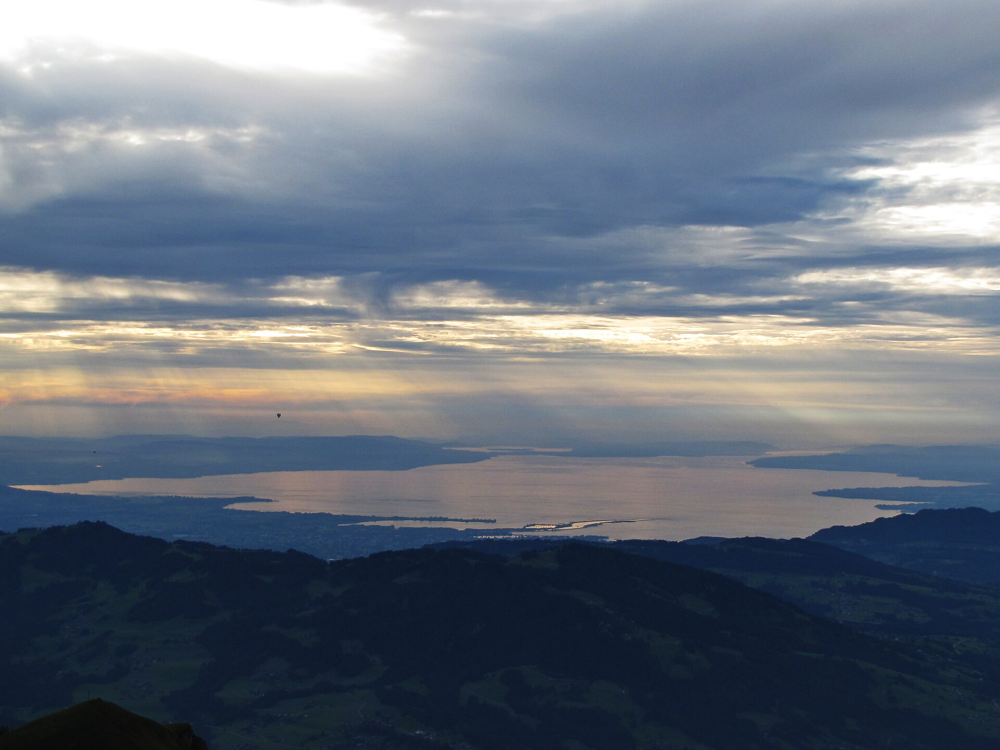
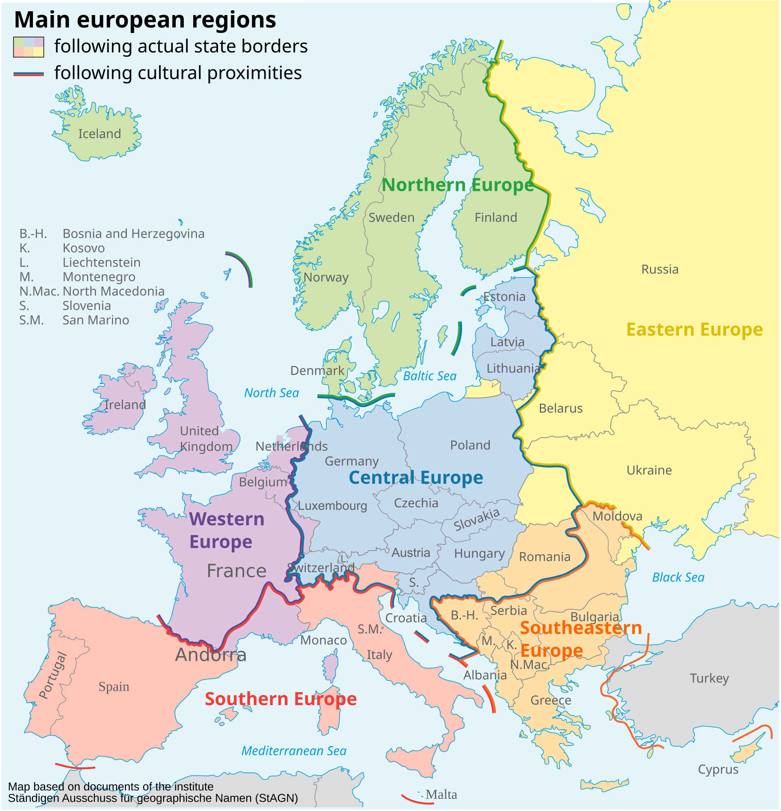
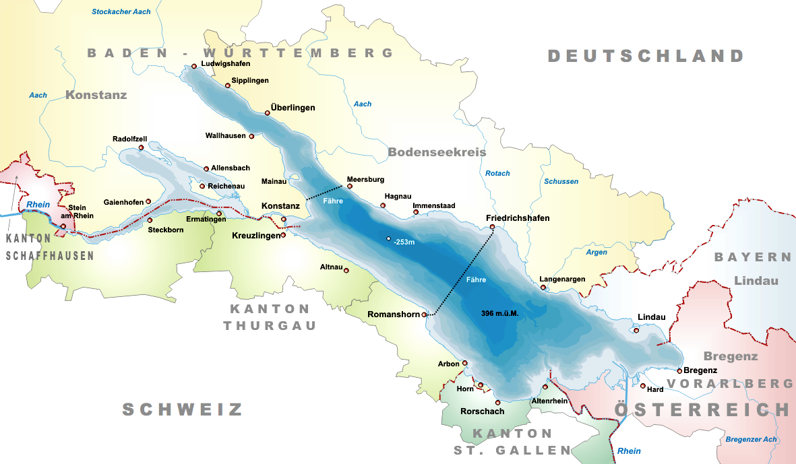

```{r setup, include = FALSE}
library(learnr)
library(tutorial.helpers)
library(knitr)
library(tidyverse)
library(sf)
library(maps)

knitr::opts_chunk$set(echo = FALSE)
knitr::opts_chunk$set(out.width = '90%')
options(tutorial.exercise.timelimit = 600,
        tutorial.storage = "local")

mallards <- read_csv("data/mallards.csv",
                     show_col_types = FALSE) |>
  mutate(
    timestamp = ymd_hms(timestamp),
    month     = month(timestamp, label = TRUE, abbr = TRUE),
    month_num = month(timestamp),
    year      = year(timestamp),
    season    = case_when(
      month_num %in% c(3, 4, 5)   ~ "Spring",
      month_num %in% c(6, 7, 8)   ~ "Summer",
      month_num %in% c(9, 10, 11) ~ "Autumn",
      TRUE                         ~ "Winter"
    ),
    season = factor(season, levels = c("Spring", "Summer", "Autumn", "Winter"))
  )
```

```{r info-section, child = system.file("child_documents/info_section.Rmd", package = "tutorial.helpers")}
```

## Introduction
###

Mallards (*Anas platyrhynchos*) are the most familiar duck in the world — the green-headed bird you've seen in every park pond. But most people don't know how far they actually travel, or how differently individual ducks behave. This tutorial uses GPS tracking data from 52 Mallards fitted with solar-powered collars at Lake Constance, on the border of Germany and Switzerland, to explore where they go, when they move most, and how much individuals differ.

<div style="display: flex; justify-content: center; gap: 20px; align-items: flex-start;">
  
  
</div>

Pictured above: a male and female Mallard (left) and Lake Constance (Bodensee), one of the largest freshwater lakes in Central Europe (right), sitting at the border of Germany, Austria, and Switzerland. It has been an important wintering and staging site for waterfowl for centuries — each autumn, tens of thousands of ducks, geese, and other waterbirds gather here before and after their migrations.

The data comes from a published study by Korner, Sauter, Fiedler, and Jenni (2016) — ["Variable allocation of activity to daylight and night in the mallard"](https://doi.org/10.1016/j.anbehav.2016.02.026) — and is freely available through [Movebank](https://movebank.org/), the world's largest archive of animal tracking data. The dataset is licensed under Creative Commons Attribution (CC BY).

We recommend using an agentic coding tool such as [Gemini CLI](https://github.com/google-gemini/gemini-cli) or [Claude Code](https://claude.ai/code), which can read and edit your files directly. Our instructions are written with these tools in mind. You may also use a chat-based AI, but you will need to copy/paste code and data context manually.

### Exercise 1

You should be connected to a repo named `ducks`. If you are not, create one and connect to it.

Create a new file, `analysis.qmd`, with the title `"Mallard Duck Movement"` and your name as the author. In a bash Terminal, render it:

```
quarto render analysis.qmd
```

Open `analysis.html` with Live Server (right-click it in the Explorer → **Open with Live Server**) and keep the tab open. It refreshes on every render. Going forward, we will just tell you to "Render" when we want you to take these steps.

Create a `.gitignore` with `*_files` followed by a blank line. Commit and push.

In the R Terminal, run:

```
show_file(".gitignore")
```

If that fails, it is probably because you have not yet loaded `library(tutorial.helpers)` in the R Terminal.

CP/CR.

```{r introduction-1}
question_text(NULL,
  answer(NULL, correct = TRUE),
  allow_retry = TRUE,
  try_again_button = "Edit Answer",
  incorrect = NULL,
  rows = 3)
```

###

<pre><code>
*_files
</code></pre>

###

This tutorial builds a website rather than a single page. The final product will have three pages: an introduction page (`analysis.qmd`), a map page (`map.qmd`), and a seasonal analysis page (`seasons.qmd`). A `_quarto.yml` file will tie them together into a navigable site. You will create these files one at a time as the tutorial progresses.

### Exercise 2

In your `analysis.qmd`, add a new code chunk with `library(tidyverse)` and `library(sf)`. Add `#| message: false` to suppress messages. Add the following to the YAML header to hide code:

```
execute:
  echo: false
```

Render. In the R Terminal, run:

```
show_file("analysis.qmd", chunk = "Last")
```

CP/CR.

```{r introduction-2}
question_text(NULL,
  answer(NULL, correct = TRUE),
  allow_retry = TRUE,
  try_again_button = "Edit Answer",
  incorrect = NULL,
  rows = 6)
```

###

<pre><code>#| message: false
library(tidyverse)
library(sf)
</code></pre>

###

There are five main approaches to making maps in R: the **[maps](https://cran.r-project.org/package=maps)** package (simple outlines, limited features), **[ggmap](https://github.com/dkahle/ggmap)** (Google/Stamen tile backgrounds), **[leaflet](https://rstudio.github.io/leaflet/)** (interactive web maps), **[tmap](https://r-tmap.github.io/tmap/)** (thematic maps with a grammar similar to ggplot2), and **[sf](https://r-spatial.github.io/sf/)** (the modern standard for spatial data in R). We use **sf** because it integrates seamlessly with the **tidyverse** — you can pipe sf objects into `ggplot2` using `geom_sf()`, filter and mutate them with **dplyr**, and read standard GIS formats like shapefiles and GeoJSON. It is the package most professional spatial analysts use today.

###

`lubridate` is already loaded as part of `library(tidyverse)` so there is no need to load it separately. Any time you call `library(tidyverse)`, you get `lubridate`, `ggplot2`, `dplyr`, `tidyr`, `readr`, and several other packages all at once.

### Exercise 3

Create a `data` directory at the top level of the `ducks` repo. In the bash Terminal, run `ls`.

CP/CR.

```{r introduction-3}
question_text(NULL,
  answer(NULL, correct = TRUE),
  allow_retry = TRUE,
  try_again_button = "Edit Answer",
  incorrect = NULL,
  rows = 4)
```

###

```
data  analysis.html  analysis.qmd  *_files
```

## Where do they go?
###

Lake Constance sits at the border of Germany, Switzerland, and Austria at roughly 47.5°N, 9.5°E. It is one of the largest freshwater lakes in Central Europe and an important staging area for waterfowl. But Mallards are not purely resident birds — some individuals make substantial seasonal movements while others barely leave the lake. The GPS data reveals exactly who goes where.

### Exercise 1

Download the mallard tracking data from this URL and save it in your `data/` directory:

```
https://github.com/PPBDS/misc.tutorials/raw/refs/heads/main/inst/tutorials/ducks/data/mallards.csv
```

In the bash Terminal, run:

```
ls data
```

CP/CR.

```{r where-do-they-go-1}
question_text(NULL,
  answer(NULL, correct = TRUE),
  allow_retry = TRUE,
  try_again_button = "Edit Answer",
  incorrect = NULL,
  rows = 4)
```

###

```
mallards.csv
```

###

The original Movebank download contained 748,082 rows mixing GPS fixes and accelerometer records across 36 columns. This teaching version keeps only the GPS rows and the seven columns needed for movement analysis: timestamp, latitude, longitude, speed, heading, duck identifier, and species name.

### Exercise 2

Create a new code chunk in `analysis.qmd` that reads `data/mallards.csv` and prints the first 10 rows. Render.

In the R Terminal, run `show_file("analysis.qmd", chunk = "Last")`. CP/CR.

```{r where-do-they-go-2}
question_text(NULL,
  answer(NULL, correct = TRUE),
  allow_retry = TRUE,
  try_again_button = "Edit Answer",
  incorrect = NULL,
  rows = 5)
```

###

```{r where-do-they-go-2-test}
#| echo: true
read_csv("data/mallards.csv", show_col_types = FALSE) |>
  head(10)
```

###
Your code may look different from ours — what matters is that the first 10 rows of the output match.

###

Each row is one **GPS fix** — a single location recorded by one duck at one moment in time. GPS collars record a fix every few hours: the collar computes its position by triangulating signals from satellites overhead, then stores the latitude, longitude, timestamp, and movement metrics. The `duck_id` column uses the tag identifier from the original study, combining a numeric code with the tagging location.

### Exercise 3

Count GPS fixes per duck, sorted from most to least. Render.

In the R Terminal, run `show_file("analysis.qmd", chunk = "Last")`. CP/CR.

```{r where-do-they-go-3}
question_text(NULL,
  answer(NULL, correct = TRUE),
  allow_retry = TRUE,
  try_again_button = "Edit Answer",
  incorrect = NULL,
  rows = 5)
```

###

```{r where-do-they-go-3-test}
#| echo: true
read_csv("data/mallards.csv", show_col_types = FALSE) |>
  count(duck_id, sort = TRUE)
```

###

Duck `2351` has over 20,000 fixes — the most of any individual, tracked continuously for several years. Several ducks have fewer than 100 records, suggesting their collars failed early or the birds died. Uneven record counts across individuals are typical of wildlife tracking studies: not every collar lasts the full study period, and ducks with more fixes will show more complete movement pictures than those with few.

### Exercise 4

Summarize the geographic range of the data: minimum and maximum latitude and longitude. Render.

In the R Terminal, run `show_file("analysis.qmd", chunk = "Last")`. CP/CR.

```{r where-do-they-go-4}
question_text(NULL,
  answer(NULL, correct = TRUE),
  allow_retry = TRUE,
  try_again_button = "Edit Answer",
  incorrect = NULL,
  rows = 5)
```

###

```{r where-do-they-go-4-test}
#| echo: true
read_csv("data/mallards.csv", show_col_types = FALSE) |>
  summarise(
    lat_min  = min(lat, na.rm = TRUE),
    lat_max  = max(lat, na.rm = TRUE),
    long_min = min(long, na.rm = TRUE),
    long_max = max(long, na.rm = TRUE)
  )
```

###

Latitudes range from 47.3°N to 53.9°N — roughly from Lake Constance in southern Germany up to the Netherlands or northern Germany. Longitudes span from 7.8°E to 23.6°E, reaching as far east as Poland or Hungary. These are large movements for a bird most people associate with park ponds. Lake Constance sits at the southwestern corner of this range, so some ducks are traveling 500 km or more from their starting point.

Below: the full region the ducks travel through (left) and a detailed view of Lake Constance itself, where all 52 ducks in this study were originally tagged (right).

<div style="display: flex; justify-content: center; gap: 20px; align-items: flex-start;">
  
  
</div>

### Exercise 5

Read `data/mallards.csv`, parse the timestamp, and add `month`, `month_num`, `year`, and `season` columns. Define season as: Spring (March–May), Summer (June–August), Autumn (September–November), Winter (December–February). Make `season` an ordered factor. Assign the result to `mallards` and print it. Render.

Feel free to copy and paste our code below directly into your QMD as a starting point.

In the R Terminal, run `show_file("analysis.qmd", chunk = "Last")`. CP/CR.

```{r where-do-they-go-5}
question_text(NULL,
  answer(NULL, correct = TRUE),
  allow_retry = TRUE,
  try_again_button = "Edit Answer",
  incorrect = NULL,
  rows = 10)
```

###

```{r where-do-they-go-5-test}
#| echo: true
mallards <- read_csv("data/mallards.csv",
                     show_col_types = FALSE) |>
  mutate(
    timestamp = ymd_hms(timestamp),
    month     = month(timestamp, label = TRUE, abbr = TRUE),
    month_num = month(timestamp),
    year      = year(timestamp),
    season    = case_when(
      month_num %in% c(3, 4, 5)   ~ "Spring",
      month_num %in% c(6, 7, 8)   ~ "Summer",
      month_num %in% c(9, 10, 11) ~ "Autumn",
      TRUE                         ~ "Winter"
    ),
    season = factor(season, levels = c("Spring", "Summer", "Autumn", "Winter"))
  )
mallards
```

###

The `season` column is an ordered factor so plots display seasons in natural calendar order rather than alphabetically. Without the explicit `levels` argument, R would sort them as Autumn, Spring, Summer, Winter — meaningless for a seasonal analysis. The dataset has `r nrow(mallards)` GPS fixes across 52 individual ducks tracked from 2007 to 2017.

### Exercise 6

Now that `mallards` is built, save it to disk so that `map.qmd` and `seasons.qmd` can read it without duplicating the data pipeline. Create a new R script called `mallards.R` in your repo. In it, write the pipeline from Exercise 5 and save the result with `saveRDS(mallards, "data/mallards.rds")`. Run the script in a bash Terminal with `Rscript mallards.R`. In the R Terminal, run `show_file("mallards.R")`. CP/CR.

```{r where-do-they-go-6}
question_text(NULL,
  answer(NULL, correct = TRUE),
  allow_retry = TRUE,
  try_again_button = "Edit Answer",
  incorrect = NULL,
  rows = 10)
```

###

<pre><code>library(tidyverse)

mallards <- read_csv("data/mallards.csv", show_col_types = FALSE) |>
  mutate(
    timestamp = ymd_hms(timestamp),
    month     = month(timestamp, label = TRUE, abbr = TRUE),
    month_num = month(timestamp),
    year      = year(timestamp),
    season    = case_when(
      month_num %in% c(3, 4, 5)   ~ "Spring",
      month_num %in% c(6, 7, 8)   ~ "Summer",
      month_num %in% c(9, 10, 11) ~ "Autumn",
      TRUE                         ~ "Winter"
    ),
    season = factor(season, levels = c("Spring", "Summer", "Autumn", "Winter"))
  )

saveRDS(mallards, "data/mallards.rds")
</code></pre>

###

**RDS** is R's native binary format for saving any R object to disk and reloading it exactly — the same data type, factor levels, and column types come back without any re-parsing. Every `.qmd` page in your website can call `readRDS("data/mallards.rds")` to get the cleaned tibble in one line, rather than each page re-running the full CSV pipeline. This is a standard pattern for Quarto websites: one script prepares the data once, and the pages consume the result.

### Exercise 7

Add `data/mallards.rds` to your `.gitignore` — generated files that can be rebuilt from source should not go to GitHub. In the R Terminal, run `show_file(".gitignore")`. CP/CR.

```{r where-do-they-go-7}
question_text(NULL,
  answer(NULL, correct = TRUE),
  allow_retry = TRUE,
  try_again_button = "Edit Answer",
  incorrect = NULL,
  rows = 5)
```

###

<pre><code>*_files
*_cache
data/mallards.rds
</code></pre>

###

The `.rds` file is regenerated by running `mallards.R`, so committing it to GitHub would just add binary noise that changes every time the script runs. The source that matters — `mallards.R` and `mallards.csv` — is already tracked. Anyone who clones the repo can recreate `mallards.rds` by running the script themselves.

### Exercise 8

In `analysis.qmd`, update the `mallards` chunk to load the RDS file instead of re-running the pipeline. Replace the current chunk contents with a single line: `mallards <- readRDS("data/mallards.rds")`. Add `#| cache: true`. Render. In the bash Terminal, run `ls data`.

CP/CR.

```{r where-do-they-go-8}
question_text(NULL,
  answer(NULL, correct = TRUE),
  allow_retry = TRUE,
  try_again_button = "Edit Answer",
  incorrect = NULL,
  rows = 4)
```

###

```
mallards.csv  mallards.rds
```

###

`readRDS()` loads the binary file in milliseconds — far faster than re-parsing a CSV and re-running `mutate()` calls. Caching it goes one step further: on the second and subsequent renders, even the `readRDS()` call is skipped and the tibble is loaded directly from the render cache.

### Exercise 9

Create a new file `map.qmd` in your repo. Add the same YAML header and library chunk as `analysis.qmd`. Add a data chunk that reads `mallards <- readRDS("data/mallards.rds")` with `#| cache: true`. Render `map.qmd`. In the R Terminal, run `show_file("map.qmd", chunk = "Last")`. CP/CR.

```{r where-do-they-go-9}
question_text(NULL,
  answer(NULL, correct = TRUE),
  allow_retry = TRUE,
  try_again_button = "Edit Answer",
  incorrect = NULL,
  rows = 5)
```

###

<pre><code>#| cache: true
mallards <- readRDS("data/mallards.rds")
</code></pre>

###

Each page of a Quarto website is an independent document with its own R session — `mallards` defined in `analysis.qmd` is not available in `map.qmd`. The RDS approach keeps all three pages in sync: if you update `mallards.R` and re-run it, every page that calls `readRDS("data/mallards.rds")` gets the updated data on the next render, with no copy-pasting.

### Exercise 10

In `map.qmd`, add a new working chunk that makes a map of all GPS fixes, colored by individual duck, filtered to the region of interest (latitudes 46–55°N, longitudes 7–25°E). Use `geom_sf()` with a world boundary layer from `rnaturalearth`. Render `map.qmd`.

In the R Terminal, run `show_file("map.qmd", chunk = "Last")`. CP/CR.

```{r where-do-they-go-10}
question_text(NULL,
  answer(NULL, correct = TRUE),
  allow_retry = TRUE,
  try_again_button = "Edit Answer",
  incorrect = NULL,
  rows = 14)
```

###

```{r where-do-they-go-10-test}
#| echo: true
world <- rnaturalearth::ne_countries(scale = "medium", returnclass = "sf")

mallards_sf <- mallards |>
  filter(lat >= 47, lat <= 55, long >= 8, long <= 25) |>
  arrange(duck_id, timestamp)

ggplot() +
  geom_sf(data = world, fill = "#e8f4f8", color = "gray70", linewidth = 0.2) +
  geom_path(
    data = mallards_sf,
    aes(x = long, y = lat, group = duck_id, color = duck_id),
    alpha = 0.4, linewidth = 0.3
  ) +
  geom_point(
    data = mallards_sf,
    aes(x = long, y = lat, color = duck_id),
    alpha = 0.6, size = 0.8
  ) +
  coord_sf(xlim = c(8, 25), ylim = c(47, 55)) +
  scale_color_viridis_d(option = "turbo") +
  labs(
    title    = "Mallard duck GPS fixes, 2007–2017",
    subtitle = "Each color is one individual duck; lines show movement paths",
    x        = NULL,
    y        = NULL,
    caption  = "Source: Korner, Sauter, Fiedler & Jenni (2016) via Movebank (CC BY)"
  ) +
  theme_minimal() +
  theme(
    axis.text        = element_blank(),
    axis.ticks       = element_blank(),
    legend.position  = "none",
    panel.background = element_rect(fill = "#d0e8f0", color = NA)
  )
```

###

Most GPS fixes cluster tightly around Lake Constance in the southwest corner of the map — the ducks' home base. A scatter of points extends northeast toward Poland and Hungary, showing that some individuals made substantial long-distance movements of several hundred kilometers. Mallards are a  **partially migratory species**: some populations are fully resident year-round, others travel long distances, and many fall somewhere between. Lake Constance is a mild wintering site that also attracts birds from colder regions further north, so some of the northeastern points may represent birds returning to breeding grounds in spring rather than local residents exploring. `st_as_sf()` converts the latitude/longitude columns into a proper sf geometry column, and `coord_sf()` clips the map to the region of interest — both are standard steps whenever you bring tabular GPS data into a spatial plot.

### Exercise 11

Commit `analysis.qmd`, `map.qmd`, and `mallards.R` with the message `"Add duck map"` and push to GitHub. In the bash Terminal, run:

```
git log -1
```

CP/CR.

```{r where-do-they-go-11}
question_text(NULL,
  answer(NULL, correct = TRUE),
  allow_retry = TRUE,
  try_again_button = "Edit Answer",
  incorrect = NULL,
  rows = 6)
```

###

```
commit 3f8a2c1
Author: Var Kurapati <vkurapat@example.com>
Date:   Wed July 08 10:23:41 2026 -0700

    Add duck map
```

###

The map shows where ducks go. The next section asks when — how does duck movement vary across seasons and months?

## When do they move?
###

GPS speed tells us not just where a duck was, but how actively it was moving at each fix. A speed near zero means the duck was resting or feeding; **higher speeds mean active flight**. Combined with timestamps, speed reveals the seasonal rhythm of duck activity across the 10-year study.

### Exercise 1

Create a new file `seasons.qmd` in your repo with the same YAML, libraries, and `readRDS` data chunk as the other pages. Then add a working chunk that counts GPS fixes per month. Render `seasons.qmd`.

In the R Terminal, run `show_file("seasons.qmd", chunk = "Last")`. CP/CR.

```{r when-do-they-move-1}
question_text(NULL,
  answer(NULL, correct = TRUE),
  allow_retry = TRUE,
  try_again_button = "Edit Answer",
  incorrect = NULL,
  rows = 5)
```

###

```{r when-do-they-move-1-test}
#| echo: true
mallards |>
  count(month)
```

###

September dominates with roughly 21,000 fixes — more than double any other month. This reflects when the collars were most active, not duck behavior: most collars were deployed in August or September, so the early weeks of tracking accumulate many fixes before some collars fail or ducks leave the study area. Always check the raw record count before interpreting patterns as biological — an uneven sampling distribution can look like a behavioral signal.

### Exercise 2

Get summary statistics for `speed`. Render `seasons.qmd`.

In the R Terminal, run `show_file("seasons.qmd", chunk = "Last")`. CP/CR.

```{r when-do-they-move-2}
question_text(NULL,
  answer(NULL, correct = TRUE),
  allow_retry = TRUE,
  try_again_button = "Edit Answer",
  incorrect = NULL,
  rows = 5)
```

###

```{r when-do-they-move-2-test}
#| echo: true
mallards |>
  summarise(
    min_speed    = min(speed, na.rm = TRUE),
    median_speed = median(speed, na.rm = TRUE),
    mean_speed   = mean(speed, na.rm = TRUE),
    max_speed    = max(speed, na.rm = TRUE)
  )
```

###

The median speed is 0.22 m/s — most fixes catch a duck that is barely moving, resting or feeding at the water's edge. The maximum is physically impossible for a Mallard (real flight speeds top out around 25–30 m/s) and is almost certainly a GPS positioning error — a common artifact in collar data when satellite geometry is poor or the collar briefly loses signal. These outliers should always be filtered before speed-based analysis.

### Exercise 3

Filter `mallards` to `speed <= 30` to remove GPS errors, then compute mean speed by season and month. Render `seasons.qmd`.

In the R Terminal, run `show_file("seasons.qmd", chunk = "Last")`. CP/CR.

```{r when-do-they-move-3}
question_text(NULL,
  answer(NULL, correct = TRUE),
  allow_retry = TRUE,
  try_again_button = "Edit Answer",
  incorrect = NULL,
  rows = 6)
```

###

```{r when-do-they-move-3-test}
#| echo: true
mallards |>
  filter(speed <= 30) |>
  summarise(mean_speed = mean(speed, na.rm = TRUE),
            .by = c(season, month, month_num)) |>
  arrange(month_num)
```

###

Mean speed peaks in August–September and again in March, when ducks are most actively dispersing or returning. Even at the seasonal peak the average stays well under 1 m/s because most GPS fixes catch a resting bird.
### Exercise 4

Make a ridge plot of speed distributions by month, with GPS errors removed. Use `ggridges`. Render `seasons.qmd`.
In the R Terminal, run `show_file("seasons.qmd", chunk = "Last")`. CP/CR.

```{r when-do-they-move-4}
question_text(NULL,
  answer(NULL, correct = TRUE),
  allow_retry = TRUE,
  try_again_button = "Edit Answer",
  incorrect = NULL,
  rows = 12)
```

###

```{r when-do-they-move-4-test}
#| echo: true
library(ggridges)

mallards |>
  filter(speed <= 30) |>
  mutate(month = fct_reorder(month, month_num)) |>
  ggplot(aes(x = speed, y = month, fill = after_stat(x))) +
  geom_density_ridges_gradient(scale = 3, rel_min_height = 0.01) +
  scale_fill_viridis_c(option = "turbo") +
  labs(
    title    = "Most ducks are barely moving — but autumn has the most active fliers",
    subtitle = "Distribution of GPS-recorded ground speeds by month (speed ≤ 30 m/s)",
    x        = "Ground speed (m/s)",
    y        = NULL,
    fill     = "Speed",
    caption  = "Source: Korner, Sauter, Fiedler & Jenni (2016) via Movebank (CC BY)"
  ) +
  theme_minimal()commit 3f8a2c1
Author: Var Kurapati <vkurapat@example.com>
Date:   Wed July 08 10:23:41 2026 -0700

    Add duck map
```

###

The autumn peak aligns with the post-breeding season when young ducks from this year's broods begin exploring beyond their natal area and adult ducks resume longer-range movements after the summer moult. The published study found that Mallards shift activity flexibly between day and night across the year — more active at night in summer, more active during the day in winter — but the GPS dataset only records where they were, not what they were doing at each fix.

### Exercise 5

Commit `seasons.qmd` with the message `"Add seasonal movement analysis"` and push to GitHub. In the bash Terminal, run:

```
git log -1
```

CP/CR.

```{r when-do-they-move-5}
question_text(NULL,
  answer(NULL, correct = TRUE),
  allow_retry = TRUE,
  try_again_button = "Edit Answer",
  incorrect = NULL,
  rows = 6)
```

###

```
commit abc1234
Author: Your Name <your@email.com>
Date:   Mon Jan 1 00:00:00 2026

    Add seasonal movement analysis
```

###

The map and the seasonal chart answer different questions: the map shows the geographic range of duck movements, and the seasonal chart shows when ducks are most and least active. The final section ties these together into a published website.


## Summary
###


You have built three pages of analysis. Now you will wire them together into a navigable Quarto website, add introductory text to the home page, and publish the result.

### Exercise 1

Create a `_quarto.yml` file at the top level of your repo with the following contents:

```
project:
  type: website

website:
  title: "Mallard Duck Movement"
  navbar:
    left:
      - href: analysis.qmd
        text: Home
      - href: map.qmd
        text: Map
      - href: seasons.qmd
        text: Seasons

format:
  html:
    theme: cosmo
```

In the bash Terminal, run:

```
quarto render
ls
```

In the R Terminal, run `show_file("_quarto.yml")`. CP/CR.

### Exercise 2

Add introductory text to `analysis.qmd`. Ask AI to write 2–3 short paragraphs introducing the study: what Mallard ducks are, where Lake Constance is, and what the GPS tracking data reveals. Render.


```
<div style="display: flex; justify-content: center;">
  
</div>
```

Place the image after your introductory paragraphs. Render and confirm it appears in the HTML.

In the R Terminal, run `show_file("analysis.qmd")`. CP/CR.

```{r summary-2}
question_text(NULL,
  answer(NULL, correct = TRUE),
  allow_retry = TRUE,
  try_again_button = "Edit Answer",
  incorrect = NULL,
  rows = 20)
```

###

Your `analysis.qmd` should have a YAML header, a libraries chunk, a data chunk, and 2–3 paragraphs of introductory prose before the plots.

###

The home page should give a reader who knows nothing about the study enough context to understand the map and seasonal analysis pages. Good introductory text names the species, explains the study location, describes what GPS tracking data is, and previews the main findings — all in plain language without jargon.

### Exercise 3

Publish the website to GitHub Pages. In the bash Terminal, run:

```
quarto publish gh-pages
```

Copy/paste the resulting URL below.

```{r summary-3}
question_text(NULL,
  answer(NULL, correct = TRUE),
  allow_retry = TRUE,
  try_again_button = "Edit Answer",
  incorrect = NULL,
  rows = 3)
```

###

`quarto publish gh-pages` without a filename publishes the whole website, not just a single page. The resulting URL gives access to all three pages via the navbar.

### Exercise 4

Commit and push any remaining changes. Copy/paste the URL to your GitHub repo.

```{r summary-4}
question_text(NULL,
  answer(NULL, correct = TRUE),
  allow_retry = TRUE,
  try_again_button = "Edit Answer",
  incorrect = NULL,
  rows = 6)
```

###

Movebank hosts thousands of published animal tracking studies under open licenses. The same workflow used here — download a CSV, clean timestamps and coordinates, save an RDS, map locations, analyze movement patterns, build a website — applies to any species in the archive, from monarch butterflies to great white sharks. The **[move2](https://cran.r-project.org/package=move2)** R package connects directly to Movebank's API, so for a more advanced project you could pull any tracking dataset straight into R without a manual download.

```{r download-answers, child = system.file("child_documents/download_answers.Rmd", package = "tutorial.helpers")}
```


