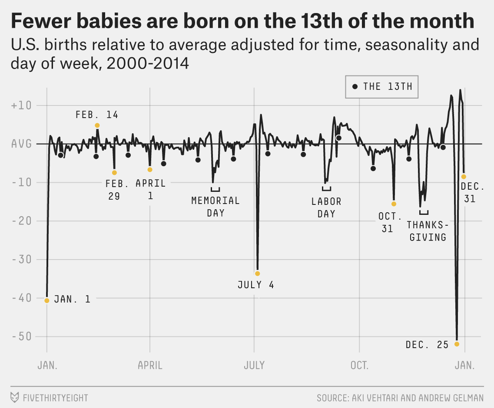
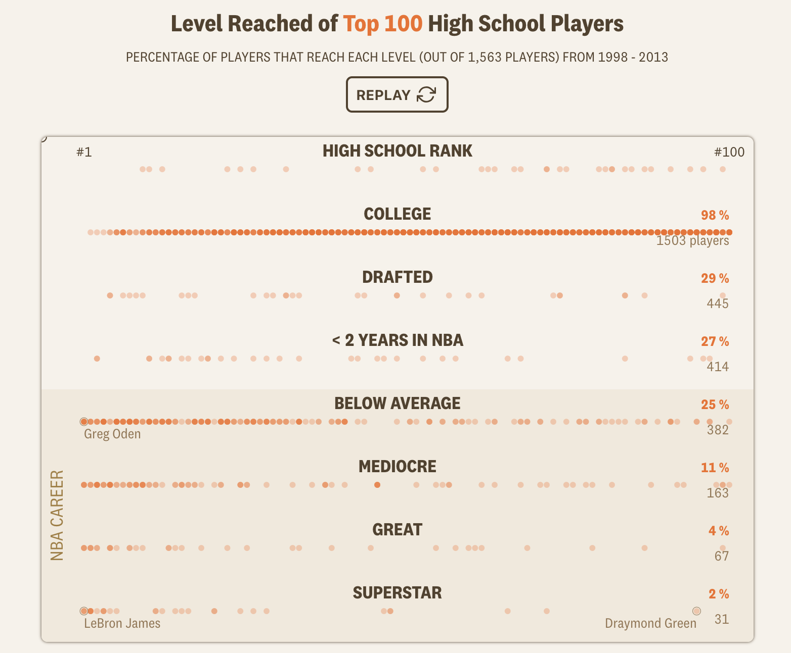

```{r setup, include = FALSE}
library(learnr)
library(tutorial.helpers)
library(knitr)
library(tidyverse)
library(readxl)

knitr::opts_chunk$set(echo = FALSE)
knitr::opts_chunk$set(out.width = '90%')
options(tutorial.exercise.timelimit = 600,
        tutorial.storage = "local")

births_tibble <- read_excel("../../extdata/r4ds-2/us_births_1994_2014.xlsx") |>
  mutate(
    day_of_week = factor(
      day_of_week,
      levels = c("Sun", "Mon", "Tues", "Wed", "Thurs", "Fri", "Sat"),
      ordered = TRUE
    )
  )

christmas_data <- births_tibble |>
  filter(month == 12) |>
  group_by(year) |>
  summarize(
    christmas_births = births[date_of_month == 25],
    baseline        = mean(births[date_of_month %in% c(20:24, 27:30)]),
    weekday         = as.character(day_of_week[date_of_month == 25]),
    .groups         = "drop"
  ) |>
  mutate(
    pct_of_baseline = christmas_births / baseline,
    weekday = factor(weekday,
                     levels = c("Sun", "Mon", "Tues", "Wed", "Thurs", "Fri", "Sat"))
  )

births_model <- lm(births ~ factor(year) + factor(month) + day_of_week,
                   data = births_tibble)

births_adjusted <- births_tibble |>
  mutate(pct_resid = resid(births_model) / mean(births_tibble$births) * 100)

calendar_resid <- births_adjusted |>
  filter(!(month == 2 & date_of_month == 29)) |>
  group_by(month, date_of_month) |>
  summarize(mean_pct_resid = mean(pct_resid), .groups = "drop") |>
  mutate(calendar_date = as.Date(paste("2001", month, date_of_month, sep = "-")))

basketball_tibble <- read_excel(
  "../../extdata/r4ds-2/nba_recruits.xlsx"
) |>
  mutate(
    recruit_group = factor(
      recruit_group,
      levels = c("#1–10", "#11–25", "#26–50",
                 "#51–100", "Outside top 100")
    ),
    tier = factor(
      tier,
      levels = c("Never played", "Brief career", "Solid career",
                 "All-Star level", "Superstar")
    )
  )
```

```{r info-section, child = system.file("child_documents/info_section.Rmd", package = "tutorial.helpers")}
```

## Introduction
###

This section covers key concepts from [Chapter 9: Layers](https://r4ds.hadley.nz/layers.html), [Chapter 10: Exploratory Data Analysis](https://r4ds.hadley.nz/eda.html), [Chapter 11: Communication](https://r4ds.hadley.nz/communication.html), and [Chapter 20: Spreadsheets](https://r4ds.hadley.nz/spreadsheets.html) from [*R for Data Science (2e)*](https://r4ds.hadley.nz/) by Hadley Wickham, Mine Çetinkaya-Rundel, and Garrett Grolemund.

You will learn about working with tabular data from Excel files using **[readxl](https://readxl.tidyverse.org/)** and **[ggplot2](https://ggplot2.tidyverse.org/)**. Key techniques include calendar heatmaps with `geom_tile()`, ordered factors for correct axis sorting, grouped summaries as the foundation for visualizations, boxplots, and scatter plots with annotated outliers.

We recommend using an agentic coding tool such as [Gemini CLI](https://github.com/google-gemini/gemini-cli) or [Claude Code](https://claude.ai/code), which can read and edit your files directly. Our instructions are written with these tools in mind. You may also use a chat-based AI, but you will need to copy/paste code and data context manually.


### Exercise 1

You should be connected to a repo named `r4ds-2`. If you are not, create one and connect to it.

Create a new file and save it as `analysis.qmd`. Add a YAML header at the top with a title (`"Analyzing US Births and Basketball Recruits"`) and your name as author. In a bash terminal, run:

```
quarto render analysis.qmd
```

Open `analysis.html` with Live Server (right-click it in the Explorer → **Open with Live Server**) and keep the tab open. It refreshes on every render. Going forward, we will just tell you to "Render" when we want you to take these steps.

Create a `.gitignore` with `analysis_files` followed by a blank line. Commit and push.

In the R Terminal, run:

```
show_file(".gitignore")
```

If that fails, it is probably because you have not yet loaded `library(tutorial.helpers)` in the R Terminal.

CP/CR.

```{r introduction-1}
question_text(NULL,
    answer(NULL, correct = TRUE),
    allow_retry = TRUE,
    try_again_button = "Edit Answer",
    incorrect = NULL,
    rows = 3)
```

###

This tutorial works with two datasets: US daily birth counts (1994–2014) from FiveThirtyEight and high school basketball recruit outcomes from The Pudding. Both arrive as `.xlsx` Excel files, so `library(readxl)` will be needed alongside `library(tidyverse)` — `readxl` is part of the tidyverse family but is not loaded automatically.

### Exercise 2

In your QMD, put `library(tidyverse)` and `library(readxl)` in a new code chunk. Render.

Notice that the file does not look good because the code is visible and there are annoying messages. To take care of this, add `#| message: false` to remove all the messages in this code chunk. Also add the following to the YAML header to remove all code echoes from the HTML:

```
execute:
  echo: false
```

In the R Terminal, run:

```
show_file("analysis.qmd", chunk = "Last")
```

CP/CR.

```{r introduction-2}
question_text(NULL,
    answer(NULL, correct = TRUE),
    allow_retry = TRUE,
    try_again_button = "Edit Answer",
    incorrect = NULL,
    rows = 6)
```

###

<!-- VK: The expected answer shows backtick fences (```{r} and ```) but my output after running show_file() doesn't output those.

> show_file("analysis.qmd", chunk = "Last")
#| message: false
library(tidyverse)
library(readxl)
> 

-->

<pre><code>```{r}
#| message: false
library(tidyverse)
library(readxl)
```</code></pre>

###

Excel files exported from spreadsheet software often encode categorical variables as plain text. Before those columns display in the right order on a plot axis they need to be converted to ordered factors — you will do that for both datasets in this tutorial.

### Exercise 3

Create a data directory at the top level of the `r4ds-2` repo. In the bash Terminal, run `ls`.

CP/CR.

```{r introduction-3}
question_text(NULL,
	answer(NULL, correct = TRUE),
	allow_retry = TRUE,
	try_again_button = "Edit Answer",
	incorrect = NULL,
	rows = 5)
```

###

```
analysis.html  analysis.qmd  analysis_files  data
```

## Births
###

In 2015, FiveThirtyEight published ["Some People Are Too Superstitious to Have a Baby on Friday the 13th"](https://fivethirtyeight.com/features/some-people-are-too-superstitious-to-have-a-baby-on-friday-the-13th/), which showed US births relative to average — adjusted for time trends, seasonality, and day of week — across the full calendar year.

```{r}

```

New Year's Day and Christmas show the deepest dips; even the 13th of each month is slightly lower than surrounding days. You will investigate this dataset and produce a version of this chart.

### Exercise 1

Download the Excel file `us_births_1994_2014.xlsx` from this URL and save it in your `data/` directory:

```
https://github.com/PPBDS/misc.tutorials/raw/refs/heads/main/inst/extdata/r4ds-2/us_births_1994_2014.xlsx
```

In a bash Terminal, run:

```
ls data
```

CP/CR.

```{r births-1}
question_text(NULL,
    answer(NULL, correct = TRUE),
    allow_retry = TRUE,
    try_again_button = "Edit Answer",
    incorrect = NULL,
    rows = 5)
```

###

```
@ppbds-student ➜ /workspaces/r4ds-2 (main) $ ls data
us_births_1994_2014.xlsx
@ppbds-student ➜ /workspaces/r4ds-2 (main) $
```

###

FiveThirtyEight published this data under a CC-BY license alongside their 2016 article. It combines two overlapping government sources: a CDC-derived file covering 1994–1999 and an Social Secutiry Admisintration (SSA) file covering 2000–2014; the combined spreadsheet uses the SSA data for the 2000–2003 overlap to avoid double-counting. Both sources use registration date rather than birth date, which introduces a small lag but does not materially affect the patterns you will analyze.

### Exercise 2

Read `data/us_births_1994_2014.xlsx` and pass the result to `glimpse()`. Render.

Copy and paste the glimpse output from the HTML.

```{r births-2}
question_text(NULL,
    answer(NULL, correct = TRUE),
    allow_retry = TRUE,
    try_again_button = "Edit Answer",
    incorrect = NULL,
    rows = 5)
```

###


```{r births-2-test}
glimpse(read_excel("../../extdata/r4ds-2/us_births_1994_2014.xlsx"))
```

The dataset has 7,670 rows and five columns: `year`, `month`, `date_of_month`, `day_of_week`, and `births`. Each row is one calendar day. Notice that `day_of_week` arrives as `<chr>` — it uses FiveThirtyEight's abbreviated labels ("Mon", "Tues", "Wed", "Thurs", "Fri", "Sat", "Sun") rather than full names or numbers.

### Exercise 3

Read `data/us_births_1994_2014.xlsx` and pass `births` and `year` to `summary()`. Render.

Copy and paste the summary output from the HTML.

```{r births-3}
question_text(NULL,
    answer(NULL, correct = TRUE),
    allow_retry = TRUE,
    try_again_button = "Edit Answer",
    incorrect = NULL,
    rows = 8)
```

###


```{r births-3-test}
read_excel("../../extdata/r4ds-2/us_births_1994_2014.xlsx") |>
  select(births, year) |>
  summary()
```

The minimum birth count is around 5,700 — that single-day low belongs to December 25, 2011 (a Sunday). The maximum is about 16,000, near the September peak. The year range confirms the full 1994–2014 span is present.

Total US births also varied year to year across this span — annual daily averages peaked around 2006–2007 and dipped somewhat by the early 2010s, a swing of roughly 7%. That secular trend means raw counts on any given December 25 carry both a holiday signal and a year-level baseline shift mixed together.

### Exercise 4

Read `data/us_births_1994_2014.xlsx`, convert `day_of_week` to an ordered factor with levels `"Sun"`, `"Mon"`, `"Tues"`, `"Wed"`, `"Thurs"`, `"Fri"`, `"Sat"`, and assign the result to `births_tibble`. Render.

In the R Terminal, run:

```
show_file("analysis.qmd", chunk = "Last")
```

CP/CR.

```{r births-4}
question_text(NULL,
    answer(NULL, correct = TRUE),
    allow_retry = TRUE,
    try_again_button = "Edit Answer",
    incorrect = NULL,
    rows = 8)
```

###


```{r births-4-test, echo = TRUE}
glimpse(births_tibble)
```

`day_of_week` is now `<ord>` — an ordered factor — rather than `<chr>`. Ordered factors tell **ggplot2** how to sequence a categorical variable on axes and in legends. Without the ordering, **ggplot2** would sort day names alphabetically ("Fri" before "Mon"), which is meaningless for a day-of-week axis.

### Exercise 5

Within the `births_tibble` code chunk, add `#| cache: true` as a chunk option. Render. This first render takes noticeably longer — Quarto runs the code and writes the cache to disk; subsequent renders skip that step and load from cache instead.

In the R Terminal, run:

```
show_file("analysis.qmd", chunk = "Last")
```

CP/CR.

```{r births-5}
question_text(NULL,
    answer(NULL, correct = TRUE),
    allow_retry = TRUE,
    try_again_button = "Edit Answer",
    incorrect = NULL,
    rows = 8)
```

###

The `glimpse()` in Exercise 4 showed 7,670 rows across 21 years — 365 × 21 plus 5 leap days (1996, 2000, 2004, 2008, 2012) — which confirms no calendar days are missing from the data. `#| cache: true` is worth adding here because `read_excel()` parses a binary format on every render, which is slower than reading a plain-text CSV.

<!-- AR: Add an exercise to add analysis_cache to the `.gitignore` -->

### Exercise 6

Compute the average number of births for each combination of `month` and `date_of_month`, grouped across all years. Render.

Copy and paste from the HTML.

```{r births-6}
question_text(NULL,
    answer(NULL, correct = TRUE),
    allow_retry = TRUE,
    try_again_button = "Edit Answer",
    incorrect = NULL,
    rows = 12)
```

###


```{r births-6-test}
births_tibble |>
  group_by(month, date_of_month) |>
  summarize(mean_births = mean(births), .groups = "drop")
```

This summary collapses 7,670 daily observations into 366 cells (one per calendar position, including Feb 29). Each cell holds the mean births across all 21 years — except February 29, which appears only 5 times (the leap years 1996, 2000, 2004, 2008, and 2012).

### Exercise 7

Make a `geom_tile()` heatmap that places `date_of_month` on the x-axis, `month` on the y-axis with January at the top, and fills each tile with mean births. Render.

In the R Terminal, run:

```
show_file("analysis.qmd", chunk = "Last")
```

CP/CR.

```{r births-7}
question_text(NULL,
    answer(NULL, correct = TRUE),
    allow_retry = TRUE,
    try_again_button = "Edit Answer",
    incorrect = NULL,
    rows = 10)
```

###


```{r births-7-test, echo = TRUE}
births_tibble |>
  group_by(month, date_of_month) |>
  summarize(mean_births = mean(births), .groups = "drop") |>
  ggplot(aes(x = date_of_month, y = month, fill = mean_births)) +
  geom_tile(color = "white", linewidth = 0.1) +
  scale_y_reverse(breaks = 1:12, labels = month.abb) +
  scale_fill_gradient(low = "#fff7ec", high = "#7f0000",
                      labels = scales::comma,
                      name = "Mean births") +
  labs(
    title = "Mean US Births by Calendar Day (1994–2014)",
    subtitle = "September peaks; holidays show deep dips (1994–2014)",
    x = "Day of month",
    y = NULL,
    caption = "Source: FiveThirtyEight/SSA (1994–2014)"
  ) +
  theme_minimal()
```

`geom_tile()` maps a two-variable grid to color — it is a natural extension of `geom_col()` and `geom_point()` to a matrix layout. `scale_y_reverse()` flips the month axis so January appears at the top, matching the convention of a wall calendar. The September cluster is immediately visible as the darkest band; the holiday notches are unmistakable dark vertical cuts.

The overall color gradient from January/February (lightest) to late summer (darkest) encodes the seasonal birth wave — roughly 9% more births per day in September than in February. That gradient is the dominant signal in the heatmap; the holiday notches are sharp interruptions within it.

### Exercise 8

<!-- AR: Remove all write-in questions. -->

Look at your rendered heatmap. Write one sentence identifying the days with the fewest births. Write one more sentence identifying the days with the most births.

```{r births-8}
question_text(NULL,
    answer(NULL, correct = TRUE),
    allow_retry = TRUE,
    try_again_button = "Edit Answer",
    incorrect = NULL,
    rows = 3)
```

```{r births-8-plot}
births_tibble |>
  group_by(month, date_of_month) |>
  summarize(mean_births = mean(births), .groups = "drop") |>
  ggplot(aes(x = date_of_month, y = month, fill = mean_births)) +
  geom_tile(color = "white", linewidth = 0.1) +
  scale_y_reverse(breaks = 1:12, labels = month.abb) +
  scale_fill_gradient(low = "#fff7ec", high = "#7f0000",
                      labels = scales::comma,
                      name = "Mean births") +
  labs(
    title = "Mean US Births by Calendar Day (1994–2014)",
    subtitle = "September peaks; holidays show deep dips (1994–2014)",
    x = "Day of month",
    y = NULL,
    caption = "Source: FiveThirtyEight/SSA (1994–2014)"
  ) +
  theme_minimal()
```

One possible answer: The five lightest cells, those days with the least births in the calendar, are all major US holidays: December 25, December 24, January 1, July 4, and Thanksgiving (the fourth Thursday of November). There are long spans of darker cells in the summer months, with a clear peak in September — the most births occur in late summer and early fall.

###

The September peak sits roughly nine months after the December holiday season — a pattern sometimes called the "holiday baby boom." The color gradient running from lightest in January and February (the slowest birth months) to darkest in September is the dominant seasonal wave; the holiday notches are sharp vertical interruptions within it.

### Exercise 9

Compute, for each year, the number of births on December 25 and the average number of births on the surrounding days (December 20–24 and 27–30), then express December 25 as a percentage of that baseline. Render.

Copy and paste the table from the HTML.

```{r births-9}
question_text(NULL,
    answer(NULL, correct = TRUE),
    allow_retry = TRUE,
    try_again_button = "Edit Answer",
    incorrect = NULL,
    rows = 12)
```

###


```{r births-9-test}
christmas_data |>
  mutate(pct_of_baseline = round(pct_of_baseline, 3)) |>
  select(year, christmas_births, baseline, pct_of_baseline, weekday)
```

The `weekday` column shows Christmas falling on a different day each year — Sunday in 1994, Monday in 1995, Wednesday in 1996. The `pct_of_baseline` moves noticeably from row to row, but the table alone does not reveal how much of that movement comes from the weekday, year-to-year differences in overall birth rates, or simply noise.

### Exercise 10

Pass `christmas_data` to `summary()`. Render.

Copy and paste the summary output from the HTML.

```{r births-10}
question_text(NULL,
    answer(NULL, correct = TRUE),
    allow_retry = TRUE,
    try_again_button = "Edit Answer",
    incorrect = NULL,
    rows = 8)
```

###


```{r births-10-test}
summary(christmas_data)
```

The `pct_of_baseline` ranges from roughly 48% to 75% — a 27-point swing across just 21 Christmases, with a median around 64%. The `weekday` factor shows Christmas cycling through all seven days across the window. A 27-point spread is too large to attribute to noise alone; something systematic is driving the variation.

### Exercise 11

Make a line and point chart of `pct_of_baseline` by year. Render.

In the R Terminal, run:

```
show_file("analysis.qmd", chunk = "Last")
```

CP/CR.

```{r births-11}
question_text(NULL,
    answer(NULL, correct = TRUE),
    allow_retry = TRUE,
    try_again_button = "Edit Answer",
    incorrect = NULL,
    rows = 10)
```

###


```{r births-11-test, echo = TRUE}
christmas_data |>
  ggplot(aes(x = year, y = pct_of_baseline)) +
  geom_line(color = "gray60", linewidth = 0.5) +
  geom_point(size = 2) +
  scale_y_continuous(labels = scales::percent_format(accuracy = 1)) +
  labs(
    title = "Dec 25 Births as a Share of Surrounding-Day Baseline",
    subtitle = "Year-over-year comparison looks noisy",
    x = "Year",
    y = "Dec 25 births as % of baseline",
    caption = "Source: FiveThirtyEight/SSA (1994–2014)"
  ) +
  theme_minimal()
```

There seems to be a general downward trend as well as an oscillating pattern. Two things vary year to year that could cause this: which weekday Christmas falls on, and the underlying level of US births — 2007 was a near-record birth year while 2011–2012 were noticeably lower.

### Exercise 12

Update the plot to color each point by the weekday that December 25 fell on that year. Render.

In the R Terminal, run:

```
show_file("analysis.qmd", chunk = "Last")
```

CP/CR.

```{r births-12}
question_text(NULL,
    answer(NULL, correct = TRUE),
    allow_retry = TRUE,
    try_again_button = "Edit Answer",
    incorrect = NULL,
    rows = 10)
```

###


```{r births-12-test, echo = TRUE}
christmas_data |>
  ggplot(aes(x = year, y = pct_of_baseline, color = weekday)) +
  geom_line(color = "gray70", linewidth = 0.4) +
  geom_point(size = 3) +
  scale_y_continuous(labels = scales::percent_format(accuracy = 1)) +
  scale_color_brewer(palette = "Dark2") +
  labs(
    title = "Dec 25 Births as a Share of Surrounding-Day Baseline",
    subtitle = "Color shows the weekday Christmas fell on each year",
    x = "Year",
    y = "Dec 25 births as % of baseline",
    color = "Weekday",
    caption = "Source: FiveThirtyEight/SSA (1994–2014)"
  ) +
  theme_minimal()
```

Sunday and Saturday years cluster near the bottom of every vertical slice; Tuesday and Wednesday years cluster near the top — the confound is the day of the week. Weekends already produce roughly 40% fewer births than weekdays from scheduled deliveries alone, so a Sunday Christmas compounds the holiday effect, while a Wednesday Christmas barely adds to it.

### Exercise 13

The Christmas analysis revealed two confounds blurring the year-over-year comparison: which weekday December 25 falls on, and year-to-year variation in overall birth rates. The FiveThirtyEight graphic shown at the top of this section removes all three effects — year, season, and day of week — before measuring the residual. The next four exercises build a version of that graphic.

The tool is a linear model. R predicts each day's birth count from year, month, and day of week; the residuals — the gap between actual and predicted — carry the holiday signal in isolation, stripped of those confounds.

Fit `lm(births ~ factor(year) + factor(month) + day_of_week, data = births_tibble)`, assign the result to `births_model`, and print `summary(births_model)$r.squared`. Render.

Copy and paste the R-squared value from the HTML.

```{r births-13}
question_text(NULL,
    answer(NULL, correct = TRUE),
    allow_retry = TRUE,
    try_again_button = "Edit Answer",
    incorrect = NULL,
    rows = 3)
```

###


```{r births-13-test}
summary(births_model)$r.squared
```

The model's R² of roughly 0.87 means year, month, and weekday together explain about 87% of the day-to-day variation in US birth counts. The remaining 13% is what the three factors cannot account for — and that unexplained portion is what we want: it holds the holiday signal, isolated from season and schedule.

### Exercise 14

Mutate `births_tibble` to add a column `pct_resid`, equal to the residuals from `births_model` divided by the overall mean of `births` and multiplied by 100. Assign the result to `births_adjusted`. Render.

In the R Terminal, run:

```
show_file("analysis.qmd", chunk = "Last")
```

CP/CR.

```{r births-14}
question_text(NULL,
    answer(NULL, correct = TRUE),
    allow_retry = TRUE,
    try_again_button = "Edit Answer",
    incorrect = NULL,
    rows = 10)
```

###


```{r births-14-test, echo = TRUE}
glimpse(births_adjusted)
```

The `pct_resid` column holds each day's residual as a percentage of the overall mean — how many percentage points above or below the model's prediction for a day with that year, season, and weekday. Most ordinary days hover near zero. The largest negative values belong to major holidays: Christmas, New Year's Day, July 4, and Thanksgiving.

### Exercise 15

Filter February 29 from `births_adjusted`, group by `month` and `date_of_month`, compute the mean `pct_resid` for each of the 365 calendar positions, and assign a calendar date using 2001 as a non-leap anchor year. Assign the result to `calendar_resid`. Render.

Copy and paste the first ten rows of the table from the HTML.

```{r births-15}
question_text(NULL,
    answer(NULL, correct = TRUE),
    allow_retry = TRUE,
    try_again_button = "Edit Answer",
    incorrect = NULL,
    rows = 8)
```

###


```{r births-15-test}
calendar_resid
```

This collapses 7,670 daily residuals to 365 calendar positions. Each row shows how far the average birth count on that date deviates from what year, season, and weekday would predict. The December 25 row will show around −35 to −45, meaning Christmas averages roughly that many percentage points below the adjusted baseline. In contrast, typical September dates should show residuals near zero — the September peak is fully captured by the month predictor.

### Exercise 16

Plot `calendar_resid` as a line chart with `calendar_date` on the x-axis and `mean_pct_resid` on the y-axis. Add a horizontal reference line at zero and annotate at least three of the deepest holiday dips by name. Render.

In the R Terminal, run:

```
show_file("analysis.qmd", chunk = "Last")
```

CP/CR.

```{r births-16}
question_text(NULL,
    answer(NULL, correct = TRUE),
    allow_retry = TRUE,
    try_again_button = "Edit Answer",
    incorrect = NULL,
    rows = 10)
```

###


```{r births-16-test, echo = TRUE}
calendar_resid |>
  ggplot(aes(x = calendar_date, y = mean_pct_resid)) +
  geom_hline(yintercept = 0, color = "gray60") +
  geom_line(linewidth = 0.4) +
  annotate("text", x = as.Date("2001-01-01"), y = -38, label = "Jan. 1",  size = 3, hjust = 0.2) +
  annotate("text", x = as.Date("2001-07-04"), y = -14, label = "July 4",  size = 3, hjust = 0.5) +
  annotate("text", x = as.Date("2001-12-25"), y = -38, label = "Dec. 25", size = 3, hjust = 1) +
  scale_x_date(date_labels = "%b.", date_breaks = "3 months") +
  scale_y_continuous(labels = scales::label_percent(scale = 1)) +
  labs(
    title = "Fewer Babies Are Born on Holidays",
    subtitle = "US births relative to year-, month-, and weekday-adjusted baseline (1994–2014)",
    x = NULL,
    y = "% vs. adjusted baseline",
    caption = "Source: FiveThirtyEight/SSA (1994–2014)"
  ) +
  theme_minimal()
```

Original FiveThirtyEight graphic for comparison:

```{r}

```

The pattern matches the FiveThirtyEight original: deep dips at Christmas, New Year's Day, and July 4; the rest of the year hovering near zero. After removing year, month, and weekday effects, the September peak disappears — it was entirely seasonal. What remains is the calendar of human decisions: the days families choose to avoid.

FiveThirtyEight used a Bayesian smoothing model to achieve a similar decomposition; `lm()` produces a comparable result by a more direct route. The main practical difference is that their model uses prior information to smooth estimates for rare dates like Feb 29; ours averages the few observed values directly.

### Exercise 17

Commit `analysis.qmd` with the message `"Add births analysis"` and push to GitHub.

CP/CR.

```{r births-17}
question_text(NULL,
    answer(NULL, correct = TRUE),
    allow_retry = TRUE,
    try_again_button = "Edit Answer",
    incorrect = NULL,
    rows = 5)
```

###

The births analysis is a textbook EDA iteration: a simple plot reveals a pattern, a second makes it look noisy, and a third reveals the confound that was blurring the signal. That cycle — inspect, notice, refine — is the core loop Chapter 10 describes.

## Basketball recruits
###

In 2019, The Pudding published [*How Many High School Stars Actually Make It in the NBA?*](https://pudding.cool/2019/03/hype/), which tracked every top-ranked high school basketball recruit from 1998 onward to see how their careers actually unfolded.

```{r}

```

The guiding question: does being a top-ranked teenager actually predict who becomes an NBA star? Our spreadsheet `data/nba_recruits.xlsx` contains The Pudding's dataset — one row per player, with recruit ranking, draft information, and career statistics.

### Exercise 1

Download the Excel file `nba_recruits.xlsx` from this URL and save it in your `data/` directory:

```
https://github.com/PPBDS/misc.tutorials/raw/refs/heads/main/inst/extdata/r4ds-2/nba_recruits.xlsx
```

In a bash Terminal, run:

```
ls data
```

CP/CR.

```{r basketball-1}
question_text(NULL,
    answer(NULL, correct = TRUE),
    allow_retry = TRUE,
    try_again_button = "Edit Answer",
    incorrect = NULL,
    rows = 5)
```

###

```
@ppbds-student ➜ /workspaces/r4ds-2 (main) $ ls data
nba_recruits.xlsx  us_births_1994_2014.xlsx
@ppbds-student ➜ /workspaces/r4ds-2 (main) $ 
```

###

The Pudding collected recruit rankings from 247Sports and career statistics from Basketball-Reference. The dataset covers draft classes from 1998 through approximately 2013 — players drafted more recently did not yet have enough career data to evaluate. Excel `.xlsx` files are binary, not plain text — your AI agent downloads them correctly, but the binary-versus-text distinction is the thing to carry away.

### Exercise 2

Read `data/nba_recruits.xlsx` with `read_excel()` and print the result. Render.

Copy and paste the table from the HTML.

```{r basketball-2}
question_text(NULL,
    answer(NULL, correct = TRUE),
    allow_retry = TRUE,
    try_again_button = "Edit Answer",
    incorrect = NULL,
    rows = 12)
```

###


```{r basketball-2-test}
read_excel("../../extdata/r4ds-2/nba_recruits.xlsx")
```

The first 10 rows are all `"#1–10"` recruits from the 1998 class — the data is ordered by recruit year and rank. `nba_mean_ws48` is Win Shares per 48 minutes, a measure of career productivity normalized for playing time. Even within this elite group it is already `NA` for several players: Korleone Young (rank 3), Ronald Curry (rank 6), and JaRon Rush (rank 7) never accumulated enough NBA minutes for career stats to register. Being the third-best high school recruit in the country was no guarantee of an NBA career.

### Exercise 3

Read `data/nba_recruits.xlsx` and pass the result to `glimpse()`. Render.

Copy and paste the glimpse output from the HTML.

```{r basketball-3}
question_text(NULL,
    answer(NULL, correct = TRUE),
    allow_retry = TRUE,
    try_again_button = "Edit Answer",
    incorrect = NULL,
    rows = 12)
```

###


```{r basketball-3-test}
read_excel("../../extdata/r4ds-2/nba_recruits.xlsx") |> glimpse()
```

`recruit_group` and `tier` come in as `<chr>`. For plots, that means R will sort them alphabetically — `"#11–25"` before `"#1–10"`, `"All-Star level"` before `"Never played"`. Converting them to ordered factors is what tells R the correct sequence.

### Exercise 4

Read `data/nba_recruits.xlsx`, select `rank`, `nba_mean_ws48`, `top_mean_wa`, `total_seasons`, and `drafted`, and pass the result to `summary()`. Render.

Copy and paste the summary output from the HTML.

```{r basketball-4}
question_text(NULL,
    answer(NULL, correct = TRUE),
    allow_retry = TRUE,
    try_again_button = "Edit Answer",
    incorrect = NULL,
    rows = 12)
```

###


```{r basketball-4-test}
read_excel("../../extdata/r4ds-2/nba_recruits.xlsx") |>
  select(rank, nba_mean_ws48, top_mean_wa, total_seasons, drafted) |>
  summary()
```

`nba_mean_ws48` has 1,504 NAs — 80% of all players never accumulated enough NBA minutes for career stats to register. `drafted` shows 1,255 FALSE versus 618 TRUE: most top-ranked high school players were never drafted at all. The 338 NAs in `rank` belong to the "Outside top 100" group — players The Pudding tracked who the ranking services never rated.

### Exercise 5

Read `data/nba_recruits.xlsx` and count players by `tier`. Render.

Copy and paste the table from the HTML.

```{r basketball-5}
question_text(NULL,
    answer(NULL, correct = TRUE),
    allow_retry = TRUE,
    try_again_button = "Edit Answer",
    incorrect = NULL,
    rows = 8)
```

###


```{r basketball-5-test}
read_excel("../../extdata/r4ds-2/nba_recruits.xlsx") |>
  count(tier)
```

More than half of all players in the dataset — roughly 1,000 of 1,873 — fall into "Never played," meaning the majority of even top-100 recruits never appeared in an NBA game. The next largest group is "Brief career," and true superstars are a small fraction. The categories sort alphabetically rather than by career progression because `tier` is still a plain character column.

### Exercise 6

Read `data/nba_recruits.xlsx` and convert `tier` to an ordered factor with levels `"Never played"`, `"Brief career"`, `"Solid career"`, `"All-Star level"`, `"Superstar"`, assigning the result to `nba_data`. Render.

In the R Terminal, run:

```
show_file("analysis.qmd", chunk = "Last")
```

CP/CR.

```{r basketball-6}
question_text(NULL,
    answer(NULL, correct = TRUE),
    allow_retry = TRUE,
    try_again_button = "Edit Answer",
    incorrect = NULL,
    rows = 8)
```

###


```{r basketball-6-test, echo = TRUE}
read_excel("../../extdata/r4ds-2/nba_recruits.xlsx") |>
  mutate(
    tier = factor(
      tier,
      levels = c("Never played", "Brief career", "Solid career",
                 "All-Star level", "Superstar")
    )
  ) |>
  count(tier)
```

Compare this to the `count()` in Exercise 5: `tier` now runs from "Never played" to "Superstar" rather than alphabetically, matching the natural progression from worst to best career outcome. `recruit_group` is still a plain character column — without the same treatment it would sort as `"#11–25"` before `"#1–10"` in any plot.

### Exercise 7

Add a second `mutate()` to the pipeline that converts `recruit_group` to an ordered factor with levels `"#1–10"`, `"#11–25"`, `"#26–50"`, `"#51–100"`, `"Outside top 100"`. Render.

In the R Terminal, run:

```
show_file("analysis.qmd", chunk = "Last")
```

CP/CR.

```{r basketball-7}
question_text(NULL,
    answer(NULL, correct = TRUE),
    allow_retry = TRUE,
    try_again_button = "Edit Answer",
    incorrect = NULL,
    rows = 10)
```

###


```{r basketball-7-test, echo = TRUE}
read_excel("../../extdata/r4ds-2/nba_recruits.xlsx") |>
  mutate(
    tier = factor(
      tier,
      levels = c("Never played", "Brief career", "Solid career",
                 "All-Star level", "Superstar")
    ),
    recruit_group = factor(
      recruit_group,
      levels = c("#1–10", "#11–25", "#26–50", "#51–100", "Outside top 100")
    )
  ) |>
  count(recruit_group)
```

Each group spans a known rank range — `#1–10` through `#51–100` — so the expected counts are 160, 240, 400, and 800 players across 16 recruit years. Every group falls slightly short, and the gap grows with rank: `#1–10` is just 2 players short while `#51–100` is 37 short. Players ranked in the 80s and 90s were inconsistently listed across services, and the earliest classes (1998–2003) drew on older sources that sometimes published fewer than 100 names.

### Exercise 8

Add `#| cache: true` to the chunk options and rename the variable from `nba_data` to `basketball_tibble`. Render.

In the R Terminal, run:

```
show_file("analysis.qmd", chunk = "Last")
```

CP/CR.

```{r basketball-8}
question_text(NULL,
    answer(NULL, correct = TRUE),
    allow_retry = TRUE,
    try_again_button = "Edit Answer",
    incorrect = NULL,
    rows = 10)
```

###


```{r basketball-8-test, echo = TRUE}
glimpse(basketball_tibble)
```

Compare the column types here to the `glimpse()` in Exercise 3: `recruit_group` and `tier` are now `<fct>` instead of `<chr>`. `#| cache: true` saves the pipeline result to disk so subsequent renders skip re-reading and reprocessing the file.

### Exercise 9

Add a new code chunk to your QMD that creates a bar chart from `basketball_tibble` showing the proportion of players in each career tier broken down by recruit group, with recruit groups on the y-axis and career tier as the fill color. Render.

In the R Terminal, run:

```
show_file("analysis.qmd", chunk = "Last")
```

CP/CR.

```{r basketball-9}
question_text(NULL,
    answer(NULL, correct = TRUE),
    allow_retry = TRUE,
    try_again_button = "Edit Answer",
    incorrect = NULL,
    rows = 10)
```

###


```{r basketball-9-test, echo = TRUE}
basketball_tibble |>
  ggplot(aes(x = fct_rev(recruit_group), fill = tier)) +
  geom_bar(position = "fill") +
  coord_flip() +
  scale_fill_brewer(palette = "RdYlGn", direction = 1) +
  labs(
    title = "Career Outcomes by High School Recruit Rank",
    subtitle = "Higher-ranked recruits are more likely to reach the NBA",
    x = "Recruit group",
    y = "Proportion",
    fill = "Career tier",
    caption = "Source: The Pudding, 2019"
  ) +
  theme_minimal()
```

Among the four ranked groups, the funnel is clear: the "Never played" segment shrinks steadily from "#51–100" to "#1–10," while the share of players with solid, All-Star, or superstar careers grows. The top-10 group has the largest proportion of meaningful NBA careers by a wide margin. `geom_bar(position = "fill")` rescales every bar to the same total height so proportions are directly comparable across groups regardless of how many players are in each.

### Exercise 10

Look at your rendered bar chart. Write one sentence identifying something about one of the bars that seems off or inconsistent with the pattern in the other bars.

```{r basketball-10}
question_text(NULL,
    answer(NULL, correct = TRUE),
    allow_retry = TRUE,
    try_again_button = "Edit Answer",
    incorrect = NULL,
    rows = 3)
```

###

The "Outside top 100" bar contains no "Never played" segment — which looks better than even the top-10 group. This is a sampling artifact: those players entered the dataset through the NBA draft, so by definition they all reached the NBA. The thousands of unranked high school players who were never drafted are simply absent, making the "Never played" denominator missing entirely for that group.

### Exercise 11

Replace the code in the previous chunk to filter `basketball_tibble` to the four ranked groups (excluding `"Outside top 100"`) before plotting the proportional bar chart, so all groups share the same data structure. Render.

In the R Terminal, run:

```
show_file("analysis.qmd", chunk = "Last")
```

CP/CR.

```{r basketball-11}
question_text(NULL,
    answer(NULL, correct = TRUE),
    allow_retry = TRUE,
    try_again_button = "Edit Answer",
    incorrect = NULL,
    rows = 10)
```

###


```{r basketball-11-test, echo = TRUE}
basketball_tibble |>
  filter(recruit_group != "Outside top 100") |>
  ggplot(aes(x = fct_rev(recruit_group), fill = tier)) +
  geom_bar(position = "fill") +
  coord_flip() +
  scale_fill_brewer(palette = "RdYlGn", direction = 1) +
  labs(
    title = "Career Outcomes by High School Recruit Rank",
    subtitle = "Top-100 recruits only — all groups include players who never reached the NBA",
    x = "Recruit group",
    y = "Proportion",
    fill = "Career tier",
    caption = "Source: The Pudding, 2019"
  ) +
  theme_minimal()
```

With the "Outside top 100" group removed, the four bars represent comparable cohorts — every group includes players who made the NBA and players who did not. The funnel is now honest: "Never played" is highest in the "#51–100" group and falls steadily toward the "#1–10" group. Removing a group that lacks a key structural feature shared by the others is a routine step in exploratory analysis; leaving it in would have led to a misleading conclusion.

### Exercise 12

Replace the code in the previous chunk with a pipeline that filters `basketball_tibble` to players with non-missing `nba_mean_ws48` and creates a boxplot of career Win Shares per 48 minutes by recruit group, with recruit groups on the y-axis. Render.

In the R Terminal, run:

```
show_file("analysis.qmd", chunk = "Last")
```

CP/CR.

```{r basketball-12}
question_text(NULL,
    answer(NULL, correct = TRUE),
    allow_retry = TRUE,
    try_again_button = "Edit Answer",
    incorrect = NULL,
    rows = 10)
```

###


```{r basketball-12-test, echo = TRUE}
basketball_tibble |>
  filter(!is.na(nba_mean_ws48)) |>
  ggplot(aes(x = fct_rev(recruit_group), y = nba_mean_ws48,
             fill = fct_rev(recruit_group))) +
  geom_boxplot(show.legend = FALSE) +
  coord_flip() +
  labs(
    title = "NBA Career Quality by High School Recruit Rank",
    subtitle = paste0("n = ", sum(!is.na(basketball_tibble$nba_mean_ws48)),
                      " players with career stats"),
    x = "Recruit group",
    y = "Career Win Shares per 48 min (WS48)",
    caption = "Source: The Pudding, 2019"
  ) +
  theme_minimal()
```

This plot filters to the 369 players with real career statistics — the 1,504 with missing `nba_mean_ws48` are excluded. The medians shift slightly across groups, but the boxes overlap almost completely. Among players who actually reached the NBA, recruit rank barely predicts how good they became.

### Exercise 13

Look at your rendered boxplot. Thinking back to the proportion bar chart from Exercise 9, write one or two sentences about how the picture changes when you shift from asking "did they make the NBA?" to "how good were they once they got there?"

```{r basketball-13}
question_text(NULL,
    answer(NULL, correct = TRUE),
    allow_retry = TRUE,
    try_again_button = "Edit Answer",
    incorrect = NULL,
    rows = 3)
```

###

A higher high school rank improves your odds of an NBA career; it does not necessarilypredict whether you will be good once you get there.

The bar chart and the boxplot answer different questions. The bar chart shows that rank strongly predicts whether a player reaches the NBA at all. The boxplot shows that among those who did make it, the spread within every recruit group is enormous and the medians barely differ. 

### Exercise 14

Replace the code in the previous chunk with a pipeline that filters `basketball_tibble` to players with non-missing `nba_mean_ws48`, arranges by descending `nba_mean_ws48`, selects `name`, `rank`, `recruit_group`, and `nba_mean_ws48`, and shows only the top 10 rows. Render.

Copy and paste the table from the HTML.

```{r basketball-14}
question_text(NULL,
    answer(NULL, correct = TRUE),
    allow_retry = TRUE,
    try_again_button = "Edit Answer",
    incorrect = NULL,
    rows = 12)
```

###


```{r basketball-14-test}
basketball_tibble |>
  filter(!is.na(nba_mean_ws48)) |>
  arrange(desc(nba_mean_ws48)) |>
  select(name, rank, recruit_group, nba_mean_ws48) |>
  head(10)
```

Stephen Curry (`rank` NA, "Outside top 100") and Damian Lillard (also "Outside top 100") appear in this table alongside players ranked first or second overall. The high school ranking services never evaluated either of them as top-100 prospects — yet both produced among the best career WS48 values in the dataset.

### Exercise 15

Replace the code in the previous chunk with a pipeline that filters `basketball_tibble` to players with non-missing `rank` and `top_mean_wa`, creates a scatter plot of recruit `rank` on the x-axis and `top_mean_wa` on the y-axis colored by `tier`, adds a linear trend line, and labels at least four notable players by name. Render.

In the R Terminal, run:

```
show_file("analysis.qmd", chunk = "Last")
```

CP/CR.

```{r basketball-15}
question_text(NULL,
    answer(NULL, correct = TRUE),
    allow_retry = TRUE,
    try_again_button = "Edit Answer",
    incorrect = NULL,
    rows = 15)
```

###


```{r basketball-15-test, echo = TRUE}
basketball_tibble |>
  filter(!is.na(rank), !is.na(top_mean_wa)) |>
  ggplot(aes(x = rank, y = top_mean_wa, color = tier)) +
  geom_point(alpha = 0.6) +
  geom_smooth(method = "lm", se = FALSE, color = "black", linewidth = 0.5) +
  geom_text(
    data = \(d) d |> filter(name %in% c("LeBron James", "Kevin Durant",
                                         "Klay Thompson")),
    aes(label = name),
    nudge_y = 1.2, hjust = 0,
    size = 3, show.legend = FALSE
  ) +
  geom_text(
    data = \(d) d |> filter(name %in% c("Draymond Green", "Gilbert Arenas")),
    aes(label = name),
    nudge_y = 1.2, hjust = 1,
    size = 3, show.legend = FALSE
  ) +
  scale_color_manual(values = c(
    "Never played"   = "gray80",
    "Brief career"   = "#74add1",
    "Solid career"   = "#fee090",
    "All-Star level" = "#f46d43",
    "Superstar"      = "#d73027"
  )) +
  labs(
    title = "Does High School Recruit Rank Predict NBA Stardom?",
    subtitle = "Among players who reached the NBA — rank predicts average careers but not superstars",
    x = "High school recruit rank (1 = top recruit)",
    y = "Peak Wins Added (best 5-season average)",
    color = "Career level",
    caption = "Source: The Pudding, 2019"
  ) +
  theme_minimal()
```

The trendline is nearly flat — the correlation between recruit rank and peak career performance among players who made the NBA is approximately −0.09. LeBron James (rank 1) anchors the top left as an outlier in both dimensions. Draymond Green (#95), Klay Thompson (#58), and Gilbert Arenas (#99) all appear at the top right with high peak Wins Added. Stephen Curry and Damian Lillard do not appear here at all because their `rank` is missing — this plot actually understates how flat the relationship is.

### Exercise 16

Commit `analysis.qmd` with the message `"Add basketball recruits analysis"` and push to GitHub.

CP/CR.

```{r basketball-16}
question_text(NULL,
    answer(NULL, correct = TRUE),
    allow_retry = TRUE,
    try_again_button = "Edit Answer",
    incorrect = NULL,
    rows = 5)
```

###

The basketball section shows a two-part finding: recruit rank predicts NBA entry (the bar chart), but not career quality once there (the boxplot and scatter plot). The scatter's nearly-flat trendline — and the labeled outliers like Curry, Lillard, and Draymond Green — tell the same story with individual names attached.

## Summary
###

This section covered key concepts from [Chapter 9: Layers](https://r4ds.hadley.nz/layers.html), [Chapter 10: Exploratory Data Analysis](https://r4ds.hadley.nz/eda.html), [Chapter 11: Communication](https://r4ds.hadley.nz/communication.html), and [Chapter 20: Spreadsheets](https://r4ds.hadley.nz/spreadsheets.html) from [*R for Data Science (2e)*](https://r4ds.hadley.nz/) by Hadley Wickham, Mine Çetinkaya-Rundel, and Garrett Grolemund.

You learned about working with tabular data from Excel files using **readxl** and **ggplot2**. Key techniques included calendar heatmaps with `geom_tile()`, ordered factors, grouped summaries, boxplots, and scatter plots with annotated outliers.

### Exercise 1

Render. Check your Live Server tab — the resulting HTML page should be attractive, showing clean versions of your plots.

In the R Terminal, run:

```
show_file("analysis.qmd")
```

CP/CR.

```{r summary-1}
question_text(NULL,
	answer(NULL, correct = TRUE),
	allow_retry = TRUE,
	try_again_button = "Edit Answer",
	incorrect = NULL,
	rows = 30)
```

###

Both analyses follow the same data-preparation pattern: read an Excel file, inspect column types, convert categorical variables to ordered factors with the right level sequence. The ordered-factor step is easy to forget — but skipping it produces alphabetically sorted axes that rarely match the data's natural order.

### Exercise 2

Publish your rendered QMD to GitHub Pages. In a bash Terminal, run:

````
quarto publish gh-pages analysis.qmd
````

If the bash Terminal is still running from rendering, stop it first using `Ctrl/Cmd + C`.

Type Y and press Enter when prompted. Copy/paste the resulting URL below.

```{r summary-2}
question_text(NULL,
	answer(NULL, correct = TRUE),
	allow_retry = TRUE,
	try_again_button = "Edit Answer",
	incorrect = NULL,
	rows = 1)
```

###

A GitHub Pages URL makes the rendered HTML publicly accessible. Unlike the Live Server URL (which only works in your Codespace), the `gh-pages` URL persists after the Codespace stops and can be shared with anyone.

### Exercise 3

Commit and push any remaining changes. Copy/paste the URL to your GitHub repo.

```{r summary-3}
question_text(NULL,
	answer(NULL, correct = TRUE),
	allow_retry = TRUE,
	try_again_button = "Edit Answer",
	incorrect = NULL,
	rows = 3)
```

###

The GitHub repo holds the source — `analysis.qmd` — behind the published page. Anyone can clone it, reproduce the analysis, or adapt it for a different dataset.

```{r download-answers, child = system.file("child_documents/download_answers.Rmd", package = "tutorial.helpers")}
```
