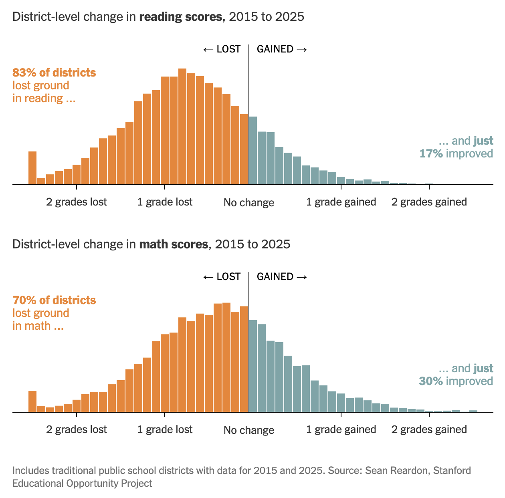

```{r setup, include = FALSE}
library(learnr)
library(tutorial.helpers)

library(tidyverse)
library(DBI)
library(duckdb)
library(dbplyr)

knitr::opts_chunk$set(echo = FALSE)
knitr::opts_chunk$set(out.width = '90%')
options(tutorial.exercise.timelimit = 600,
        tutorial.storage = "local")

con_seda <- dbConnect(duckdb::duckdb(),
                      dbdir = "../../extdata/r4ds-3/seda_2025.duckdb")

dbplyr_dist <- tbl(con_seda, "district_scores")

dist_2023 <- dbplyr_dist |>
  filter(year == 2023, !is.na(rla_score)) |>
  collect()

score_change <- dbplyr_dist |>
  filter(year %in% c(2015, 2023), !is.na(rla_score)) |>
  select(district_id, district_name, state, year, rla_score) |>
  collect() |>
  pivot_wider(names_from = year, values_from = rla_score, names_prefix = "rla_") |>
  filter(!is.na(rla_2015), !is.na(rla_2023)) |>
  mutate(rla_change = rla_2023 - rla_2015)

mth_score_change <- dbplyr_dist |>
  filter(year %in% c(2015, 2023), !is.na(mth_score)) |>
  select(district_id, district_name, state, year, mth_score) |>
  collect() |>
  pivot_wider(names_from = year, values_from = mth_score, names_prefix = "mth_") |>
  filter(!is.na(mth_2015), !is.na(mth_2023)) |>
  mutate(mth_change = mth_2023 - mth_2015)

state_change <- tbl(con_seda, "state_scores") |>
  filter(year %in% c(2015, 2023), !is.na(rla_score)) |>
  select(stateabb, state_name, year, rla_score) |>
  collect() |>
  pivot_wider(names_from = year, values_from = rla_score, names_prefix = "rla_") |>
  filter(!is.na(rla_2015), !is.na(rla_2023)) |>
  mutate(rla_change = rla_2023 - rla_2015)

atus_path <- "../../extdata/r4ds-3/atus.duckdb"
if (file.exists(atus_path)) {
  con_atus     <- dbConnect(duckdb::duckdb(), dbdir = atus_path)
  dbplyr_act   <- tbl(con_atus, "activities")
  dbplyr_resp  <- tbl(con_atus, "respondents")
  dbplyr_codes <- tbl(con_atus, "activity_codes")

  keep_cats <- c(
    "Personal Care Activities",
    "Household Activities",
    "Caring for and Helping Household Members",
    "Socializing, Relaxing, and Leisure"
  )

  x <- dbplyr_act |>
    left_join(dbplyr_codes |> select(activity_code, major_name),
              by = "activity_code") |>
    inner_join(dbplyr_resp |>
                 filter(str_starts(employment_status, "Not"),
                        day_type == "Weekday") |>
                 select(tucaseid, sex),
               by = "tucaseid") |>
    group_by(tucaseid, sex, major_name) |>
    summarize(daily_min = sum(duration_min, na.rm = TRUE), .groups = "drop") |>
    group_by(sex, major_name) |>
    summarize(avg_daily_min = mean(daily_min, na.rm = TRUE), .groups = "drop") |>
    collect()

  y <- dbplyr_act |>
    mutate(hour = start_hhmm %/% 100L) |>
    filter(hour >= 6L, hour <= 23L) |>
    left_join(dbplyr_codes |> select(activity_code, major_name),
              by = "activity_code") |>
    filter(major_name %in% keep_cats) |>
    inner_join(dbplyr_resp |>
                 filter(str_starts(employment_status, "Not"),
                        day_type == "Weekday") |>
                 select(tucaseid, sex),
               by = "tucaseid") |>
    group_by(sex, hour, major_name) |>
    summarize(avg_min = mean(duration_min, na.rm = TRUE), .groups = "drop") |>
    collect()
} else {
  con_atus <- dbplyr_act <- dbplyr_resp <- dbplyr_codes <- NULL
  x <- y <- NULL
}
```

```{r info-section, child = system.file("child_documents/info_section.Rmd", package = "tutorial.helpers")}
```

## Introduction
###

This section covers key concepts from [Chapter 13: Numbers](https://r4ds.hadley.nz/numbers.html), [Chapter 14: Strings](https://r4ds.hadley.nz/strings.html), [Chapter 15: Regular Expressions](https://r4ds.hadley.nz/regexps.html), [Chapter 12: Logical Vectors](https://r4ds.hadley.nz/logicals.html), and [Chapter 21: Databases](https://r4ds.hadley.nz/databases.html) from [*R for Data Science (2e)*](https://r4ds.hadley.nz/) by Hadley Wickham, Mine Çetinkaya-Rundel, and Garrett Grolemund.

You will learn about working with numeric data and text patterns using core *Tidyverse* packages like **[readr](https://readr.tidyverse.org/)**, **[dplyr](https://dplyr.tidyverse.org/)**, and **[stringr](https://stringr.tidyverse.org/)**, as well as database interaction using **[dbplyr](https://dbplyr.tidyverse.org/)**. Key concepts include extracting numbers from strings, detecting text patterns, computing parallel maxima across vectors, and connecting to databases.

We recommend using an agentic coding tool such as [Gemini CLI](https://github.com/google-gemini/gemini-cli) or [Claude Code](https://claude.ai/code). Our instructions are written with these tools in mind. You may also use a chat-based AI, but you will need to copy/paste code and data context manually.

### Exercise 1

You should be connected to a repo named `r4ds-3`. If you are not, create one and connect to it.

Create a new file, `analysis.qmd`, with the title `"Analyzing School Districts and Flights"` and your name as the author. In a bash Terminal, render it:

```
quarto render analysis.qmd
```

Open `analysis.html` with Live Server (right-click it in the Explorer → **Open with Live Server**) and keep the tab open. It refreshes on every render.

Create a `.gitignore` with `analysis_files` followed by a blank line. Commit and push.

In the R Terminal, run:

```
show_file(".gitignore")
```

If that fails, it is probably because you have not yet loaded `library(tutorial.helpers)` in the R Terminal.

CP/CR.

```{r introduction-1}
question_text(NULL,
    answer(NULL, correct = TRUE),
    allow_retry = TRUE,
    try_again_button = "Edit Answer",
    incorrect = NULL,
    rows = 3)
```

###

```
analysis_files
```

###

We will be working with databases in this tutorial. Two key differences between data frames and database tables: database tables are stored on disk and can be arbitrarily large, while data frames are stored in memory; database tables almost always have indexes for fast row lookups, while data frames do not.

### Exercise 2

In your QMD, put `library(tidyverse)`, `library(DBI)`, `library(duckdb)`, and `library(dbplyr)` in a new code chunk. In a bash Terminal, run `quarto render analysis.qmd`. Check your Live Server tab — it should refresh automatically.

Notice that the file does not look good because the code is visible and there are annoying messages. To take care of this, add `#| message: false` to remove all the messages in this code chunk. Also add the following to the YAML header to remove all code echoes from the HTML:

```
execute:
  echo: false
```

In a bash Terminal, run `quarto render analysis.qmd`. Check your Live Server tab. In the R Terminal, run:

```
show_file("analysis.qmd", chunk = "Last")
```

CP/CR.

```{r introduction-2}
question_text(NULL,
    answer(NULL, correct = TRUE),
    allow_retry = TRUE,
    try_again_button = "Edit Answer",
    incorrect = NULL,
    rows = 6)
```

###

<pre><code>```{r}
#| message: false
library(tidyverse)
library(DBI)
library(duckdb)
library(dbplyr)
```</code></pre>

###

Databases are run by database management systems (DBMS's). DuckDB is an in-process DBMS — it runs entirely within your R session, requires no separate server, and is ideal for analyzing large local datasets.

### Exercise 3

From the R Terminal, run these three commands:

```
getwd()
dir.create("data")
list.files()
```

CP/CR.

```{r introduction-3}
question_text(NULL,
	answer(NULL, correct = TRUE),
	allow_retry = TRUE,
	try_again_button = "Edit Answer",
	incorrect = NULL,
	rows = 5)
```

###

```
[1] "analysis.html"  "analysis.qmd"   "analysis_files" "data"
```

###

At the simplest level, a database is a collection of data frames — called tables. Like a data frame, a table is a set of named columns where every value in a column has the same type.


## US education
###

This section uses a DuckDB database built from the Stanford Education Data Archive
(SEDA), which converts each state's standardized test results into a common
grade-equivalent scale so that achievement can be compared across districts and years.
The database holds three tables: annual scores for all students (`district_scores`),
the same data broken out by demographic subgroup (`district_demographics`), and
state-level annual scores (`state_scores`).

Before querying the data, look at what the New York Times found from this same archive
in 2026.

```{r, echo = FALSE}

```

```{r, echo = FALSE}
knitr::include_graphics("images/us-ed-state-reading-change-nyt.png")
```

### Exercise 1

Download the DuckDB database `seda_2025.duckdb` from this URL and save it in your
`data/` directory:

```
https://github.com/PPBDS/misc.tutorials/raw/refs/heads/main/inst/extdata/r4ds-3/seda_2025.duckdb
```

Add `list.files("data")` to a new code chunk in `analysis.qmd`. In a bash Terminal,
run `quarto render analysis.qmd`. Check your Live Server tab.

Copy/paste the output from your HTML below.

```{r us-education-1}
question_text(NULL,
    answer(NULL, correct = TRUE),
    allow_retry = TRUE,
    try_again_button = "Edit Answer",
    incorrect = NULL,
    rows = 3)
```

###

```
[1] "seda_2025.duckdb"
```

###

A database holds multiple tables — typically dozens or hundreds in production systems.
`dbListTables()` is how you discover what a database contains before writing any queries.

### Exercise 2

Connect to the database file, then run `dbListTables()` to see the available tables.
Add the connection code to `analysis.qmd`. In a bash Terminal, run
`quarto render analysis.qmd`. Check your Live Server tab.

Copy/paste the output from your HTML below.

```{r us-education-2}
question_text(NULL,
    answer(NULL, correct = TRUE),
    allow_retry = TRUE,
    try_again_button = "Edit Answer",
    incorrect = NULL,
    rows = 3)
```

###

```
[1] "district_demographics" "district_scores"       "state_scores"
```

###

The SEDA database has three tables: `district_scores` (one row per district per year,
all students combined), `district_demographics` (the same districts broken out by race,
gender, and income level), and `state_scores` (one row per state per year). Together
they hold about 1.25 million rows — too large to hold in memory all at once, which is
why we use lazy table references and collect only what we need.

### Exercise 3

Create a lazy reference to the `district_scores` table, assign it to `dbplyr_dist`,
and print it. In a bash Terminal, run `quarto render analysis.qmd`. Check your Live
Server tab.

Copy/paste the output from your HTML below.

```{r us-education-3}
question_text(NULL,
    answer(NULL, correct = TRUE),
    allow_retry = TRUE,
    try_again_button = "Edit Answer",
    incorrect = NULL,
    rows = 8)
```

###

```{r us-education-3-test}
dbplyr_dist
```

###

`district_name` is the official district name as submitted to the federal education data
collection. Naming conventions vary by state: Texas districts end with "ISD" (Independent
School District), California often uses "USD" (Unified School District), and many states
mark urban systems with "City." The `rla_score` and `mth_score` columns are on the SEDA
YS scale — a value of 0 is roughly the national average, and 1.0 is one full grade level
above it. Negative values mean that district's students scored below the national average.

### Exercise 4

Count the number of district-year observations per year in `dbplyr_dist`. Collect the
result. In a bash Terminal, run `quarto render analysis.qmd`. Check your Live Server tab.

Copy/paste the output from your HTML below.

```{r us-education-4}
question_text(NULL,
    answer(NULL, correct = TRUE),
    allow_retry = TRUE,
    try_again_button = "Edit Answer",
    incorrect = NULL,
    rows = 8)
```

###

```{r us-education-4-test}
dbplyr_dist |> count(year) |> collect()
```

###

The dataset spans 15 years — 2009 through 2019 and 2022 through 2025 — with no
observations for 2020 or 2021. Most states suspended standardized testing during the
COVID-19 pandemic, so SEDA has nothing to report for those two school years. About
12,700 to 13,000 districts appear in each year; the count varies slightly as districts
open, close, or drop below the enrollment threshold required for SEDA to publish a score.

### Exercise 5

Filter `dbplyr_dist` to 2023 with a non-missing `rla_score`. Summarize: compute the
number of districts, the mean reading score, and the standard deviation. Collect the
result. In a bash Terminal, run `quarto render analysis.qmd`. Check your Live Server tab.

Copy/paste the output from your HTML below.

```{r us-education-5}
question_text(NULL,
    answer(NULL, correct = TRUE),
    allow_retry = TRUE,
    try_again_button = "Edit Answer",
    incorrect = NULL,
    rows = 3)
```

###

```{r us-education-5-test}
dbplyr_dist |>
  filter(year == 2023, !is.na(rla_score)) |>
  summarize(n = n(), mean_rla = mean(rla_score), sd_rla = sd(rla_score)) |>
  collect()
```

###

The standard deviation of roughly 0.65 grade-equivalents means the middle 68% of
districts fall within about two-thirds of a grade level of the mean. The mean sitting
slightly below zero reflects the post-COVID slide pulling most districts below the
historical benchmark. A spread of 1.3 grade-equivalents across one standard deviation is
large: a student in a district one SD above average is expected to read more than a full
grade level ahead of a student in a district one SD below.

### Exercise 6

Filter `dbplyr_dist` to 2023 and non-missing `rla_score`, collect, then add a chunk to
`analysis.qmd` that plots the distribution as a histogram. Add a vertical reference line
at 0. Give the plot a proper title, subtitle, and caption. In a bash Terminal, run
`quarto render analysis.qmd`. Check your Live Server tab.

In the R Terminal, run:

```
show_file("analysis.qmd", chunk = "Last")
```

CP/CR.

```{r us-education-6}
question_text(NULL,
    answer(NULL, correct = TRUE),
    allow_retry = TRUE,
    try_again_button = "Edit Answer",
    incorrect = NULL,
    rows = 12)
```

###

```{r us-education-6-test}
#| echo: true
ggplot(dist_2023, aes(x = rla_score)) +
  geom_histogram(bins = 50, fill = "steelblue", color = "white") +
  geom_vline(xintercept = 0, linetype = "dashed", color = "darkred") +
  labs(
    title = "Distribution of District Reading Scores, 2023",
    subtitle = "Most districts cluster near the national average; a left tail shows the most struggling",
    x = "Reading score (grade-equivalents above/below national average)",
    y = "Number of districts",
    caption = "Source: Reardon et al. (2026). Stanford Education Data Archive (SEDA 2025.1)."
  ) +
  theme_minimal()
```

###

The distribution is roughly bell-shaped but with a longer left tail — more districts
score well below average than well above it. The dashed line at 0 is the national
benchmark: districts to its left score below average, those to its right above. The
cluster just right of 0 is the modal group — districts performing at roughly the national
norm. The extreme values on the left (−2 or below) tend to be small, high-poverty
districts whose students score roughly two grade levels below the national average.

### Exercise 7

For each district, compute the change in reading score from 2015 to 2023. Filter
`dbplyr_dist` to those two years with non-missing `rla_score`, collect, reshape to one
row per district, and compute `rla_change`. Assign the result to `score_change` and
print the ten districts with the largest decline. In a bash Terminal, run
`quarto render analysis.qmd`. Check your Live Server tab.

Copy/paste the output from your HTML below.

```{r us-education-7}
question_text(NULL,
    answer(NULL, correct = TRUE),
    allow_retry = TRUE,
    try_again_button = "Edit Answer",
    incorrect = NULL,
    rows = 8)
```

###

```{r us-education-7-test}
#| echo: true
score_change |> arrange(rla_change) |> head(10)
```

###

The largest declines are around −1 to −1.5 grade-equivalents over eight years — a
substantial loss. The `pivot_wider()` step drops any district missing a score in either
year, so `score_change` only includes districts with data for both benchmarks — roughly
the same 10,000 or so districts that maintained stable enrollment and testing programs
across the full 2015–2023 window.

### Exercise 8

Add a chunk to `analysis.qmd` that plots the distribution of `rla_change` as a histogram.
Color bars differently for positive and negative changes. Add a vertical reference line at
0. Give the plot a proper title, subtitle, and caption. In a bash Terminal, run
`quarto render analysis.qmd`. Check your Live Server tab.

In the R Terminal, run:

```
show_file("analysis.qmd", chunk = "Last")
```

CP/CR.

```{r us-education-8}
question_text(NULL,
    answer(NULL, correct = TRUE),
    allow_retry = TRUE,
    try_again_button = "Edit Answer",
    incorrect = NULL,
    rows = 12)
```

###

```{r us-education-8-test}
#| echo: true
ggplot(score_change, aes(x = rla_change)) +
  geom_histogram(bins = 60, aes(fill = rla_change < 0), show.legend = FALSE) +
  scale_fill_manual(values = c("TRUE" = "tomato", "FALSE" = "steelblue")) +
  geom_vline(xintercept = 0, linetype = "dashed", color = "black") +
  labs(
    title = "Change in District Reading Scores, 2015 to 2023",
    subtitle = "About 82% of districts scored lower in 2023 than in 2015",
    x = "Score change (grade-equivalents)",
    y = "Number of districts",
    caption = "Source: Reardon et al. (2026). Stanford Education Data Archive (SEDA 2025.1)."
  ) +
  theme_minimal()
```

###

The distribution is almost entirely to the left of 0 — about 82% of districts with data
in both years show a negative change. This is the same finding the New York Times
visualized in the arrow chart at the start of this section, now shown as a histogram. The
peak falls around −0.2 to −0.3 grade-equivalents; very few districts showed large
positive changes, and those that did are visible only as the thin right tail.

### Exercise 9

Filter `dbplyr_dist` to 2023 and non-missing `mth_score`, collect, then add a chunk to
`analysis.qmd` that plots the distribution as a histogram. Add a vertical reference line
at 0. Give the plot a proper title, subtitle, and caption. In a bash Terminal, run
`quarto render analysis.qmd`. Check your Live Server tab.

In the R Terminal, run:

```
show_file("analysis.qmd", chunk = "Last")
```

CP/CR.

```{r us-education-9}
question_text(NULL,
    answer(NULL, correct = TRUE),
    allow_retry = TRUE,
    try_again_button = "Edit Answer",
    incorrect = NULL,
    rows = 12)
```

###

```{r us-education-9-test}
#| echo: true
dist_2023 |>
  filter(!is.na(mth_score)) |>
  ggplot(aes(x = mth_score)) +
  geom_histogram(bins = 50, fill = "darkorange", color = "white") +
  geom_vline(xintercept = 0, linetype = "dashed", color = "darkred") +
  labs(
    title = "Distribution of District Math Scores, 2023",
    subtitle = "The math distribution is similar in shape to reading but with slightly more spread",
    x = "Math score (grade-equivalents above/below national average)",
    y = "Number of districts",
    caption = "Source: Reardon et al. (2026). Stanford Education Data Archive (SEDA 2025.1)."
  ) +
  theme_minimal()
```

###

The math distribution mirrors reading in shape — roughly bell-shaped with a left tail —
but math typically shows slightly more spread. Both subjects are pulled below zero by the
post-COVID decline. The same underlying factors drive both: poverty, school funding, and
teacher quality affect reading and math simultaneously, which is why the two histograms
look so similar.

### Exercise 10

Compute the change in math score from 2015 to 2023 for each district. Follow the same
approach as Exercise 7 but using `mth_score`. Assign the result to `mth_score_change` and
print the ten districts with the largest decline. In a bash Terminal, run
`quarto render analysis.qmd`. Check your Live Server tab.

Copy/paste the output from your HTML below.

```{r us-education-10}
question_text(NULL,
    answer(NULL, correct = TRUE),
    allow_retry = TRUE,
    try_again_button = "Edit Answer",
    incorrect = NULL,
    rows = 8)
```

###

```{r us-education-10-test}
#| echo: true
mth_score_change |> arrange(mth_change) |> head(10)
```

###

The largest math declines tend to be larger in magnitude than the comparable reading
declines. Math skills depend more heavily on in-person, sequential instruction; reading
is more easily reinforced at home. Districts appearing in both the reading and math
worst-decline lists are facing broad academic challenges that go beyond subject-specific
interventions.

### Exercise 11

Add a chunk to `analysis.qmd` that plots the distribution of `mth_change` from
`mth_score_change` as a histogram. Color bars differently for positive and negative
changes. Add a vertical reference line at 0. Give the plot a proper title, subtitle, and
caption. In a bash Terminal, run `quarto render analysis.qmd`. Check your Live Server tab.

In the R Terminal, run:

```
show_file("analysis.qmd", chunk = "Last")
```

CP/CR.

```{r us-education-11}
question_text(NULL,
    answer(NULL, correct = TRUE),
    allow_retry = TRUE,
    try_again_button = "Edit Answer",
    incorrect = NULL,
    rows = 12)
```

###

```{r us-education-11-test}
#| echo: true
ggplot(mth_score_change, aes(x = mth_change)) +
  geom_histogram(bins = 60, aes(fill = mth_change < 0), show.legend = FALSE) +
  scale_fill_manual(values = c("TRUE" = "tomato", "FALSE" = "steelblue")) +
  geom_vline(xintercept = 0, linetype = "dashed", color = "black") +
  labs(
    title = "Change in District Math Scores, 2015 to 2023",
    subtitle = "Math declines were larger and more widespread than reading declines",
    x = "Score change (grade-equivalents)",
    y = "Number of districts",
    caption = "Source: Reardon et al. (2026). Stanford Education Data Archive (SEDA 2025.1)."
  ) +
  theme_minimal()
```

###

Comparing this histogram to Exercise 8 shows the math distribution shifted further left
— the peak falls around −0.4 to −0.5 grade-equivalents, compared with about −0.2 to
−0.3 for reading. More than 85% of districts show a negative math change. The extra
left-shift is consistent with findings from the National Assessment of Educational
Progress (NAEP), which recorded the largest math score drops in a generation after the
pandemic.

### Exercise 12

Filter `dbplyr_dist` to 2023 with non-missing `rla_score` and `mth_score`, collect, then
add a chunk to `analysis.qmd` that plots reading score on the x-axis against math score
on the y-axis. Add reference lines at x = 0 and y = 0. Give the plot a proper title,
subtitle, and caption. In a bash Terminal, run `quarto render analysis.qmd`. Check your
Live Server tab.

In the R Terminal, run:

```
show_file("analysis.qmd", chunk = "Last")
```

CP/CR.

```{r us-education-12}
question_text(NULL,
    answer(NULL, correct = TRUE),
    allow_retry = TRUE,
    try_again_button = "Edit Answer",
    incorrect = NULL,
    rows = 12)
```

###

```{r us-education-12-test}
#| echo: true
dist_2023 |>
  filter(!is.na(mth_score)) |>
  ggplot(aes(x = rla_score, y = mth_score)) +
  geom_point(alpha = 0.25, size = 0.8, color = "steelblue") +
  geom_hline(yintercept = 0, linetype = "dashed", color = "gray40") +
  geom_vline(xintercept = 0, linetype = "dashed", color = "gray40") +
  geom_smooth(method = "lm", color = "darkred", se = FALSE, linewidth = 0.8) +
  labs(
    title = "Reading vs Math Scores Across US School Districts, 2023",
    subtitle = "Districts that struggle in reading almost always struggle in math",
    x = "Reading score (grade-equivalents)",
    y = "Math score (grade-equivalents)",
    caption = "Source: Reardon et al. (2026). Stanford Education Data Archive (SEDA 2025.1)."
  ) +
  theme_minimal()
```

###

The two measures are tightly correlated — nearly all points fall along the diagonal. The
four quadrants divided by the reference lines show how rare it is to score high in one
subject and low in the other. Most points cluster in the lower-left quadrant, consistent
with the broad post-COVID decline visible in both subjects and in both change histograms.

### Exercise 13

Create a lazy reference to the `state_scores` table. Filter to 2015 and 2023 with
non-missing `rla_score`, collect, reshape to one row per state, and compute
`rla_change = rla_2023 - rla_2015`. Assign the result to `state_change` and print all
rows sorted by `rla_change`. In a bash Terminal, run `quarto render analysis.qmd`. Check
your Live Server tab.

Copy/paste the output from your HTML below.

```{r us-education-13}
question_text(NULL,
    answer(NULL, correct = TRUE),
    allow_retry = TRUE,
    try_again_button = "Edit Answer",
    incorrect = NULL,
    rows = 12)
```

###

```{r us-education-13-test}
state_change |> arrange(rla_change)
```

###

The state-level picture compresses the district histogram from Exercise 8 into 50 summary
values. Most states declined, but the range is wide. With only 50 observations the state
data is easy to examine row by row — this is when printing all rows rather than `head()`
makes sense. The two rightward outliers you will see in the next exercise are Mississippi
and Louisiana.

### Exercise 14

Add a chunk to `analysis.qmd` that plots the distribution of `rla_change` from
`state_change` as a histogram. Color bars by direction. Add a vertical reference line at
0. Give the plot a proper title, subtitle, and caption. In a bash Terminal, run
`quarto render analysis.qmd`. Check your Live Server tab.

In the R Terminal, run:

```
show_file("analysis.qmd", chunk = "Last")
```

CP/CR.

```{r us-education-14}
question_text(NULL,
    answer(NULL, correct = TRUE),
    allow_retry = TRUE,
    try_again_button = "Edit Answer",
    incorrect = NULL,
    rows = 12)
```

###

```{r us-education-14-test}
#| echo: true
ggplot(state_change, aes(x = rla_change)) +
  geom_histogram(bins = 20, aes(fill = rla_change < 0), show.legend = FALSE) +
  scale_fill_manual(values = c("TRUE" = "tomato", "FALSE" = "steelblue")) +
  geom_vline(xintercept = 0, linetype = "dashed", color = "black") +
  labs(
    title = "Change in State Reading Scores, 2015 to 2023",
    subtitle = "Nearly every state declined; a handful improved",
    x = "Score change (grade-equivalents)",
    y = "Number of states",
    caption = "Source: Reardon et al. (2026). Stanford Education Data Archive (SEDA 2025.1)."
  ) +
  theme_minimal()
```

###

With only 50 data points, 20 bins is plenty. The shape tells the same story as the
district histogram but at the state level: nearly universal decline, a handful of
rightward outliers. The two blue bars on the right are Mississippi and Louisiana — their
gains are not visible in the aggregate district statistics but stand out clearly at this
level of aggregation.

### Exercise 15

Add a chunk to `analysis.qmd` that builds a state-level arrow chart of reading score
changes from 2015 to 2023. Sort states by their 2023 reading score. For each state draw
an arrow from its 2015 score to its 2023 score, colored by direction of change. Add a
gray dot at the 2015 starting point. Give the plot a proper title, subtitle, and caption
with no y-axis label. In a bash Terminal, run `quarto render analysis.qmd`. Check your
Live Server tab.

In the R Terminal, run:

```
show_file("analysis.qmd", chunk = "Last")
```

CP/CR.

```{r us-education-15}
question_text(NULL,
    answer(NULL, correct = TRUE),
    allow_retry = TRUE,
    try_again_button = "Edit Answer",
    incorrect = NULL,
    rows = 15)
```

###

```{r us-education-15-test}
#| echo: true
#| fig.height: 10
state_change |>
  arrange(rla_2023) |>
  mutate(state_name = fct_inorder(state_name)) |>
  ggplot(aes(y = state_name)) +
  geom_segment(
    aes(x = rla_2015, xend = rla_2023, yend = state_name,
        color = rla_change > 0),
    arrow = arrow(length = unit(0.15, "cm"), type = "closed"),
    linewidth = 0.7,
    show.legend = FALSE
  ) +
  geom_point(aes(x = rla_2015), color = "gray60", size = 1) +
  scale_color_manual(values = c("TRUE" = "steelblue", "FALSE" = "tomato")) +
  labs(
    title = "State Reading Score Changes, 2015 to 2023",
    subtitle = "Arrows point left (decline) for most states; Mississippi and Louisiana stand out",
    x = "Reading score (grade-equivalents)",
    y = NULL,
    caption = "Source: Reardon et al. (2026). Stanford Education Data Archive (SEDA 2025.1)."
  ) +
  theme_minimal() +
  theme(axis.text.y = element_text(size = 9))
```

###

This format — sometimes called a "dumbbell chart" or "connected dot plot" — shows both
the starting point and direction of change for each state simultaneously. The gray dot
marks 2015; the arrowhead marks 2023. Mississippi and Louisiana's blue arrows stand out
sharply against the field of red, making the legislative story concrete: aggressive
phonics-based reform moved these states upward while the rest declined. This is the same
chart the New York Times built from the SEDA data shown in the section introduction.

### Exercise 16

Commit `analysis.qmd` with the message `"Add SEDA district reading analysis"`. You may
use your AI agent, the VS Code Source Control panel, or the bash terminal.

```{r us-education-16}
question_text(NULL,
    answer(NULL, correct = TRUE),
    allow_retry = TRUE,
    try_again_button = "Edit Answer",
    incorrect = NULL,
    rows = 3)
```

###

The SEDA dataset covers 2009–2025 and includes about 13,000 districts in each year.
About 82% of districts with comparable 2015 and 2023 data show a negative reading score
change — the largest single-decade setback in modern US education measurement. The state
arrow chart from Exercise 15 puts that aggregate finding into policy context: the
exceptions that improved are states that passed evidence-based literacy legislation, not
statistical noise.

## Time use
###

This section uses a DuckDB database built from the Bureau of Labor Statistics American
Time Use Survey (ATUS), which asks one randomly selected person per household to record
every activity they did across a single 24-hour diary day. The survey has run each year
since 2003 and now covers more than 220,000 respondents. The database has three tables:
`activities` (one row per recorded activity), `respondents` (one row per person), and
`activity_codes` (a lookup table translating numeric codes to human-readable descriptions).

Before querying the data, look at what the New York Times found from this same survey.

```{r, echo = FALSE}
knitr::include_graphics("images/men-v-women-atus-nyt.png")
```

### Exercise 1

Download the DuckDB database `atus.duckdb` from this URL and save it in your `data/`
directory:

```
https://github.com/PPBDS/misc.tutorials/raw/refs/heads/main/inst/extdata/r4ds-3/atus.duckdb
```

Connect to the database file, then run `dbListTables()` to see what tables it contains.
Add the connection and `dbListTables()` code to `analysis.qmd`. In a bash Terminal, run
`quarto render analysis.qmd`. Check your Live Server tab.

In the R Terminal, run:

```
show_file("analysis.qmd", chunk = "Last")
```

CP/CR.

```{r time-use-1}
question_text(NULL,
    answer(NULL, correct = TRUE),
    allow_retry = TRUE,
    try_again_button = "Edit Answer",
    incorrect = NULL,
    rows = 5)
```

###

```
[1] "activities"     "activity_codes" "respondents"
```

###

The ATUS surveys one randomly selected person aged 15 or older per household each month.
That person fills out a time diary for a single 24-hour day, recording every activity from
waking up to going to sleep — including time spent on housework, TV, childcare, exercise,
and sleep itself. The survey has been running annually since 2003. The database holds
three tables: `activities` (the main diary records), `respondents` (who each diarist was),
and `activity_codes` (what each numeric activity code means). A database keeps all three
related but separate, and `dbListTables()` is how you discover what a database contains
before writing any queries.

### Exercise 2

Create a lazy reference to the `activities` table and assign it to `dbplyr_act`. Create
a lazy reference to the `respondents` table and assign it to `dbplyr_resp`. Create a lazy
reference to the `activity_codes` table and assign it to `dbplyr_codes`. In a bash
Terminal, run `quarto render analysis.qmd`.

Then add a new chunk that prints `dbplyr_act`. In a bash Terminal, run
`quarto render analysis.qmd`. Check your Live Server tab.

In the R Terminal, run:

```
show_file("analysis.qmd", chunk = "Last")
```

CP/CR.

```{r time-use-2}
question_text(NULL,
    answer(NULL, correct = TRUE),
    allow_retry = TRUE,
    try_again_button = "Edit Answer",
    incorrect = NULL,
    rows = 5)
```

###

```{r time-use-2-test, eval = !is.null(con_atus)}
dbplyr_act
```

###

The `activity_code` column stores a 6-digit integer — for example, 120303. The first two
digits identify the major category (12 = Socializing, Relaxing, and Leisure). The next
two identify the sub-category (03 = TV and Movies). The last two give the detailed
activity (03 = Watching TV). The hierarchy is unlocked with integer division:
`activity_code %/% 10000` gives 12, just as `dep_time %/% 100` gives the departure hour
in the flights data. The `start_hhmm` column works the same way: 1430 means 2:30 PM, and
`start_hhmm %/% 100` gives the hour of the day.

### Exercise 3

Add a chunk that prints `dbplyr_resp`. In a bash Terminal, run `quarto render analysis.qmd`.
Check your Live Server tab.

In the R Terminal, run:

```
show_file("analysis.qmd", chunk = "Last")
```

CP/CR.

```{r time-use-3}
question_text(NULL,
    answer(NULL, correct = TRUE),
    allow_retry = TRUE,
    try_again_button = "Edit Answer",
    incorrect = NULL,
    rows = 5)
```

###

```{r time-use-3-test, eval = !is.null(con_atus)}
dbplyr_resp
```

###

Each row in `respondents` is one person who filled out an ATUS diary. The
`employment_status` column has three values: `"Employed"`, `"Unemployed"`, and
`"Not in labor force"`. "Not in labor force" means the person was not working and not
actively looking for work — retirees, full-time caregivers, and students who aren't
job-hunting all fall here. The `day_type` column indicates whether the diary day was
a weekday or a weekend/holiday; time use patterns differ substantially between the
two. The `weight` column is the survey weight, which adjusts for the probability of
selection so that weighted estimates represent the full US population.

### Exercise 4

Add a chunk that collects the entire `dbplyr_codes` table and prints it. Because
`activity_codes` is only a few hundred rows, `collect()` is fine here — it is the large
tables we defer. In a bash Terminal, run `quarto render analysis.qmd`. Copy and paste the
printed table from the rendered HTML.

```{r time-use-4}
question_text(NULL,
    answer(NULL, correct = TRUE),
    allow_retry = TRUE,
    try_again_button = "Edit Answer",
    incorrect = NULL,
    rows = 8)
```

###

```{r time-use-4-test, eval = !is.null(con_atus)}
dbplyr_codes |> collect()
```

###

The `activity_codes` table is the codebook for the six-digit `activity_code` integers in
`activities`. The 18 major categories range from Personal Care (sleeping, grooming, health
care) at one end to Other Activities at the other. Most of the entries you will use in this
section are in categories 2 (Household Activities), 3 (Caring for Household Members), and
12 (Socializing, Relaxing, and Leisure — the category that contains TV watching). The
`sub_code` and `detail_code` columns hold the second and third tiers of the hierarchy;
`major_name` is the only human-readable name column in this build, since the full lexicon
requires parsing a separate BLS PDF.

### Exercise 5

Add a chunk that, for each table in the database, counts the number of rows. Use
`dbplyr_act |> summarize(n = n()) |> collect()`, and repeat for `dbplyr_resp` and
`dbplyr_codes`. In a bash Terminal, run `quarto render analysis.qmd`. Copy and paste the
three row counts from the rendered HTML.

```{r time-use-5}
question_text(NULL,
    answer(NULL, correct = TRUE),
    allow_retry = TRUE,
    try_again_button = "Edit Answer",
    incorrect = NULL,
    rows = 5)
```

###

```{r time-use-5-test, eval = !is.null(con_atus)}
#| echo: true
list(
  activities     = dbplyr_act  |> summarize(n = n()) |> collect(),
  respondents    = dbplyr_resp |> summarize(n = n()) |> collect(),
  activity_codes = dbplyr_codes|> summarize(n = n()) |> collect()
)
```

###

The [~5.6 million] activity records are what justify using a database here. If you ran
`dbplyr_act |> collect()`, you would pull all ~5.6 million rows into R at once — that is
roughly the in-memory footprint of a 400 MB data frame. The `collect()` step is the
moment data moves from the database into R, and it should be deliberate. Using lazy
references and aggregating inside DuckDB before calling `collect()` means R only ever
sees the summary you asked for, not the full five million rows.

### Exercise 6

Add a chunk that counts activity records by major category. From `dbplyr_act`, create a
`major_code` column equal to `activity_code %/% 10000`. Join to `dbplyr_codes` on
`activity_code` to get `major_name`. Count records per `major_name`, sort descending by
count. Collect and print. In a bash Terminal, run `quarto render analysis.qmd`. Copy and
paste the table from the rendered HTML.

```{r time-use-6}
question_text(NULL,
    answer(NULL, correct = TRUE),
    allow_retry = TRUE,
    try_again_button = "Edit Answer",
    incorrect = NULL,
    rows = 8)
```

###

```{r time-use-6-test, eval = !is.null(con_atus)}
#| echo: true
dbplyr_act |>
  mutate(major_code = activity_code %/% 10000L) |>
  left_join(dbplyr_codes |> select(activity_code, major_name),
            by = "activity_code") |>
  count(major_name, sort = TRUE) |>
  collect()
```

###

Traveling generates the most activity records because ATUS codes each individual trip as
a separate activity entry — a person who drives to work, goes to a store at lunch, and
drives home records three traveling records in a single diary day. Sleeping generates
fewer records than you might expect because a full night's sleep is typically one entry.
Personal Care (sleeping, grooming, and health care) and Socializing, Relaxing, and Leisure
each account for a large share of total records. Note that `activity_code %/% 10000`
extracts the two-digit major category from a six-digit code: dividing by 10,000 shifts
the decimal left four places, so the `%/%` integer-division keeps only the leading digits.

### Exercise 7

Add a chunk that computes the average `duration_min` per activity record by major category.
Join `dbplyr_act` to `dbplyr_codes` to get `major_name`. Use `summarize()` with
`mean(duration_min, na.rm = TRUE)` grouped by `major_name`, then sort descending by mean
duration. Collect and print. In a bash Terminal, run `quarto render analysis.qmd`. Copy
and paste the table from the rendered HTML.

```{r time-use-7}
question_text(NULL,
    answer(NULL, correct = TRUE),
    allow_retry = TRUE,
    try_again_button = "Edit Answer",
    incorrect = NULL,
    rows = 8)
```

###

```{r time-use-7-test, eval = !is.null(con_atus)}
#| echo: true
dbplyr_act |>
  left_join(dbplyr_codes |> select(activity_code, major_name),
            by = "activity_code") |>
  group_by(major_name) |>
  summarize(avg_min = mean(duration_min, na.rm = TRUE)) |>
  arrange(desc(avg_min)) |>
  collect()
```

###

Personal Care has by far the highest average duration per record because a single sleep
entry typically lasts 7–9 hours. Work appears near the top too — a typical work shift is
a long unbroken stretch compared to, say, a grocery run or a phone call. This table
answers a different question than Exercise 6: Exercise 6 counted how many activity records
exist per category, while this one asks how long each record lasts on average. A category
can have many short records (Traveling) or few long ones (Sleeping). When researchers want
total time per person per day in each category, they sum `duration_min` per respondent —
a step you will do in Exercise 10.

### Exercise 8

Add a chunk that counts the number of respondents by `sex` and `employment_status`. Use
`dbplyr_resp`, group by both columns, count, collect, and print. In a bash Terminal, run
`quarto render analysis.qmd`. Copy and paste the table from the rendered HTML.

```{r time-use-8}
question_text(NULL,
    answer(NULL, correct = TRUE),
    allow_retry = TRUE,
    try_again_button = "Edit Answer",
    incorrect = NULL,
    rows = 8)
```

###

```{r time-use-8-test, eval = !is.null(con_atus)}
#| echo: true
dbplyr_resp |>
  count(sex, employment_status, sort = FALSE) |>
  arrange(sex, employment_status) |>
  collect()
```

###

The majority of ATUS respondents are employed, reflecting the composition of the US
working-age population. The "Not in labor force" group — the group the NYT graphic
focuses on — is smaller but still a substantial sample. Women are overrepresented in
this category relative to men, consistent with decades of data showing that women are
more likely than men to exit the labor force for caregiving. Across the full 2003–2023
period, there are enough non-employed respondents of both sexes to produce stable
estimates of their daily activity patterns.

### Exercise 9

Add a chunk that counts the number of respondents by `year`. Use `dbplyr_resp`, group
by `year`, count, collect, and print. In a bash Terminal, run `quarto render analysis.qmd`.
Copy and paste the table from the rendered HTML.

```{r time-use-9}
question_text(NULL,
    answer(NULL, correct = TRUE),
    allow_retry = TRUE,
    try_again_button = "Edit Answer",
    incorrect = NULL,
    rows = 8)
```

###

```{r time-use-9-test, eval = !is.null(con_atus)}
#| echo: true
dbplyr_resp |>
  count(year) |>
  arrange(year) |>
  collect()
```

###

Annual sample sizes are roughly stable — around 10,000–11,000 respondents per year from
2003 onward. The 2020 and 2021 counts may be lower: the COVID-19 pandemic disrupted BLS
field operations, and diary-day patterns in those years reflect atypical conditions
(school closures, remote work, reduced socializing). Analyses that exclude 2020–2021 or
treat them separately can avoid conflating pandemic-era behavior with longer-run trends.
The 21-year span makes the ATUS one of the longest-running household time-use surveys in
the world.

### Exercise 10

Add a chunk that, for weekday non-employed respondents, computes each person's total
daily minutes in each major activity category, then averages across people by `sex` and
`major_name`. Specifically:

- Start from `dbplyr_act`
- Join to `dbplyr_codes` on `activity_code` to get `major_name`
- Join to `dbplyr_resp` on `tucaseid`, keeping only rows where
  `str_starts(employment_status, "Not")` and `day_type == "Weekday"`
- Group by `tucaseid`, `sex`, and `major_name`; sum `duration_min` per person per category
- Then group by `sex` and `major_name`; average that per-person total
- Collect and assign to `x`

Add `#| cache: true` to this chunk and add `analysis_cache` to `.gitignore` if you have
not already. In a bash Terminal, run `quarto render analysis.qmd` (first run will be slow).
Check your Live Server tab.

In the R Terminal, run:

```
show_file("analysis.qmd", chunk = "Last")
```

CP/CR.

```{r time-use-10}
question_text(NULL,
    answer(NULL, correct = TRUE),
    allow_retry = TRUE,
    try_again_button = "Edit Answer",
    incorrect = NULL,
    rows = 10)
```

###

```{r time-use-10-test, eval = !is.null(con_atus)}
#| echo: true
dbplyr_act |>
  left_join(dbplyr_codes |> select(activity_code, major_name),
            by = "activity_code") |>
  inner_join(dbplyr_resp |>
               filter(str_starts(employment_status, "Not"),
                      day_type == "Weekday") |>
               select(tucaseid, sex),
             by = "tucaseid") |>
  group_by(tucaseid, sex, major_name) |>
  summarize(daily_min = sum(duration_min, na.rm = TRUE), .groups = "drop") |>
  group_by(sex, major_name) |>
  summarize(avg_daily_min = mean(daily_min, na.rm = TRUE), .groups = "drop") |>
  arrange(sex, desc(avg_daily_min)) |>
  collect()
```

###

If your result differs from ours, replace your code with the code above before moving on
so your `x` matches for the rest of the section.

This two-step aggregation matters: the first `summarize()` totals minutes per person per
category (so that one respondent who watched TV in three separate stretches contributes
one total, not three separate records). The second `summarize()` then averages those
person-level totals across respondents. Skipping the first step and averaging raw
`duration_min` records would give the average length of a single TV-watching stretch, not
the average total TV time per person per day — a different and less useful quantity.

### Exercise 11

Add a new chunk that makes a horizontal grouped bar chart from `x` showing average daily
minutes by `major_name` on the y-axis and colored by `sex`. Reorder `major_name` by
average minutes (averaged across sexes). Remove any rows where `major_name` is `NA`.
Give the chart a title, subtitle, axis labels, and a data source caption. In a bash
Terminal, run `quarto render analysis.qmd`. Check your Live Server tab.

In the R Terminal, run:

```
show_file("analysis.qmd", chunk = "Last")
```

CP/CR.

```{r time-use-11}
question_text(NULL,
    answer(NULL, correct = TRUE),
    allow_retry = TRUE,
    try_again_button = "Edit Answer",
    incorrect = NULL,
    rows = 12)
```

###

```{r time-use-11-test, eval = !is.null(con_atus)}
#| echo: true
x |>
  filter(!is.na(major_name)) |>
  mutate(major_name = fct_reorder(major_name, avg_daily_min)) |>
  ggplot(aes(x = avg_daily_min, y = major_name, fill = sex)) +
  geom_col(position = "dodge") +
  labs(
    title = "How Non-Employed Americans Spend Weekdays",
    subtitle = "Women devote more time to housework and caregiving; men spend more on leisure",
    x = "Average minutes per weekday",
    y = NULL,
    fill = "Sex",
    caption = "Source: BLS American Time Use Survey (2003–2023). Weekday non-employed respondents."
  ) +
  theme_minimal()
```

###

The two longest bars for both men and women are Personal Care (mostly sleeping) and
Socializing, Relaxing, and Leisure (mostly TV). But the Household Activities and Caring
bars tell the story the NYT graphic illustrates: women's bars extend substantially farther
to the right — roughly 50–60 minutes more per weekday in each of those two categories.
The Leisure bar goes the other way: men average substantially more minutes. This gender
gap in unpaid labor appears whether respondents are employed or not, but it is widest in
the non-employed group, which is what the NYT graphic highlights.

### Exercise 12

In one to two sentences, describe the most striking difference between men and women in
the chart you just produced. Name the specific activity categories where the gap is
largest, and state which direction (men higher or women higher).

```{r time-use-12}
question_text(NULL,
  message = "Women average about 50–60 more minutes per weekday on Household Activities
and Caring than non-employed men. Men average roughly 60 more minutes on Socializing,
Relaxing, and Leisure — driven largely by more TV watching.",
  answer(NULL, correct = TRUE),
  allow_retry = FALSE,
  incorrect = NULL,
  rows = 4)
```

###

Sociologist Arlie Hochschild named this the "second shift" in 1989: even when women join
the paid labor force, they retain the bulk of household and caregiving work. The ATUS
shows the pattern persists in the non-employed group too — non-employed women do not
simply redirect the time they would have spent working into leisure; they redirect it into
unpaid domestic work. The BLS has published ATUS findings on this gender gap every year
since the survey launched in 2003, and it has narrowed only modestly over two decades.

### Exercise 13

Now build toward the time-of-day view shown in the NYT graphic. Add a new chunk with
`#| cache: true` that, for weekday non-employed respondents, computes the average minutes
spent in activities starting in each hour of the day, broken out by `sex` and `major_name`.

Specifically:
- From `dbplyr_act`, add a column `hour` equal to `start_hhmm %/% 100`
- Filter to hours 6 through 23 (6 AM through 11 PM)
- Join to `dbplyr_codes` to get `major_name`
- Join to `dbplyr_resp`, filtering to non-employed weekday respondents, keeping `sex`
- Keep only the four major categories: Personal Care, Household Activities,
  Caring for and Helping Household Members, and Socializing, Relaxing, and Leisure
- Group by `sex`, `hour`, and `major_name`; summarize average `duration_min`
- Collect and assign to `y`

In a bash Terminal, run `quarto render analysis.qmd`. Check your Live Server tab.

In the R Terminal, run:

```
show_file("analysis.qmd", chunk = "Last")
```

CP/CR.

```{r time-use-13}
question_text(NULL,
    answer(NULL, correct = TRUE),
    allow_retry = TRUE,
    try_again_button = "Edit Answer",
    incorrect = NULL,
    rows = 12)
```

###

```{r time-use-13-test, eval = !is.null(con_atus)}
#| echo: true
keep_cats <- c(
  "Personal Care Activities",
  "Household Activities",
  "Caring for and Helping Household Members",
  "Socializing, Relaxing, and Leisure"
)

dbplyr_act |>
  mutate(hour = start_hhmm %/% 100L) |>
  filter(hour >= 6L, hour <= 23L) |>
  left_join(dbplyr_codes |> select(activity_code, major_name),
            by = "activity_code") |>
  filter(major_name %in% keep_cats) |>
  inner_join(dbplyr_resp |>
               filter(str_starts(employment_status, "Not"),
                      day_type == "Weekday") |>
               select(tucaseid, sex),
             by = "tucaseid") |>
  group_by(sex, hour, major_name) |>
  summarize(avg_min = mean(duration_min, na.rm = TRUE), .groups = "drop") |>
  collect()
```

###

The ATUS diary day runs from 4 AM to 4 AM the next morning. Times from midnight to 3:59 AM
are stored as hours 24–27 (e.g., 0015 becomes start_hhmm 15, but 12:15 AM in the diary
can appear as 2415). Filtering to hours 6–23 avoids the before-dawn ambiguity and focuses
on typical waking hours. The `start_hhmm %/% 100` extraction is the same integer-division
operation used to get departure hours from `dep_time` in the flights data — both are
packed HHMM integers where the upper two digits hold the hour.

### Exercise 14

Add a new chunk that makes a stacked area chart from `y`, with `hour` on the x-axis,
`avg_min` on the y-axis, `major_name` as the fill, faceted by `sex`. Use
`position = "stack"` for the area geometry. Give the chart a title that describes what
it shows, a subtitle that names the key pattern, and a data source caption. In a bash
Terminal, run `quarto render analysis.qmd`. Check your Live Server tab.

In the R Terminal, run:

```
show_file("analysis.qmd", chunk = "Last")
```

CP/CR.

```{r time-use-14}
question_text(NULL,
    answer(NULL, correct = TRUE),
    allow_retry = TRUE,
    try_again_button = "Edit Answer",
    incorrect = NULL,
    rows = 12)
```

###

```{r time-use-14-test, eval = !is.null(con_atus)}
#| echo: true
ggplot(y, aes(x = hour, y = avg_min, fill = major_name)) +
  geom_area(position = "stack", alpha = 0.85) +
  facet_wrap(~ sex) +
  scale_x_continuous(
    breaks = c(6, 9, 12, 15, 18, 21),
    labels = c("6 AM", "9 AM", "Noon", "3 PM", "6 PM", "9 PM")
  ) +
  labs(
    title = "Time Use by Hour of Day, Non-Employed Americans (Weekdays)",
    subtitle = "Men's afternoon leisure peak is taller; women's morning housework block is wider",
    x = NULL,
    y = "Average minutes in activities starting this hour",
    fill = "Activity",
    caption = "Source: BLS American Time Use Survey (2003–2023). Weekday non-employed respondents."
  ) +
  theme_minimal() +
  theme(legend.position = "bottom")
```

###

This chart is a simplified version of the NYT interactive. The NYT graphic shows what
fraction of respondents are currently engaged in each activity at each minute of the day
— a calculation that requires tracking which activity each person was doing at every
moment (not just when each activity started). The chart you built uses start time as a
proxy, which captures the broad shape but understates later-starting activities whose
duration extends past the hour boundary. Despite the simplification, the key patterns
are visible: the Leisure band (containing TV) dominates the afternoon for both sexes and
is taller for men; the Household band is wider and starts earlier for women.

### Exercise 15

Now build toward the 2024 "Americans are homebodies" finding. Add a new chunk with
`#| cache: true` that computes average daily leisure minutes per respondent by year,
for all respondents (not just non-employed). Specifically:

- Join `dbplyr_act` to `dbplyr_codes` and keep rows where
  `major_name == "Socializing, Relaxing, and Leisure"`
- Join to `dbplyr_resp` to get `year` and `tucaseid`
- Sum `duration_min` per person per year, then average across respondents by `year`
- Collect, assign to `z`, and make a line chart: `year` on the x-axis, average leisure
  minutes on the y-axis. Give it a title, subtitle, and caption.

In a bash Terminal, run `quarto render analysis.qmd`. Check your Live Server tab.

In the R Terminal, run:

```
show_file("analysis.qmd", chunk = "Last")
```

CP/CR.

```{r time-use-15}
question_text(NULL,
    answer(NULL, correct = TRUE),
    allow_retry = TRUE,
    try_again_button = "Edit Answer",
    incorrect = NULL,
    rows = 12)
```

###

```{r time-use-15-test, eval = !is.null(con_atus)}
#| echo: true
dbplyr_act |>
  left_join(dbplyr_codes |> select(activity_code, major_name),
            by = "activity_code") |>
  filter(major_name == "Socializing, Relaxing, and Leisure") |>
  inner_join(dbplyr_resp |> select(tucaseid, year),
             by = "tucaseid") |>
  group_by(tucaseid, year) |>
  summarize(daily_leisure = sum(duration_min, na.rm = TRUE), .groups = "drop") |>
  group_by(year) |>
  summarize(avg_leisure = mean(daily_leisure, na.rm = TRUE)) |>
  arrange(year) |>
  collect() |>
  ggplot(aes(x = year, y = avg_leisure)) +
  geom_line(linewidth = 1.2) +
  geom_point(size = 2) +
  labs(
    title = "Average Daily Leisure Time, US Adults (2003–2023)",
    subtitle = "Leisure time has risen modestly over two decades, with a spike in 2020",
    x = "Year",
    y = "Average minutes of leisure per day",
    caption = "Source: BLS American Time Use Survey (2003–2023). All respondents."
  ) +
  theme_minimal()
```

###

The 2024 NYT Upshot article noted that Americans are increasingly homebodies — doing more
leisure at home and spending more time alone. The ATUS shows a related pattern: average
leisure time rose modestly from 2003 to 2019, then spiked sharply in 2020 when the
pandemic eliminated most out-of-home activities. The 2021–2023 values are elevated
relative to the pre-pandemic baseline in many years. Within the Leisure category, the
biggest driver of the post-2003 increase has been TV and screen time — the same activity
that dominates the afternoon band in the previous chart. Whether this counts as Americans
becoming more homebound or simply having more free time is a question the data can frame
but not fully answer.

### Exercise 16

Commit `analysis.qmd` with the message `"Add ATUS time-use analysis"`. You may use your
AI agent, the VS Code Source Control panel, or the bash terminal.

```{r time-use-16}
question_text(NULL,
    answer(NULL, correct = TRUE),
    allow_retry = TRUE,
    try_again_button = "Edit Answer",
    incorrect = NULL,
    rows = 3)
```

###

The ATUS microdata is updated each year and is freely available from the BLS. Researchers
use it to study paid and unpaid labor, sleep inequality, caregiving, and how time use
changes with economic conditions. The coding scheme you used — extracting
`activity_code %/% 10000` to get the major category — is the standard first step in
almost every ATUS analysis. The packed integer format compresses a three-level hierarchy
into one column, and integer division is the key that unpacks it.

## Summary

###

This tutorial covered [Chapter 12: Logical vectors](https://r4ds.hadley.nz/logicals.html), [Chapter 13: Numbers](https://r4ds.hadley.nz/numbers.html), [Chapter 14: Strings](https://r4ds.hadley.nz/strings.html), [Chapter 15: Regular expressions](https://r4ds.hadley.nz/regexps.html), and [Chapter 21: Databases](https://r4ds.hadley.nz/databases.html) from [*R for Data Science (2e)*](https://r4ds.hadley.nz/) by Hadley Wickham, Mine Çetinkaya-Rundel, and Garrett Grolemund.

You learned how to work with numbers, strings, and logical vectors using **readr**, **stringr**, and **dplyr**, and how to query databases using **[DBI](https://dbi.r-dbi.org/)** and **dbplyr**.

### Exercise 1

In a bash Terminal, run `quarto render analysis.qmd` to ensure that everything works. Check your Live Server tab — the resulting HTML page should be attractive, showing clean versions of your plots.

In the R Terminal, run:

```
show_file("analysis.qmd")
```

CP/CR.

```{r summary-1}
question_text(NULL,
	answer(NULL, correct = TRUE),
	allow_retry = TRUE,
	try_again_button = "Edit Answer",
	incorrect = NULL,
	rows = 30)
```

###

Database operations with **dbplyr** are translated to SQL and executed in the database, with the results only pulled into R when you collect them.

### Exercise 2

Publish your rendered QMD to GitHub Pages. In a bash Terminal, run:

````
quarto publish gh-pages analysis.qmd
````

If the bash Terminal is still running from rendering, stop it first using `Ctrl/Cmd + C`.

Copy/paste the resulting URL below.

```{r summary-2}
question_text(NULL,
	answer(NULL, correct = TRUE),
	allow_retry = TRUE,
	try_again_button = "Edit Answer",
	incorrect = NULL,
	rows = 1)
```

###

Publishing the QMD creates a public URL anyone can use to view the rendered project.

### Exercise 3

Commit and push all your files. Copy/paste the URL to your GitHub repo.

```{r summary-3}
question_text(NULL,
	answer(NULL, correct = TRUE),
	allow_retry = TRUE,
	try_again_button = "Edit Answer",
	incorrect = NULL,
	rows = 3)
```

###

GitHub repositories are where people can view the code you used to create your project.

```{r download-answers, child = system.file("child_documents/download_answers.Rmd", package = "tutorial.helpers")}
```
