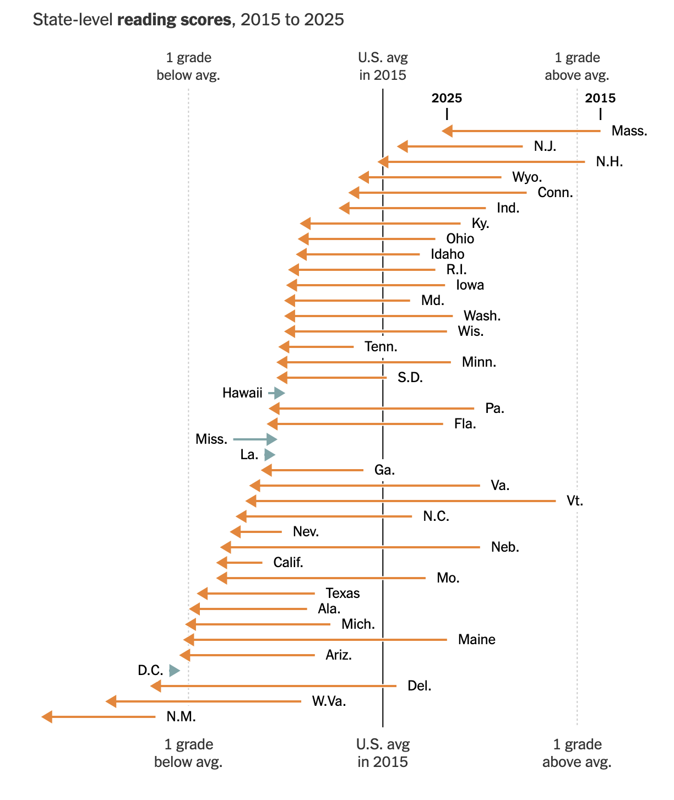
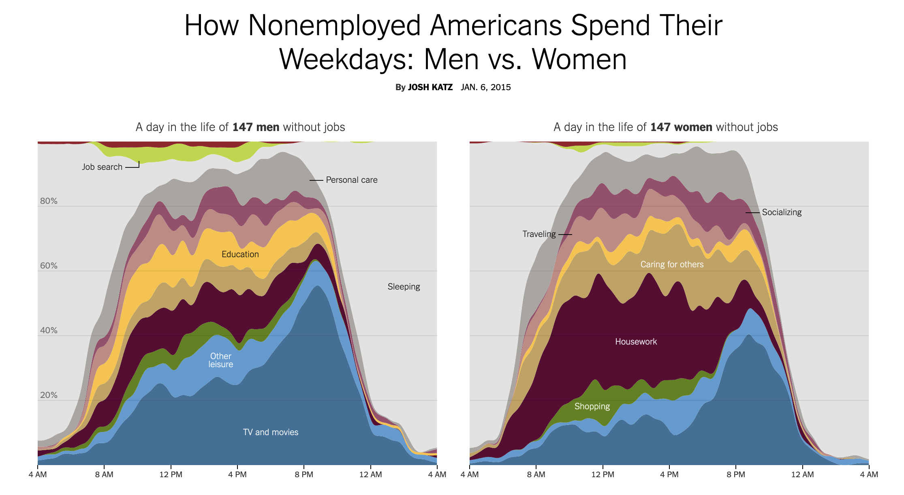

```{r setup, include = FALSE}
library(learnr)
library(tutorial.helpers)

library(tidyverse)
library(DBI)
library(duckdb)
library(dbplyr)

knitr::opts_chunk$set(echo = FALSE)
knitr::opts_chunk$set(out.width = '90%')
options(tutorial.exercise.timelimit = 600,
        tutorial.storage = "local")

con_seda <- dbConnect(duckdb::duckdb(),
                      dbdir = "../../extdata/r4ds-3/seda_2025.duckdb")

dbplyr_dist <- tbl(con_seda, "district_scores")

dist_2023 <- dbplyr_dist |>
  filter(year == 2023, !is.na(rla_score)) |>
  collect()

score_change <- dbplyr_dist |>
  filter(year %in% c(2015, 2023), !is.na(rla_score)) |>
  select(district_id, district_name, state, year, rla_score) |>
  collect() |>
  pivot_wider(names_from = year, values_from = rla_score, names_prefix = "rla_") |>
  filter(!is.na(rla_2015), !is.na(rla_2023)) |>
  mutate(rla_change = rla_2023 - rla_2015)


state_change <- tbl(con_seda, "state_scores") |>
  filter(year %in% c(2015, 2023), !is.na(rla_score)) |>
  select(stateabb, state_name, year, rla_score) |>
  collect() |>
  pivot_wider(names_from = year, values_from = rla_score, names_prefix = "rla_") |>
  filter(!is.na(rla_2015), !is.na(rla_2023)) |>
  mutate(rla_change = rla_2023 - rla_2015)

atus_path <- "../../extdata/r4ds-3/atus.duckdb"
if (file.exists(atus_path)) {
  con_atus     <- dbConnect(duckdb::duckdb(), dbdir = atus_path)
  dbplyr_act   <- tbl(con_atus, "activities")
  dbplyr_resp  <- tbl(con_atus, "respondents")
  dbplyr_codes <- tbl(con_atus, "activity_codes")

  keep_cats <- c(
    "Personal Care Activities",
    "Household Activities",
    "Caring for and Helping Household Members",
    "Socializing, Relaxing, and Leisure"
  )

  x <- dbplyr_act |>
    left_join(dbplyr_codes |> select(activity_code, major_name),
              by = "activity_code") |>
    inner_join(dbplyr_resp |>
                 filter(str_starts(employment_status, "Not"),
                        day_type == "Weekday") |>
                 select(tucaseid, sex),
               by = "tucaseid") |>
    group_by(tucaseid, sex, major_name) |>
    summarize(daily_min = sum(duration_min, na.rm = TRUE), .groups = "drop") |>
    group_by(sex, major_name) |>
    summarize(avg_daily_min = mean(daily_min, na.rm = TRUE), .groups = "drop") |>
    collect()

  y <- dbplyr_act |>
    mutate(hour = start_hhmm %/% 100L) |>
    filter(hour >= 6L, hour <= 23L) |>
    left_join(dbplyr_codes |> select(activity_code, major_name),
              by = "activity_code") |>
    filter(major_name %in% keep_cats) |>
    inner_join(dbplyr_resp |>
                 filter(str_starts(employment_status, "Not"),
                        day_type == "Weekday") |>
                 select(tucaseid, sex),
               by = "tucaseid") |>
    group_by(sex, hour, major_name) |>
    summarize(avg_min = mean(duration_min, na.rm = TRUE), .groups = "drop") |>
    collect()
} else {
  con_atus <- dbplyr_act <- dbplyr_resp <- dbplyr_codes <- NULL
  x <- y <- NULL
}
```

```{r info-section, child = system.file("child_documents/info_section.Rmd", package = "tutorial.helpers")}
```

## Introduction
###

This tutorial accompanies [Chapter 21: Databases](https://r4ds.hadley.nz/databases.html) from [*R for Data Science (2e)*](https://r4ds.hadley.nz/) by Hadley Wickham, Mine Çetinkaya-Rundel, and Garrett Grolemund.

You will use the  **[DBI](https://dbi.r-dbi.org/)**, **[duckdb](https://duckdb.org/docs/api/r)**, and **[dbplyr](https://dbplyr.tidyverse.org/)** packages to query two datasets recently featured in the *New York Times*: the Stanford Education Data Archive (SEDA) reading scores across 13,000 US school districts, and the American Time Use Survey (ATUS), which records how non-employed Americans spend their weekdays.

We recommend using an agentic coding tool such as [Gemini CLI](https://github.com/google-gemini/gemini-cli) or [Claude Code](https://claude.ai/code). Our instructions are written with these tools in mind. You may also use a chat-based AI, but you will need to copy/paste code and data context manually.

### Exercise 1

You should be connected to a repo named `r4ds-3`. If you are not, create one and connect to it.

Create a new file, `analysis.qmd`, with the title `"Analyzing School Districts and Americans' Time Use"` and your name as the author. In a bash Terminal, render it:

```
quarto render analysis.qmd
```

Open `analysis.html` with Live Server (right-click it in the Explorer → **Open with Live Server**) and keep the tab open. It refreshes on every render. Going forward, we will just tell you to "Render" when we want you to take these steps.

Create a `.gitignore` with `analysis_files` followed by a blank line. Commit and push.

In the R Terminal, run:

```
show_file(".gitignore")
```

If that fails, it is probably because you have not yet loaded `library(tutorial.helpers)` in the R Terminal.

CP/CR.

```{r introduction-1}
question_text(NULL,
    answer(NULL, correct = TRUE),
    allow_retry = TRUE,
    try_again_button = "Edit Answer",
    incorrect = NULL,
    rows = 3)
```

###

```
analysis_files
```

###

We will be working with databases in this tutorial. Two key differences between data frames and database tables: database tables are stored on disk and can be arbitrarily large, while data frames are stored in memory; database tables almost always have indexes for fast row lookups, while data frames do not.

### Exercise 2

In your QMD, put `library(tidyverse)`, `library(DBI)`, `library(duckdb)`, and `library(dbplyr)` in a new code chunk. Render.

Notice that the file does not look good because the code is visible and there are annoying messages. To take care of this, add `#| message: false` to remove all the messages in this code chunk. Also add the following to the YAML header to remove all code echoes from the HTML:

```
execute:
  echo: false
```

Render. In the R Terminal, run:

```
show_file("analysis.qmd", chunk = "Last")
```

CP/CR.

```{r introduction-2}
question_text(NULL,
    answer(NULL, correct = TRUE),
    allow_retry = TRUE,
    try_again_button = "Edit Answer",
    incorrect = NULL,
    rows = 6)
```

###

````
#| message: false
library(tidyverse)
library(DBI)
library(duckdb)
library(dbplyr)
````

###

Databases are run by database management systems (DBMS's). DuckDB is an in-process DBMS — it runs entirely within your R session, requires no separate server, and is ideal for analyzing large local datasets.

### Exercise 3

Create a data directory at the top level of the `r4ds-3` repo. In the bash Terminal, run `ls`.

CP/CR.

```{r introduction-3}
question_text(NULL,
	answer(NULL, correct = TRUE),
	allow_retry = TRUE,
	try_again_button = "Edit Answer",
	incorrect = NULL,
	rows = 5)
```

###

```
analysis.html  analysis.qmd  analysis_files  data
```

###

At the simplest level, a database is a collection of data frames — called tables. Like a data frame, a table is a set of named columns where every value in a column has the same type.


## US education
###

This section uses the [Stanford Education Data Archive (SEDA)](https://edopportunity.org/),
which converts each state's standardized test results into a common
grade-equivalent scale so that achievement can be compared across districts and
years. 

Here's [what the New York Times found](https://www.nytimes.com/2026/05/13/upshot/test-scores-school-districts-us.html)
from this same data in May of 2026.

```{r, echo = FALSE}

```

### Exercise 1

Download the DuckDB database `seda_2025.duckdb` from this URL and save it in your
`data/` directory:

```
https://github.com/PPBDS/misc.tutorials/raw/refs/heads/main/inst/extdata/r4ds-3/seda_2025.duckdb
```

Run `ls data` in the bash Terminal. 

CP/CR.

```{r us-education-1}
question_text(NULL,
    answer(NULL, correct = TRUE),
    allow_retry = TRUE,
    try_again_button = "Edit Answer",
    incorrect = NULL,
    rows = 3)
```

###

```
seda_2025.duckdb
```

###

A database holds multiple tables — typically dozens or hundreds in production systems.
`dbListTables()` is how you discover what a database contains before writing any queries.

### Exercise 2

Create a new working chunk in `analysis.qmd`. Add code to connect to the database file and run `dbListTables()` to see the available tables. Render.

In the R Terminal, run `show_file("analysis.qmd", chunk = "Last")`. CP/CR.

```{r us-education-2}
question_text(NULL,
    answer(NULL, correct = TRUE),
    allow_retry = TRUE,
    try_again_button = "Edit Answer",
    incorrect = NULL,
    rows = 5)
```

###

```{r us-education-2-test}
#| echo: true
dbListTables(con_seda)
```

###

The SEDA database has three tables: `district_scores` (one row per district per year), `district_demographics` (the same districts broken out by race, gender, and income), and `state_scores` (one row per state per year).

### Exercise 3

In the current working chunk, create a lazy reference to the `district_scores` table, assign it to `dbplyr_dist`, and print it. Render.

In the R Terminal, run `show_file("analysis.qmd", chunk = "Last")`. CP/CR.

```{r us-education-3}
question_text(NULL,
    answer(NULL, correct = TRUE),
    allow_retry = TRUE,
    try_again_button = "Edit Answer",
    incorrect = NULL,
    rows = 5)
```

###

```{r us-education-3-test}
#| echo: true
dbplyr_dist <- tbl(con_seda, "district_scores")
dbplyr_dist
```

###

The `rla_score` column is on the SEDA grade-equivalent scale: 0 is roughly the national average, and 1.0 is one full grade level above it. Negative values mean that district's students scored below the national average. `dbplyr_dist` is a lazy reference — it points to the table but pulls no data into R. Data only moves into memory when you call `collect()`.

### Exercise 4

Count the number of district-year observations per year in `dbplyr_dist`. Collect and arrange by year. Render.

In the R Terminal, run `show_file("analysis.qmd", chunk = "Last")`. CP/CR.
In the R Terminal, run `show_file("analysis.qmd", chunk = "Last")`. CP/CR.

```{r us-education-4}
question_text(NULL,
    answer(NULL, correct = TRUE),
    allow_retry = TRUE,
    try_again_button = "Edit Answer",
    incorrect = NULL,
    rows = 5)
```

###

```{r us-education-4-test}
#| echo: true
dbplyr_dist |>
  count(year) |>
  collect() |>
  arrange(year)
```

###

The dataset spans 2009–2019 and 2022–2025, with no observations for 2020 or 2021 — most states suspended standardized testing during the COVID-19 pandemic.

### Exercise 5

Compute the mean `rla_score` across all districts and years where `rla_score` is not missing. Collect the result. Render.

In the R Terminal, run `show_file("analysis.qmd", chunk = "Last")`. CP/CR.
In the R Terminal, run `show_file("analysis.qmd", chunk = "Last")`. CP/CR.

```{r us-education-5}
question_text(NULL,
    answer(NULL, correct = TRUE),
    allow_retry = TRUE,
    try_again_button = "Edit Answer",
    incorrect = NULL,
    rows = 5)
```

###

```{r us-education-5-test}
#| echo: true
dbplyr_dist |>
  filter(!is.na(rla_score)) |>
  summarize(mean_rla = mean(rla_score)) |>
  collect()
```

###

The overall mean sits slightly below zero — the typical US district has scored a fraction below the national benchmark when averaged across all years.

### Exercise 6

Compute the mean `rla_score` grouped by year, for districts with non-missing scores. Arrange by year. Collect and print. Render.

In the R Terminal, run `show_file("analysis.qmd", chunk = "Last")`. CP/CR.
In the R Terminal, run `show_file("analysis.qmd", chunk = "Last")`. CP/CR.

```{r us-education-6}
question_text(NULL,
    answer(NULL, correct = TRUE),
    allow_retry = TRUE,
    try_again_button = "Edit Answer",
    incorrect = NULL,
    rows = 7)
```

###

```{r us-education-6-test}
#| echo: true
dbplyr_dist |>
  filter(!is.na(rla_score)) |>
  group_by(year) |>
  summarize(mean_rla = mean(rla_score)) |>
  arrange(year) |>
  collect()
```

###

Scores are consistently above but near zero during 2012-2019. The 2022–2025 values are noticeably more negative, with scores decreasing each year. The COVID disruption lowered the national average and recovery has been slow.

### Exercise 7

For each district, compute the change in reading score from 2015 to 2023, where a positive value means improvement. Keep only districts with data in both years. Assign the result to `score_change` and print it. Render.

In the R Terminal, run `show_file("analysis.qmd", chunk = "Last")`. CP/CR.

```{r us-education-7}
question_text(NULL,
    answer(NULL, correct = TRUE),
    allow_retry = TRUE,
    try_again_button = "Edit Answer",
    incorrect = NULL,
    rows = 10)
```

###

```{r us-education-7-test}
#| echo: true
score_change <- dbplyr_dist |>
  filter(year %in% c(2015, 2023), !is.na(rla_score)) |>
  select(district_id, district_name, state, year, rla_score) |>
  collect() |>
  pivot_wider(names_from = year, values_from = rla_score, names_prefix = "rla_") |>
  filter(!is.na(rla_2015), !is.na(rla_2023)) |>
  mutate(rla_change = rla_2023 - rla_2015)
score_change
```

###

`score_change` has one row per district with its 2015 score, 2023 score, and their difference. The `collect()` here pulls a small derived table into memory after the database has done the heavy filtering and reshaping.

### Exercise 8

In the same working chunk, also compute `state_change` using the `state_scores` table — the same structure as `score_change` but aggregated at the state level. Replace the print of `score_change` with a print of `state_change`. Render.

In the R Terminal, run `show_file("analysis.qmd", chunk = "Last")`. CP/CR.

```{r us-education-8}
question_text(NULL,
    answer(NULL, correct = TRUE),
    allow_retry = TRUE,
    try_again_button = "Edit Answer",
    incorrect = NULL,
    rows = 5)
```

###

```{r us-education-8-test}
#| echo: true
score_change <- dbplyr_dist |>
  filter(year %in% c(2015, 2023), !is.na(rla_score)) |>
  select(district_id, district_name, state, year, rla_score) |>
  collect() |>
  pivot_wider(names_from = year, values_from = rla_score, names_prefix = "rla_") |>
  filter(!is.na(rla_2015), !is.na(rla_2023)) |>
  mutate(rla_change = rla_2023 - rla_2015)
state_change <- tbl(con_seda, "state_scores") |>
  filter(year %in% c(2015, 2023), !is.na(rla_score)) |>
  select(stateabb, state_name, year, rla_score) |>
  collect() |>
  pivot_wider(names_from = year, values_from = rla_score, names_prefix = "rla_") |>
  filter(!is.na(rla_2015), !is.na(rla_2023)) |>
  mutate(rla_change = rla_2023 - rla_2015)
state_change
```

###

`score_change` and `state_change` have the same structure at different levels of aggregation — district and state. You will use both in the remaining exercises.

### Exercise 9

Now finalize the current working chunk. Edit the chunk so it contains only: the database connection, the `dbplyr_dist` lazy reference, the `score_change` computation from Exercise 7, and the `state_change` computation from Exercise 8. Remove all exploratory code from Exercises 2–6.

Render.

In the R Terminal, run `show_file("analysis.qmd", chunk = "Last")`. CP/CR.

```{r us-education-9}
question_text(NULL,
    answer(NULL, correct = TRUE),
    allow_retry = TRUE,
    try_again_button = "Edit Answer",
    incorrect = NULL,
    rows = 10)
```

###

<pre><code>con_seda <- dbConnect(duckdb::duckdb(), dbdir = "data/seda_2025.duckdb")
dbplyr_dist <- tbl(con_seda, "district_scores")
score_change <- dbplyr_dist |>
  filter(year %in% c(2015, 2023), !is.na(rla_score)) |>
  select(district_id, district_name, state, year, rla_score) |>
  collect() |>
  pivot_wider(names_from = year, values_from = rla_score, names_prefix = "rla_") |>
  filter(!is.na(rla_2015), !is.na(rla_2023)) |>
  mutate(rla_change = rla_2023 - rla_2015)
state_change <- tbl(con_seda, "state_scores") |>
  filter(year %in% c(2015, 2023), !is.na(rla_score)) |>
  select(stateabb, state_name, year, rla_score) |>
  collect() |>
  pivot_wider(names_from = year, values_from = rla_score, names_prefix = "rla_") |>
  filter(!is.na(rla_2015), !is.na(rla_2023)) |>
  mutate(rla_change = rla_2023 - rla_2015)
</code></pre>

###

The chunk now holds only the objects worth keeping, nothing exploratory. Now we're ready to cache them for faster loading in our further work.

### Exercise 10

Add `#| cache: true` as the first option in the current working chunk. Render. In the bash Terminal, run `ls`. CP/CR.

```{r us-education-10}
question_text(NULL,
    answer(NULL, correct = TRUE),
    allow_retry = TRUE,
    try_again_button = "Edit Answer",
    incorrect = NULL,
    rows = 5)
```

###

<pre><code>$ ls
analysis.qmd  analysis_cache  analysis_files  analysis.html  data
</code></pre>

###

The first render with caching writes `analysis_cache/` to disk. Subsequent renders reload `score_change` and `state_change` from cache and skip the database joins entirely.

### Exercise 11

Add `analysis_cache` to your `.gitignore` on its own line. In the R Terminal, run `show_file(".gitignore")`. CP/CR.

```{r us-education-11}
question_text(NULL,
    answer(NULL, correct = TRUE),
    allow_retry = TRUE,
    try_again_button = "Edit Answer",
    incorrect = NULL,
    rows = 5)
```

###

<pre><code>analysis_files
analysis_cache
</code></pre>

###

Cache files are machine-specific and regenerated on every render — they should never go to GitHub.

### Exercise 12

Create a new working code chunk in `analysis.qmd`. From `dbplyr_dist`, filter to 2023 with non-missing `rla_score`, collect, and plot the distribution as a histogram. Add a vertical reference line at 0. Include the district count in the subtitle. Give the plot a title, subtitle, and caption. Render.

In the R Terminal, run:

```
show_file("analysis.qmd", chunk = "Last")
```

CP/CR.

```{r us-education-12}
question_text(NULL,
    answer(NULL, correct = TRUE),
    allow_retry = TRUE,
    try_again_button = "Edit Answer",
    incorrect = NULL,
    rows = 12)
```

###

```{r us-education-12-test}
#| echo: true
ggplot(dist_2023, aes(x = rla_score)) +
  geom_histogram(bins = 50, fill = "steelblue", color = "white") +
  geom_vline(xintercept = 0, linetype = "dashed", color = "darkred") +
  labs(
    title = "Distribution of District Reading Scores, 2023",
    subtitle = paste0("n = ", nrow(dist_2023), " districts; most cluster near average, left tail shows the lowest-scoring"),
    x = "Reading score (grade-equivalents above/below national average)",
    y = "Number of districts",
    caption = "Source: Reardon et al. (2026). Stanford Education Data Archive (SEDA 2025.1)."
  ) +
  theme_minimal()
```

###

The distribution is roughly bell-shaped with a longer left tail. Extreme values on the left (−2 or below) tend to be small, high-poverty districts whose students score roughly two grade levels below average.

### Exercise 13

Print the 10 districts with the largest reading score decline from `score_change`. Render.

In the R Terminal, run `show_file("analysis.qmd", chunk = "Last")`. CP/CR.

```{r us-education-13}
question_text(NULL,
    answer(NULL, correct = TRUE),
    allow_retry = TRUE,
    try_again_button = "Edit Answer",
    incorrect = NULL,
    rows = 5)
```

###

```{r us-education-13-test}
#| echo: true
score_change |>
  arrange(rla_change) |>
  head(10)
```

###

The largest declines are around −1 to −1.9 grade-equivalents over eight years. Scan the district names — extreme values in education data are often dominated by tiny or specialty districts with very small student populations, where a single cohort can swing the average dramatically.

### Exercise 14

Plot the distribution of `rla_change` from `score_change` as a histogram, coloring bars differently for positive and negative changes. Add a vertical reference line at 0. Include the district count in the subtitle. Give the plot a title, subtitle, and caption. Render.

In the R Terminal, run:

```
show_file("analysis.qmd", chunk = "Last")
```

CP/CR.

```{r us-education-14}
question_text(NULL,
    answer(NULL, correct = TRUE),
    allow_retry = TRUE,
    try_again_button = "Edit Answer",
    incorrect = NULL,
    rows = 12)
```

###

```{r us-education-14-test}
#| echo: true
ggplot(score_change, aes(x = rla_change)) +
  geom_histogram(bins = 60, aes(fill = rla_change < 0), show.legend = FALSE) +
  scale_fill_manual(values = c("TRUE" = "tomato", "FALSE" = "steelblue")) +
  geom_vline(xintercept = 0, linetype = "dashed", color = "black") +
  labs(
    title = "Change in District Reading Scores, 2015 to 2023",
    subtitle = paste0("n = ", nrow(score_change), " districts; about 82% scored lower in 2023 than in 2015"),
    x = "Score change (grade-equivalents)",
    y = "Number of districts",
    caption = "Source: Reardon et al. (2026). Stanford Education Data Archive (SEDA 2025.1)."
  ) +
  theme_minimal()
```

###

The distribution sits almost entirely to the left of 0 — about 82% of districts with data in both years show a negative change. This is the same finding the New York Times visualized in the arrow chart shown at the start of this section.

### Exercise 15

Print `state_change` sorted by `rla_change`. Render.

In the R Terminal, run `show_file("analysis.qmd", chunk = "Last")`. CP/CR.

```{r us-education-15}
question_text(NULL,
    answer(NULL, correct = TRUE),
    allow_retry = TRUE,
    try_again_button = "Edit Answer",
    incorrect = NULL,
    rows = 5)
```

###

```{r us-education-15-test}
#| echo: true
state_change |>
  arrange(rla_change)
```

###

With only 50 states, printing all rows makes sense. Most states declined, but two near the bottom of the ascending sort improved substantially.

### Exercise 16

Let's reconstruct the *New York Times* arrow chart from the beginning of this section. Recall:


```{r, echo = FALSE}

```

Build a state-level arrow chart of reading score changes from 2015 to 2023. Sort states by their 2023 reading score. For each state, draw an arrow from its 2015 score to its 2023 score, colored by direction of change. Add a gray dot at the 2015 starting point. Give the plot a title, subtitle, and caption with no y-axis label. Render.

In the R Terminal, run:

```
show_file("analysis.qmd", chunk = "Last")
```

CP/CR.

```{r us-education-16}
question_text(NULL,
    answer(NULL, correct = TRUE),
    allow_retry = TRUE,
    try_again_button = "Edit Answer",
    incorrect = NULL,
    rows = 15)
```

###

```{r us-education-16-test}
#| echo: true
#| fig.height: 10
state_change |>
  arrange(rla_2023) |>
  mutate(state_name = fct_inorder(state_name)) |>
  ggplot(aes(y = state_name)) +
  geom_segment(
    aes(x = rla_2015, xend = rla_2023, yend = state_name,
        color = rla_change > 0),
    arrow = arrow(length = unit(0.15, "cm"), type = "closed"),
    linewidth = 0.7,
    show.legend = FALSE
  ) +
  geom_point(aes(x = rla_2015), color = "gray60", size = 1) +
  scale_color_manual(values = c("TRUE" = "steelblue", "FALSE" = "tomato")) +
  labs(
    title = "State Reading Score Changes, 2015 to 2023",
    subtitle = "Arrows point left (decline) for most states; Mississippi and Louisiana stand out",
    x = "Reading score (grade-equivalents)",
    y = NULL,
    caption = "Source: Reardon et al. (2026). Stanford Education Data Archive (SEDA 2025.1)."
  ) +
  theme_minimal() +
  theme(axis.text.y = element_text(size = 9))
```

###

Mississippi and Louisiana's blue arrows stand out sharply against the field of red. Both passed aggressive phonics-based reading legislation in the years shown, and SEDA captures the result. This is the same chart the New York Times built from the SEDA data shown in the section introduction.

### Exercise 17

Commit `analysis.qmd` with the message `"Add SEDA district reading analysis"`. You may
use your AI agent, the VS Code Source Control panel, or the bash terminal.

```{r us-education-17}
question_text(NULL,
    answer(NULL, correct = TRUE),
    allow_retry = TRUE,
    try_again_button = "Edit Answer",
    incorrect = NULL,
    rows = 3)
```

###

About 82% of districts with comparable 2015 and 2023 data show a negative reading score change — the largest single-decade setback in modern US education measurement. The state arrow chart from Exercise 15 puts that aggregate finding into policy context: the exceptions are states that passed evidence-based literacy legislation.

## Time use
###

This section uses a DuckDB database built from the Bureau of Labor Statistics
[American Time Use Survey (ATUS)](https://www.bls.gov/tus/), which asks one
randomly selected person per household to record every activity they did across
a single 24-hour diary day. The survey has run each year since 2003 and now
covers more than 220,000 respondents.

###

In 2015, here's [what the New York Times found](https://www.nytimes.com/interactive/2015/01/06/upshot/how-nonemployed-americans-spend-their-weekdays-men-vs-women.html)
from this same survey.

```{r, echo = FALSE}

```

### Exercise 1

Download the DuckDB database `atus.duckdb` from this URL and save it in your `data/` directory:

```
https://github.com/PPBDS/misc.tutorials/raw/refs/heads/main/inst/extdata/r4ds-3/atus.duckdb
```

In the bash Terminal, run `ls data`.

CP/CR.

```{r time-use-1}
question_text(NULL,
    answer(NULL, correct = TRUE),
    allow_retry = TRUE,
    try_again_button = "Edit Answer",
    incorrect = NULL,
    rows = 3)
```

###

```
atus.duckdb  seda_2025.duckdb
```

###

The ATUS has been running annually since 2003 and now covers more than 220,000 respondents. The survey asks one randomly selected person per household to record every activity — housework, childcare, TV, travel — across a single 24-hour day.

### Exercise 2

Create a new working chunk in `analysis.qmd`. Add code to connect to `data/atus.duckdb` and run `dbListTables()` to see what tables it contains. Render.

In the R Terminal, run `show_file("analysis.qmd", chunk = "Last")`. CP/CR.

```{r time-use-2}
question_text(NULL,
    answer(NULL, correct = TRUE),
    allow_retry = TRUE,
    try_again_button = "Edit Answer",
    incorrect = NULL,
    rows = 5)
```

###

```{r time-use-2-test, eval = !is.null(con_atus)}
#| echo: true
dbListTables(con_atus)
```

###

Three tables: `activities` records every diary entry with start time and duration, `respondents` holds demographic data including sex, age, and employment status, and `activity_codes` maps numeric codes to human-readable category names.

### Exercise 3

In the current working chunk, replace the `dbListTables()` call with lazy references to all three tables: assign `dbplyr_act` for `activities`, `dbplyr_resp` for `respondents`, and `dbplyr_codes` for `activity_codes`. Print `dbplyr_act`. Render.

In the R Terminal, run `show_file("analysis.qmd", chunk = "Last")`. CP/CR.

```{r time-use-3}
question_text(NULL,
    answer(NULL, correct = TRUE),
    allow_retry = TRUE,
    try_again_button = "Edit Answer",
    incorrect = NULL,
    rows = 7)
```

###

```{r time-use-3-test, eval = !is.null(con_atus)}
#| echo: true
dbplyr_act   <- tbl(con_atus, "activities")
dbplyr_resp  <- tbl(con_atus, "respondents")
dbplyr_codes <- tbl(con_atus, "activity_codes")
dbplyr_act
```

###

The six-digit `activity_code` encodes a three-level hierarchy: for code 120303, `%/% 10000` gives major category 12 (Socializing, Relaxing, and Leisure), `%/% 100 %% 100` gives sub-category 03 (TV and Movies), and `%% 100` gives detail 03 (Watching TV). The `start_hhmm` column uses the same packed format: 1430 means 2:30 PM, and `start_hhmm %/% 100` gives the hour.

### Exercise 4

In the current working chunk, replace the print of `dbplyr_act` with `dbplyr_resp`. Render.

In the R Terminal, run `show_file("analysis.qmd", chunk = "Last")`. CP/CR.

```{r time-use-4}
question_text(NULL,
    answer(NULL, correct = TRUE),
    allow_retry = TRUE,
    try_again_button = "Edit Answer",
    incorrect = NULL,
    rows = 5)
```

###

```{r time-use-4-test, eval = !is.null(con_atus)}
#| echo: true
dbplyr_resp
```

###

Each row is one ATUS diarist. "Not in labor force" means the person was neither working nor job-hunting — retirees, full-time caregivers, and non-enrolled students all qualify. The `day_type` column separates weekday diaries from weekend/holiday ones, and `weight` adjusts each respondent to represent the full US population.

### Exercise 5

Collect the entire `dbplyr_codes` table and print it. Because `activity_codes` is only a few hundred rows, `collect()` is fine here — it is the large tables we defer. Render.

In the R Terminal, run `show_file("analysis.qmd", chunk = "Last")`. CP/CR.

```{r time-use-5}
question_text(NULL,
    answer(NULL, correct = TRUE),
    allow_retry = TRUE,
    try_again_button = "Edit Answer",
    incorrect = NULL,
    rows = 5)
```

###

```{r time-use-5-test, eval = !is.null(con_atus)}
#| echo: true
dbplyr_codes |>
  collect()
```

###

The 18 major categories run from Personal Care (sleeping, grooming) to Other Activities; this section focuses on categories 2 (Household Activities), 3 (Caring), and 12 (Leisure, which contains TV). `major_name` is the only human-readable label in this build — the full codebook lives in a separate BLS PDF.

### Exercise 6

For each table in the database, count the number of rows. Render.

In the R Terminal, run `show_file("analysis.qmd", chunk = "Last")`. CP/CR.

```{r time-use-6}
question_text(NULL,
    answer(NULL, correct = TRUE),
    allow_retry = TRUE,
    try_again_button = "Edit Answer",
    incorrect = NULL,
    rows = 5)
```

###

```{r time-use-6-test, eval = !is.null(con_atus)}
#| echo: true
list(
  activities     = dbplyr_act  |> summarize(n = n()) |> collect(),
  respondents    = dbplyr_resp |> summarize(n = n()) |> collect(),
  activity_codes = dbplyr_codes|> summarize(n = n()) |> collect()
)
```

###

Nearly five million activity records justify keeping the data in DuckDB — collecting the whole table at once would load a ~400 MB data frame into R. Aggregating before `collect()` means R only ever sees the summary.

### Exercise 7

Count activity records by major category: join `dbplyr_act` to `dbplyr_codes` to get `major_name`, count records per `major_name`, sort descending. Collect and print. Render.

In the R Terminal, run `show_file("analysis.qmd", chunk = "Last")`. CP/CR.

```{r time-use-7}
question_text(NULL,
    answer(NULL, correct = TRUE),
    allow_retry = TRUE,
    try_again_button = "Edit Answer",
    incorrect = NULL,
    rows = 7)
```

###

```{r time-use-7-test, eval = !is.null(con_atus)}
#| echo: true
dbplyr_act |>
  mutate(major_code = activity_code %/% 10000L) |>
  left_join(dbplyr_codes |> select(activity_code, major_name),
            by = "activity_code") |>
  count(major_name, sort = TRUE) |>
  collect()
```

###

Record count is not the same as time spent: Traveling ranks near the top because each trip is its own entry — a commute from home to the bus stop, the bus to work, and the walk to the office is three rows despite being one journey. Personal Care Activities includes sleeping, which is typically one uninterrupted record per night, so it ranks much lower here despite accounting for roughly a third of the day.

### Exercise 8

Compute the average `duration_min` per activity record by major category. Join `dbplyr_act` to `dbplyr_codes` to get `major_name`, average `duration_min` grouped by `major_name`, sort descending. Collect and print. Render.

In the R Terminal, run `show_file("analysis.qmd", chunk = "Last")`. CP/CR.

```{r time-use-8}
question_text(NULL,
    answer(NULL, correct = TRUE),
    allow_retry = TRUE,
    try_again_button = "Edit Answer",
    incorrect = NULL,
    rows = 7)
```

###

```{r time-use-8-test, eval = !is.null(con_atus)}
#| echo: true
dbplyr_act |>
  left_join(dbplyr_codes |> select(activity_code, major_name),
            by = "activity_code") |>
  group_by(major_name) |>
  summarize(avg_min = mean(duration_min, na.rm = TRUE)) |>
  arrange(desc(avg_min)) |>
  collect()
```

###

This table answers a different question than the one above: average duration per record rather than record count. Traveling, which generates many short entries, ranks near the bottom here; Personal Care Activities, which includes sleeping, rises toward the top because a typical night's sleep is one long uninterrupted record.

### Exercise 9

Count the number of respondents by `sex` and `employment_status`. Collect and print. Render.

In the R Terminal, run `show_file("analysis.qmd", chunk = "Last")`. CP/CR.

```{r time-use-9}
question_text(NULL,
    answer(NULL, correct = TRUE),
    allow_retry = TRUE,
    try_again_button = "Edit Answer",
    incorrect = NULL,
    rows = 7)
```

###

```{r time-use-9-test, eval = !is.null(con_atus)}
#| echo: true
dbplyr_resp |>
  count(sex, employment_status, sort = FALSE) |>
  arrange(sex, employment_status) |>
  collect()
```

###

The "Not in labor force" group — the focus of the NYT graphic — is smaller than the employed group but still a substantial sample. Women are overrepresented in it relative to men, consistent with decades of data on caregiving exit rates.

### Exercise 10

Count the number of respondents by `year`. Collect and print, arranged by year. Render.

In the R Terminal, run `show_file("analysis.qmd", chunk = "Last")`. CP/CR.

```{r time-use-10}
question_text(NULL,
    answer(NULL, correct = TRUE),
    allow_retry = TRUE,
    try_again_button = "Edit Answer",
    incorrect = NULL,
    rows = 7)
```

###

```{r time-use-10-test, eval = !is.null(con_atus)}
#| echo: true
dbplyr_resp |>
  count(year) |>
  arrange(year) |>
  collect()
```

###

Annual sample sizes are roughly stable — around 10,000–11,000 respondents per year. The 2020 and 2021 counts may be lower: the pandemic disrupted BLS field operations and produced atypical diary-day patterns that analysts often treat separately from the longer-run trend.

### Exercise 11

For weekday non-employed respondents, compute each person's total daily minutes in each major activity category. Join `dbplyr_act` to `dbplyr_codes` to get `major_name`, filter to non-employed weekday respondents via `dbplyr_resp`, and sum `duration_min` per person per category. Collect and print the result. Render (this first render is slow).

In the R Terminal, run `show_file("analysis.qmd", chunk = "Last")`. CP/CR.

```{r time-use-11}
question_text(NULL,
    answer(NULL, correct = TRUE),
    allow_retry = TRUE,
    try_again_button = "Edit Answer",
    incorrect = NULL,
    rows = 10)
```

###

```{r time-use-11-test, eval = !is.null(con_atus)}
#| echo: true
dbplyr_act |>
  left_join(dbplyr_codes |> select(activity_code, major_name),
            by = "activity_code") |>
  inner_join(dbplyr_resp |>
               filter(str_starts(employment_status, "Not"),
                      day_type == "Weekday") |>
               select(tucaseid, sex),
             by = "tucaseid") |>
  group_by(tucaseid, sex, major_name) |>
  summarize(daily_min = sum(duration_min, na.rm = TRUE), .groups = "drop") |>
  collect()
```

###

This first `summarize()` totals minutes per person per category. A respondent who watched TV in three stretches contributes one total, not three records.

### Exercise 12

Extend the pipeline: after the first `group_by()` + `summarize()`, add a second `group_by(sex, major_name)` + `summarize()` that averages the person-level totals across respondents. Assign the full result to `x`. Render.

In the R Terminal, run `show_file("analysis.qmd", chunk = "Last")`. CP/CR.

```{r time-use-12}
question_text(NULL,
    answer(NULL, correct = TRUE),
    allow_retry = TRUE,
    try_again_button = "Edit Answer",
    incorrect = NULL,
    rows = 12)
```

###

```{r time-use-12-test, eval = !is.null(con_atus)}
#| echo: true
x <- dbplyr_act |>
  left_join(dbplyr_codes |> select(activity_code, major_name),
            by = "activity_code") |>
  inner_join(dbplyr_resp |>
               filter(str_starts(employment_status, "Not"),
                      day_type == "Weekday") |>
               select(tucaseid, sex),
             by = "tucaseid") |>
  group_by(tucaseid, sex, major_name) |>
  summarize(daily_min = sum(duration_min, na.rm = TRUE), .groups = "drop") |>
  group_by(sex, major_name) |>
  summarize(avg_daily_min = mean(daily_min, na.rm = TRUE), .groups = "drop") |>
  collect()
x
```

###

If your result differs from ours, replace your code with the code above before moving on so your `x` matches for the rest of the section.

`x` now has one row per sex–category combination, with `avg_daily_min` representing the average weekday minutes a non-employed person of that sex spends in that category.

### Exercise 13

Build the time-of-day dataset for the final chart: for weekday non-employed respondents, compute the average minutes spent in activities starting in each hour of the day, broken out by `sex` and `major_name`. Keep only the four major categories: Personal Care, Household Activities, Caring for and Helping Household Members, and Socializing, Relaxing, and Leisure. Filter to hours 6 through 23. Collect and assign to `y`. Render. In the R Terminal, run `show_file("analysis.qmd", chunk = "Last")`. CP/CR.

```{r time-use-13}
question_text(NULL,
    answer(NULL, correct = TRUE),
    allow_retry = TRUE,
    try_again_button = "Edit Answer",
    incorrect = NULL,
    rows = 12)
```

###

```{r time-use-13-test, eval = !is.null(con_atus)}
#| echo: true
keep_cats <- c(
  "Personal Care Activities",
  "Household Activities",
  "Caring for and Helping Household Members",
  "Socializing, Relaxing, and Leisure"
)

dbplyr_act |>
  mutate(hour = start_hhmm %/% 100L) |>
  filter(hour >= 6L, hour <= 23L) |>
  left_join(dbplyr_codes |> select(activity_code, major_name),
            by = "activity_code") |>
  filter(major_name %in% keep_cats) |>
  inner_join(dbplyr_resp |>
               filter(str_starts(employment_status, "Not"),
                      day_type == "Weekday") |>
               select(tucaseid, sex),
             by = "tucaseid") |>
  group_by(sex, hour, major_name) |>
  summarize(avg_min = mean(duration_min, na.rm = TRUE), .groups = "drop") |>
  collect()
```

###

The `start_hhmm %/% 100` extraction is the same integer-division operation used to get departure hours from `dep_time` in the flights data — both are packed HHMM integers where the upper two digits hold the hour. Filtering to hours 6–23 avoids a before-dawn ambiguity in the ATUS diary format.

### Exercise 14

Create a new code chunk in `analysis.qmd`. Make a horizontal grouped bar chart from `x` showing average daily minutes by `major_name` on the y-axis and colored by `sex`. Reorder `major_name` by average minutes. Remove any rows where `major_name` is `NA`. Give the chart a title, subtitle, axis labels, and a data source caption. Render.

In the R Terminal, run:

```
show_file("analysis.qmd", chunk = "Last")
```

CP/CR.

```{r time-use-14}
question_text(NULL,
    answer(NULL, correct = TRUE),
    allow_retry = TRUE,
    try_again_button = "Edit Answer",
    incorrect = NULL,
    rows = 12)
```

###

```{r time-use-14-test, eval = !is.null(con_atus)}
#| echo: true
x |>
  filter(!is.na(major_name)) |>
  mutate(major_name = fct_reorder(major_name, avg_daily_min)) |>
  ggplot(aes(x = avg_daily_min, y = major_name, fill = sex)) +
  geom_col(position = "dodge") +
  labs(
    title = "How Non-Employed Americans Spend Weekdays",
    subtitle = "Women devote more time to housework and caregiving; men spend more on leisure",
    x = "Average minutes per weekday",
    y = NULL,
    fill = "Sex",
    caption = "Source: BLS American Time Use Survey (2003–2023). Weekday non-employed respondents."
  ) +
  theme_minimal()
```

###

The Household Activities and Caring bars tell the story the NYT graphic illustrates: women's bars extend roughly 50–60 minutes farther than men's. The Leisure bar goes the other way: men average substantially more minutes, driven largely by TV. Sociologist Arlie Hochschild named this the "second shift" in 1989: even when women join the paid labor force, they retain the bulk of household and caregiving work. The ATUS shows the pattern persists in the non-employed group — non-employed women redirect time not into leisure but into unpaid domestic work.

### Exercise 15

Recall the New York Times chart from the beginning of this section:

```{r, echo = FALSE}

```

Build a stacked area chart from `y`, with `hour` on the x-axis, `avg_min` on the y-axis, `major_name` as the fill, faceted by `sex`. Use `position = "stack"`. Give the chart a title, subtitle, and data source caption. Render.

In the R Terminal, run `show_file("analysis.qmd", chunk = "Last")`. CP/CR.

```{r time-use-15}
question_text(NULL,
    answer(NULL, correct = TRUE),
    allow_retry = TRUE,
    try_again_button = "Edit Answer",
    incorrect = NULL,
    rows = 12)
```

###

```{r time-use-15-test, eval = !is.null(con_atus)}
#| echo: true
ggplot(y, aes(x = hour, y = avg_min, fill = major_name)) +
  geom_area(position = "stack", alpha = 0.85) +
  facet_wrap(~ sex) +
  scale_x_continuous(
    breaks = c(6, 9, 12, 15, 18, 21),
    labels = c("6 AM", "9 AM", "Noon", "3 PM", "6 PM", "9 PM")
  ) +
  labs(
    title = "Time Use by Hour of Day, Non-Employed Americans (Weekdays)",
    subtitle = "Men's afternoon leisure peak is taller; women's morning housework block is wider",
    x = NULL,
    y = "Average minutes in activities starting this hour",
    fill = "Activity",
    caption = "Source: BLS American Time Use Survey (2003–2023). Weekday non-employed respondents."
  ) +
  theme_minimal() +
  theme(legend.position = "bottom")
```

###

Your chart uses start time as a proxy for current activity, which captures the broad shape but understates activities whose duration extends past the hour boundary. The NYT version shows the fraction of people in each activity at each minute — a more precise measure, but the same broad pattern: the Leisure band is taller for men all afternoon, and the Household band is wider and starts earlier for women.

### Exercise 16

Commit `analysis.qmd` with the message `"Add ATUS time-use analysis"`. You may use your
AI agent, the VS Code Source Control panel, or the bash terminal.

```{r time-use-16}
question_text(NULL,
    answer(NULL, correct = TRUE),
    allow_retry = TRUE,
    try_again_button = "Edit Answer",
    incorrect = NULL,
    rows = 3)
```

###

The ATUS microdata is updated each year and is freely available from the BLS. Researchers use it to study paid and unpaid labor, sleep inequality, caregiving, and how time use changes with economic conditions.

## Summary

###

This tutorial covered [Chapter 21: Databases](https://r4ds.hadley.nz/databases.html) from [*R for Data Science (2e)*](https://r4ds.hadley.nz/) by Hadley Wickham, Mine Çetinkaya-Rundel, and Garrett Grolemund.

You used **[DBI](https://dbi.r-dbi.org/)**, **[duckdb](https://duckdb.org/docs/api/r)**, and **[dbplyr](https://dbplyr.tidyverse.org/)** to query the Stanford Education Data Archive and the American Time Use Survey, and produced two final graphics featured in the *New York Times*.

### Exercise 1

<!-- AR: Need to add full, correct analysis.qmd as example answer. -->

Render. Check your Live Server tab — the resulting HTML page should be attractive, showing clean versions of your plots.

In the R Terminal, run:

```
show_file("analysis.qmd")
```

CP/CR.

```{r summary-1}
question_text(NULL,
	answer(NULL, correct = TRUE),
	allow_retry = TRUE,
	try_again_button = "Edit Answer",
	incorrect = NULL,
	rows = 30)
```

###

Database operations with **dbplyr** are translated to SQL and executed in the database, with the results only pulled into R when you collect them.

### Exercise 2

Publish your rendered QMD to GitHub Pages. In a bash Terminal, run:

````
quarto publish gh-pages analysis.qmd
````

If the bash Terminal is still running from rendering, stop it first using `Ctrl/Cmd + C`.

Copy/paste the resulting URL below.

```{r summary-2}
question_text(NULL,
	answer(NULL, correct = TRUE),
	allow_retry = TRUE,
	try_again_button = "Edit Answer",
	incorrect = NULL,
	rows = 1)
```

###

Every plot in your published page was created without ever loading the full SEDA or ATUS tables into R — the database did the heavy lifting and `collect()` pulled only the summary you needed. That pattern — aggregate first, collect small — is what makes the DuckDB workflow practical at scale.

### Exercise 3

Commit and push all your files. Copy/paste the URL to your GitHub repo.

```{r summary-3}
question_text(NULL,
	answer(NULL, correct = TRUE),
	allow_retry = TRUE,
	try_again_button = "Edit Answer",
	incorrect = NULL,
	rows = 3)
```

###

SEDA and ATUS are both maintained by their original institutions and updated annually. The DuckDB workflow you used here — query in the database, collect only what you need, cache the result — scales to datasets far larger than these without changing the code.

```{r download-answers, child = system.file("child_documents/download_answers.Rmd", package = "tutorial.helpers")}
```
