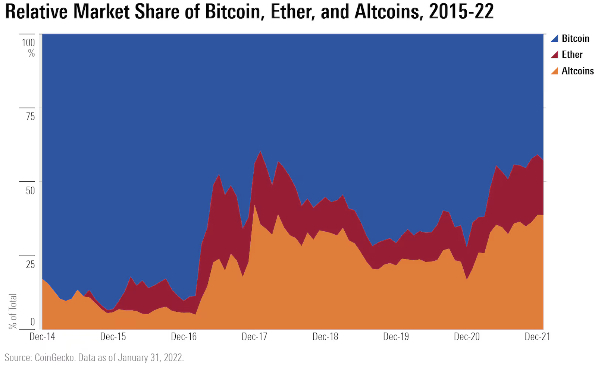
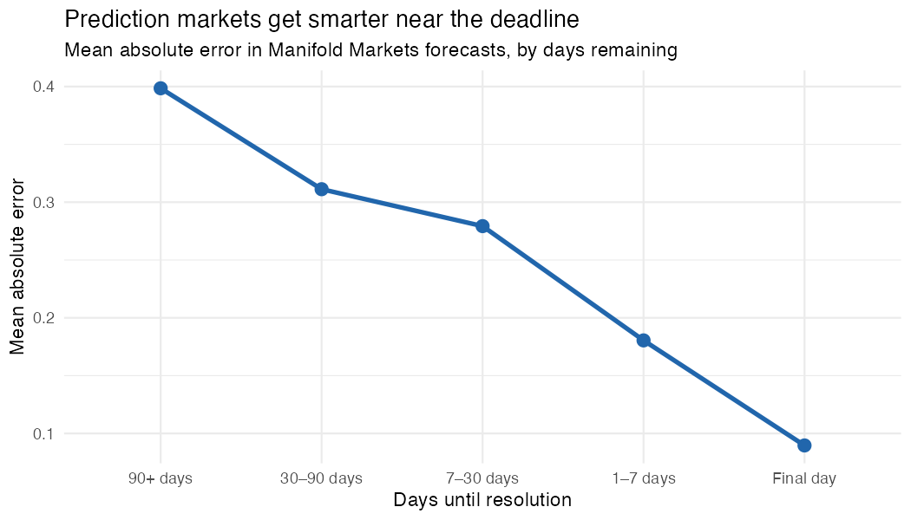

```{r setup, include = FALSE}
library(learnr)
library(tutorial.helpers)
library(tidyverse)
library(arrow)
library(viridis)

knitr::opts_chunk$set(echo = FALSE)
knitr::opts_chunk$set(out.width = '90%')
options(tutorial.exercise.timelimit = 600, tutorial.storage = "local")
```

```{r info-section, child = system.file("child_documents/info_section.Rmd", package = "tutorial.helpers")}
```

## Introduction
###

This tutorial covers key concepts from [Chapter 16: Factors](https://r4ds.hadley.nz/factors.html), [Chapter 17: Dates and Times](https://r4ds.hadley.nz/datetimes.html), [Chapter 18: Missing Values](https://r4ds.hadley.nz/missing-values.html), [Chapter 19: Joins](https://r4ds.hadley.nz/joins.html), and [Chapter 22: Arrow](https://r4ds.hadley.nz/arrow.html) from [*R for Data Science (2e)*](https://r4ds.hadley.nz/) by Hadley Wickham, Mine Çetinkaya-Rundel, and Garrett Grolemund.

The tutorial has two sections: one uses cryptocurrency price, metadata, and category files to analyze market composition, and the other uses prediction-market history, market metadata, and topic labels to study forecast accuracy near resolution. Both sections use **[arrow](https://arrow.apache.org/docs/r/)** to read parquet files efficiently.

We recommend using an agentic coding tool such as [Gemini CLI](https://github.com/google-gemini/gemini-cli) or [Claude Code](https://claude.ai/code). Our instructions are written with these tools in mind. You may also use a chat-based AI, but you will need to copy/paste code and data context manually.

### Exercise 1

You should be connected to a repo named `r4ds-4`. If you are not, create one and connect to it.

Create a new file, `analysis.qmd`, with the title `"Crypto Markets"` and your name as the author. In a bash Terminal, render it:

```
quarto render analysis.qmd
```

Open `analysis.html` with Live Server (right-click it in the Explorer → **Open with Live Server**) and keep the tab open. It refreshes on every render. Going forward, we will just tell you to "Render" when we want you to take these steps.

Create a `.gitignore` with `analysis_files` followed by a blank line. Commit and push.

In the R Terminal, run:

```
show_file(".gitignore")
```

If that fails, it is probably because you have not yet loaded `library(tutorial.helpers)` in the R Terminal.

CP/CR.

```{r introduction-1}
question_text(NULL,
    answer(NULL, correct = TRUE),
    allow_retry = TRUE,
    try_again_button = "Edit Answer",
    incorrect = NULL,
    rows = 3)
```

###

```
analysis_files
```

###

Parquet files store data by column, which is efficient for analysis because you often need only a few columns at a time. They also compress well, so the same dataset is usually much smaller as parquet than as CSV.

### Exercise 2

In your QMD, add a new code chunk with `#| message: false` to load all required libraries:

```
library(tidyverse)
library(arrow)
library(viridis)
```

Also add the following to the YAML header to remove all code echoes from the HTML:

```
execute:
  echo: false
```

Render. In the R Terminal, run:

```
show_file("analysis.qmd", chunk = "Last")
```

CP/CR.

```{r introduction-2}
question_text(NULL,
    answer(NULL, correct = TRUE),
    allow_retry = TRUE,
    try_again_button = "Edit Answer",
    incorrect = NULL,
    rows = 6)
```

###

<pre><code>#| message: false
library(tidyverse)
library(arrow)
library(viridis)
</code></pre>

###

Like CSV, parquet stores rectangular data, but it is a binary format designed for fast analysis rather than human reading. The package, **arrow**, lets you use familiar **dplyr**-style workflows with parquet files.

### Exercise 3

Create a `data` directory at the top level of the `r4ds-4` repo. In the bash Terminal, run:

```
ls
```

CP/CR.

```{r introduction-3}
question_text(NULL,
    answer(NULL, correct = TRUE),
    allow_retry = TRUE,
    try_again_button = "Edit Answer",
    incorrect = NULL,
    rows = 5)
```

###

```
analysis.html  analysis.qmd  analysis_files  data
```

###

Unlike CSV, which stores data row-by-row, parquet stores data **column-by-column**. When a query reads only the `close` column from a fifty-column file, parquet skips the rest of the columns entirely. Combined with built-in compression, a parquet file is typically 5–10× smaller than the equivalent CSV and loads proportionally faster.


## Crypto markets
###

Bitcoin launched the cryptocurrency market in 2009. By 2013, it represented over 90% of all crypto by market value. But by 2021, Bitcoin's share had fallen to around 40%. Where did the other 60% go?

```{r}

```

In this section you will join three parquet files — daily prices, coin metadata, and category labels — to build a chart, similar to the one above from [this *Morningstar* article](https://global.morningstar.com/en-gb/economy/5-charts-on-crypto-s-past-present-and-future), showing how each category's share of the total crypto market evolved. **[Arrow](https://arrow.apache.org/docs/r/)** makes it practical to inspect and filter those files before pulling data into memory.

### Exercise 1

Download the three crypto parquet files into your `data/` directory so the analysis can run locally and reproducibly. Use these stable URLs:

`https://github.com/PPBDS/misc.tutorials/raw/refs/heads/main/inst/extdata/r4ds-4/daily_prices.parquet`
`https://github.com/PPBDS/misc.tutorials/raw/refs/heads/main/inst/extdata/r4ds-4/coin_metadata.parquet`
`https://github.com/PPBDS/misc.tutorials/raw/refs/heads/main/inst/extdata/r4ds-4/categories.parquet`

In the bash Terminal, run:

```
ls data
```

CP/CR.

```{r crypto-markets-1}
question_text(NULL,
    answer(NULL, correct = TRUE),
    allow_retry = TRUE,
    try_again_button = "Edit Answer",
    incorrect = NULL,
    rows = 3)
```

###

```
categories.parquet    coin_metadata.parquet    daily_prices.parquet
```

###

The three crypto files are only a little over 2 MB, but they still hold 59,436 daily price records plus coin and category lookup tables. Parquet makes that possible by storing data column-by-column and compressing repeated values efficiently.

### Exercise 2

In a new code chunk, inspect the schema of `data/daily_prices.parquet` using Arrow without pulling the full file into memory. Don't assign the result — just print it. Render.

In the R Terminal, run:

```
show_file("analysis.qmd", chunk = "Last")
```

CP/CR.

```{r crypto-markets-2}
question_text(NULL,
    answer(NULL, correct = TRUE),
    allow_retry = TRUE,
    try_again_button = "Edit Answer",
    incorrect = NULL,
    rows = 3)
```

###

```{r crypto-markets-2-test}
#| echo: true
# your file path will differ. It will probably be "data/daily_prices.parquet" if you downloaded the file into your data/ directory
open_dataset("../../extdata/r4ds-4/daily_prices.parquet")
```

###

The result of `open_dataset()` is an `ArrowDataset`, not a tibble: Arrow is showing the schema without loading the rows. Notice that `date_raw` is stored as a string of text, which means you need to parse it before doing date-based analysis.

### Exercise 3

Take a random sample of 10 rows from `data/daily_prices.parquet` and collect the result into a tibble. Do not assign it — just print it so you can see a variety of coins and dates. Render.

In the R Terminal, run:

```
show_file("analysis.qmd", chunk = "Last")
```

CP/CR.

```{r crypto-markets-3}
question_text(NULL,
    answer(NULL, correct = TRUE),
    allow_retry = TRUE,
    try_again_button = "Edit Answer",
    incorrect = NULL,
    rows = 4)
```

###

```{r crypto-markets-3-test}
#| echo: true
open_dataset("../../extdata/r4ds-4/daily_prices.parquet") |>
  collect() |>
  slice_sample(n = 10)
```

###

Each row records one coin on one day — for example, an `eth` row might show `market_cap_usd` near $200 billion alongside the human-readable `market_cap_str` like `$200.5B`. The data is sorted by coin ID, so the top rows would all show the same coin; a random sample gives a mix of coins and time periods.

### Exercise 4

In a new code chunk, load `daily_prices.parquet` into R as an analysis table named `prices`. Print `prices` so you can inspect the daily price fields before joining. Render.

In the R Terminal, run:

```
show_file("analysis.qmd", chunk = "Last")
```

CP/CR.

```{r crypto-markets-4}
question_text(NULL,
    answer(NULL, correct = TRUE),
    allow_retry = TRUE,
    try_again_button = "Edit Answer",
    incorrect = NULL,
    rows = 5)
```

###

```{r crypto-markets-4-test}
#| echo: true
prices     <- open_dataset("../../extdata/r4ds-4/daily_prices.parquet") |>
  collect()
prices |>
  slice_sample(n = 10)
```

###

The `prices` table has one row per coin per day. Each row records that coin's `price_usd`, `market_cap_usd`, and `volume_usd` for that date. Market cap is the total value of all circulating units at that day's price.

### Exercise 5

Load `coin_metadata.parquet` as `metadata` in the same chunk, below the `prices` line. Print `metadata` instead of `prices` so you can inspect the coin-level fields before joining. Render.

In the R Terminal, run:

```
show_file("analysis.qmd", chunk = "Last")
```

CP/CR.

```{r crypto-markets-5}
question_text(NULL,
    answer(NULL, correct = TRUE),
    allow_retry = TRUE,
    try_again_button = "Edit Answer",
    incorrect = NULL,
    rows = 5)
```

###

```{r crypto-markets-5-test}
#| echo: true
prices     <- open_dataset("../../extdata/r4ds-4/daily_prices.parquet") |>
  collect()
metadata   <- open_dataset("../../extdata/r4ds-4/coin_metadata.parquet") |>
  collect()
metadata
```

###

The `metadata` table has one row per coin. `coin_id` links back to `prices`, and `category_id` links forward to `categories`. It also has a coin-level `description`.

### Exercise 6

Load `categories.parquet` as `categories` in the same chunk, below the `metadata` line. Print `categories` instead of `metadata` so you can inspect the category lookup table before joining. Render.

In the R Terminal, run:

```
show_file("analysis.qmd", chunk = "Last")
```

CP/CR.

```{r crypto-markets-6}
question_text(NULL,
    answer(NULL, correct = TRUE),
    allow_retry = TRUE,
    try_again_button = "Edit Answer",
    incorrect = NULL,
    rows = 5)
```

###

```{r crypto-markets-6-test}
#| echo: true
prices     <- open_dataset("../../extdata/r4ds-4/daily_prices.parquet") |>
  collect()
metadata   <- open_dataset("../../extdata/r4ds-4/coin_metadata.parquet") |>
  collect()
categories <- open_dataset("../../extdata/r4ds-4/categories.parquet") |>
  collect()
categories
```

###

The `categories` table has one row per crypto category, and `category_id` is the key that connects it to `metadata`. Its `category_name` is the readable label we want for plots, but its `description` duplicates a column name already used in `metadata`.

### Exercise 7

Let's get a feel for the raw price data. In a new chunk, filter `prices` to Bitcoin (`coin_id == "btc"`), convert `date_raw` to a proper date with `ymd()`, and draw a line chart of `price_usd` against date. Render.

In the R Terminal, run:

```
show_file("analysis.qmd", chunk = "Last")
```

CP/CR.

```{r crypto-markets-7}
question_text(NULL,
    answer(NULL, correct = TRUE),
    allow_retry = TRUE,
    try_again_button = "Edit Answer",
    incorrect = NULL,
    rows = 5)
```

###

```{r crypto-markets-7-test}
#| echo: true
prices |>
  filter(coin_id == "btc") |>
  mutate(date = ymd(date_raw)) |>
  ggplot(aes(x = date, y = price_usd)) +
  geom_line() +
  labs(x = NULL, y = "Price (USD)", title = "Bitcoin daily price") +
  theme_minimal()
```

###

Bitcoin has gone through two distinct cycles: a peak near $65K in late 2021, and a second peak near that level in 2024.

### Exercise 8

Now plot Bitcoin's market cap over time. Filter `prices` to `coin_id == "btc"`, convert `date_raw` with `ymd()`, and draw a line chart of `market_cap_usd` in trillions against date. Render.

In the R Terminal, run:

```
show_file("analysis.qmd", chunk = "Last")
```

CP/CR.

```{r crypto-markets-8}
question_text(NULL,
    answer(NULL, correct = TRUE),
    allow_retry = TRUE,
    try_again_button = "Edit Answer",
    incorrect = NULL,
    rows = 5)
```

###

```{r crypto-markets-8-test}
#| echo: true
prices |>
  filter(coin_id == "btc") |>
  mutate(date = ymd(date_raw)) |>
  ggplot(aes(x = date, y = market_cap_usd / 1e12)) +
  geom_line() +
  labs(x = NULL, y = "Market cap (USD trillions)", title = "Bitcoin market cap over time") +
  theme_minimal()
```

###

Price and market cap tell related but distinct stories. Price is what one unit costs; market cap is price × circulating supply. For Bitcoin, supply grows slowly and predictably, so the two charts look nearly identical in shape — but market cap is the right unit for comparing coins of different supply sizes, which is why it drives the analysis in later exercises.

### Exercise 9

Now compare market cap across all 22 coins. In a new chunk, draw a boxplot of `market_cap_usd` (in billions) per coin, ordered by median market cap, with a log-scale y-axis. Render.

In the R Terminal, run:

```
show_file("analysis.qmd", chunk = "Last")
```

CP/CR.

```{r crypto-markets-9}
question_text(NULL,
    answer(NULL, correct = TRUE),
    allow_retry = TRUE,
    try_again_button = "Edit Answer",
    incorrect = NULL,
    rows = 8)
```

###

```{r crypto-markets-9-test}
#| echo: true
prices |>
  ggplot(aes(x = fct_reorder(coin_id, market_cap_usd, .fun = median, na.rm = TRUE),
             y = market_cap_usd / 1e9)) +
  geom_boxplot() +
  coord_flip() +
  scale_y_log10() +
  labs(x = NULL, y = "Market cap (USD billions, log scale)",
       title = "Market cap distribution by coin") +
  theme_minimal()
```

###

Bitcoin and Ethereum sit well above the rest — roughly 10–100× larger than the next tier. The log scale is essential here: on a linear scale, every non-BTC coin collapses to near zero. The wide boxes for coins like SOL and BNB reflect high variability over time; narrow boxes reflect either stable coins (stablecoins) or coins that entered the dataset late.

### Exercise 10

In a new chunk, join `prices` to `metadata` by `coin_id` to attach coin-level details to each price row. Do not assign the result — just print it to see what columns were added. Render.

In the R Terminal, run:

```
show_file("analysis.qmd", chunk = "Last")
```

CP/CR.

```{r crypto-markets-10}
question_text(NULL,
    answer(NULL, correct = TRUE),
    allow_retry = TRUE,
    try_again_button = "Edit Answer",
    incorrect = NULL,
    rows = 3)
```

###

```{r crypto-markets-10-test}
#| echo: true
prices |>
  left_join(metadata, by = "coin_id")
```

###

A left join keeps all 59,436 rows from `prices` and adds matching columns from `metadata`. Row count is unchanged because each coin appears exactly once in `metadata`.

### Exercise 11

Before joining `categories`, check whether it shares any column names with the table you just built. Extend the pipe to handle any collision and add the join to `categories` by `category_id`. Still do not assign — just print the result. Render.

In the R Terminal, run:

```
show_file("analysis.qmd", chunk = "Last")
```

CP/CR.

```{r crypto-markets-11}
question_text(NULL,
    answer(NULL, correct = TRUE),
    allow_retry = TRUE,
    try_again_button = "Edit Answer",
    incorrect = NULL,
    rows = 5)
```

###

```{r crypto-markets-11-test}
#| echo: true
prices |>
  left_join(metadata, by = "coin_id") |>
  left_join(select(categories, -description), by = "category_id")
```

###

Both `metadata` and `categories` have a `description` column. Joining without resolving that collision creates `description.x` and `description.y` — confusing names that require extra cleanup. Dropping the unwanted column before joining is cleaner than renaming afterward.

### Exercise 12

The join pipeline is ready. Extend it to print the first 5 rows of the joined result. Render.

In the R Terminal, run:

```
show_file("analysis.qmd", chunk = "Last")
```

CP/CR.

```{r crypto-markets-12}
question_text(NULL,
    answer(NULL, correct = TRUE),
    allow_retry = TRUE,
    try_again_button = "Edit Answer",
    incorrect = NULL,
    rows = 5)
```

###

```{r crypto-markets-12-test}
#| echo: true
prices |>
  left_join(metadata, by = "coin_id") |>
  left_join(select(categories, -description), by = "category_id") |>
  head(5)
```

###

The `crypto` table has 59,436 rows and all the columns needed: daily prices from `prices`, coin metadata including `category_id`, and the readable `category_name` from `categories`.

### Exercise 13

`market_cap_str` contains human-readable values like `"$1.24T"`, `"$450.2B"`, `"$37.5M"`, and some `NA`. Extend the pipe with a `mutate()` that adds `market_cap_parsed`, converting those display strings to numeric dollar values using the `T`, `B`, `M`, and `K` suffixes. End with a sample of 5 rows showing `coin_id`, `market_cap_str`, and `market_cap_parsed` to verify the conversion. Render.

In the R Terminal, run:

```
show_file("analysis.qmd", chunk = "Last")
```

CP/CR.

```{r crypto-markets-13}
question_text(NULL,
    answer(NULL, correct = TRUE),
    allow_retry = TRUE,
    try_again_button = "Edit Answer",
    incorrect = NULL,
    rows = 10)
```

###

```{r crypto-markets-13-test}
#| echo: true
prices |>
  left_join(metadata, by = "coin_id") |>
  left_join(select(categories, -description), by = "category_id") |>
  mutate(
    market_cap_parsed = case_when(
      str_detect(market_cap_str, "T") ~ parse_number(market_cap_str) * 1e12,
      str_detect(market_cap_str, "B") ~ parse_number(market_cap_str) * 1e9,
      str_detect(market_cap_str, "M") ~ parse_number(market_cap_str) * 1e6,
      str_detect(market_cap_str, "K") ~ parse_number(market_cap_str) * 1e3,
      !is.na(market_cap_str) ~ parse_number(market_cap_str),
      TRUE ~ NA_real_
    )
  ) |>
  select(coin_id, market_cap_str, market_cap_parsed) |>
  drop_na(market_cap_str) |>
  slice_sample(n = 5)
```

###

Formatted financial strings need extra care because suffixes like `T`, `B`, and `M` change the scale of the number. Eyeball the sample: wherever you see a `T`-suffixed string, `market_cap_parsed` should be in the trillions; a `B`-suffix means billions.

### Exercise 14

The `date_raw` column is a character string, not a proper date, which means sorting, filtering by date range, and time-series plots all behave unexpectedly. Add a proper date field to the pipe so that subsequent steps can use it correctly. End with the range of dates as a sanity check. Render.

In the R Terminal, run:

```
show_file("analysis.qmd", chunk = "Last")
```

CP/CR.

```{r crypto-markets-14}
question_text(NULL,
    answer(NULL, correct = TRUE),
    allow_retry = TRUE,
    try_again_button = "Edit Answer",
    incorrect = NULL,
    rows = 4)
```

###

```{r crypto-markets-14-test}
#| echo: true
prices |>
  left_join(metadata, by = "coin_id") |>
  left_join(select(categories, -description), by = "category_id") |>
  mutate(
    market_cap_parsed = case_when(
      str_detect(market_cap_str, "T") ~ parse_number(market_cap_str) * 1e12,
      str_detect(market_cap_str, "B") ~ parse_number(market_cap_str) * 1e9,
      str_detect(market_cap_str, "M") ~ parse_number(market_cap_str) * 1e6,
      str_detect(market_cap_str, "K") ~ parse_number(market_cap_str) * 1e3,
      !is.na(market_cap_str) ~ parse_number(market_cap_str),
      TRUE ~ NA_real_
    ),
    date = ymd(date_raw)
  ) |>
  pull(date) |>
  range()
```

###

Parquet stored `date_raw` as an [ISO 8601](https://en.wikipedia.org/wiki/ISO_8601) string — the international standard format `"YYYY-MM-DD"` (e.g. `"2021-11-09"`). `ymd()` is named after that format and parses it into a proper R Date that can be sorted, subtracted, and used in time-series plots. The range confirms the dataset spans early 2018 through early 2026.

### Exercise 15

Add a description clean-up to the pipe's `mutate()`: replace embedded newlines (`\n`) with spaces. End with the distinct descriptions for `btc` and `eth` to confirm the fix. Render.

In the R Terminal, run:

```
show_file("analysis.qmd", chunk = "Last")
```

CP/CR.

```{r crypto-markets-15}
question_text(NULL,
    answer(NULL, correct = TRUE),
    allow_retry = TRUE,
    try_again_button = "Edit Answer",
    incorrect = NULL,
    rows = 6)
```

###

```{r crypto-markets-15-test}
#| echo: true
prices |>
  left_join(metadata, by = "coin_id") |>
  left_join(select(categories, -description), by = "category_id") |>
  mutate(
    market_cap_parsed = case_when(
      str_detect(market_cap_str, "T") ~ parse_number(market_cap_str) * 1e12,
      str_detect(market_cap_str, "B") ~ parse_number(market_cap_str) * 1e9,
      str_detect(market_cap_str, "M") ~ parse_number(market_cap_str) * 1e6,
      str_detect(market_cap_str, "K") ~ parse_number(market_cap_str) * 1e3,
      !is.na(market_cap_str) ~ parse_number(market_cap_str),
      TRUE ~ NA_real_
    ),
    date = ymd(date_raw),
    description = str_replace_all(description, "\\n", " ")
  ) |>
  filter(coin_id %in% c("btc", "eth")) |>
  distinct(coin_id, description)
```

###

Embedded newlines often come from scraped web text or copied document text. They can make text fields harder to search, compare, or export, so cleaning them early prevents confusing downstream behavior.

### Exercise 16

Add `era` to the pipe's `mutate()` using the year of `date`: `"Bitcoin Era"` (2016 and earlier), `"ICO/Ethereum Era"` (2017–2019), `"DeFi Summer"` (2020–2021), and `"Maturation Era"` (2022 onward). Make the labels ordered chronologically. End with a count of rows per era. Render.

In the R Terminal, run:

```
show_file("analysis.qmd", chunk = "Last")
```

CP/CR.

```{r crypto-markets-16}
question_text(NULL,
    answer(NULL, correct = TRUE),
    allow_retry = TRUE,
    try_again_button = "Edit Answer",
    incorrect = NULL,
    rows = 10)
```

###

```{r crypto-markets-16-test}
#| echo: true
prices |>
  left_join(metadata, by = "coin_id") |>
  left_join(select(categories, -description), by = "category_id") |>
  mutate(
    market_cap_parsed = case_when(
      str_detect(market_cap_str, "T") ~ parse_number(market_cap_str) * 1e12,
      str_detect(market_cap_str, "B") ~ parse_number(market_cap_str) * 1e9,
      str_detect(market_cap_str, "M") ~ parse_number(market_cap_str) * 1e6,
      str_detect(market_cap_str, "K") ~ parse_number(market_cap_str) * 1e3,
      !is.na(market_cap_str) ~ parse_number(market_cap_str),
      TRUE ~ NA_real_
    ),
    date = ymd(date_raw),
    description = str_replace_all(description, "\\n", " "),
    era = factor(
      case_when(
        year(date) <= 2016 ~ "Bitcoin Era",
        year(date) <= 2019 ~ "ICO/Ethereum Era",
        year(date) <= 2021 ~ "DeFi Summer",
        TRUE ~ "Maturation Era"
      ),
      levels = c("Bitcoin Era", "ICO/Ethereum Era", "DeFi Summer", "Maturation Era")
    )
  ) |>
  count(era)
```

###

The era labels are interpretive, not official; different analysts might choose different boundaries. Making them ordered is useful because plots and tables should show the eras in chronological order, not alphabetical order.

### Exercise 17

Finalize the data-preparation chunk. Add `crypto <-` to assign the pipe, and remove the `count(era)` verification at the end. Then merge the loads and the `crypto` pipe into one permanent chunk. Render.

In the R Terminal, run:

```
show_file("analysis.qmd", chunk = "Last")
```

CP/CR.

```{r crypto-markets-17}
question_text(NULL,
    answer(NULL, correct = TRUE),
    allow_retry = TRUE,
    try_again_button = "Edit Answer",
    incorrect = NULL,
    rows = 20)
```

```{r crypto-markets-17-test}
#| echo: true
prices     <- open_dataset("../../extdata/r4ds-4/daily_prices.parquet") |>
  collect()
metadata   <- open_dataset("../../extdata/r4ds-4/coin_metadata.parquet") |>
  collect()
categories <- open_dataset("../../extdata/r4ds-4/categories.parquet") |>
  collect()

crypto <- prices |>
  left_join(metadata, by = "coin_id") |>
  left_join(select(categories, -description), by = "category_id") |>
  mutate(
    market_cap_parsed = case_when(
      str_detect(market_cap_str, "T") ~ parse_number(market_cap_str) * 1e12,
      str_detect(market_cap_str, "B") ~ parse_number(market_cap_str) * 1e9,
      str_detect(market_cap_str, "M") ~ parse_number(market_cap_str) * 1e6,
      str_detect(market_cap_str, "K") ~ parse_number(market_cap_str) * 1e3,
      !is.na(market_cap_str) ~ parse_number(market_cap_str),
      TRUE ~ NA_real_
    ),
    date = ymd(date_raw),
    description = str_replace_all(description, "\\n", " "),
    era = factor(
      case_when(
        year(date) <= 2016 ~ "Bitcoin Era",
        year(date) <= 2019 ~ "ICO/Ethereum Era",
        year(date) <= 2021 ~ "DeFi Summer",
        TRUE ~ "Maturation Era"
      ),
      levels = c("Bitcoin Era", "ICO/Ethereum Era", "DeFi Summer", "Maturation Era")
    )
  )

crypto
```

###

The cleaned `crypto` table has one row per coin per day: 59,436 rows for 22 coins from 2018 through 2026. The table is now ready for grouped summaries and time-series plots.

### Exercise 18

Add `#| cache: true` to the chunk. Render. This first render with caching will take a moment; subsequent renders will load from disk.

In the bash Terminal, run:

```
ls
```

CP/CR.

```{r crypto-markets-18}
question_text(NULL,
    answer(NULL, correct = TRUE),
    allow_retry = TRUE,
    try_again_button = "Edit Answer",
    incorrect = NULL,
    rows = 5)
```

###

```
analysis.html  analysis.qmd  analysis_cache  analysis_files  data
```

###

Stablecoin market cap can rise even when token prices stay near $1. For coins like USDT, USDC, and DAI, market-cap growth mostly reflects more dollars flowing into stable crypto-denominated assets.

### Exercise 19

Add `analysis_cache` to your `.gitignore`. The Source Control change count in VS Code jumped when the cache directory appeared; adding it to `.gitignore` drops it back.

In the R Terminal, run:

```
show_file(".gitignore")
```

CP/CR.

```{r crypto-markets-19}
question_text(NULL,
    answer(NULL, correct = TRUE),
    allow_retry = TRUE,
    try_again_button = "Edit Answer",
    incorrect = NULL,
    rows = 4)
```

###

```
analysis_files
analysis_cache
```

###

Cache files are fully reproducible — anyone can regenerate them by rendering — so committing them just adds binary noise to the repo and can cause spurious merge conflicts if two contributors run the document on machines where the cache hashes differ.

### Exercise 20

Start a new analysis chunk that gives market context: calculate total crypto market cap for each day in `crypto` and plot it as a line chart, with market cap shown in trillions of dollars. Render.

In the R Terminal, run:

```
show_file("analysis.qmd", chunk = "Last")
```

CP/CR.

```{r crypto-markets-20}
question_text(NULL,
    answer(NULL, correct = TRUE),
    allow_retry = TRUE,
    try_again_button = "Edit Answer",
    incorrect = NULL,
    rows = 8)
```

###

```{r crypto-markets-20-test}
#| echo: true
crypto |>
  group_by(date) |>
  summarise(total_mcap = sum(market_cap_usd, na.rm = TRUE)) |>
  ggplot(aes(x = date, y = total_mcap / 1e12)) +
  geom_line() +
  labs(x = NULL, y = "Total market cap (trillions USD)",
       title = "Total crypto market capitalization, 2018–2026")
```

###

Total market cap gives context for category-share plots. Bitcoin's share can fall even while Bitcoin's dollar value rises, because the whole market is changing at the same time.

### Exercise 21

Break the market-cap trend out by category. For each day and category, aggregate the coin-level market caps, then plot category market cap over time as a multi-line chart. Render.

In the R Terminal, run:

```
show_file("analysis.qmd", chunk = "Last")
```

CP/CR.

```{r crypto-markets-21}
question_text(NULL,
    answer(NULL, correct = TRUE),
    allow_retry = TRUE,
    try_again_button = "Edit Answer",
    incorrect = NULL,
    rows = 8)
```

###

```{r crypto-markets-21-test}
#| echo: true
crypto |>
  group_by(date, category_name) |>
  summarise(cat_mcap = sum(market_cap_usd, na.rm = TRUE), .groups = "drop") |>
  ggplot(aes(x = date, y = cat_mcap / 1e12, color = category_name)) +
  geom_line() +
  labs(x = NULL, y = "Market cap (trillions USD)", color = NULL,
       title = "Crypto market cap by category, 2018–2026")
```

###

This chart is hard to read because Bitcoin dominates the absolute dollar scale. When one group dwarfs the others, plotting each group's share of the total often reveals patterns that the raw values hide.

### Exercise 22

Now build a stacked area chart of category market-cap shares over time. The total height of the chart should always sum to 100%, with each colored band representing one category's share. This format — familiar from the Morningstar chart shown at the start of the section — makes it easy to see how category dominance shifted over the period. Render.

In the R Terminal, run:

```
show_file("analysis.qmd", chunk = "Last")
```

CP/CR.

```{r crypto-markets-22}
question_text(NULL,
    answer(NULL, correct = TRUE),
    allow_retry = TRUE,
    try_again_button = "Edit Answer",
    incorrect = NULL,
    rows = 10)
```

###

```{r crypto-markets-22-test}
#| echo: true
crypto |>
  group_by(date, category_name) |>
  summarise(cat_mcap = sum(market_cap_usd, na.rm = TRUE), .groups = "drop") |>
  ggplot(aes(x = date, y = cat_mcap, fill = category_name)) +
  geom_area(position = "fill") +
  scale_y_continuous(labels = scales::percent) +
  labs(x = NULL, y = "Share of total market cap", fill = NULL,
       title = "Crypto market cap share by category, 2018–2026")
```

###

The stacked area chart reveals each category's relative dominance at every point in time. `position = "fill"` handles the normalisation automatically — ggplot divides each layer's value by the column total, so no manual percentage calculation is needed. Bitcoin's band narrows visibly over the period as smart-contract platforms and stablecoins claimed more of the market.

### Exercise 23

Polish the market-share chart for publication. Order the legend by typical category size, use a colorblind-safe palette, and add a clear title, subtitle, axis labels, and source caption. Render.

In the R Terminal, run:

```
show_file("analysis.qmd", chunk = "Last")
```

CP/CR.

```{r crypto-markets-23}
question_text(NULL,
    answer(NULL, correct = TRUE),
    allow_retry = TRUE,
    try_again_button = "Edit Answer",
    incorrect = NULL,
    rows = 14)
```

###

```{r crypto-markets-23-test}
#| echo: true
crypto |>
  group_by(date, category_name) |>
  summarise(cat_mcap = sum(market_cap_usd, na.rm = TRUE), .groups = "drop") |>
  mutate(category_name = fct_reorder(category_name, cat_mcap, .fun = median, .desc = TRUE)) |>
  ggplot(aes(x = date, y = cat_mcap, fill = category_name)) +
  geom_area(position = "fill") +
  scale_fill_viridis_d(option = "plasma", end = 0.9) +
  scale_y_continuous(labels = scales::percent) +
  labs(x = NULL, y = "Share of total market cap", fill = NULL,
       title = "Crypto market cap share by category, 2018–2026",
       subtitle = "Bitcoin's share fell as smart-contract platforms grew; the two tend to move in opposite directions",
       caption = "Source: Coin Metrics Community Data (CC BY 4.0)")
```

###

Ordering the legend by typical category size makes the plot easier to scan. Colorblind-safe palettes are a good default because charts are often viewed in many formats and by many audiences.

### Exercise 24

Add event context to the final chart by marking two major crypto shocks: the Luna/UST crash (approximately May 7–12, 2022) and the FTX collapse (approximately November 8–11, 2022). Render.

In the R Terminal, run:

```
show_file("analysis.qmd", chunk = "Last")
```

CP/CR.

```{r crypto-markets-24}
question_text(NULL,
    answer(NULL, correct = TRUE),
    allow_retry = TRUE,
    try_again_button = "Edit Answer",
    incorrect = NULL,
    rows = 12)
```

###

```{r crypto-markets-24-test}
#| echo: true
crypto |>
  group_by(date, category_name) |>
  summarise(cat_mcap = sum(market_cap_usd, na.rm = TRUE), .groups = "drop") |>
  mutate(category_name = fct_reorder(category_name, cat_mcap, .fun = median, .desc = TRUE)) |>
  ggplot(aes(x = date, y = cat_mcap, fill = category_name)) +
  geom_area(position = "fill") +
  scale_fill_viridis_d(option = "plasma", end = 0.9) +
  scale_y_continuous(labels = scales::percent) +
  annotate("rect", xmin = as.Date("2022-05-07"), xmax = as.Date("2022-05-12"),
           ymin = -Inf, ymax = Inf, alpha = 0.15, fill = "red") +
  annotate("rect", xmin = as.Date("2022-11-08"), xmax = as.Date("2022-11-11"),
           ymin = -Inf, ymax = Inf, alpha = 0.15, fill = "red") +
  labs(x = NULL, y = "Share of total market cap", fill = NULL,
       title = "Crypto market cap share by category, 2018–2026",
       subtitle = "Bitcoin's share fell as smart-contract platforms grew; the two tend to move in opposite directions",
       caption = "Source: Coin Metrics Community Data (CC BY 4.0)")
```

###

UST was an algorithmic stablecoin — it tried to hold a $1 value through a mechanism rather than dollar reserves. Its May 2022 collapse wiped roughly $40B from the market in days. The FTX exchange token FTT then fell from roughly $7.25B on November 7, 2022 to about $724M on November 9 when FTX halted withdrawals. The two events are distinct in kind (algorithmic failure vs. exchange insolvency) but both show how quickly confidence can evaporate in less-regulated markets.

### Exercise 25

Commit `analysis.qmd` with the message `"Crypto market composition analysis"` and push to GitHub. In the bash Terminal, run:

```
git log --oneline -3
```

CP/CR.

```{r crypto-markets-25}
question_text(NULL,
    answer(NULL, correct = TRUE),
    allow_retry = TRUE,
    try_again_button = "Edit Answer",
    incorrect = NULL,
    rows = 3)
```

###

```
abc1234 Crypto market composition analysis
...
```

###

The 22 coins in this dataset represent the major categories but exclude thousands of smaller coins, so the category shares are approximations rather than exact measures of the full crypto market. That tradeoff is intentional: the file stays small enough for a tutorial while preserving the dominant category-level patterns.

## Prediction markets
###

Picture a market where people bet on whether a future event will happen: a new
law passes, a company goes bankrupt, a model breaks a benchmark. Each trade
moves the price toward the bettor's belief, and the current price is the
crowd's best estimate of the probability of YES. As the resolution date
approaches and more information becomes available, does the crowd get smarter?

```{r}

```

In this section you will join four parquet files representing 800 resolved
markets and 43,694 daily probability snapshots to answer that question. Along
the way you will encounter a **many-to-many join** — a table relationship that
silently multiplies rows if you are not careful — and build an accuracy chart
that tracks whether prediction markets converge as the resolution date
approaches.

### Exercise 1

Get the two core prediction-market files, `markets.parquet` and `history.parquet`, into `data/` so the analysis can run locally. The stable URLs are:

`https://github.com/PPBDS/misc.tutorials/raw/refs/heads/main/inst/extdata/r4ds-4/markets.parquet`
`https://github.com/PPBDS/misc.tutorials/raw/refs/heads/main/inst/extdata/r4ds-4/history.parquet`

In a new code chunk, inspect `history.parquet` with Arrow before loading it into memory. Assign the lazy table to `history_lazy` and print it so you can see the schema and row count. Render.

In the R Terminal, run:

```
show_file("analysis.qmd", chunk = "Last")
```

CP/CR.

```{r prediction-markets-1}
question_text(NULL,
  answer(NULL, correct = TRUE),
  allow_retry = TRUE,
  try_again_button = "Edit Answer",
  incorrect = NULL,
  rows = 4)
```

###

```{r prediction-markets-1-test}
#| echo: true
history_lazy <- open_dataset("../../extdata/r4ds-4/history.parquet")
history_lazy
```

###

Manifold Markets is a play-money prediction platform launched in 2022. Users trade with Mana (Ṁ), a fictional currency, but the questions in this dataset are real events such as AI model releases, elections, and geopolitical outcomes.

### Exercise 2

Create the main forecasting table. Read the market-level file into memory, attach the market outcome to each daily probability snapshot, and add an `outcome_numeric` field coded as 1 for YES and 0 for NO so errors can be calculated later. Save the result as `joined` and print the row count as a join check. Render.

In the R Terminal, run:

```
show_file("analysis.qmd", chunk = "Last")
```

CP/CR.

```{r prediction-markets-2}
question_text(NULL,
  answer(NULL, correct = TRUE),
  allow_retry = TRUE,
  try_again_button = "Edit Answer",
  incorrect = NULL,
  rows = 8)
```

###

```{r prediction-markets-2-test}
#| echo: true
markets <- read_parquet("../../extdata/r4ds-4/markets.parquet")

joined <- history_lazy |>
  collect() |>
  left_join(markets, by = "market_id") |>
  mutate(outcome_numeric = if_else(outcome == "YES", 1, 0))

joined |> nrow()
```

The row count does not change. This is a one-to-many join: one market row
matched to many daily history rows. Each of the 43,694 history rows gets one
matching market row appended.

###

In this dataset, 63% of markets resolved NO and 37% resolved YES. That outcome balance matters because averages combine two different forecasting situations: markets where the event happened and markets where it did not.

### Exercise 3

Get the two topic-classification files, `groups.parquet` and `market_groups.parquet`, into `data/`. The stable URLs are:

`https://github.com/PPBDS/misc.tutorials/raw/refs/heads/main/inst/extdata/r4ds-4/groups.parquet`
`https://github.com/PPBDS/misc.tutorials/raw/refs/heads/main/inst/extdata/r4ds-4/market_groups.parquet`

Keep the code that defines `history_lazy`, `markets`, and `joined`. Add the topic-classification files to the chunk and inspect their structure: column types, a few example values, and row counts. Use that output to understand how these tables relate to `markets`. Render.

In the R Terminal, run:

```
show_file("analysis.qmd", chunk = "Last")
```

CP/CR.

```{r prediction-markets-3}
question_text(NULL,
  answer(NULL, correct = TRUE),
  allow_retry = TRUE,
  try_again_button = "Edit Answer",
  incorrect = NULL,
  rows = 6)
```

###

```{r prediction-markets-3-test}
#| echo: true
history_lazy <- open_dataset("../../extdata/r4ds-4/history.parquet")
markets <- read_parquet("../../extdata/r4ds-4/markets.parquet")

joined <- history_lazy |>
  collect() |>
  left_join(markets, by = "market_id") |>
  mutate(outcome_numeric = if_else(outcome == "YES", 1, 0))

groups        <- read_parquet("../../extdata/r4ds-4/groups.parquet")
market_groups <- read_parquet("../../extdata/r4ds-4/market_groups.parquet")

groups |> glimpse()
market_groups |> glimpse()
```

###

The `groups` file is a reference table: one row per topic group. The `market_groups` file is a junction table, which records a many-to-many relationship between markets and groups.

### Exercise 4

Stress-test the topic join before using it in analysis. Join `markets` to `market_groups` by `market_id`, print the resulting row count, and compare it to the original 800 market rows. Render.

In the R Terminal, run:

```
show_file("analysis.qmd", chunk = "Last")
```

CP/CR.

```{r prediction-markets-4}
question_text(NULL,
  answer(NULL, correct = TRUE),
  allow_retry = TRUE,
  try_again_button = "Edit Answer",
  incorrect = NULL,
  rows = 5)
```

###

```{r prediction-markets-4-test}
#| echo: true
markets |>
  left_join(market_groups, by = "market_id") |>
  nrow()
```

The row count increases because markets can appear once for each group they belong to. Any per-market summary computed after this join would over-count markets with more topic labels.

###

A many-to-many join occurs when matching keys repeat on both sides of a join. Here, the safer workflow is to finish market-level calculations before joining to topic labels.

### Exercise 5

Use the topic lookup table to profile the dataset. Attach `groups` to `market_groups`, then count how many group memberships fall into each `broad_category`, sorted from most to least common. Render.

In the R Terminal, run:

```
show_file("analysis.qmd", chunk = "Last")
```

CP/CR.

```{r prediction-markets-5}
question_text(NULL,
  answer(NULL, correct = TRUE),
  allow_retry = TRUE,
  try_again_button = "Edit Answer",
  incorrect = NULL,
  rows = 5)
```

###

```{r prediction-markets-5-test}
#| echo: true
market_groups |>
  left_join(groups, by = "group_slug") |>
  count(broad_category, sort = TRUE)
```

This join does not inflate the row count because each `group_slug` points to one row in the reference table. Joining from a many-row table to a one-row-per-key lookup table is usually safe.

###

The dataset skews toward economics, politics, AI, and geopolitics. That tells you what Manifold users were actively trading during this period, not necessarily what all prediction markets cover.

### Exercise 6

Measure how long these markets stay open. In `markets`, parse the creation and resolution timestamps, compute each market's duration in days, and summarize the median and maximum duration. Render.

In the R Terminal, run:

```
show_file("analysis.qmd", chunk = "Last")
```

CP/CR.

```{r prediction-markets-6}
question_text(NULL,
  answer(NULL, correct = TRUE),
  allow_retry = TRUE,
  try_again_button = "Edit Answer",
  incorrect = NULL,
  rows = 8)
```

###

```{r prediction-markets-6-test}
#| echo: true
markets |>
  mutate(
    created_at  = ymd_hms(created_at),
    resolved_at = ymd_hms(resolved_at),
    duration_days = as.numeric(as.Date(resolved_at) - as.Date(created_at))
  ) |>
  summarise(
    median_duration = median(duration_days),
    max_duration    = max(duration_days)
  )
```

###

Most markets in this sample resolve within weeks; the median duration is 36 days. Short market lifetimes mean the most informative probability changes often happen close to the resolution date.

### Exercise 7

Add the core accuracy metric to `joined`: the absolute distance between the crowd's probability and the true outcome. Summarize the mean and median prediction error so you know the baseline before considering time-to-resolution. Render.

In the R Terminal, run:

```
show_file("analysis.qmd", chunk = "Last")
```

CP/CR.

```{r prediction-markets-7}
question_text(NULL,
  answer(NULL, correct = TRUE),
  allow_retry = TRUE,
  try_again_button = "Edit Answer",
  incorrect = NULL,
  rows = 6)
```

###

```{r prediction-markets-7-test}
#| echo: true
joined <- joined |>
  mutate(prediction_error = abs(probability - outcome_numeric))

joined |>
  summarise(
    mean_error   = mean(prediction_error),
    median_error = median(prediction_error)
  )
```

###

`prediction_error` is measured in probability units from 0 to 1. An average error of 0.29 means the crowd was about 29 percentage points away from the true outcome before accounting for time to resolution.

### Exercise 8

Add a time-to-deadline field to `joined`: the number of calendar days remaining until resolution. As a data check, count how many snapshots are on the final day and how many are one to seven days from resolution. Render.

In the R Terminal, run:

```
show_file("analysis.qmd", chunk = "Last")
```

CP/CR.

```{r prediction-markets-8}
question_text(NULL,
  answer(NULL, correct = TRUE),
  allow_retry = TRUE,
  try_again_button = "Edit Answer",
  incorrect = NULL,
  rows = 6)
```

###

```{r prediction-markets-8-test}
#| echo: true
joined <- joined |>
  mutate(days_to_resolution = as.numeric(as.Date(ymd_hms(resolved_at)) - date))

joined |>
  summarise(
    final_day    = sum(days_to_resolution == 0),
    one_to_seven = sum(days_to_resolution >= 1 & days_to_resolution <= 7)
  )
```

There are exactly 800 final-day rows, one for each market. The 1-7 day window is larger because each market can contribute up to seven daily snapshots.

###

The 43,694 rows are not evenly distributed across time-to-resolution buckets. That matters because later summaries combine both accuracy and the amount of data available in each bucket.

### Exercise 9

Inspect one high-attention market before aggregating across all markets. Find the market with the most traders, isolate its probability history from `joined`, and plot probability over time with the final outcome encoded by line color. Render.

In the R Terminal, run:

```
show_file("analysis.qmd", chunk = "Last")
```

CP/CR.

```{r prediction-markets-9}
question_text(NULL,
  answer(NULL, correct = TRUE),
  allow_retry = TRUE,
  try_again_button = "Edit Answer",
  incorrect = NULL,
  rows = 8)
```

###

```{r prediction-markets-9-test}
#| echo: true
top_market <- markets |>
  slice_max(total_traders, n = 1) |>
  pull(market_id)

joined |>
  filter(market_id == top_market) |>
  ggplot(aes(x = date, y = probability, color = outcome)) +
  geom_line(linewidth = 1.2) +
  labs(
    title = "Probability trajectory for most-traded market",
    x     = "Date",
    y     = "Crowd-implied probability",
    color = "Outcome"
  ) +
  theme_minimal()
```

###

One market's probability path can be noisy, flat, or event-driven. The next summaries ask whether those individual paths become more accurate on average as resolution approaches.

### Exercise 10

Bucket each probability snapshot by how far it was from resolution. Add a `time_bucket` column to `joined` using five ordered categories:

- `days_to_resolution > 90`  → `"90+ days"`
- `days_to_resolution > 30`  → `"30–90 days"`
- `days_to_resolution > 7`   → `"7–30 days"`
- `days_to_resolution >= 1`  → `"1–7 days"`
- otherwise                  → `"Final day"`

Make the bucket order run from `"90+ days"` to `"Final day"`, then count rows per bucket to check the distribution of snapshots. Render.

In the R Terminal, run:

```
show_file("analysis.qmd", chunk = "Last")
```

CP/CR.

```{r prediction-markets-10}
question_text(NULL,
  answer(NULL, correct = TRUE),
  allow_retry = TRUE,
  try_again_button = "Edit Answer",
  incorrect = NULL,
  rows = 12)
```

###

```{r prediction-markets-10-test}
#| echo: true
joined <- joined |>
  mutate(
    time_bucket = factor(
      case_when(
        days_to_resolution >  90 ~ "90+ days",
        days_to_resolution >  30 ~ "30–90 days",
        days_to_resolution >   7 ~ "7–30 days",
        days_to_resolution >=  1 ~ "1–7 days",
        TRUE                      ~ "Final day"
      ),
      levels = c("90+ days", "30–90 days", "7–30 days", "1–7 days", "Final day"),
      ordered = TRUE
    )
  )

joined |> count(time_bucket)
```

###

The 7-30 day bucket has the most rows because many markets in this sample last only a few weeks. Keeping the buckets ordered is important because alphabetical order would scramble the time sequence in plots.

### Exercise 11

Compare the full error distribution across time horizons with a box plot of `prediction_error` by `time_bucket`. Render.

In the R Terminal, run:

```
show_file("analysis.qmd", chunk = "Last")
```

CP/CR.

```{r prediction-markets-11}
question_text(NULL,
  answer(NULL, correct = TRUE),
  allow_retry = TRUE,
  try_again_button = "Edit Answer",
  incorrect = NULL,
  rows = 8)
```

###

```{r prediction-markets-11-test}
#| echo: true
joined |>
  ggplot(aes(x = time_bucket, y = prediction_error)) +
  geom_boxplot() +
  labs(
    title = "Prediction error shrinks near the deadline",
    x     = "Days until resolution",
    y     = "Prediction error (|probability − outcome|)"
  ) +
  theme_minimal()
```

###

The boxes should move lower and get tighter as resolution approaches. That pattern means forecasts are not only more accurate near the deadline, but also less variable.

### Exercise 12

Create a compact accuracy summary for the final chart: compute mean prediction error for each `time_bucket`, include the number of snapshots in each bucket, save it as `accuracy`, and print it. Render.

In the R Terminal, run:

```
show_file("analysis.qmd", chunk = "Last")
```

CP/CR.

```{r prediction-markets-12}
question_text(NULL,
  answer(NULL, correct = TRUE),
  allow_retry = TRUE,
  try_again_button = "Edit Answer",
  incorrect = NULL,
  rows = 5)
```

###

```{r prediction-markets-12-test}
#| echo: true
accuracy <- joined |>
  group_by(time_bucket) |>
  summarise(mean_error = mean(prediction_error), n_rows = n(), .groups = "drop")

accuracy
```

###

The biggest drop in mean error happens between the final week and the final day. That does not necessarily mean traders suddenly become smarter; it often means more decisive information has arrived.

### Exercise 13

Use `accuracy` to make the final forecasting chart: a line-and-point plot of mean error by time bucket. Use the title `"Prediction markets get smarter near the deadline"` and the subtitle `"Mean absolute error in Manifold Markets forecasts, by days remaining"`. Render.

In the R Terminal, run:

```
show_file("analysis.qmd", chunk = "Last")
```

CP/CR.

```{r prediction-markets-13}
question_text(NULL,
  answer(NULL, correct = TRUE),
  allow_retry = TRUE,
  try_again_button = "Edit Answer",
  incorrect = NULL,
  rows = 10)
```

###

```{r prediction-markets-13-test}
#| echo: true
accuracy |>
  ggplot(aes(x = time_bucket, y = mean_error, group = 1)) +
  geom_line(linewidth = 1.2, color = "#2166ac") +
  geom_point(size = 3, color = "#2166ac") +
  labs(
    title    = "Prediction markets get smarter near the deadline",
    subtitle = "Mean absolute error in Manifold Markets forecasts, by days remaining",
    x        = "Days until resolution",
    y        = "Mean absolute error"
  ) +
  theme_minimal()
```

###

The line shows a clear convergence pattern: average prediction error falls as markets approach resolution. This is the main result of the section, and it is exactly the kind of pattern prediction-market analysts look for.

### Exercise 14

Stage `analysis.qmd`, commit with the message
`"Add prediction market accuracy analysis"`, and push to GitHub. In the
bash Terminal, run:

```
git log --oneline -3
```

CP/CR.

```{r prediction-markets-14}
question_text(NULL,
  answer(NULL, correct = TRUE),
  allow_retry = TRUE,
  try_again_button = "Edit Answer",
  incorrect = NULL,
  rows = 5)
```

###

```
abc1234 Add prediction market accuracy analysis
def5678 Crypto market composition analysis
...
```

###

Prediction-market accuracy improves here because resolution dates concentrate information. A final-day price is not magic; it is a market incorporating facts that often did not exist weeks earlier.

## Summary
###

This tutorial covered key concepts from [Chapter 16: Factors](https://r4ds.hadley.nz/factors.html), [Chapter 17: Dates and Times](https://r4ds.hadley.nz/datetimes.html), [Chapter 18: Missing Values](https://r4ds.hadley.nz/missing-values.html), [Chapter 19: Joins](https://r4ds.hadley.nz/joins.html), and [Chapter 22: Arrow](https://r4ds.hadley.nz/arrow.html) from [*R for Data Science (2e)*](https://r4ds.hadley.nz/) by Hadley Wickham, Mine Çetinkaya-Rundel, and Garrett Grolemund.

You loaded parquet files from disk with **[arrow](https://arrow.apache.org/docs/r/)**'s `open_dataset()`, inspected schemas without pulling data into memory, and joined multiple tables by shared keys. In two independent analyses — crypto market composition and prediction market accuracy — you cleaned, aggregated, and visualized the joined data using **tidyverse** tools, then published the results to GitHub Pages.

### Exercise 1

Render to ensure that everything works. Check your Live Server tab — the resulting HTML page should be attractive, showing a clean version of your final plots.

In the R Terminal, run:

```
show_file("analysis.qmd")
```

CP/CR.

```{r summary-1}
question_text(NULL,
    answer(NULL, correct = TRUE),
    allow_retry = TRUE,
    try_again_button = "Edit Answer",
    incorrect = NULL,
    rows = 30)
```

###

**arrow** only understands a subset of R expressions before data is collected into memory. A good workflow is to use Arrow for filtering and selecting, then do more flexible R work after collection.

### Exercise 2

Publish your rendered QMD to GitHub Pages. In a bash Terminal, run:

```
quarto publish gh-pages analysis.qmd
```

If the bash Terminal is still running from rendering, stop it first using `Ctrl/Cmd + C`.

Copy/paste the resulting URL below.

```{r summary-2}
question_text(NULL,
    answer(NULL, correct = TRUE),
    allow_retry = TRUE,
    try_again_button = "Edit Answer",
    incorrect = NULL,
    rows = 1)
```

###

Publishing the QMD creates a public URL anyone can use to view the rendered project.

### Exercise 3

Commit and push any remaining changes. Copy/paste the URL to your GitHub repo.

```{r summary-3}
question_text(NULL,
    answer(NULL, correct = TRUE),
    allow_retry = TRUE,
    try_again_button = "Edit Answer",
    incorrect = NULL,
    rows = 3)
```

###

GitHub repositories are where people can view the code you used to create your project.

```{r download-answers, child = system.file("child_documents/download_answers.Rmd", package = "tutorial.helpers")}
```
