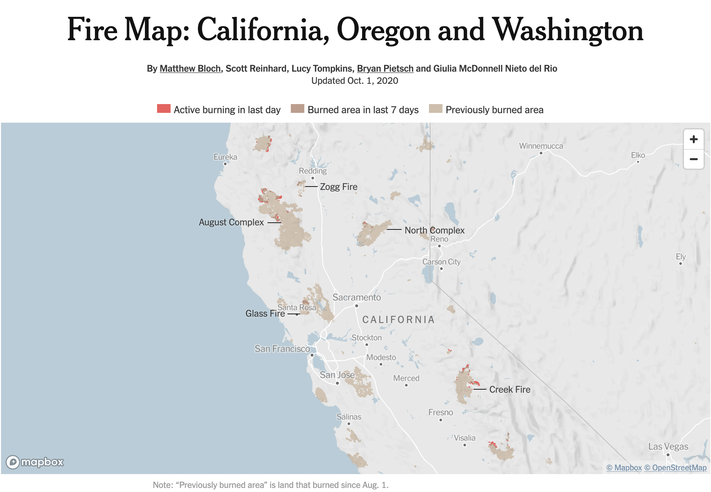

```{r setup, include = FALSE}
library(learnr)
library(tutorial.helpers)

library(tidyverse)
library(leaflet)
library(rvest)
library(httr2)
library(purrr)

knitr::opts_chunk$set(echo = FALSE)
knitr::opts_chunk$set(out.width = '90%')
options(tutorial.exercise.timelimit = 60,
        tutorial.storage = "local")

centroid_lon <- function(coords) {
  mean(map_dbl(coords[[1]], 1))
}
centroid_lat <- function(coords) {
  mean(map_dbl(coords[[1]], 2))
}

raw <- jsonlite::read_json("../../extdata/r4ds-5/wildfires.geojson")

fires <- raw |>
  pluck("features") |>
  tibble(features = _) |>
  unnest_wider(features) |>
  unnest_wider(properties) |>
  unnest_wider(geometry, names_sep = "_") |>
  select(incident, gis_acres, fire_year, agency, state, geometry_coordinates) |>
  mutate(
    gis_acres = as.numeric(gis_acres),
    fire_year = as.integer(fire_year)
  )

big_fires <- fires |>
  filter(gis_acres >= 100000) |>
  mutate(
    lon = map_dbl(geometry_coordinates, centroid_lon),
    lat = map_dbl(geometry_coordinates, centroid_lat)
  )

imdb_snapshots <- readRDS("../../extdata/r4ds-5/imdb_snapshots.rds")
```

```{r info-section, child = system.file("child_documents/info_section.Rmd", package = "tutorial.helpers")}
```

## Introduction
###

This section covers key concepts from [Chapter 23: Hierarchical Data](https://r4ds.hadley.nz/hierarchical), [Chapter 24: Web Scraping](https://r4ds.hadley.nz/webscraping), [Chapter 25: Functions](https://r4ds.hadley.nz/functions), and [Chapter 26: Iterations](https://r4ds.hadley.nz/iteration) from [*R for Data Science (2e)*](https://r4ds.hadley.nz/) by Hadley Wickham, Mine Çetinkaya-Rundel, and Garrett Grolemund.

Using core packages such as **[jsonlite](https://cran.r-project.org/package=jsonlite)**, **[rvest](https://rvest.tidyverse.org/)**, **[httr2](https://httr2.r-lib.org/)**, **[purrr](https://purrr.tidyverse.org/)**, and **[leaflet](https://rstudio.github.io/leaflet/)**, you will extract nested elements from lists, expand list-columns into tidy tables, scrape HTML tables from archived web pages, split compound text columns using regex, and render geographic polygon boundaries as interactive maps. The analysis uses two datasets: wildfire perimeter polygons from the National Interagency Fire Center and five archived snapshots of the IMDb Top 250 from the Wayback Machine.

We recommend using an agentic coding tool such as [Gemini CLI](https://github.com/google-gemini/gemini-cli) or [Claude Code](https://claude.ai/code). Our instructions are written with these tools in mind. You may also use a chat-based AI, but you will need to copy/paste code and data context manually.

### Exercise 1

You should be connected to a repo named `r4ds-5`. If you are not, create one and connect to it.

Create a new file, `analysis.qmd`, with the title `"Wildfires and Movies"` and your name as the author. In a bash Terminal, render it:

```
quarto render analysis.qmd
```

Open `analysis.html` with Live Server (right-click it in the Explorer → **Open with Live Server**) and keep the tab open. It refreshes on every render. Going forward, we will just tell you to "Render" when we want you to take these steps.

Create a `.gitignore` with `analysis_files` followed by a blank line. Commit and push.

In the R Terminal, run:

```
show_file(".gitignore")
```

If that fails, it is probably because you have not yet loaded `library(tutorial.helpers)` in the R Terminal.

CP/CR.

```{r introduction-1}
question_text(NULL,
	answer(NULL, correct = TRUE),
	allow_retry = TRUE,
	try_again_button = "Edit Answer",
	incorrect = NULL,
	rows = 3)
```

###

```
analysis_files
```

###

This tutorial works with two very different datasets. The first is a GeoJSON file from the National Interagency Fire Center containing 883 finalized wildfire perimeter polygons across the western US — each fire's surveyed boundary stored as nested geographic coordinates. The second is five archived snapshots of the IMDb Top 250, scraped from the Wayback Machine, covering 2015 to 2022. Together they are a study in the messiest storage formats data scientists encounter: deeply nested geographic JSON and scraped HTML tables.

### Exercise 2

In your QMD, add the following `library()` commands in a new code chunk with `#| message: false`:

```
library(tidyverse)
library(purrr)
library(leaflet)
library(rvest)
library(httr2)
library(jsonlite)
```

Also add the following to the YAML header to remove all code from the HTML output:

```
execute:
  echo: false
```

Render.

In the R Terminal, run:

```
show_file("analysis.qmd", chunk = "Last")
```

CP/CR.

```{r introduction-2}
question_text(NULL,
	answer(NULL, correct = TRUE),
	allow_retry = TRUE,
	try_again_button = "Edit Answer",
	incorrect = NULL,
	rows = 6)
```

###

<pre><code>#| message: false
library(tidyverse)
library(purrr)
library(leaflet)
library(rvest)
library(httr2)
library(jsonlite)
</code></pre>

###

JSON is a machine-readable format with six data types: null (like R's `NA`), string, number, boolean (lowercase `true`/`false`), array (like unnamed R lists), and object (like named R lists).

```json
{
  "place": "Northern California",
  "magnitude": 4.2,
  "felt": true,
  "tags": ["minor", "shallow"]
}
```

### Exercise 3

Create a data directory at the top level of the `r4ds-5` repo. In the bash Terminal, run `ls`.

CP/CR.

```{r introduction-3}
question_text(NULL,
	answer(NULL, correct = TRUE),
	allow_retry = TRUE,
	try_again_button = "Edit Answer",
	incorrect = NULL,
	rows = 5)
```

###

```
analysis.html  analysis.qmd  analysis_files  data
```

###

**jsonlite** is R's standard package for reading and writing JSON. It is used directly when loading local JSON files like the GeoJSON you are about to download, and indirectly inside packages like **httr2**, which calls jsonlite under the hood when parsing responses from web requests. JSON is a common format for transmitting data on the web, and jsonlite is how R reads it.

## Wildfire perimeters
###

The **[National Interagency Fire Center](https://data-nifc.opendata.arcgis.com/)** maintains a consolidated archive of finalized wildfire perimeter polygons — one polygon per fire, with metadata on name, acreage, year, state, and managing agency — published as a GeoJSON file. GeoJSON stores geometry as deeply nested lists that often must be reformatted before they can be analyzed. Using **jsonlite**, **[tidyr](https://tidyr.tidyverse.org/)**, **[purrr](https://purrr.tidyverse.org/)**, and **[leaflet](https://rstudio.github.io/leaflet/)**, you will flatten that nested structure, analyze 33 years of burned acreage, and render the actual fire boundaries as an interactive polygon map — the kind of visualization the [New York Times](https://www.nytimes.com/interactive/2020/us/fires-map-tracker.html) built during the 2020 fire season:

```{r}

```

###

We use `wildfires.geojson` from the **National Interagency Fire Center (NIFC) InterAgencyFirePerimeterHistory** dataset — a consolidated archive of finalized wildfire perimeter polygons contributed by the USFS, NPS, BLM, BIA, CAL FIRE, and state agencies. Each feature is a polygon representing one fire's surveyed boundary. The 2020 season was one of the most destructive on record — the August Complex burned over a million acres, becoming the largest fire in California history.

### Exercise 1

Download the file `wildfires.geojson` from this URL and save it in your `data/` directory:

```
https://github.com/PPBDS/misc.tutorials/raw/refs/heads/main/inst/extdata/r4ds-5/wildfires.geojson
```

In a bash Terminal, run:

```
ls data
```

CP/CR.

```{r wildfire-perimeters-1}
question_text(NULL,
	answer(NULL, correct = TRUE),
	allow_retry = TRUE,
	try_again_button = "Edit Answer",
	incorrect = NULL,
	rows = 3)
```

###

```
wildfires.geojson
```

###

GeoJSON is a standard format for geographic data built on JSON. Each feature pairs a **geometry** — the spatial shape, stored as nested coordinate arrays — with a **properties** object holding tabular metadata like name, acreage, and year. This two-part structure (shape + attributes) is common to all geographic formats; GeoJSON is simply the JSON encoding of it.

### Exercise 2

Read `data/wildfires.geojson` as JSON and assign it to `raw`. Print the number of features it contains.

Render.

In the R Terminal, run `show_file("analysis.qmd", chunk = "Last")`. CP/CR.

```{r wildfire-perimeters-2}
question_text(NULL,
	answer(NULL, correct = TRUE),
	allow_retry = TRUE,
	try_again_button = "Edit Answer",
	incorrect = NULL,
	rows = 5)
```

###

```{r wildfire-perimeters-2-test}
#| echo: true
# your path will be "data/wildfires.geojson"
raw <- jsonlite::read_json("../../extdata/r4ds-5/wildfires.geojson")
length(raw$features)
```

###

`raw` has two top-level keys: `type` (the string `"FeatureCollection"`, a GeoJSON standard marker) and `features` (the list of fires). `raw$features` holds 883 elements — one per fire — each a named list containing the fire's geographic shape and tabular metadata.

### Exercise 3

Extract the first fire from `raw` and show its component names.

Render.

In the R Terminal, run `show_file("analysis.qmd", chunk = "Last")`. CP/CR.

```{r wildfire-perimeters-3}
question_text(NULL,
	answer(NULL, correct = TRUE),
	allow_retry = TRUE,
	try_again_button = "Edit Answer",
	incorrect = NULL,
	rows = 6)
```

###

```{r wildfire-perimeters-3-test}
#| echo: true
pluck(raw, "features", 1) |> names()
```

###

Each fire in `raw$features` is a named list with four keys: `type` (a GeoJSON classification string), `id` (a unique fire identifier), `geometry` (the coordinate arrays that define the fire's boundary shape), and `properties` (tabular metadata like fire name, year, and acreage).

### Exercise 4

Navigate into the first fire's geometry to extract the first coordinate pair of its boundary.

Render.

In the R Terminal, run `show_file("analysis.qmd", chunk = "Last")`. CP/CR.

```{r wildfire-perimeters-4}
question_text(NULL,
	answer(NULL, correct = TRUE),
	allow_retry = TRUE,
	try_again_button = "Edit Answer",
	incorrect = NULL,
	rows = 6)
```

###

```{r wildfire-perimeters-4-test}
#| echo: true
pluck(raw, "features", 1, "geometry", "coordinates", 1, 1)
```

###

GeoJSON stores coordinates as `[longitude, latitude]` — longitude first, the opposite of the spoken convention. The path to one coordinate pair from the top level is five steps: `features → [[1]] → geometry → coordinates → [[1]] → [[1]]`. `pluck()` is designed for exactly this kind of path navigation through nested R lists.

### Exercise 5

Wrap `raw$features` in a tibble with a column called `features`. Print the result.

Render.

In the R Terminal, run `show_file("analysis.qmd", chunk = "Last")`. CP/CR.

```{r wildfire-perimeters-5}
question_text(NULL,
	answer(NULL, correct = TRUE),
	allow_retry = TRUE,
	try_again_button = "Edit Answer",
	incorrect = NULL,
	rows = 5)
```

###

```{r wildfire-perimeters-5-test}
#| echo: true
tibble(features = raw$features)
```

###

A list-column holds an R list as a column — each row contains one complete R list (here, one fire feature). This 883 × 1 tibble is the standard starting point for rectangling: wrap the list in a tibble, then progressively widen it.

### Exercise 6

Expand the `features` list-column so each named element becomes its own column.

Render.

In the R Terminal, run `show_file("analysis.qmd", chunk = "Last")`. CP/CR.

```{r wildfire-perimeters-6}
question_text(NULL,
	answer(NULL, correct = TRUE),
	allow_retry = TRUE,
	try_again_button = "Edit Answer",
	incorrect = NULL,
	rows = 5)
```

###

```{r wildfire-perimeters-6-test}
#| echo: true
tibble(features = raw$features) |>
  unnest_wider(features)
```

###

`unnest_wider()` takes each named element of the list-column and makes it a column. You now have `type`, `id`, `geometry`, and `properties` — three of them still list-columns. The rectangling is not done yet.

### Exercise 7

Continue the pipeline by expanding the `properties` list-column the same way.

Render.

In the R Terminal, run `show_file("analysis.qmd", chunk = "Last")`. CP/CR.

```{r wildfire-perimeters-7}
question_text(NULL,
	answer(NULL, correct = TRUE),
	allow_retry = TRUE,
	try_again_button = "Edit Answer",
	incorrect = NULL,
	rows = 5)
```

###

```{r wildfire-perimeters-7-test}
#| echo: true
tibble(features = raw$features) |>
  unnest_wider(features) |>
  unnest_wider(properties)
```

###

The eight attributes — `incident`, `gis_acres`, `fire_year`, `agency`, `state`, `map_method`, `date_current`, `unique_fire_id` — are now flat columns. The `geometry` column is still a list-column; it holds the polygon coordinates and needs separate handling.

### Exercise 8

Continue the pipeline by expanding the `geometry` list-column. Note that a `type` column already exists at the feature level, so the geometry expansion will create a naming conflict — make sure the geometry columns get distinct names. Then keep only the six columns you will need: `incident`, `gis_acres`, `fire_year`, `agency`, `state`, and `geometry_coordinates`. Coerce `gis_acres` to numeric and `fire_year` to integer. Assign the result to `fires`. Print `fires`.

Render.

In the R Terminal, run `show_file("analysis.qmd", chunk = "Last")`. CP/CR.

```{r wildfire-perimeters-8}
question_text(NULL,
	answer(NULL, correct = TRUE),
	allow_retry = TRUE,
	try_again_button = "Edit Answer",
	incorrect = NULL,
	rows = 10)
```

###

<pre><code>fires <- jsonlite::read_json("data/wildfires.geojson") |>
  pluck("features") |>
  tibble(features = _) |>
  unnest_wider(features) |>
  unnest_wider(properties) |>
  unnest_wider(geometry, names_sep = "_") |>
  select(incident, gis_acres, fire_year, agency, state, geometry_coordinates) |>
  mutate(
    gis_acres = as.numeric(gis_acres),
    fire_year = as.integer(fire_year)
  )
fires
</code></pre>

###

```{r wildfire-perimeters-8-test}
#| echo: true
fires
```

###

If your `fires` does not match ours, replace your code with the pipeline above before continuing.

`geometry` contains two fields: `type` (the string `"Polygon"`) and `coordinates`. But a `type` column already exists from the feature level — without `names_sep`, unnesting would silently overwrite it. `names_sep = "_"` prefixes the new columns as `geometry_type` and `geometry_coordinates`; then `select()` drops what you don't need.

### Exercise 9

That GeoJSON pipeline takes time on every render. Strip the `fires` print line from the chunk, leaving only the pipeline that defines `fires`.

In the R Terminal, run `show_file("analysis.qmd", chunk = "Last")`. CP/CR.

```{r wildfire-perimeters-9}
question_text(NULL,
	answer(NULL, correct = TRUE),
	allow_retry = TRUE,
	try_again_button = "Edit Answer",
	incorrect = NULL,
	rows = 10)
```

###

<pre><code>fires <- jsonlite::read_json("data/wildfires.geojson") |>
  pluck("features") |>
  tibble(features = _) |>
  unnest_wider(features) |>
  unnest_wider(properties) |>
  unnest_wider(geometry, names_sep = "_") |>
  select(incident, gis_acres, fire_year, agency, state, geometry_coordinates) |>
  mutate(
    gis_acres = as.numeric(gis_acres),
    fire_year = as.integer(fire_year)
  )
</code></pre>

###

A chunk that only assigns a variable produces no visible output in the rendered HTML — that is expected. The cleaned pipeline is also a readable map of the GeoJSON nesting: each step corresponds to one level of structure in the raw file — features, then properties, then geometry. The code shape and the data shape are the same.

### Exercise 10

Add `#| cache: true` as the first line inside the `fires` chunk. Render the QMD. Rendering with caching turned on creates an `analysis_cache/` directory next to your `analysis.qmd`. To confirm the directory is there, run `ls` in the **bash Terminal**. CP/CR.

```{r wildfire-perimeters-10}
question_text(NULL,
	answer(NULL, correct = TRUE),
	allow_retry = TRUE,
	try_again_button = "Edit Answer",
	incorrect = NULL,
	rows = 5)
```

###

<pre><code>$ ls
analysis.qmd  analysis_cache  analysis_files  analysis.html  data
</code></pre>

###

`analysis_cache/` now holds the saved `fires` tibble. Every subsequent render loads it from disk instead of re-reading and re-rectangling the 8.8 MB GeoJSON file.

### Exercise 11

The Source Control change count jumped because `analysis_cache/` now looks like untracked work to git. Cached files should never go to GitHub.

Add `analysis_cache` to your `.gitignore` on its own line. In the R Terminal, run `show_file(".gitignore")`. CP/CR.

```{r wildfire-perimeters-11}
question_text(NULL,
	answer(NULL, correct = TRUE),
	allow_retry = TRUE,
	try_again_button = "Edit Answer",
	incorrect = NULL,
	rows = 5)
```

###

<pre><code>analysis_files
analysis_cache
</code></pre>

###

The Source Control change count should drop back to where it was before the render.

### Exercise 12

In a new working chunk, search `fires` for any fire whose name contains the word "August". How many rows come back? Then show the ten largest fires by acreage.

Render.

In the R Terminal, run `show_file("analysis.qmd", chunk = "Last")`. CP/CR.

```{r wildfire-perimeters-12}
question_text(NULL,
	answer(NULL, correct = TRUE),
	allow_retry = TRUE,
	try_again_button = "Edit Answer",
	incorrect = NULL,
	rows = 8)
```

###

```{r wildfire-perimeters-12-test}
#| echo: true
fires |> filter(str_detect(incident, "August"))
fires |> arrange(desc(gis_acres)) |> head(10)
```

###

The search returns zero rows — "August Complex" is not in the dataset by that name. Yet the second-largest record is "DOE" (CA, 2020, ~590k acres). DOE is the Doe component of the August Complex, which together burned over a million acres and became the largest fire in California history. The dataset records component fires under their individual names, not the complex name the news reported.

### Exercise 13

Evolve the working chunk to plot the distribution of fire sizes in `fires`. Use a log scale on the x-axis.

Render.

In the R Terminal, run `show_file("analysis.qmd", chunk = "Last")`. CP/CR.

```{r wildfire-perimeters-13}
question_text(NULL,
	answer(NULL, correct = TRUE),
	allow_retry = TRUE,
	try_again_button = "Edit Answer",
	incorrect = NULL,
	rows = 8)
```

###

```{r wildfire-perimeters-13-test}
#| echo: true
fires |>
  ggplot(aes(x = gis_acres)) +
  geom_histogram(bins = 40) +
  scale_x_log10() +
  labs(
    title = "Distribution of Western US Wildfire Sizes",
    x = "Acres burned (log scale)",
    y = "Number of fires",
    caption = "Source: NIFC InterAgencyFirePerimeterHistory"
  )
```

###

Fire sizes follow an extreme right skew — most fires cluster near 10,000 acres (the dataset's lower bound), while a tiny fraction exceed 500,000. This power-law-like pattern is common in natural hazard systems: small fires are frequent, large fires are rare but account for the majority of total burned area. The log scale reveals the shape clearly — on a linear axis, the handful of very large fires would compress the rest of the distribution into a nearly invisible spike near zero.

### Exercise 14

Plot the total acres burned per year in `fires` as a line chart. Give it a proper title, axis labels, and caption.

Render.

In the R Terminal, run `show_file("analysis.qmd", chunk = "Last")`. CP/CR.

```{r wildfire-perimeters-14}
question_text(NULL,
	answer(NULL, correct = TRUE),
	allow_retry = TRUE,
	try_again_button = "Edit Answer",
	incorrect = NULL,
	rows = 10)
```

###

```{r wildfire-perimeters-14-test}
#| echo: true
fires |>
  group_by(fire_year) |>
  summarize(total_acres = sum(gis_acres, na.rm = TRUE), .groups = "drop") |>
  ggplot(aes(x = fire_year, y = total_acres)) +
  geom_line() +
  labs(
    title = "Western US Wildfire Burned Area, 1990–2023",
    subtitle = "Fires ≥ 10,000 acres",
    x = "Year",
    y = "Total acres burned",
    caption = "Source: NIFC InterAgencyFirePerimeterHistory"
  )
```

###

Annual burned acreage in fires ≥ 10,000 acres averaged around 1.5 million acres in the 1990s and closer to 4 million by the 2010s. 2020 and 2021 stand out — both exceeded 7 million acres. Climate, accumulated fuel from decades of fire suppression, and changing land use patterns all contribute to the trend.

### Exercise 15

Evolve the working chunk to show total acres burned by state in `fires`. Show only the top 10 states, ordered by total acreage.

Render.

In the R Terminal, run `show_file("analysis.qmd", chunk = "Last")`. CP/CR.

```{r wildfire-perimeters-15}
question_text(NULL,
	answer(NULL, correct = TRUE),
	allow_retry = TRUE,
	try_again_button = "Edit Answer",
	incorrect = NULL,
	rows = 10)
```

###

```{r wildfire-perimeters-15-test}
#| echo: true
fires |>
  group_by(state) |>
  summarize(total_acres = sum(gis_acres, na.rm = TRUE), .groups = "drop") |>
  slice_max(total_acres, n = 10) |>
  mutate(state = fct_reorder(state, total_acres)) |>
  ggplot(aes(x = total_acres, y = state)) +
  geom_col() +
  labs(
    title = "Total Acres Burned by State, 1990–2023",
    x = "Total acres burned",
    y = NULL,
    caption = "Source: NIFC InterAgencyFirePerimeterHistory"
  )
```

###

Idaho leads California in total burned acreage over the dataset's 33 years — a result that surprises most people. California dominates news coverage because its fires threaten populated areas and destroy structures; Idaho's large fires burn remote rangeland and forest. Total acreage and public impact are very different measures of a fire season's severity.

### Exercise 16

In a new working chunk, filter `fires` to fires of at least 100,000 acres and assign the result to `big_fires`. Print it.

Render.

In the R Terminal, run `show_file("analysis.qmd", chunk = "Last")`. CP/CR.

```{r wildfire-perimeters-16}
question_text(NULL,
	answer(NULL, correct = TRUE),
	allow_retry = TRUE,
	try_again_button = "Edit Answer",
	incorrect = NULL,
	rows = 6)
```

###

```{r wildfire-perimeters-16-test}
#| echo: true
big_fires <- fires |> filter(gis_acres >= 100000)
big_fires
```

###

100,000 acres is roughly the area of Los Angeles city. These are the fires that command national news coverage and multi-week suppression efforts. Idaho has more of them than the media count suggests — California dominates news coverage but not necessarily the acreage data.

### Exercise 17

Evolve the working chunk to plot the number of big fires by managing agency in `big_fires`.

Render.

In the R Terminal, run `show_file("analysis.qmd", chunk = "Last")`. CP/CR.

```{r wildfire-perimeters-17}
question_text(NULL,
	answer(NULL, correct = TRUE),
	allow_retry = TRUE,
	try_again_button = "Edit Answer",
	incorrect = NULL,
	rows = 8)
```

###

```{r wildfire-perimeters-17-test}
#| echo: true
big_fires |>
  count(agency) |>
  mutate(agency = fct_reorder(agency, n)) |>
  ggplot(aes(x = n, y = agency)) +
  geom_col() +
  labs(
    title = "Large Wildfires by Managing Agency",
    subtitle = "Fires ≥ 100,000 acres, 1990–2023",
    x = "Number of fires",
    y = NULL,
    caption = "Source: NIFC InterAgencyFirePerimeterHistory"
  )
```

###

The USFS (US Forest Service) manages more large-fire acreage than any other agency — it administers 193 million acres of national forest land in the West, more than BLM and NPS combined. State agencies like CAL FIRE appear separately; many fires cross jurisdictional boundaries and are recorded under the primary managing agency at the time of the incident.

### Exercise 18

Each fire's boundary is a polygon defined by many coordinate pairs. A simple way to reduce that to a single representative point is to compute the centroid — the mean longitude and mean latitude across all coordinate pairs in the polygon. Add `lon` and `lat` centroid columns to `big_fires`. Print `big_fires`.

Render.

In the R Terminal, run `show_file("analysis.qmd", chunk = "Last")`. CP/CR.

```{r wildfire-perimeters-18}
question_text(NULL,
	answer(NULL, correct = TRUE),
	allow_retry = TRUE,
	try_again_button = "Edit Answer",
	incorrect = NULL,
	rows = 14)
```

###

```{r wildfire-perimeters-18-test}
#| echo: true
centroid_lon <- function(coords) {
  mean(map_dbl(coords[[1]], 1))
}
centroid_lat <- function(coords) {
  mean(map_dbl(coords[[1]], 2))
}
big_fires <- big_fires |>
  mutate(
    lon = map_dbl(geometry_coordinates, centroid_lon),
    lat = map_dbl(geometry_coordinates, centroid_lat)
  )
big_fires
```

###

The first fire's boundary has hundreds of coordinate pairs. Wrapping `mean(map_dbl(coords[[1]], 1))` in a named function — rather than embedding it directly in `mutate()` — makes the pipeline readable and testable. The outer `map_dbl()` in `mutate()` applies the function once per row; the inner `map_dbl()` inside the function extracts one element from each coordinate pair within that row.

### Exercise 19

In a new working chunk, build a circle-marker leaflet map of `big_fires` where each circle's size reflects the fire's acreage. Zoom the map to the western US.

Render.

In the R Terminal, run `show_file("analysis.qmd", chunk = "Last")`. CP/CR.

```{r wildfire-perimeters-19}
question_text(NULL,
	answer(NULL, correct = TRUE),
	allow_retry = TRUE,
	try_again_button = "Edit Answer",
	incorrect = NULL,
	rows = 10)
```

###

```{r wildfire-perimeters-19-test}
#| echo: true
leaflet(big_fires) |>
  addTiles() |>
  setView(lng = -115, lat = 42, zoom = 4) |>
  addCircleMarkers(
    lng    = ~lon,
    lat    = ~lat,
    radius = ~sqrt(gis_acres) / 30,
    stroke = FALSE,
    fillOpacity = 0.6
  )
```

###

The circles cluster along the Sierra Nevada, Cascades, and northern Rockies — the fire-prone landscapes of the interior west. A handful of very large circles stand out immediately. Circle size communicates acreage, but not shape: a compact high-elevation burn and a wind-driven valley fire can look identical on this map.

### Exercise 20

Replace the circle-marker map with a polygon map that renders the actual fire boundary shapes from `data/wildfires.geojson`. Zoom the map to the western US.

Render.

In the R Terminal, run `show_file("analysis.qmd", chunk = "Last")`. CP/CR.

```{r wildfire-perimeters-20}
question_text(NULL,
	answer(NULL, correct = TRUE),
	allow_retry = TRUE,
	try_again_button = "Edit Answer",
	incorrect = NULL,
	rows = 10)
```

###

```{r wildfire-perimeters-20-test}
#| echo: true
leaflet() |>
  addTiles() |>
  setView(lng = -115, lat = 42, zoom = 4) |>
  addGeoJSON(
    readr::read_file("../../extdata/r4ds-5/wildfires.geojson"),
    weight      = 1,
    color       = "#cc4400",
    fillColor   = "#ff7733",
    fillOpacity = 0.35
  )
```

###

`addGeoJSON()` reads a GeoJSON string and draws every feature as its actual polygon shape — no coordinate extraction required. The Dixie Fire polygon fills an area you can compare directly to county lines and city boundaries on the basemap. The shape of a fire is information that acreage alone cannot convey: whether it was a compact burn or a sprawling, wind-driven perimeter that jumped multiple ridgelines.

### Exercise 21

Commit `analysis.qmd` with a message like "Add wildfire perimeters analysis" and push to GitHub. Copy/paste the URL to your GitHub repo.

```{r wildfire-perimeters-21}
question_text(NULL,
	answer(NULL, correct = TRUE),
	allow_retry = TRUE,
	try_again_button = "Edit Answer",
	incorrect = NULL,
	rows = 1)
```

###

The **NIFC** also publishes current-year fire perimeters in real time — the **IRWIN** (Integrated Reporting of Wildland-Fire Information) feed is updated multiple times per day during active fire season. The historical archive used here is finalized geometry; the live feed shows boundaries as incident command teams map them in the field.

## Movie rankings
###

This section covers web scraping using the 
**[httr2](https://httr2.r-lib.org/)** package. You will write a scraping function that
fetches one Wayback Machine snapshot of the IMDb Top 250, then apply it across five
snapshot years and combine the results. Key concepts
include selecting elements from an HTML page, reading an HTML table into a data frame,
pulling attributes off HTML nodes, parsing a messy text column with regex patterns.

We use five archived snapshots of the **IMDb Top 250** from January 2015, January 2017,
January 2019, January 2021, and February 2022 — accessed via the
[Wayback Machine](https://web.archive.org/), a digital archive that preserves frozen
copies of web pages as they appeared on specific dates. Combined, the five snapshots form
a 1,250-row panel dataset tracking how film rankings shifted over seven years.

Here is the plot you will build:

```{r movie-rankings-graphic}
imdb_snapshots |>
  filter(snap_year %in% c(2015, 2022)) |>
  select(snap_year, title, year, rank) |>
  pivot_wider(names_from = snap_year, values_from = rank, names_prefix = "rank_") |>
  drop_na() |>
  mutate(
    rank_change = rank_2015 - rank_2022,
    decade = paste0(floor(year / 10) * 10, "s")
  ) |>
  group_by(decade) |>
  summarise(avg_change = mean(rank_change), .groups = "drop") |>
  mutate(direction = if_else(avg_change > 0, "Rose", "Fell")) |>
  ggplot(aes(x = avg_change, y = decade, fill = direction)) +
  geom_col() +
  geom_vline(xintercept = 0, linewidth = 0.8) +
  scale_fill_manual(values = c("Rose" = "#2a9d8f", "Fell" = "#e76f51")) +
  labs(
    title = "Classic Films Slide, 1990s Films Hold Steady",
    subtitle = "Average rank change in the IMDb Top 250, 2015 to 2022",
    x = "Average rank change (positive = rose)",
    y = "Film release decade",
    fill = NULL,
    caption = "Films appearing in both 2015 and 2022 snapshots. n = 183 films."
  ) +
  theme_minimal() +
  theme(legend.position = "bottom")
```

### Exercise 1

Download the dataset into your `data/` directory. The file is `imdb_snapshots.rds` and
the URL is:

```
https://github.com/PPBDS/misc.tutorials/raw/refs/heads/main/inst/extdata/r4ds-5/imdb_snapshots.rds
```

In a bash Terminal, run:

```
ls data
```

CP/CR.

```{r movie-rankings-1}
question_text(NULL,
	answer(NULL, correct = TRUE),
	allow_retry = TRUE,
	try_again_button = "Edit Answer",
	incorrect = NULL,
	rows = 3)
```

###

```
imdb_snapshots.rds
wildfires.geojson
```

###

The Wayback Machine archives frozen copies of web pages as they appeared on a specific
date. The IMDb Top 250 used static HTML until around 2022, which makes these five
snapshots parseable with the same **rvest** pipeline. We pre-built this file so the
tutorial doesn't depend on live Wayback Machine responses during setup — the scraping
exercises come later.

### Exercise 2

Read `data/imdb_snapshots.rds` into a tibble called `imdb_snapshots`. Print it, then print a count of rows per snapshot year. Render.

In the R Terminal, run:

```
show_file("analysis.qmd", chunk = "Last")
```

CP/CR.

```{r movie-rankings-2}
question_text(NULL,
	answer(NULL, correct = TRUE),
	allow_retry = TRUE,
	try_again_button = "Edit Answer",
	incorrect = NULL,
	rows = 6)
```

###

```{r movie-rankings-2-test}
#| echo: true
readRDS("../../extdata/r4ds-5/imdb_snapshots.rds") |>
  count(snap_year)
```

###

1,250 rows = 5 snapshots × 250 films. The `snap_year` column is what converts a
single-year scrape into a **panel dataset** — each film can appear up to 5 times, once per
snapshot year, with its rank at that point in time. The `number` column is the raw vote
count, not the displayed rating. As of 2022, The Shawshank Redemption had 2.7 million
ratings — nearly twice as many as in 2015.

### Exercise 3

Using `imdb_snapshots`, show the ten films with the largest rank change between the 2015 and 2022 snapshots. Only include films that appear in both years.

Render.

In the R Terminal, run:

```
show_file("analysis.qmd", chunk = "Last")
```

CP/CR.

```{r movie-rankings-3}
question_text(NULL,
	answer(NULL, correct = TRUE),
	allow_retry = TRUE,
	try_again_button = "Edit Answer",
	incorrect = NULL,
	rows = 8)
```

###

```{r movie-rankings-3-test}
#| echo: true
imdb_snapshots |>
  filter(snap_year %in% c(2015, 2022)) |>
  select(snap_year, title, year, rank) |>
  pivot_wider(names_from = snap_year, values_from = rank, names_prefix = "rank_") |>
  drop_na() |>
  mutate(rank_change = rank_2015 - rank_2022) |>
  arrange(desc(abs(rank_change))) |>
  head(10)
```

###

"It Happened One Night" (Frank Capra, 1934) fell from rank 149 to 243 — a drop of 94
spots in seven years. The top 10 biggest movers are almost all fallers. The only substantial
riser in the full list is Jurassic Park (+70 spots). This asymmetry is a clue: something is
systematically pushing older films down, not just shuffling the deck at random.

### Exercise 4

Add a release decade column to the rank-change data, then show the average rank change by decade sorted chronologically.

Render.

In the R Terminal, run:

```
show_file("analysis.qmd", chunk = "Last")
```

CP/CR.

```{r movie-rankings-4}
question_text(NULL,
	answer(NULL, correct = TRUE),
	allow_retry = TRUE,
	try_again_button = "Edit Answer",
	incorrect = NULL,
	rows = 8)
```

###

```{r movie-rankings-4-test}
#| echo: true
imdb_snapshots |>
  filter(snap_year %in% c(2015, 2022)) |>
  select(snap_year, title, year, rank) |>
  pivot_wider(names_from = snap_year, values_from = rank, names_prefix = "rank_") |>
  drop_na() |>
  mutate(
    rank_change = rank_2015 - rank_2022,
    decade = paste0(floor(year / 10) * 10, "s")
  ) |>
  group_by(decade) |>
  summarise(avg_change = round(mean(rank_change), 1), n = n(), .groups = "drop") |>
  arrange(decade)
```

###

Films from the 1930s fell an average of 38 spots; films from the 1990s were essentially
flat (+0.4 average). This is the section's central pattern. The mechanism: 93 films entered
the Top 250 after 2015, and when new films push in, older ones get crowded out at the bottom.
The question is *which* films fall — and the answer is mostly older ones. The voter base that
rates films on IMDb skews toward people who grew up in the streaming era, and they are more
active on recently released films than on 1930s classics.

### Exercise 5

Filter `imdb_snapshots` to Christopher Nolan films and show their rank in each snapshot year
in a wide table with one row per film.

Nolan films to include: "The Dark Knight", "Inception", "Interstellar", "The Dark Knight
Rises", "Memento", "The Prestige", "Batman Begins".

Render.

In the R Terminal, run:

```
show_file("analysis.qmd", chunk = "Last")
```

CP/CR.

```{r movie-rankings-5}
question_text(NULL,
	answer(NULL, correct = TRUE),
	allow_retry = TRUE,
	try_again_button = "Edit Answer",
	incorrect = NULL,
	rows = 8)
```

###

```{r movie-rankings-5-test}
#| echo: true
nolan_titles <- c(
  "The Dark Knight", "Inception", "Interstellar",
  "The Dark Knight Rises", "Memento", "The Prestige", "Batman Begins"
)

imdb_snapshots |>
  filter(title %in% nolan_titles) |>
  select(title, snap_year, rank) |>
  pivot_wider(names_from = snap_year, values_from = rank) |>
  arrange(`2015`)
```

###

The Dark Knight has held exactly rank 4 in all five snapshots — the flattest trajectory on
the list. Inception has held 13–14. These films appear more stable than their release decade
(2000s–2010s average: −7 to −14) would predict. Films with organized, active online fanbases
accumulate votes faster than the internet-growth baseline, which keeps their weighted rating
competitive. This is sometimes called the "fanbase effect."

### Exercise 6

Filter `imdb_snapshots` to Interstellar and make a bar chart showing its rank in each snapshot year.

Render.

In the R Terminal, run:

```
show_file("analysis.qmd", chunk = "Last")
```

CP/CR.

```{r movie-rankings-6}
question_text(NULL,
	answer(NULL, correct = TRUE),
	allow_retry = TRUE,
	try_again_button = "Edit Answer",
	incorrect = NULL,
	rows = 8)
```

###

```{r movie-rankings-6-test}
#| echo: true
imdb_snapshots |>
  filter(title == "Interstellar") |>
  ggplot(aes(x = snap_year, y = rank)) +
  geom_col() +
  scale_y_reverse() +
  labs(title = "Interstellar's IMDb Rank Over Time",
       x = "Snapshot year", y = "Rank")
```

###

Interstellar's rank fell steadily from 16 in 2015 to 28 in 2022 — a drop of 12 spots over
seven years. IMDb's rating is a **Bayesian weighted average**: it pulls each film's raw
average toward the global mean, weighted by its vote count. As the internet user base grows,
every film's vote count grows roughly proportionally. What matters for rank is whether a
film's vote growth *outpaces* the list average — and Interstellar's didn't.

### Exercise 7

Count how many of the five snapshots each film appears in, then show the distribution of
that count.

Render.

In the R Terminal, run:

```
show_file("analysis.qmd", chunk = "Last")
```

CP/CR.

```{r movie-rankings-7}
question_text(NULL,
	answer(NULL, correct = TRUE),
	allow_retry = TRUE,
	try_again_button = "Edit Answer",
	incorrect = NULL,
	rows = 6)
```

###

```{r movie-rankings-7-test}
#| echo: true
imdb_snapshots |>
  count(title, name = "n_snapshots") |>
  count(n_snapshots, name = "n_films")
```

###

71 films appear in only one snapshot — some entered the list after 2015 and climbed fast
(Whiplash entered in 2017 at rank 43; Come and See entered in 2017 at rank 89), others left
the list and never returned. 183 films appear in all five snapshots — those are the films
stable enough to have held a Top 250 position through all seven years. The Top 250 is a
living ranking, not a fixed historical record.

### Exercise 8

Now build the scraping pipeline that assembled this data. In a new chunk, write a function that takes one Wayback Machine URL and a snapshot year and returns a 250-row tibble with columns `snap_year`, `rank`, `title`, `year`, `rating`, and `number`. Apply it across the five snapshot URLs and years, and row-bind the results into a single tibble assigned to `imdb_snapshots`.

Render.

In the R Terminal, run:

```
show_file("analysis.qmd", chunk = "Last")
```

CP/CR.

```{r movie-rankings-8}
question_text(NULL,
	answer(NULL, correct = TRUE),
	allow_retry = TRUE,
	try_again_button = "Edit Answer",
	incorrect = NULL,
	rows = 20)
```

###

<pre><code>snap_urls <- c(
  "https://web.archive.org/web/20150101/https://www.imdb.com/chart/top/",
  "https://web.archive.org/web/20170101/https://www.imdb.com/chart/top/",
  "https://web.archive.org/web/20190101/https://www.imdb.com/chart/top/",
  "https://web.archive.org/web/20210101/https://www.imdb.com/chart/top/",
  "https://web.archive.org/web/20220201012049/https://www.imdb.com/chart/top/"
)
snap_years <- c(2015, 2017, 2019, 2021, 2022)

scrape_snapshot <- function(url, snap_year) {
  page      <- request(url) |>
    req_timeout(60) |>
    req_retry(max_tries = 3, backoff = ~ 5) |>
    req_perform() |>
    resp_body_html()
  tbl       <- page |> html_element("table") |> html_table()
  attr_vals <- page |> html_elements("td strong") |> html_attr("title")
  tbl |>
    select(rank_title_year = `Rank & Title`, rating = `IMDb Rating`) |>
    mutate(
      rank_title_year = str_replace_all(rank_title_year, "\n +", " "),
      number = str_extract(attr_vals, "(?<=based on )[0-9,]+") |>
        parse_number()
    ) |>
    separate_wider_regex(
      rank_title_year,
      patterns = c(rank = "\\d+", "\\. ", title = ".+", " +\\(", year = "\\d+", "\\)")
    ) |>
    mutate(rank = as.integer(rank), year = as.integer(year), snap_year = snap_year) |>
    select(snap_year, rank, title, year, rating, number)
}

imdb_snapshots <- map2(snap_urls, snap_years, scrape_snapshot) |>
  list_rbind()
</code></pre>

###

```{r movie-rankings-8-test}
#| echo: true
imdb_snapshots
```

###

**purrr**'s two-input iteration applies a two-argument function to each corresponding pair
drawn from two parallel vectors — here, each (URL, year) pair produces one 250-row tibble.
The resulting list of five tibbles stacks into a single 1,250-row tibble preserving row
order. This is the Chapter 26 pattern: one function captures the scraping logic once;
iteration applies it across all five snapshots.

The vote-count attribute string differs between snapshot years — pre-2022 snapshots say
"9.2 based on 1,354,030 votes"; 2022 says "8.7 based on 2,432,861 user ratings".
**stringr**'s lookbehind regex pattern `(?<=based on )` matches both formats without
branching, so the function works identically across all five years.

Not every Wayback Machine URL returns a usable page — some timestamps resolve to a redirect
or a partial archive. The **Wayback Machine CDX API** at
`web.archive.org/cdx/search/cdx?url=https://www.imdb.com/chart/top/&output=text` lets you
query the full list of available captures for a URL, so you can choose timestamps with
confirmed high-fidelity archives. The five dates used here were selected that way.

### Exercise 9

In a new code chunk, make a rough bar chart of the average rank change from 2015 to 2022 by release decade, with decade on the y-axis and average rank change on the x-axis. Do not assign the plot to a variable.

Render.

In the R Terminal, run:

```
show_file("analysis.qmd", chunk = "Last")
```

CP/CR.

```{r movie-rankings-9}
question_text(NULL,
	answer(NULL, correct = TRUE),
	allow_retry = TRUE,
	try_again_button = "Edit Answer",
	incorrect = NULL,
	rows = 10)
```

###

```{r movie-rankings-9-test}
#| echo: true
imdb_snapshots |>
  filter(snap_year %in% c(2015, 2022)) |>
  select(snap_year, title, year, rank) |>
  pivot_wider(names_from = snap_year, values_from = rank, names_prefix = "rank_") |>
  drop_na() |>
  mutate(
    rank_change = rank_2015 - rank_2022,
    decade = paste0(floor(year / 10) * 10, "s")
  ) |>
  group_by(decade) |>
  summarise(avg_change = mean(rank_change), .groups = "drop") |>
  ggplot(aes(x = avg_change, y = decade)) +
  geom_col()
```

###

The bars sort in the right order because decade labels like "1920s", "1930s" sort
alphabetically — which happens to be chronological here. But all bars are the same color,
so the direction of the change (rose vs. fell) isn't immediately visible. The x-axis label
is the raw variable name `avg_change` rather than something readable. Two things to fix in
the next exercise.

### Exercise 10

Polish the bar chart. Color the bars by direction — one color for decades where the average
rank rose, another for decades where it fell. Add a vertical reference line at zero. Give
the chart a proper title, subtitle, axis labels, a legend label, and a caption that mentions
the sample size (183 films appear in both the 2015 and 2022 snapshots).

Render.

In the R Terminal, run:

```
show_file("analysis.qmd", chunk = "Last")
```

CP/CR.

```{r movie-rankings-10}
question_text(NULL,
	answer(NULL, correct = TRUE),
	allow_retry = TRUE,
	try_again_button = "Edit Answer",
	incorrect = NULL,
	rows = 14)
```

###

```{r movie-rankings-10-test}
#| echo: true
imdb_snapshots |>
  filter(snap_year %in% c(2015, 2022)) |>
  select(snap_year, title, year, rank) |>
  pivot_wider(names_from = snap_year, values_from = rank, names_prefix = "rank_") |>
  drop_na() |>
  mutate(
    rank_change = rank_2015 - rank_2022,
    decade = paste0(floor(year / 10) * 10, "s")
  ) |>
  group_by(decade) |>
  summarise(avg_change = mean(rank_change), .groups = "drop") |>
  mutate(direction = if_else(avg_change > 0, "Rose", "Fell")) |>
  ggplot(aes(x = avg_change, y = decade, fill = direction)) +
  geom_col() +
  geom_vline(xintercept = 0, linewidth = 0.8) +
  scale_fill_manual(values = c("Rose" = "#2a9d8f", "Fell" = "#e76f51")) +
  labs(
    title = "Classic Films Slide, 1990s Films Hold Steady",
    subtitle = "Average rank change in the IMDb Top 250, 2015 to 2022",
    x = "Average rank change (positive = rose)",
    y = "Film release decade",
    fill = NULL,
    caption = "Films appearing in both 2015 and 2022 snapshots. n = 183 films."
  ) +
  theme_minimal() +
  theme(legend.position = "bottom")
```

###

Films from the 1990s are essentially flat (+0.4 average). These films are still being
actively rated by the audience that grew up with them — viewers now in their 30s and 40s
who first used IMDb in the early 2000s. The 1930s films' audience is smaller and less
active online. The IMDb voter base did not exist in 1934; it emerged around 1998 and is
now dominated by viewers who have no particular attachment to films from that era.

### Exercise 11

Commit `analysis.qmd` with a message like "Add movie rankings analysis" and push to GitHub.
Copy/paste the URL to your GitHub repo.

```{r movie-rankings-11}
question_text(NULL,
	answer(NULL, correct = TRUE),
	allow_retry = TRUE,
	try_again_button = "Edit Answer",
	incorrect = NULL,
	rows = 1)
```

###

The **ggplot2movies** package on CRAN includes IMDb data from a 2015 snapshot — a
convenient alternative for offline analysis that also exposes budgets, genres, and
MPAA ratings. **Letterboxd**, a social film platform, maintains its own community-rated
lists; its rankings often differ substantially from IMDb's because its user base skews
younger and more cinephile than IMDb's general audience.

## Summary
###

This section covered key concepts from [Chapter 23: Hierarchical Data](https://r4ds.hadley.nz/hierarchical), [Chapter 24: Web Scraping](https://r4ds.hadley.nz/webscraping), [Chapter 25: Functions](https://r4ds.hadley.nz/functions), and [Chapter 26: Iterations](https://r4ds.hadley.nz/iteration) from [*R for Data Science (2e)*](https://r4ds.hadley.nz/) by Hadley Wickham, Mine Çetinkaya-Rundel, and Garrett Grolemund.

You learned about working with nested JSON data, web scraping, and iteration using core packages such as **jsonlite**, **rvest**, **httr2**, and **purrr**. Key concepts included rectangling nested GeoJSON into tidy tables, writing custom functions with **purrr**, building interactive leaflet maps with polygon geometry, and scraping panel data from HTML tables across multiple snapshot years.

### Exercise 1

Render. Check your Live Server tab.

In the R Terminal, run:

```
show_file("analysis.qmd")
```

CP/CR.

```{r summary-1}
question_text(NULL,
	answer(NULL, correct = TRUE),
	allow_retry = TRUE,
	try_again_button = "Edit Answer",
	incorrect = NULL,
	rows = 30)
```

###

**purrr** lets you apply the same function to each element of a list and gather the results — either as a new list, or row-bound into a single data frame. That is the natural way to run one scraping function across many URLs.

### Exercise 2

Publish your rendered QMD to GitHub Pages. In a bash Terminal, run:

```
quarto publish gh-pages analysis.qmd
```

If the bash Terminal is still running from rendering, stop it first using `Ctrl/Cmd + C`.

Copy/paste the resulting URL below.

```{r summary-2}
question_text(NULL,
	answer(NULL, correct = TRUE),
	allow_retry = TRUE,
	try_again_button = "Edit Answer",
	incorrect = NULL,
	rows = 1)
```

###

The leaflet polygon map you built is fully interactive in the published page — readers can pan, zoom, and inspect individual fire boundaries. This kind of interactivity only works in HTML output, which is one of the main reasons to publish to the web rather than share a static PDF.

### Exercise 3

Commit and push all your files. Copy/paste the URL to your GitHub repo.

```{r summary-3}
question_text(NULL,
	answer(NULL, correct = TRUE),
	allow_retry = TRUE,
	try_again_button = "Edit Answer",
	incorrect = NULL,
	rows = 3)
```

###

The five IMDb snapshots form panel data: the same movies observed at multiple points in time. A single snapshot can only rank movies; five snapshots let you ask which films aged well, which fell off, and how taste shifted over seven years. The Wayback Machine is one of the few ways to reconstruct panel data for things that were never formally archived.

```{r download-answers, child = system.file("child_documents/download_answers.Rmd", package = "tutorial.helpers")}
```
