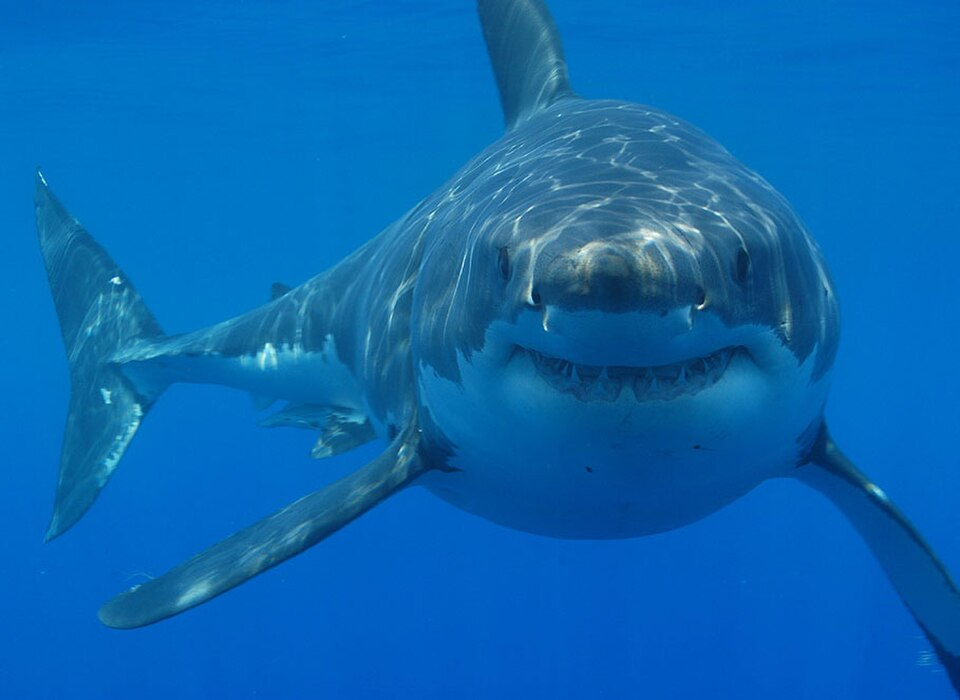

```{r setup, include = FALSE}
library(learnr)
library(tutorial.helpers)
library(knitr)
library(tidyverse)
library(maps)

knitr::opts_chunk$set(echo = FALSE)
knitr::opts_chunk$set(out.width = '90%')
options(tutorial.exercise.timelimit = 600,
        tutorial.storage = "local")

attacks <- readRDS("data/attacks.rds")
```

```{r info-section, child = system.file("child_documents/info_section.Rmd", package = "tutorial.helpers")}
```

## Introduction
###

Sharks have patrolled the world's oceans for over 400 million years — long before dinosaurs existed. Yet most people fear them far more than the numbers suggest. This tutorial uses the **Global Shark Attack File (GSAF)**, a database maintained by the Shark Research Institute that records over a century of shark incidents worldwide, to ask: **are sharks actually as dangerous as we think?**

We recommend using an agentic coding tool such as [Gemini CLI](https://github.com/google-gemini/gemini-cli) or [Claude Code](https://claude.ai/code), which can read and edit your files directly. Our instructions are written with these tools in mind.

<div style="display: flex; justify-content: center;">
  
</div>

### Exercise 1

You should be doing this tutorial in a repo named `sharks`. If you are not, create one and then connect to it. You may need to restart this tutorial after you do so.

Create a new file, `analysis.qmd`, with the title `"Shark Attacks"` and your name as the author. In a bash Terminal, render it:

```
quarto render analysis.qmd
```

Open `analysis.html` with Live Server (right-click it in the Explorer → **Open with Live Server**) and keep the tab open. It refreshes on every render. Going forward, we will just tell you to "Render" when we want you to take these steps.

This tutorial builds a website. Create a `.gitignore` that ignores generated files:

```
_site/
.quarto/
*_files
*_cache
*.html
```

Commit and push.

In the R Terminal, run:

```
show_file(".gitignore")
```

CP/CR.

```{r introduction-1}
question_text(NULL,
  answer(NULL, correct = TRUE),
  allow_retry = TRUE,
  try_again_button = "Edit Answer",
  incorrect = NULL,
  rows = 6)
```

###

<pre><code>_site/
.quarto/
*_files
*_cache
*.html
</code></pre>

###

This tutorial builds a website rather than a single page. The final product will have three pages: an introduction page (`analysis.qmd`), a map page (`map.qmd`), and a trends page (`trends.qmd`). A `_quarto.yml` file will tie them together into a navigable site.

### Exercise 2

In your `analysis.qmd`, add a new code chunk with `library(tidyverse)` and `library(maps)`. Add `#| message: false` to suppress messages. Add the following to the YAML header to hide code:

```
execute:
  echo: false
```

Render. In the R Terminal, run:

```
show_file("analysis.qmd", chunk = "Last")
```

CP/CR.

```{r introduction-2}
question_text(NULL,
  answer(NULL, correct = TRUE),
  allow_retry = TRUE,
  try_again_button = "Edit Answer",
  incorrect = NULL,
  rows = 6)
```

###

<pre><code>#| message: false
library(tidyverse)
library(maps)
</code></pre>

###

The **maps** package provides world boundary data that we can use with `ggplot2` to draw country outlines. It integrates seamlessly with **tidyverse** — you can pass map data directly to `geom_polygon()` or `geom_map()`.

### Exercise 3

Create a `data` directory at the top level of the `sharks` repo. In the bash Terminal, run `ls`.

CP/CR.

```{r introduction-3}
question_text(NULL,
  answer(NULL, correct = TRUE),
  allow_retry = TRUE,
  try_again_button = "Edit Answer",
  incorrect = NULL,
  rows = 4)
```

###

```
analysis.qmd  data
```

###

Keeping data files in a `data/` subdirectory separates raw inputs from analysis outputs. When a project grows, this makes it easy to find the source data.

## Where do attacks happen?
###

Shark attacks are not evenly distributed around the world. Some countries account for the vast majority of incidents — a pattern driven by coastline length, water temperature, beach culture, and reporting practices. The GSAF data lets us map exactly where attacks have occurred over the past century.

### Exercise 1

Download the shark attack data from this URL and save it in your `data/` directory:

```
https://github.com/PPBDS/misc.tutorials/raw/refs/heads/main/inst/tutorials/sharks/data/attacks_clean.csv
```

In the bash Terminal, run:

```
ls data
```

CP/CR.

```{r where-1}
question_text(NULL,
  answer(NULL, correct = TRUE),
  allow_retry = TRUE,
  try_again_button = "Edit Answer",
  incorrect = NULL,
  rows = 4)
```

###

```
attacks_clean.csv
```

###

The original Global Shark Attack File contains over 25,000 rows going back centuries, but most are incomplete. This cleaned version keeps only records with a known year (after 1900), country, and activity — 5,094 incidents in total.

### Exercise 2

In a new code chunk in `analysis.qmd`, read `data/attacks_clean.csv` and print the first 10 rows. Render.

In the R Terminal, run `show_file("analysis.qmd", chunk = "Last")`. CP/CR.

```{r where-2}
question_text(NULL,
  answer(NULL, correct = TRUE),
  allow_retry = TRUE,
  try_again_button = "Edit Answer",
  incorrect = NULL,
  rows = 5)
```

###

```{r where-2-test}
#| echo: true
read_csv("data/attacks_clean.csv", show_col_types = FALSE) |>
  head(10)
```

###

Each row is one shark incident. The `Activity` column records what the person was doing — surfing, swimming, fishing, and so on. `Fatal` records whether the attack was fatal (Y) or not (N).

### Exercise 3

Count incidents per country, sorted from most to least. Render.

In the R Terminal, run `show_file("analysis.qmd", chunk = "Last")`. CP/CR.

```{r where-3}
question_text(NULL,
  answer(NULL, correct = TRUE),
  allow_retry = TRUE,
  try_again_button = "Edit Answer",
  incorrect = NULL,
  rows = 5)
```

###

```{r where-3-test}
#| echo: true
read_csv("data/attacks_clean.csv", show_col_types = FALSE) |>
  count(Country, sort = TRUE) |>
  head(10)
```

###

The USA leads with 1,958 incidents, followed by Australia (1,077) and South Africa (506). These three countries account for nearly 70% of all recorded attacks — driven by long coastlines, warm water, and active beach cultures.

### Exercise 4

Count fatal vs non-fatal attacks. Render.

In the R Terminal, run `show_file("analysis.qmd", chunk = "Last")`. CP/CR.

```{r where-4}
question_text(NULL,
  answer(NULL, correct = TRUE),
  allow_retry = TRUE,
  try_again_button = "Edit Answer",
  incorrect = NULL,
  rows = 5)
```

###

```{r where-4-test}
#| echo: true
read_csv("data/attacks_clean.csv", show_col_types = FALSE) |>
  count(Fatal, sort = TRUE)
```

###

Only 943 of the 5,094 incidents were fatal — about 18.5%. The vast majority of shark encounters do not result in death. Most attacks are single bites followed by the shark releasing the person, suggesting mistaken identity rather than predatory intent.

### Exercise 5

Read `data/attacks_clean.csv`, clean the `Country` column to lowercase for map matching, and assign the result to `attacks`. Save it with `saveRDS(attacks, "data/attacks.rds")`. Create a new R script called `sharks.R` in your repo. In it, write this pipeline and run it in a bash Terminal with `Rscript sharks.R`. In the R Terminal, run `show_file("sharks.R")`. CP/CR.

```{r where-5}
question_text(NULL,
  answer(NULL, correct = TRUE),
  allow_retry = TRUE,
  try_again_button = "Edit Answer",
  incorrect = NULL,
  rows = 10)
```

###

<pre><code>library(tidyverse)

attacks <- read_csv("data/attacks_clean.csv", show_col_types = FALSE) |>
  mutate(
    Country_lower = str_to_lower(str_trim(Country)),
    Fatal_clean   = case_when(
      Fatal == "Y" ~ "Fatal",
      Fatal == "N" ~ "Non-fatal",
      TRUE         ~ "Unknown"
    )
  )

saveRDS(attacks, "data/attacks.rds")
</code></pre>

###

`str_to_lower()` converts country names to lowercase so they match the `maps` package's world map data, which uses lowercase country names. `str_trim()` removes any leading or trailing whitespace that could cause mismatches.

### Exercise 6

Add `data/attacks.rds` to your `.gitignore`. In the R Terminal, run `show_file(".gitignore")`. CP/CR.

```{r where-6}
question_text(NULL,
  answer(NULL, correct = TRUE),
  allow_retry = TRUE,
  try_again_button = "Edit Answer",
  incorrect = NULL,
  rows = 6)
```

###

<pre><code>_site/
.quarto/
*_files
*_cache
*.html
data/attacks.rds
</code></pre>

###

The `.rds` file is regenerated by running `sharks.R`, so it does not need to be committed. Anyone who clones the repo can recreate it by running the script.

### Exercise 7

In `analysis.qmd`, update the data chunk to load the RDS file instead of re-reading the CSV. Replace its contents with `attacks <- readRDS("data/attacks.rds")`. Add `#| cache: true`. Render.

In the bash Terminal, run `ls data`. CP/CR.

```{r where-7}
question_text(NULL,
  answer(NULL, correct = TRUE),
  allow_retry = TRUE,
  try_again_button = "Edit Answer",
  incorrect = NULL,
  rows = 4)
```

###

```
attacks.rds  attacks_clean.csv
```

###

`readRDS()` loads the binary file in milliseconds — far faster than re-parsing a CSV. Caching it goes one step further: on subsequent renders, even the `readRDS()` call is skipped.

### Exercise 8

Create a new file `map.qmd` with the same YAML header and library chunk as `analysis.qmd`. Add a data chunk that reads `attacks <- readRDS("data/attacks.rds")` with `#| cache: true`. Render `map.qmd`.

In the R Terminal, run `show_file("map.qmd", chunk = "Last")`. CP/CR.

```{r where-8}
question_text(NULL,
  answer(NULL, correct = TRUE),
  allow_retry = TRUE,
  try_again_button = "Edit Answer",
  incorrect = NULL,
  rows = 5)
```

###

<pre><code>#| cache: true
attacks <- readRDS("data/attacks.rds")
</code></pre>

###

Each page of a Quarto website runs in its own R session — objects defined in `analysis.qmd` are not available in `map.qmd`. The RDS approach keeps all pages in sync.

### Exercise 9

In `map.qmd`, add a new code chunk that makes a world map showing the number of shark attacks per country, colored by attack count. Use `map_data("world")` for the base map. Render `map.qmd`.

In the R Terminal, run `show_file("map.qmd", chunk = "Last")`. CP/CR.

```{r where-9}
question_text(NULL,
  answer(NULL, correct = TRUE),
  allow_retry = TRUE,
  try_again_button = "Edit Answer",
  incorrect = NULL,
  rows = 14)
```

###

```{r where-9-test}
#| echo: true
world_map <- map_data("world") |>
  mutate(region = str_to_lower(region))

attacks_by_country <- attacks |>
  count(Country_lower, name = "n_attacks")

map_with_attacks <- world_map |>
  left_join(attacks_by_country, by = c("region" = "Country_lower"))

ggplot(map_with_attacks, aes(x = long, y = lat, group = group)) +
  geom_polygon(aes(fill = n_attacks), color = "white", linewidth = 0.1) +
  scale_fill_viridis_c(
    option = "inferno", na.value = "gray90",
    trans = "log10",
    breaks = c(1, 10, 100, 1000),
    labels = c("1", "10", "100", "1,000+"),
    name = "Attacks\n(log scale)"
  ) +
  coord_fixed(1.3) +
  labs(
    title    = "Shark attacks are concentrated in a handful of countries",
    subtitle = "Total incidents 1901–2018, log scale",
    caption  = "Source: Global Shark Attack File (GSAF). Gray = no recorded\nincidents in this dataset, not necessarily zero risk."
  ) +
  theme_void() +
  theme(legend.position = "right")
```

###

The USA, Australia, and South Africa dominate — shown in the darkest shades. A log scale is used because the USA has nearly twice as many attacks as Australia, which would make all other countries invisible on a linear scale. Most of the world's coastline has never recorded a single attack in this dataset.

### Exercise 10

Commit `analysis.qmd`, `map.qmd`, and `sharks.R` with the message `"Add shark attack map"` and push to GitHub. In the bash Terminal, run:

```
git log -1
```

CP/CR.

```{r where-10}
question_text(NULL,
  answer(NULL, correct = TRUE),
  allow_retry = TRUE,
  try_again_button = "Edit Answer",
  incorrect = NULL,
  rows = 6)
```

###

```
commit 3f8a2c1
Author: Var Kurapati <vkurapat@example.com>
Date:   Mon Jul 14 10:23:41 2025 -0700

    Add shark attack map
```

###

The map shows where attacks happen. The next section asks when and why — how do attacks vary by year and by what people were doing?

## When and why?
###

Shark attacks are not random — they cluster around certain activities, certain seasons, and certain decades. Understanding these patterns helps reframe the risk. If most attacks happen to surfers, the question becomes not "are sharks dangerous?" but "what is the risk per surfing session?" — a very different number.

<div style="display: flex; justify-content: center;">
  
</div>

### Exercise 1

Create a new file `trends.qmd` with the same YAML, libraries, and data chunk as the other pages. Add a working chunk that counts attacks per year. Render `trends.qmd`.

In the R Terminal, run `show_file("trends.qmd", chunk = "Last")`. CP/CR.

```{r when-1}
question_text(NULL,
  answer(NULL, correct = TRUE),
  allow_retry = TRUE,
  try_again_button = "Edit Answer",
  incorrect = NULL,
  rows = 5)
```

###

```{r when-1-test}
#| echo: true
attacks |>
  count(Year)
```

###

Attacks were rare before 1950 — not because sharks were less common, but because ocean recreation was less common. As surfing and swimming grew into mass activities in the second half of the 20th century, encounters with sharks increased proportionally.

### Exercise 2

Update your chunk to show a line chart of attacks per year. Render.

In the R Terminal, run `show_file("trends.qmd", chunk = "Last")`. CP/CR.

```{r when-2}
question_text(NULL,
  answer(NULL, correct = TRUE),
  allow_retry = TRUE,
  try_again_button = "Edit Answer",
  incorrect = NULL,
  rows = 8)
```

###

```{r when-2-test}
#| echo: true
attacks |>
  count(Year) |>
  filter(Year < 2018) |>
  ggplot(aes(x = Year, y = n)) +
  geom_line() +
  geom_smooth(method = "loess", se = FALSE, color = "steelblue") +
  labs(
    title   = "Shark attacks have increased over the past century",
    subtitle = "Likely driven by growth in beach tourism, not more dangerous water",
    x       = "Year",
    y       = "Number of attacks",
    caption = "Source: Global Shark Attack File (GSAF). 2018 excluded — incomplete\nat time of data collection."
  ) +
  theme_minimal()
```

###

The upward trend in attacks mirrors the growth in beach tourism and water sports — more people in the water means more encounters. Without knowing how many hours people spent swimming or surfing each year, we cannot say whether the *rate* of attacks has changed.

### Exercise 3

Update your chunk to count attacks by activity, keeping only activities with at least 50 incidents. Render.

In the R Terminal, run `show_file("trends.qmd", chunk = "Last")`. CP/CR.

```{r when-3}
question_text(NULL,
  answer(NULL, correct = TRUE),
  allow_retry = TRUE,
  try_again_button = "Edit Answer",
  incorrect = NULL,
  rows = 6)
```

###

```{r when-3-test}
#| echo: true
attacks |>
  count(Activity, sort = TRUE) |>
  filter(n >= 50)
```

###

Surfing leads with 972 incidents — well ahead of swimming (791) despite far fewer people surfing than swimming. Surfers spend more time in deeper water, make more noise and splashing, and wear wetsuits that can resemble prey. These factors combine to make surfing the highest-risk water activity for shark encounters.

### Exercise 4

Update your chunk to show a bar chart of attacks by activity, filtered to activities with at least 50 incidents. Render.

In the R Terminal, run `show_file("trends.qmd", chunk = "Last")`. CP/CR.

```{r when-4}
question_text(NULL,
  answer(NULL, correct = TRUE),
  allow_retry = TRUE,
  try_again_button = "Edit Answer",
  incorrect = NULL,
  rows = 10)
```

###

```{r when-4-test}
#| echo: true
attacks |>
  count(Activity, sort = TRUE) |>
  filter(n >= 50) |>
  ggplot(aes(x = n, y = fct_reorder(Activity, n))) +
  geom_col(fill = "steelblue") +
  labs(
    title   = "Surfing accounts for the most shark attacks",
    subtitle = "Activities with 50 or more recorded incidents, 1901–2018",
    x       = "Number of attacks",
    y       = NULL,
    caption = "Source: Global Shark Attack File (GSAF)"
  ) +
  theme_minimal()
```

###

The pattern reflects who spends time in the ocean, not how aggressive sharks are. Sharks do not preferentially hunt surfers — they are simply more likely to encounter them because surfers occupy the same habitat (the surf zone) more frequently than other water users.

### Exercise 5

Update your chunk to show fatal vs non-fatal attacks by activity, for activities with at least 50 incidents. Render.

In the R Terminal, run `show_file("trends.qmd", chunk = "Last")`. CP/CR.

```{r when-5}
question_text(NULL,
  answer(NULL, correct = TRUE),
  allow_retry = TRUE,
  try_again_button = "Edit Answer",
  incorrect = NULL,
  rows = 12)
```

###

```{r when-5-test}
#| echo: true
attacks |>
  filter(Fatal_clean %in% c("Fatal", "Non-fatal")) |>
  count(Activity, Fatal_clean) |>
  filter(sum(n) >= 50, .by = Activity) |>
  ggplot(aes(x = n, y = fct_reorder(Activity, n, sum),
             fill = Fatal_clean)) +
  geom_col() +
  scale_fill_manual(values = c("Fatal" = "#d62728", "Non-fatal" = "#1f77b4")) +
  labs(
    title   = "Most shark attacks are not fatal",
    subtitle = "Activities with 50 or more recorded incidents, 1901–2018",
    x       = "Number of attacks",
    y       = NULL,
    fill    = NULL,
    caption = "Source: Global Shark Attack File (GSAF)"
  ) +
  theme_minimal() +
  theme(legend.position = "bottom")
```

###

Non-fatal attacks outnumber fatal ones in every activity category. Fishing and spearfishing have a higher proportion of fatal outcomes than surfing — likely because these activities involve fish blood and bait in the water, which can escalate an encounter. Even so, the majority of all interactions end without a fatality.

### Exercise 6

Commit `trends.qmd` with the message `"Add trends analysis"` and push to GitHub. In the bash Terminal, run:

```
git log -1
```

CP/CR.

```{r when-6}
question_text(NULL,
  answer(NULL, correct = TRUE),
  allow_retry = TRUE,
  try_again_button = "Edit Answer",
  incorrect = NULL,
  rows = 6)
```

###

```
commit 7d4e9b2
Author: Var Kurapati <vkurapat@example.com>
Date:   Mon Jul 14 14:51:03 2025 -0700

    Add trends analysis
```

###

The trends page and the map page together answer the two central questions: where do attacks happen, and when and why? The final section ties these together into a published website.

## Summary
###

You have built three pages of analysis. Now wire them together into a navigable Quarto website, add introductory text to the home page, and publish the result.

### Exercise 1

Create a `_quarto.yml` file at the top level of your repo with the following contents:

```
project:
  type: website

website:
  title: "Shark Attacks"
  navbar:
    left:
      - href: analysis.qmd
        text: Home
      - href: map.qmd
        text: Map
      - href: trends.qmd
        text: Trends

format:
  html:
    theme: cosmo
```

In the bash Terminal, run:

```
quarto render
ls
```

In the R Terminal, run `show_file("_quarto.yml")`. CP/CR.

```{r summary-1}
question_text(NULL,
  answer(NULL, correct = TRUE),
  allow_retry = TRUE,
  try_again_button = "Edit Answer",
  incorrect = NULL,
  rows = 15)
```

###

<pre><code>project:
  type: website

website:
  title: "Shark Attacks"
  navbar:
    left:
      - href: analysis.qmd
        text: Home
      - href: map.qmd
        text: Map
      - href: trends.qmd
        text: Trends

format:
  html:
    theme: cosmo
</code></pre>

###

`_quarto.yml` turns a folder of `.qmd` files into a navigable website. Without it, each file renders independently with no connection between pages.

### Exercise 2

Add introductory text to `analysis.qmd`. Ask AI to write 2–3 short paragraphs introducing the topic: what the Global Shark Attack File is, why shark fear is often disproportionate to actual risk, and what this analysis investigates. Render.

In the R Terminal, run `show_file("analysis.qmd")`. CP/CR.

```{r summary-2}
question_text(NULL,
  answer(NULL, correct = TRUE),
  allow_retry = TRUE,
  try_again_button = "Edit Answer",
  incorrect = NULL,
  rows = 20)
```

###

Your `analysis.qmd` should have a YAML header, a libraries chunk, a data chunk, and 2–3 paragraphs of introductory prose.

###

The home page should give a reader who knows nothing about the dataset enough context to understand the map and trends pages. Good introductory text names the data source, frames the central question, and previews the main findings.

### Exercise 3

Publish the website to GitHub Pages. In the bash Terminal, run:

```
quarto publish gh-pages
```

Copy/paste the resulting URL below.

```{r summary-3}
question_text(NULL,
  answer(NULL, correct = TRUE),
  allow_retry = TRUE,
  try_again_button = "Edit Answer",
  incorrect = NULL,
  rows = 3)
```

###

`quarto publish gh-pages` without a filename publishes the whole website. All three pages are now live via the navbar.

### Exercise 4

Commit and push any remaining changes. Copy/paste the URL to your GitHub repo.

```{r summary-4}
question_text(NULL,
  answer(NULL, correct = TRUE),
  allow_retry = TRUE,
  try_again_button = "Edit Answer",
  incorrect = NULL,
  rows = 3)
```

###

The Global Shark Attack File is updated regularly and is freely available at [sharkattackfile.net](https://www.sharkattackfile.net/). The same workflow used here — download a CSV, clean it, save an RDS, map locations, analyze patterns, build a website — applies to any incident database. The tools are the same; only the question changes.

```{r download-answers, child = system.file("child_documents/download_answers.Rmd", package = "tutorial.helpers")}
```
